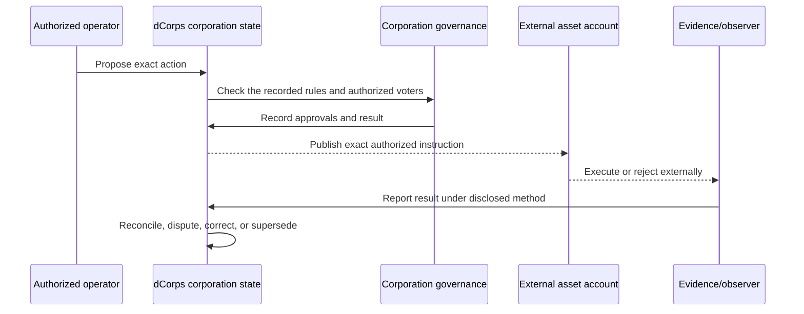
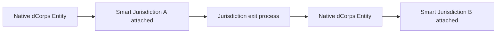
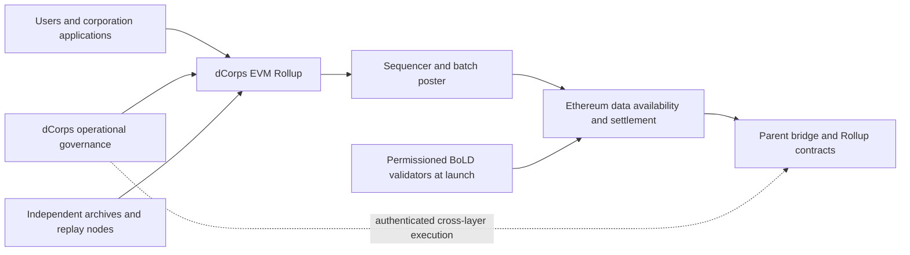
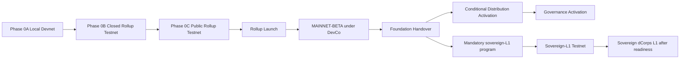

# dCorps

## The Blockchain for Digital Corporations

**Create a business cryptographically. Own it directly. Operate it globally.**

- **Document type:** Blockchain whitepaper
- **Version:** 1.0
- **Status:** Unpublished official project baseline
- **Date:** 2026-08-12
- **Author:** Nicolas Turcotte, Protocol Founder
- **Intended BVI entity name:** dCorps Ltd.; it is the intended Founder-controlled initial legal HoldCo and DevCo connected to the continuing dCorps Project Entity and must remain Founder-controlled
- **Intended development structure:** DevCo is the Founder-controlled development organization responsible for the complete core development, integration, technical release, and maintenance of the dCorps Rollup, sovereign dCorps Layer 1, protocol infrastructure, and Native App; a later Singapore DevCo is intended to become the principal legal employer and development company while remaining controlled by dCorps Ltd.

This document is the official project-design baseline for the dCorps blockchain. It presents the purpose, architecture, protocol model, native asset, governance path, security assumptions, and adoption strategy. Unless deployment evidence is expressly cited, present-tense descriptions state the **target design**, not a claim that a feature is already deployed, audited, operational, decentralized, or legally effective. It is not an offer to sell DCORPS, does not authorize a public distribution, and is not legal, tax, accounting, investment, or regulatory advice. Production addresses, deployed software versions, audits, legal instruments, operating providers, sale or distribution terms, and live network parameters belong in separately published disclosures.

---

## Abstract

Today, creating a business begins with geography. A person selects a country, state, or province; follows its formation rules; pays the required intermediaries; enters a local registry; and then attempts to obtain banking, payment, and international credibility. Access, cost, speed, and trust depend heavily on where that person lives and which institutions accept the result.

dCorps begins somewhere else: cryptography.

> The ability to form an organization and be taken seriously should not depend on where you were born.

A valid creation transaction on dCorps creates a **dCorps Entity** directly on the blockchain. The dCorps Entity is the permanent protocol-level organization whose identity, initial ownership, governing rules, roles, accounts, and history are created and maintained by canonical dCorps state. It does not report that a corporation was already created by a country.

dCorps presents this native organization as a **digital corporation**. `Digital Corporation` and the shorter product term `Corporation` express the dCorps brand and product category; they do not, by themselves, claim statutory incorporation, legal personality, limited liability, tax status, or recognition by a state. Those external effects exist only where an applicable legal framework actually provides them.

dCorps defines this model as **Corporation 3.0**: a protocol-native organization whose identity, ownership, authority, governance, designated accounts, recorded operations, and reconstructible accepted history exist as canonical blockchain state, while applications, service providers, controller-identity systems, external asset execution, and legal-recognition frameworks remain replaceable or attachable under their own rules. Corporation 3.0 is a dCorps-defined project and product category. It is not an established legal classification, an automatic claim of state recognition, or a claim that dCorps invented every component it assembles.

The creator receives a complete business-management structure rather than an empty registry entry. The Entity begins with a stable identity, shares owned by blockchain accounts, decision rules, proposals, approvals, directors, officers, operators, and delegated roles. It can designate merchant, operating, payroll, reserve, capital, and treasury accounts across supported networks; execute authorized payment, split, and sweep workflows through canonical bridged USDC; and record native evidence or source-labelled outside observations while retaining sovereign control of long-term external reserves.

The corporation also controls how its information is disclosed. It selects an editable Entity-wide default privacy posture and can then make category, record, field, account, role, audit, verification, purpose, and time exceptions. Protected corporation state remains encrypted on-chain, while the mandatory public minimum and every authorized public disclosure remain readable. Every accepted action, change, dispute, correction, and privacy-policy transition contributes to an append-oriented history that can be reconstructed independently of the original application according to the viewer's valid access when the disclosed chain and archival requirements are satisfied.

dCorps presents this structure through complete official web and mobile management applications. A founder should be able to create the corporation and then manage ownership, partners, governance, roles, logical treasury accounts, canonical bridged-USDC settlement, sovereign external reserves, evidence, disclosure, and reporting from one coherent workspace. The applications make the blockchain usable; the chain keeps the authoritative record. Every canonical corporation operation available through an official application must also be available through documented programmatic and direct-chain interfaces under the same corporation authorization and protocol rules.

A corporation can be created by one person or jointly by several partners. The founders assign share units to their blockchain accounts and choose rules for voting, share transfers, protected decisions, roles, and treasury approvals. Smart contracts apply those rules before accepting a change. This gives the partners cryptographic protection against unilateral action: one partner cannot simply take another partner's shares, rewrite the agreed rules, or approve a protected transaction without the required account signatures and approvals.

The blockchain account shown in the official dCorps share ledger owns the native shares. Whoever satisfies that account's signing rules controls it: normally a private key for a basic account or the published signer and recovery rules of a smart account. A wallet is the access tool; the account is the owner. No incorporation paper, attorney, notary, bank, DID, Smart Jurisdiction, or government registry is required to create or own the base dCorps Entity.

The design requires alteration of accepted history to be detectable under the disclosed trust model. A correction, transfer, governance change, or superseding action creates a new visible record. dCorps therefore provides durable evidence of what the corporation recorded, who had authority under its rules, what was approved, and how the state later changed. It does not make every off-chain claim true, and MAINNET-BETA's disclosed chain-owner and archival risks limit the strength of this guarantee until those powers and dependencies are removed.

Every dCorps Entity uses one universal, modular digital-corporation model. A conforming application may assist formation with an optional, versioned, and editable template or configuration manifest, but no template label, preset, legal form, or application category becomes a protocol-level Entity type or source of canonical authority. Guided Formation composes a proposed initial state; that state becomes canonical only when the applicable formation or activation transition is accepted under the corporation's authorization rules. An Entity can begin with one owner or several owners, simple rules or layered governance, and only the roles and accounts it needs. Later authorized workflows can change its operating structure without changing its permanent identity or abandoning its history.

DCORPS is the fixed-supply protocol-native gas asset. Stablecoins and other commerce assets remain externally governed assets. The launch target uses one canonical bridged-USDC representation designed from deployment to conform to Circle's Bridged USDC Standard. Full-bridge settlement is the normal dCorps financial-execution path, while long-term reserves may settle to corporation-controlled external policy accounts. Possible later Circle-issued native USDC on dCorps requires Circle's independent approval and implementation; it is not current or guaranteed and does not displace DCORPS. Future DID modules may identify account controllers. Smart Jurisdiction is the dCorps-defined long-term programmable-recognition framework through which a conforming jurisdiction may attach stated legal effects and automatically executable covered obligations to an existing dCorps Entity or to a legally defined representation of it. It is not a current feature. Neither identity nor recognition creates the native Entity, owns its shares, or becomes its source of truth.

During MAINNET-BETA, while the network remains in the DevCo management era, DevCo intends to research, identify, and engage jurisdictions that may wish to become participating Smart Jurisdictions. `DevCo` is functional shorthand for the Founder-controlled development organization. The intended BVI entity is named dCorps Ltd. It is the initial legal HoldCo and DevCo connected to the dCorps Project Entity and must remain controlled by Nicolas Turcotte. A later Singapore DevCo is intended to become the principal legal employer and development company while remaining controlled by dCorps Ltd. Candidate identification or discussion does not establish participation, make a Smart Jurisdiction capability available, or confer legal recognition on any dCorps Entity. Participation requires a jurisdiction-specific legal framework or agreement and conformance to the dCorps admission, automation, privacy, evidence, security, continuity, technical, operating, and activation standard.

The launch implementation is an EVM-compatible Arbitrum Rollup settling directly to Ethereum. The Rollup allows dCorps to become operational before an independent consensus network is technically and economically sustainable, but it is bootstrap architecture rather than the final destination. The chain is dCorps, applications are replaceable, user corporations control themselves, and protocol operations progress from DevCo bootstrap to independent Foundation stewardship and later public DCORPS governance. At production Rollup activation, the official dCorps Project Entity is the first valid non-system dCorps Entity created in canonical state and begins using the protocol for the development group's real remote and online operations. The intended Foundation is an independent Cayman Islands Foundation Company to be formed before Rollup launch for continuity arrangements. Operational Handover occurs only after every existing Handover gate is satisfied. Cayman is the intended external jurisdiction of the Foundation only. It is not a Smart Jurisdiction attachment for user dCorps Entities and does not make the Foundation their registry or source of existence. After Foundation Handover, the Foundation preserves the operating network, funds and independently oversees the readiness-gated sovereign-L1 program, and retains its assigned legal and operational stewardship. Founder-controlled DevCo remains the mandatory and fully accountable core developer, final technical integrator, technical release authority, and maintainer for the Rollup, sovereign L1, protocol infrastructure, and Native App under the disclosed long-term development and operations agreement. Nicolas Turcotte's protected strategic role preserves the mission against speculative capture without becoming unilateral technical or operational control over the sovereign network.

---

## dCorps in one minute

1. Create a dCorps Entity - a native digital corporation - alone or with several partners directly on dCorps.
2. Issue its share units to the partners' blockchain accounts and choose the rules that protect them.
3. Use those accounts to prove ownership and approve decisions.
4. Set directors, officers, roles, rules, and business accounts.
5. Receive supported stablecoin payments through full-bridge settlement, execute authorized splits and payments through canonical bridged USDC, and move long-term reserves to corporation-controlled external policy accounts.
6. Choose what is public, keep sensitive records private, or open selected information to specific blockchain accounts and roles such as an auditor or investor.
7. Build an append-oriented history whose alteration is detectable under the disclosed network trust model.
8. Add optional identity or external legal recognition later where available, after Entity authorization and the applicable external requirements are satisfied.
9. Start alone or create a complex structure from day one; grow without changing the corporation's identity.

The Entity exists on dCorps because the blockchain created it. A country, application, bank, lawyer, or service provider may interact with it later, but none of them is the source of its dCorps existence.

### Plain-language terms used in this paper

| Term | Meaning here |
| --- | --- |
| Account | The blockchain address or smart account that owns shares or performs an action |
| Canonical | The official result recorded by dCorps |
| dCorps Entity | The permanent protocol-level organization created and maintained by canonical dCorps state |
| Digital Corporation or Corporation | The branded dCorps product category and product-facing name for a dCorps Entity; the term does not by itself assert external legal status |
| Corporation 3.0 | The dCorps-defined category for a protocol-native digital corporation whose canonical organization and history exist on-chain while identity, service, and legal-recognition layers remain separately attachable or replaceable |
| EntityID | The Entity's permanent identifier within the applicable dCorps continuity model |
| Entity state | The Entity's current recorded ownership, rules, roles, accounts, and history |
| Corporation rules | The versioned protocol rules shared by every dCorps corporation; a corporation's structure comes from its recorded state, not from a template or type |
| Native dCorps share | A protocol-native unit of ownership and control inside one dCorps corporation; it is not automatically a statutory share under external law and is not equity in DevCo, the Foundation, or DCORPS |
| Evidence anchor or commitment | A cryptographic fingerprint of information; it proves the fingerprint was recorded, not that every claim is true |
| Governance | The rules and process used to propose and approve decisions |
| DCORPS | The protocol-native gas asset used to pay dCorps transaction fees and, later, govern shared chain operations |
| Foundation | The intended independent Cayman Islands Foundation Company that later stewards the shared dCorps network and sponsors, funds, authorizes, and independently oversees the sovereign-L1 mission while DevCo retains complete technical responsibility; it is an external legal steward, not a registry, creator, owner, or source of existence of user dCorps Entities |
| DevCo | Functional shorthand for the Founder-controlled development organization with mandatory complete responsibility for core development, architecture, integration, technical release, and maintenance of the Rollup, sovereign L1, protocol infrastructure, and Native App; accepted external innovation remains subject to DevCo review, integration, release, and continuing maintenance |
| dCorps Project Entity | The first valid non-system production dCorps Entity and the continuing protocol-native organizational identity and operating record of the dCorps development group; it neither owns nor merges dCorps Ltd., Singapore DevCo, the Foundation, or any user-created Entity into one legal person |
| dCorps Ltd. | The owner-selected name of the intended Founder-controlled British Virgin Islands initial legal HoldCo and DevCo connected to the Project Entity, the intended recipient of the development-group allocation after Distribution Activation subject to vesting, and an entity that must remain controlled by Nicolas Turcotte |
| Singapore DevCo | The intended later principal legal employer and development company connected to the same continuing Project Entity; it must remain controlled by dCorps Ltd. and receives no separate DCORPS allocation merely because it is established |
| SaleCo | Functional shorthand for an optional future wholly Foundation-owned special-purpose Seller for a reviewed public distribution; it must be legally separate from Founder-controlled dCorps Ltd. and Singapore DevCo |
| Founder-affiliated economic exposure | The prospective aggregate economic exposure from the 15 percent Founder allocation and the 10 percent development-group allocation to the intended Founder-controlled dCorps Ltd.; the positions remain legally separate and are aggregated for concentration, conflicts, governance-power analysis, and public disclosure |
| Effective DCORPS voting power | Governance-eligible DCORPS counted once at the applicable snapshot after vesting, custody, lock, delegation, affiliation, and other exclusions are applied; it is distinct from economic allocation or ownership |
| Bridge | The system that represents an external asset, such as a stablecoin, on dCorps |
| Full-bridge settlement | The normal path in which a supported stablecoin payment becomes canonical bridged USDC on dCorps before the Entity's authorized financial workflow executes |
| Canonical bridged USDC | The one launch-target USDC representation used for normal dCorps execution, subject to disclosed Circle, backing, bridge, Ethereum, Rollup, contract, and exit assumptions |
| Capped dCorps operating liquidity | Working capital intentionally retained on dCorps within the Entity's authorized exposure policy and stricter protocol safety limits |
| Sovereign external reserves | Long-term or purpose-specific treasury value held in corporation-controlled external policy accounts that remain independently usable if dCorps is unavailable |
| Circle-issued native USDC | A possible future USDC asset issued by Circle on dCorps only after Circle's independent approval and implementation; it is not a current or guaranteed capability |
| Smart Jurisdiction | The optional dCorps-defined programmable-recognition framework through which a conforming jurisdiction may recognize an existing dCorps Entity or a legally defined representation, with covered obligations executed under a versioned jurisdiction configuration |
| Rollup | A blockchain that executes its own transactions while publishing data and results to Ethereum |
| Final | A record that has reached the disclosed point at which users may rely on it |

---

## Contents

1. A new way to form and operate a business
2. What dCorps is
3. Rules the design must follow
4. How dCorps identifies an Entity and records change
5. Ownership, voting, roles, and asset signing
6. One dCorps Entity model, shaped over time
7. What the chain proves, what counts as evidence, and what stays private
8. Treasury and payments
9. Why dCorps uses its own blockchain
10. DCORPS tokenomics: paying for the chain and later governing shared operations
11. Who controls what
12. Protecting the chain, corporations, and history
13. Adoption strategy and roadmap
14. What can go wrong
15. How dCorps differs from other systems
16. Conclusion

Sections 1 through 8 explain the product and the dCorps Entity model. Sections 9 through 12 explain the blockchain, DCORPS, control, and security. Sections 13 through 16 explain launch, risks, and differentiation. Exact software algorithms and legal instruments are deliberately outside this whitepaper.

---

## The idea in one sentence

> dCorps lets anyone create a corporation on a blockchain, own it through blockchain accounts, operate it through clear rules and accounts, and build an append-oriented history independent of any single application or country.

At the protocol level, the organization created by that transaction is a dCorps Entity. `Corporation` remains the primary branded product term, while `Entity` identifies the technical object and avoids implying an external legal status that canonical chain state alone cannot grant. Corporation 3.0 names the complete dCorps category: native Entity existence and continuity first, with replaceable applications and services and optional identity and legal-recognition layers attached later.

dCorps proves what happened inside dCorps. It does not automatically prove that every outside claim is true, that a payment was wise, or that an outside institution will recognize the result. It **does** determine native dCorps ownership: if the official chain record assigns shares to an account, that account owns those shares inside the dCorps Entity. External legal recognition is separate, optional, and future.

The chain - not the official application - is dCorps. Applications, wallets, explorers, indexers, APIs, and professional services are replaceable access surfaces. They can improve usability and provide conclusions within their own responsibility, but they do not become consensus.

Control is divided into three understandable parts:

1. **Each corporation controls itself:** its owners and authorized participants control its shares, rules, roles, accounts, and assets.
2. **Shared chain operations are governed separately:** DevCo operates the Rollup first, the Foundation later assumes independent operational stewardship, and eligible DCORPS holders may eventually govern listed operational matters. Throughout those stages, DevCo remains responsible for complete core development, integration, technical release, and maintenance of the blockchain and Native App. After handover, the Foundation funds and independently oversees the sovereign Layer 1 mission.
3. **The project keeps protected long-term direction:** Nicolas Turcotte is the permanent historical Protocol Founder and protected long-term Strategic Steward for dCorps identity, mission, core doctrine, DCORPS purpose, roadmap, development direction, and overall project strategy. Changes within the Strategic Domain require his exact consent while he serves as the active Strategic Steward. This protection prevents a Foundation board, token majority, investor, or affiliate from removing the Founder or redirecting the project without the narrowly defined cessation process. It does not provide unilateral control over a corporation, its assets, chain treasury spending, personnel, consensus, validation, emergency controls, routine technical operations, or shutdown, and it is not personal technical control over the final sovereign network.

During the Rollup phase, this is not described as complete decentralization. The purpose is to protect the mission during development, decentralize shared operations over time, keep every dCorps corporation under its own control, and ultimately establish a sovereign network that no Founder, DevCo, Foundation, parent chain, provider, or administrative controller can unilaterally shut down.

### Design at a glance

| Dimension | V1.0 target design |
| --- | --- |
| Protocol category | Corporation 3.0: the dCorps-defined category for creating and operating protocol-native digital corporations |
| Protocol object | dCorps Entity: the permanent native organization created and maintained by canonical dCorps state |
| First production Entity | The official dCorps Project Entity, created first in canonical production state and operated as the principal Corporation 3.0 demonstration |
| Bootstrap execution | EVM-compatible Arbitrum Rollup |
| Bootstrap settlement and parent data availability | Ethereum |
| Launch validation | Permissioned BoLD with disclosed validators |
| Native gas | DCORPS |
| Commerce assets | One canonical bridged-USDC launch representation designed to conform to Circle's Bridged USDC Standard; possible later Circle-issued native USDC requires Circle's independent approval and implementation; both remain external assets under disclosed issuer, bridge, liquidity, and control assumptions |
| Maximum DCORPS issuance | 1,000,000,000 |
| Entity model | One universal modular dCorps Entity model whose digital-corporation structure is shaped by recorded state and authorized workflows, not template labels, legal forms, or protocol types |
| Workflow Library | Accepted, non-exhaustive protocol-design foundation identifying operations dCorps may support; Library inclusion alone does not make an operation available or normative |
| Adopted Workflow Specifications | Normative definitions of supported operations across authorization, preconditions, approvals, signatures, transitions, resulting state, events, evidence, privacy, failures, reconstruction, and conforming interfaces |
| Guided Formation | Replaceable application experience that may use editable templates or configuration manifests to compose a complete proposed initial state; canonicalization requires an accepted formation or activation transition |
| Access surfaces | Official web and mobile applications, managed REST API, SDKs, direct RPC, published contract ABIs, wallets, explorers, and conforming third-party systems |
| Managed-service boundary | The target dCorps Commercial Developer Platform is a dCorps-owned managed API product whose core development, integration, technical release, and maintenance remain within DevCo's continuing mandate; DevCo may operate the bootstrap managed service, and external providers may use it or independent interfaces for their own services, but service access cannot imply partnership, grant different protocol powers, or restrict independent direct-chain access |
| Native share owner | The blockchain account shown in the official dCorps share ledger |
| Ownership control | The account's private key or published smart-account signing rules |
| Ownership-upgrade objective | No DevCo, Foundation, Founder, token vote, chain administrator, or application can unilaterally change a corporation's finalized ownership |
| Identity binding | Not part of base Entity creation; future optional DID or controller-attestation modules, with a documented identity and eligibility process required for any activated Smart Jurisdiction framework |
| External legal status | Optional future Smart Jurisdiction recognition, separate from native existence and ownership and unavailable until a jurisdiction confers stated legal effects and the legal, identity, tax and fee, technical, operating, and activation requirements are met |
| Supported native object | dCorps Entities under one universal digital-corporation model |
| Corporation assets | Classified as funds in transit, capped dCorps operating liquidity, or sovereign external reserves across Entity-designated accounts; dCorps, DevCo, a future Foundation, and the official application are not mandatory treasury signers, and the custody, signing, recovery, continuity, network, and risk model must be disclosed |
| Privacy model | One editable Entity-wide default posture with granular public and encrypted native on-chain state, scoped access, and attributable policy history |
| Historical reconstruction | Ethereum blobs, independent complete archives, permanent Ethereum commitments, and tested replay |
| Core developer and bootstrap operator | Founder-controlled DevCo, initially through dCorps Ltd. and later principally through its controlled Singapore DevCo; DevCo remains the complete core developer, final technical integrator, technical release authority, and maintainer while shared operational authority follows the disclosed lifecycle |
| Pre-MAINNET-BETA lifecycle | Phase 0A local Devnet, Phase 0B Closed Rollup Testnet, and Phase 0C Public Rollup Testnet, all within the public `DEVNET` era and separated by evidence gates |
| Rollup testnet | One persistent no-value production-parity network, which may use disclosed closed and public epochs and remains the permanent pre-production and canary network after MAINNET-BETA begins |
| MAINNET-BETA trust boundary | DevCo manages the network and controls disclosed Arbitrum chain-upgrade authority; mitigations reduce but do not eliminate that power during beta |
| MAINNET-BETA operating objective | Demonstrate security, adoption, provider integration, commercial viability, and real Project Entity use under bounded DevCo management before institutional handover |
| MAINNET-BETA DCORPS posture | Real DCORPS is used as native gas through capped, purpose-bound beta provisioning; DevCo conducts no public sale, broad public or community distribution, public-liquidity program, or binding DCORPS governance |
| MAINNET-BETA Smart Jurisdiction objective | Identify and engage potential future participating jurisdictions and prepare the existing Project Entity to become the first live applicant, without presenting the framework as active or any candidate as participating |
| Institutional transition | Same-Rollup Handover to the intended independent Cayman Islands Foundation Company only after every applicable Section 11.2 gate is satisfied, the Foundation is intended to be memberless, its independent-majority board and independent Supervisor are operational, its governing instruments impose the sovereign-L1 mission and protected Strategic Domain, the Project Entity's real operational use and continuity are demonstrated, and the mandatory DevCo agreement is effective |
| Long-term network mission | A sovereign dCorps Layer 1, launched only after separately reviewed technical, security, economic, and continuity readiness |
| Public distribution | Separate, conditional, post-Handover Foundation activation, including up to 7% public sale and 3% community distribution; an optional wholly Foundation-owned SaleCo may act as Seller under separately reviewed terms, but no SaleCo structure or entity is a protocol requirement |
| Public governance | Later delegated, linear DCORPS voting for listed operational surfaces |
| Founder economic and voting boundary | Prospective 25% Founder-affiliated economic exposure from legally separate 15% and 10% allocations; Governance Activation requires the complete disclosed insider group to remain strictly below 20% of effective DCORPS voting power |
| Strategic direction | Nicolas Turcotte as permanent historical Founder, creator of the Corporation 3.0 and native Entity thesis, protected long-term Strategic Steward, and principal project-wide strategic leader, with exact consent for the Strategic Domain and no unilateral operational key |
| Decentralization claim | DevCo-operated bootstrap, progressive operational decentralization, corporation autonomy, and a mandatory sovereign-L1 destination |

---

## 1. A new way to form and operate a business

### 1.1 What makes a business

A business needs more than a name. It needs an identity, owners and a record of what they own, rules for making decisions, people authorized to perform specific jobs, accounts used to receive and pay money, and a history of what happened. These pieces form one operating structure even though conventional systems usually store them in different places.

All of those things can change. A founder may add an investor. Share classes may change. A director may leave. A new treasury account may replace an old one. A vote may correct an earlier mistake.

dCorps keeps the current situation and the history together. It can answer simple questions: Who owns the shares now? Who could approve this action? Which account could sign it? What rules applied at the time? What evidence was recorded? What changed later?

### 1.2 Today's business records are scattered

Today, those answers are spread across registries, contracts, ownership spreadsheets, board minutes, banks, wallets, accounting tools, and private applications.

A registry may name an officer without showing every limit on that person's power. An ownership spreadsheet may show balances without showing which rules applied to a vote. Meeting minutes may approve a payment without identifying the exact asset, amount, network, or receiving account. A wallet may sign a transaction without knowing whether the corporation approved it.

When someone later needs proof, the history must be rebuilt from emails, exports, signatures, minutes, transaction records, and provider logs. That is slow, expensive, and often incomplete.

dCorps starts independently of those old systems. A dCorps Entity can exist and operate before it receives any service or recognition from a registry, bank, card network, lawyer, or corporate-service provider. Outside services can connect later, while the Entity's native existence and history continue on the chain.

### 1.3 Replace geography with cryptography

Today's business system begins with a country. It depends on local registries, legal services, banks, payment companies, and private databases. The same business may appear credible in one country and difficult to verify, fund, or pay in another.

Blockchains, programmable accounts, stablecoins, digital signatures, verifiable credentials, and open financial tools already operate across borders. Existing systems demonstrate individual parts of the transition. dCorps assembles them around its selected center: a continuous protocol-native organization that can be created, owned, governed, financed, evidenced, and later recognized without making one application, service provider, or country the source of its existence.

dCorps defines **Corporation 3.0** around this observable infrastructure transition and its assembly into one continuous corporate system. A person can create a digital corporation, issue shares to blockchain accounts, set decision rules and roles, designate business accounts, record actions and native evidence, commit to identified outside bytes when needed, use supported stablecoins, and build canonical history that can be inspected independently according to the viewer's valid rights under the Entity's privacy rules. The category claim concerns this composition and continuity; it does not claim that Corporation 3.0 is already a legal category, that every surrounding technology originated with dCorps, or that no adjacent system exists.

At every scale, that native stack can be the business - not a waiting room for conventional incorporation. A dCorps corporation can begin with one owner or with a complex structure, and it can evolve from one to the other without abandoning its identity or history. External legal status or services may be attached later where available, after Entity authorization and the applicable external requirements are satisfied, but they do not define whether the dCorps corporation exists, owns its shares, governs itself, or can operate through digital financial rails.

This is valuable for a solo founder, a local shop, a remote team, a small school, a cross-border venture, a community-owned business, and a growing company. Scale and professional sophistication are not admission requirements. dCorps reduces the gap between corporations that inherit trusted rails and corporations that must otherwise spend heavily to prove that they exist and operate seriously.

The value comes from making the raw corporate history portable, structured, and difficult to falsify retroactively. Counterparties, communities, software, and future analysis systems can then form better judgments from shared evidence instead of relying on a single presentation or database.

### 1.4 A wallet signature is not the same as company approval

The blockchain holding an asset answers one question:

> Did the account sign this transaction?

The corporation answers another:

> Did the corporation approve this exact action under its rules?

The answers can differ. A wallet can execute an unauthorized corporate payment. A corporation can approve a transaction that account signers later refuse.

dCorps keeps both answers. A valid account signature proves that the account approved the transaction. The dCorps record shows what that account owns and what the corporation allowed it to approve. If the account holds 40 percent of a share class, it owns that recorded position and receives the rights assigned to that class. The signature alone does not prove the human identity behind the account or give that person an unrelated business role.

The wallet application is only a tool. The blockchain account is the owner. A basic account is normally controlled by its private key. A smart account can require several signers, recovery guardians, delays, or other published rules. A delegated key may perform one limited task without becoming the owner.

dCorps preserves both records and makes the mismatch visible. It does not force corporate approval and asset execution into the same concept.

### 1.5 What dCorps can and cannot prove

The main claim is simple:

> dCorps keeps public canonical state and disclosure policy independently readable, while protected native state and selectively disclosed history remain recoverable from the chain subject to the Entity's privacy rules and the viewer's valid access.

From the chain history, a reader can reconstruct the corporation's recorded situation at a particular time within that reader's valid visibility and access rights. This may include which accounts owned its native shares, what a proposal or payment instruction requested, whether recorded voting and approval rules were satisfied, which account signatures were accepted, how an outside result was checked, and whether a later action disputed, corrected, withdrew, or replaced an earlier record. An accepted creation transition in canonical dCorps state creates the protocol Entity; the resulting record provides cryptographic evidence of that existence and its later state. Evidence makes native state independently verifiable within the applicable disclosure boundary. A commitment or external assertion does not create truth merely because it is recorded.

Corporation 3.0 keeps three layers distinct without creating three Entity types:

| Layer | What it establishes | What it does not establish |
| --- | --- | --- |
| Native protocol existence | The dCorps Entity, `EntityID`, account-owned shares, recorded authority, rules, and history | Human identity, legal personality, limited liability, or state recognition |
| Verified controller identity | A disclosed identity or eKYC verification process whose result may be linked or conveyed through an accepted DID, Verifiable Credential, or other attestation | Native share ownership, Entity creation, or legal recognition by itself |
| External legal recognition | The legal effects actually conferred under a named Smart Jurisdiction framework | A replacement Entity, a rewritten native history, or automatic effect outside the applicable framework |

That proof has a clear boundary. Off-chain statements, professional opinions, legal recognition, beneficial ownership under outside law, commercial fairness, accounting treatment, and provider performance depend on evidence or institutions beyond the chain. dCorps records those materials according to their source and verification method rather than presenting them as native facts. Inside the protocol, however, ownership is unambiguous: the account shown in the official dCorps share ledger owns the corresponding native shares. A recognition framework may give an externally sourced beneficial-ownership claim legal consequences within its scope, but it does not convert that claim into native dCorps share ownership or change the canonical share ledger.

### 1.6 Who dCorps is for

dCorps is for anyone who wants to create and operate a native digital corporation. Size, geography, wealth, and corporate complexity are not admission criteria. A solo founder can begin with one owner and grow over time. Several partners can establish protected ownership and decision rules together. A local shop, school, remote team, cross-border venture, or digital-native company can use the same protocol base to establish discoverable existence, receive bridged-stablecoin payments, structure treasury accounts, and build a credible operating history.

The same corporation can later add directors, officers, employees, share classes, financing rounds, delegations, multiple accounts, and more advanced governance. For people operating where banking, merchant processing, registry visibility, or international trust is limited, dCorps provides the same protocol-level starting point available to users in better-served markets. Applications and service providers can build against that shared standard instead of reserving sophisticated infrastructure for privileged clients.

V1.0 supports one universal dCorps Entity model presented as the native digital corporation. Its universal scope comes from allowing the same Entity model to begin with any practical level of ownership and governance complexity and to keep changing through authorized workflows without changing its identity. It does not introduce separate Entity categories or jurisdictional legal forms.

The intended spectrum includes one person working alone, a small professional partnership, a distributed multi-owner or venture-backed organization, a large conventional corporation with layered ownership and governance, a blockchain-native governance model, and organizational forms that do not yet have established names. This is an architectural coverage objective, not a claim that every specialized workflow or module is available in V1.0 or the initial release.

dCorps does not require a business to be small, large, simple, or complex before it deserves a durable identity. A corporation can start with one owner, one share class, basic governance, and a treasury capable of using bridged stablecoins, then add roles, accounts, evidence, financing, and advanced governance without changing its permanent identity. It can also be created with several owners, layered ownership, decision-making groups, delegations, policies, and accounts from the beginning. These are differences in recorded state, not different templates or protocol types. Conventional incorporation and banking remain available choices; they are not prerequisites for native dCorps existence.

The costs and responsibilities of blockchain use - keys, fees, public metadata, smart-contract risk, and recovery - must be made understandable and manageable through product design. They are implementation challenges to solve for ordinary users, not reasons to exclude them from the protocol's mission.

---

## 2. What dCorps is

At its center, dCorps is a blockchain that orders transactions and preserves the official history of every native corporation. Shared corporation rules give consistent meaning to identity, ownership, authority, accounts, evidence, and corrections. Each corporation shapes those capabilities through its recorded state and authorized workflows, while optional modules can add specialized capabilities later. Protocol governance operates the shared chain without entering the internal governance of user corporations.

Applications, wallets, explorers, outside source systems, evidence services, financial services, registries, custodians, and other networks can all interact with this structure. They provide access or external services around the corporation, while the chain remains the common record from which its native state can be reconstructed.

The solid path shows the parts of dCorps. The dotted path shows outside information that can be referenced as evidence without becoming an automatic blockchain fact.

### 2.1 The chain - not the app - is dCorps

The website, the Hub, wallets, and corporate-management applications are interfaces to dCorps. The blockchain stores the official dCorps Entity identity, issued shares, owners, changes, and history. Public data formats and test examples allow another application to read the same records and recover the same Entity and native share balances from the same final chain history.

This allows applications to compete without splitting the corporation into separate records. A company can leave the official application and use another interface without creating a new corporation.

The official web and mobile applications, managed REST API, SDKs, direct RPC access, published contract ABIs, wallets, explorers, and conforming third-party systems are interfaces to the same protocol. Every canonical corporation operation exposed through an official application must be executable through the documented REST API and SDK and by an independently built client using direct RPC and the published ABIs. Each interface applies the same active corporation rules, account authorization, required signatures, canonical state transitions, evidence semantics, and DCORPS transaction-fee requirements. An API credential controls access to a managed service. Transaction submission requires DCORPS gas paid by the user or a disclosed sponsor. Neither mechanism grants authority inside a corporation. No official application, API operator, or integration receives a private protocol capability or privileged state-transition path.

The core dCorps Native App is free to use and carries no application-access fee. Network transaction fees remain separate. During MAINNET-BETA, DevCo may charge for optional managed services such as dedicated hosting, additional storage, Commercial Developer Platform capacity, indexing, automation, integrations, transaction-sponsorship administration, onboarding, support, and service levels. Independent providers may charge for their own external services. Payment for either category buys capacity, convenience, or the separately defined external service, not different protocol authority.

Capability parity applies to canonical protocol operations and reconstructible canonical state. Hosted indexing, queries, notifications, orchestration, batching, encrypted storage, reports, transaction-sponsorship administration, support, and service levels are provider services. Providers may package and charge for those services. A managed-service restriction cannot restrict documented SDK, direct RPC, published-ABI, or independently built conforming access to the protocol.

#### Official Native App wallet access

The target official Native App must support a compatible external wallet, a dCorps-initiated embedded wallet or Wallet-as-a-Service path for a person who prefers familiar application login and phone or device confirmation, and compatible institutional account systems. Each path accesses a real blockchain account and produces the account authorization required by the same active corporation rules. Application login, wallet connection, provider authentication, or a provider confirmation result is not by itself a blockchain signature or corporation authority.

dCorps owns the decision, provider selection, integration, requirements, and user experience for any embedded wallet offered inside the official Native App. A selected, replaceable provider supplies the wallet, key-management, authentication, recovery, and signing infrastructure under a disclosed custody, control, portability, and exit model. A provider may separately build its own dCorps-compatible wallet through public interfaces, but Commercial Developer Platform access alone does not place that technology inside the official Native App. This target design selects no provider and does not claim that an embedded-wallet or login integration is currently available.

#### Commercial Developer Platform and external-world services

The **dCorps Commercial Developer Platform** is the target dCorps-owned managed API product. Its core development, integration, technical release, and maintenance remain within DevCo's continuing mandate. DevCo may operate the managed service during the bootstrap era, but that service does not restrict non-exclusive access through documented SDK, direct-RPC, published-ABI, or independently built conforming paths. The platform is intended for companies building applications, infrastructure, or external-world services for dCorps corporations. Only an operation implemented under an adopted Workflow Specification and honestly published for the applicable environment can be described as supported through the managed API. Commercial API access is not generally available. No live endpoint, sandbox, supported-operation inventory, package, price, quota, contractual service-level agreement, or launch date is published. A commercial-grade or production-ready claim requires separate implementation, security, capacity, reliability, support, and contractual evidence. Any future service-level agreement covers only the named managed service and environment; it cannot present protocol finality, external-provider performance, identity accuracy, fiat settlement, stablecoin solvency, or bridge safety as managed-API uptime.

An external identity or organizational-attestation provider may integrate after the relevant supported interfaces and workflows are published. Under the target pattern, the provider retains the raw identity, corporate, biometric, and supporting evidence and supplies only the minimum attributable credential result needed by the applicable workflow, such as the issuer, an opaque issuer-scoped reference or commitment, scope, Entity or account binding, validity period, and status. The dCorps record does not make the underlying evidence a native fact. A Smart Jurisdiction separately determines which issuers, schemas, assurance levels, and statuses it accepts; technical API compatibility is not jurisdictional approval.

An external fiat, banking, payment-rail, on/off-ramp, or foreign-exchange provider may connect its service to a corporation-controlled stablecoin wallet after the applicable supported interfaces and workflows are published. That provider remains responsible for its customer relationship, licensing and compliance duties, external account access, quotes, conversion, collection, payout, fees, reversals, refunds, and fiat-side settlement. Its API or webhook result remains source-labelled external evidence and does not become dCorps consensus or prove more than the provider's disclosed verification method.

In the target design, dCorps retains the corporation authorization model, corporation wallet and account model, dCorps-local stablecoin execution, supported stablecoin representation, canonical bridge integration and accounting, finality treatment, monitoring, incident response, and continuity design. The corporation still controls its wallet under its own account and signing policy; this dCorps responsibility boundary does not create custody by implication. The underlying stablecoin issuer remains an upstream external asset dependency with its own issuance, reserve, administrative, freeze, and redemption authority; it is not treated here as a corporation-service provider invited through the Commercial Developer Platform. An independent bridge application may interact with public dCorps interfaces, but it cannot define or replace the canonical dCorps bridge or supported settlement representation.

Markets, custodians, wallets, financial-service companies, and other providers may innovate through the managed API or documented independent interfaces without a mandatory bilateral dCorps integration or provider marketplace. Each remains responsible for its own service, data, licensing, custody, execution, customer relationship, solvency, pricing, and legal effects. Technical compatibility does not make the provider part of dCorps, make its result canonical, establish endorsement, or create a privileged state-transition path.

### 2.2 The complete corporation-management stack

Most people will experience dCorps through an ERP-style management application built by dCorps. After creating a corporation, the user enters a structured workspace designed to manage the company from formation through daily operation, financing, growth, and eventual transfer or closure. The objective is not to expose raw smart contracts. It is to give an ordinary founder the kind of organized control environment normally assembled from many separate corporate, cap-table, banking, governance, document, and accounting tools.

The accepted, non-exhaustive **Workflow Library** is a protocol-design foundation. It identifies operations dCorps may support, but it does not itself make an operation available or define its normative behavior. For each supported operation, an **adopted Workflow Specification** defines the initiating account or role, active rules, preconditions, required approvals and signatures, canonical state transition, resulting state, emitted events, evidence and privacy boundary, failure outcomes, and reconstruction requirements. Contracts, schemas, events, indexers, REST APIs, SDKs, direct-chain interfaces, and conforming applications implement the same adopted specification. Private interface logic cannot replace protocol authorization or canonical state.

A conforming application, including the official Native App, may provide **Guided Formation** using versioned, editable templates or configuration manifests. It asks founders what they need, composes a complete proposed state from corporation rules and adopted Workflow Specifications, and presents that resolved state for review and authorization. The state becomes canonical only when the applicable formation or activation transition is accepted under those rules. A template name, version, label, or provenance is not authority and does not create an Entity type; provenance may be retained as non-authoritative evidence for reproducibility. A template label cannot restrict later workflow use, although active Entity rules, installed modules, compatibility requirements, adopted Workflow Specifications, and release phase may legitimately determine availability.

The ownership area shows the share classes, issued units, owner accounts, percentages, restrictions, vesting, transfers, and complete capitalization history. A corporation may begin with one owner and one simple share class. A company formed by several partners can show each partner's units and the exact rules protecting transfers or major decisions. The same corporation can add financing rounds, several classes, allocation pools, boards, committees, and investor protections without changing its identity or changing to another template.

The governance and people areas organize proposals, votes, written approvals, directors, officers, operators, delegations, conflicts, and decision thresholds. Instead of treating a policy as a document nobody can enforce consistently, the application translates supported policies into clear workflows backed by smart-contract rules. It shows who can propose an action, who must approve it, when a decision becomes effective, and what happened afterward.

The financial area brings together the corporation's merchant, operating, payroll, reserve, capital, and treasury accounts as one logical Entity treasury across supported networks. It can prepare payment requests, collect the required corporate approvals, execute supported dCorps-local splits through canonical bridged USDC, apply the Entity's operating-liquidity cap, prepare authorized sweeps to external policy accounts, and reconcile each final result with the original decision. An Entity may use its own accounts and signing devices or a separately governed custody or payment provider; in either case the management stack records the network, asset, balance class, custody and signer model, continuity path, and relationship between instruction, execution, and evidence.

The records and reporting areas connect native records, invoices, agreements, outside observations, corporate actions, and corrections to the relevant event. Disclosure controls let the corporation choose an Entity-wide default privacy posture, publish selected eligible information, protect otherwise public fields, or open protected records to specific accounts and roles such as an auditor, investor, lender, director, or adviser. Dashboards and exports can then present a current view of the corporation while preserving the ability to inspect how that view was produced.

A conforming application may use Agentic AI to recommend a starting posture, classify fields, prepare policy changes, explain their effect for different viewers, monitor unexpected exposure, and coordinate scoped grants. AI receives no authority merely because it is AI. Canonical disclosure changes still require the Entity's applicable authority, approvals, and signatures, and the same governed operations remain available through a usable manual path.

Everything that can be represented and safely enforced on-chain should use the blockchain as its authoritative record. Sensitive corporation records and fields that should remain confidential are represented as encrypted native on-chain state governed by disclosure and access rules. Public readers see only authorized public state and unavoidable metadata or commitments, while permitted recipients can resolve the protected state available to their accounts or roles. The dCorps application may provide the most complete reference experience, but it cannot privately rewrite the corporation: another conforming application must be able to recover the same public state, protected ciphertext, rules, grants, decisions, accounts, and ordered history from the chain.

dCorps will maintain a versioned standards-alignment program for applicable corporate operations. Where applicable, that program may map dCorps capabilities to ISO 37000 and the G20/OECD Principles of Corporate Governance for governance guidance; applicable ISO 20022 securities-event messages for corporate actions and general meetings; ISO 20275 for jurisdiction-specific Entity Legal Form codes; ISO 17442 for Legal Entity Identifiers and verifiable LEIs; and the Open Cap Table Format for capitalization-data exchange. Exact editions, mappings, implemented coverage, tests, limitations, and assessment status will be maintained outside this Whitepaper in a separately versioned Standards Alignment Register and supporting profiles. Reference to, alignment with, or mapping to a standard does not by itself constitute certification, legal recognition, regulatory compliance, or complete interoperability. Any certification, qualification, attestation, audit, or independent-assessment claim must identify its exact subject, scope, issuer or assessor, version, date, validity, and supporting evidence.

### 2.3 The shared rules every corporation follows

The shared rules provide a stable identifier and status for each corporation, identify the applicable rule version, and preserve the history of ownership positions, roles, governing bodies, committees, delegations, proposals, votes, and approvals. They also define how business accounts are labeled across networks, how evidence and outside observations are connected to actions, and how disputes, corrections, revocations, and replacements affect the current record.

Those rules are universal across dCorps corporations. A corporation may have one or several shareholders, one or several share classes, no board or a layered board and committee structure, simple or protected voting, and few or many operating roles and accounts. These differences are expressed through its state, not through different corporation types.

Every V1.0 dCorps Entity has a native share ledger, at least one issued native share, and at least one owner account. Active rules may separate native economic ownership, voting power, governance capacity, operational authority, and asset-execution authority, but V1.0 does not define an ownerless or shareless Entity.

### 2.4 One universal, modular dCorps Entity model

Every dCorps Entity uses the same versioned corporation rules. Replaceable applications may offer optional, versioned, and editable starting templates or configuration manifests to help founders compose a proposed initial state. Founders must be able to inspect and authorize the complete resolved state. Canonical authority comes from an accepted formation or activation transition under the applicable rules, not from a template name, version, label, or provenance. Template provenance may be recorded as non-authoritative evidence for reproducibility. No starting configuration creates a permanent protocol-level Entity type. An Entity's structure is its current canonical state: owners, share classes, voting and transfer rules, boards, committees, roles, delegations, accounts, recovery choices, its Entity-wide default privacy posture, granular disclosure and access rules, and attached modules.

An accepted formation or activation transition records the initial shape authorized by the founder or co-founders. That initial shape includes one editable default privacy posture, which may range from maximum privacy to maximum transparency. Optional presets help compose that posture but do not create different Entity types; the canonical result is the complete resolved policy. Later workflows make the smallest authorized state transitions needed to add or remove owners, issue or transfer shares, establish a board, appoint people, change decision rules, add accounts, raise capital, change the privacy posture or a granular disclosure rule, attach modules, or adopt more advanced controls. Versioned protocol rules can evolve through reviewed upgrades, but an Entity never switches templates or changes its permanent identity merely because its structure becomes more complex. A template label does not restrict later workflow use, while active Entity rules, installed modules, compatibility requirements, adopted Workflow Specifications, and release phase may determine which operations are available.

### 2.5 Optional add-ons

Post-launch modules can add DID identity claims, Smart Jurisdiction adapters, industry workflows, specialized voting, or enhanced account rules. These additions remain separate from the base release and must disclose what they can read or change, who can upgrade them, and how failure affects the corporation.

An organization involved in developing, governing, maintaining, or supporting a DAO or DeFi arrangement may use a dCorps Entity to record its own ownership, authority, approvals, treasury policies, appointments, disclosures, evidence, and history. Those records do not, by themselves, establish the external arrangement's ownership, control, decentralization, execution, liquidity, oracle data, custody, licensing, or regulatory status.

The important limit is continuity. An optional module cannot rewrite earlier history, redefine the corporation's identity, alter another corporation without authority, or gain custody simply because it was attached. If it fails or is removed, unrelated corporation state must remain intact. This allows dCorps to expand without making any optional provider the new source of the corporation's existence or control.

---

## 3. Rules the design must follow

### 3.1 Corporation autonomy begins with cryptographic ownership

Every dCorps Entity controls its own shares, decision rules, roles, accounts, evidence, disclosures, and assets. The blockchain account shown in the official share ledger owns each native share balance, and that account is controlled through its private key or published smart-account rules. A spreadsheet, certificate, application, future identity provider, or future Smart Jurisdiction may describe the position, but the native ownership record remains on dCorps.

The final ownership objective is non-unilateral control: no DevCo, Foundation, Founder, token vote, chain administrator, or application can change a corporation's finalized ownership without a transition authorized under that corporation's active rules. The corporation contracts enforce this objective from launch. The disclosed Arbitrum chain-owner authority retained during MAINNET-BETA remains a stronger underlying power and means the objective is not yet an absolute chain-level guarantee during that phase.

Ownership is only one kind of power. The right to own shares, vote on a proposal, perform a business task, and sign an asset transaction can belong to different accounts under different rules. Keeping them separate allows a corporation to give an operator permission to issue invoices, for example, without giving that operator shares or unrestricted access to treasury funds. Protocol governance operates the shared chain and has no ordinary role inside those corporation-specific decisions.

### 3.2 The Entity outlives any application

The official dCorps application is designed to provide the complete management experience, but the dCorps Entity cannot depend on that application for its existence. Its public ownership, roles, rules, accounts, records, and accepted history remain readable from the blockchain through another application, explorer, node, or indexer. Protected ciphertext, visibility rules, commitments, grants, and access history remain recoverable from the blockchain, while protected plaintext is readable only by a valid authorized recipient. This makes the application replaceable while preserving the digital corporation that users created through it.

The same independence applies to sovereign external reserves. An external policy account must remain usable under the corporation's own signer, threshold, limit, recovery, and continuity rules if the official application, DevCo, sequencer, or dCorps network is unavailable. dCorps may normally prepare and record the exact Entity authorization, but dCorps, DevCo, a future Foundation, and the official application cannot be mandatory asset signers or unrestricted treasury modules. Funds intentionally retained as dCorps operating liquidity require an Ethereum-enforced withdrawal or escape path without privileged dCorps participation.

### 3.3 Evidence, correction, and privacy remain connected

dCorps records where evidence came from and how it was checked. A native blockchain fact, a protected native record, a commitment to outside bytes, an outside report, and a professional opinion retain different meanings even when they support the same corporate action. That separation lets a reader understand the strength and limits of the available evidence instead of seeing one unexplained verified label.

Mistakes remain correctable without erasing accountability. The original accepted record stays in on-chain history, while a later authorized action can dispute, revoke, correct, or replace its current effect. Sensitive corporation state remains encrypted on-chain when protected. The Entity's default posture and more specific category, record, field, and recipient rules determine which information becomes public and which protected state is opened to selected accounts or roles, while the chain preserves the applicable policy, commitments, grants, and access history.

### 3.4 Trust must be visible, and shared operations decentralize over time

The dCorps chain still depends on sequencers, validators, bridges, upgrades, price feeds, archives, providers, and governance. Those dependencies must be published in terms users can understand. The network begins as a Rollup under accountable DevCo operation, transitions to independent Foundation operational stewardship on the same Rollup, and can later activate public DCORPS operational governance after measurable readiness conditions are met. Foundation Handover also begins the Foundation's mandatory responsibility to preserve the operating network and sponsor, fund, authorize, and independently oversee the sovereign-L1 mission. Founder-controlled DevCo retains complete technical responsibility for core development, architecture, integration, release, operation, and maintenance of the Rollup and sovereign L1. Handover cannot occur until those complementary responsibilities are imposed by the Foundation's governing instruments and the Development and Operations Agreement. The operating controllers and eventually the network architecture can change while every corporation's identity and history continue under an explicitly adopted continuity design.

### 3.5 Founder direction and operational control remain separate

The Protocol Founder protects the mission, doctrine, identity, DCORPS purpose, roadmap, development direction, and overall strategic direction of dCorps while building the project and helping the Foundation continue that mission. Nicolas Turcotte's permanent historical Founder attribution, protected long-term active Strategic Steward role, Strategic Domain, project-wide strategic leadership, and exact-consent right cannot be reduced, terminated, transferred, subordinated, diluted, reclassified, or bypassed by a Foundation board, Supervisor, SaleCo, token vote, investor, DevCo entity, or affiliate except through the narrowly defined cessation process in Section 11.3. Normal protocol operations become institutionally and publicly governable, and user corporations remain under their own control. The strategic role protects against speculative takeover; it is not a treasury key, consensus key, validator key, infrastructure key, emergency key, shutdown power, or hidden power over user corporations. Active stewardship and permanent historical attribution remain separate, but the active role does not end through convenience, strategic disagreement, an ordinary board or token vote, investor pressure, or loss of confidence without independently established objective cause. The strict below-20-percent effective DCORPS voting-power limit does not limit Founder-affiliated economic ownership, the Strategic Domain, or the active Strategic Steward's exact-consent right.

---

## 4. How dCorps identifies an Entity and records change

### 4.1 One permanent identity for each dCorps network deployment

The initial dCorps Ethereum Rollup receives one permanent network identifier when it is launched. That identifier is created from facts that cannot later be changed: the Ethereum parent network, the original Rollup contract, and the approved initial deployment record.

The identifier is then stored in the Rollup's initial state. Contract upgrades within that network do not change its identifier. They must point back to the original deployment and publish a verifiable link between old and new contracts. The Protocol Specification contains the exact hashing and encoding method.

The network identifier, continuing dCorps project identity, and each Entity's `EntityID` are different things. The required long-term sovereign dCorps Layer 1 will be a new network deployment with a new network identifier; the Rollup cannot simply be renamed or treated as though it became an L1 in place. This whitepaper establishes the mission rather than a premature transition mechanism. Before L1 launch, a separately reviewed continuity design must preserve exact DCORPS economic supply, holder positions, Entity identity, authorized Entity state, replay protection, and permanent linkage to the final Ethereum-confirmed Rollup state. The new network cannot silently present itself as the original Rollup deployment.

### 4.2 One permanent identity for each dCorps Entity

Every dCorps Entity receives one permanent `EntityID` when it is created. The identifier is tied to the dCorps chain, the creation registry, a unique creation number, the creator's authorization, the applicable corporation-rule version, and the exact initial Entity state.

The creation record stores a cryptographic fingerprint of those facts. Upgrading the registry does not change the corporation's `EntityID`. A voluntary export to a noncanonical external chain would require an explicit export from dCorps, an identified final source record, acceptance by the destination, protection against using the same export twice, and a public continuity record. The protocol-wide transition to the sovereign dCorps L1 instead follows the separately reviewed network continuity design described above. Another chain cannot simply copy the identifier and claim to be the same official corporation. Exact encoding belongs in the Protocol Specification.

At production Rollup activation, the official dCorps Project Entity must be the first valid non-system Entity created in canonical state. The production deployment and creation sequence must reserve and assign `EntityID 1`, or the equivalent first permanent identifier supported by the final identifier design, to that Project Entity without a privileged protocol type or different formation standard. System contracts, protocol registries, testnet Entities, and deployment fixtures do not count as production Entities for this ordering rule. The Project Entity then retains the same permanent `EntityID` and complete native history through every later legal-structure, operating, governance, and recognition change, including the sovereign-L1 continuity process.

### 4.3 What dCorps records for each Entity

At every point in its history, dCorps records the corporation's:

| Record | What it contains |
| --- | --- |
| Identity | Name, identifier, public claims, and the version of each claim |
| Corporation rules | The applicable version of the universal dCorps corporation rules |
| Status | Draft, active, suspended, dissolved, or archived |
| Ownership | Share classes, issued shares, owner accounts, and restrictions |
| People and powers | Directors, officers, committees, delegates, and recovery authority |
| Decisions | Proposals, eligible voters, approvals, rejections, and results |
| Business accounts | Merchant, operating, payroll, reserve, capital, and treasury accounts |
| Privacy policy | Entity-wide default posture, granular category, record, and field rules, scoped grants, versions, effective times, and history |
| Evidence | Native records, commitments to identified outside bytes, and source-labelled outside observations |
| Actions and corrections | Operating actions, payments, disputes, corrections, and superseding records |
| Optional additions | The exact versions of any modules attached to the Entity |

A transaction asks dCorps to change one or more of those records. The change is accepted only when it follows the active rules and is approved by the accounts or roles authorized for that specific action.

The decision uses the ownership, roles, rules, conflicts, amounts, assets, destinations, deadlines, and approval thresholds that applied at the recorded decision point. A later change cannot rewrite which rules applied earlier, and an application's private permissions cannot replace the chain's authority record.

When the paper says an account owns a share, it means the official dCorps share ledger assigns that share to the account. When the paper states an ownership percentage, it must also say what is being counted - for example, one share class, all issued shares, voting shares, economic shares, or a fully diluted total. An application cannot display a more favorable percentage by silently changing that basis.

### 4.4 Exactly what an account authorizes

An account signature must be tied to the exact action being approved. The signed information identifies the dCorps chain, the corporation, the action, the result it would produce, the applicable rule version, a one-time reference, and any deadline. This prevents a signature collected for one corporation, action, or time from being reused for something else.

For a basic account, authorization normally means a valid signature from its private key. For a smart account, authorization means satisfying its published rules - for example, two of three signers, a hardware key, a guardian, or a recovery delay. The wallet software is not the owner and does not become authoritative merely because it displays the balance.

A service may deliver an already authorized action to the chain, but it cannot change what the account approved. Exact message formats and signature standards belong in the Protocol Specification.

### 4.5 From creation to closure

A dCorps Entity can move through clear recorded stages:

- a draft can become active or be abandoned;
- an active corporation can be suspended and later restored;
- an active or suspended corporation can be dissolved; and
- a dissolved corporation can be archived while its history remains available.

The dCorps status is not an outside legal status. A native dCorps Entity can be active without any legal-recognition attachment. Calling it a digital corporation does not change that boundary. A future Smart Jurisdiction or outside registry may report a different status in its own system. Interfaces must show the source, jurisdiction, effective period, and verification date of every external-status claim instead of presenting it as native dCorps state.

An external registration, court order, professional conclusion, future DID-binding change, or future Smart Jurisdiction status update can be committed as evidence or observation when the applicable module exists. None of them directly changes native share ownership. Current native ownership changes only through a valid dCorps state transition under the applicable corporation rules. If external and native states conflict, both are shown and the mismatch remains explicit until an authorized native transition or an external correction resolves it.

Corrections are append-oriented:

1. the original accepted record remains visible;
2. the correcting record identifies its target;
3. it states its authority, effect, and reason;
4. current-state derivation follows the explicit correction rule; and
5. historical queries show both states.

This preserves accountability without treating a known error as permanent current authority.

---

## 5. Ownership, voting, roles, and asset signing

dCorps keeps four questions separate: Who owns the shares? Who may approve this decision? Who may perform this business task? Who can sign the asset transaction? The same account may answer several questions, but one power never silently becomes another.

### 5.1 Who owns the shares

A native share is owned by the blockchain account shown in the official dCorps share ledger. Each share class can have its own rights for voting, information, payments, conversion, transfer, or closure of the corporation.

A **native dCorps share** is a protocol-native unit of ownership and control inside one dCorps corporation. It is not automatically a statutory share created under an external jurisdiction and is not equity in dCorps, DevCo, the Foundation, or DCORPS. External recognition may attach later without becoming the source of native ownership.

This is ownership inside dCorps. A certificate, DID, application database, spreadsheet, Smart Jurisdiction, or government registry is not required to make the share exist. Future identity and legal services may describe or recognize the share, but they do not become the dCorps share ledger.

The owner controls the share through the account's signing rules. That may be one private key or a smart account with several signers and recovery options. At base release, the account may remain pseudonymous. A future identity requirement may apply to a particular service, but identity information does not become ownership.

Share ownership does not automatically make someone a director, officer, application administrator, asset signer, or governor of the dCorps chain. The share class and corporation rules say what the owner may do.

### 5.2 Who may approve a decision

Voting power is the right to vote, consent, approve, or reject a particular corporation action. dCorps calculates it from the recorded ownership, roles, and rules that apply to that decision.

Voting power can depend on:

- eligible position classes;
- balances at the record block;
- board or committee seats;
- class-specific voting rules;
- delegations and proxies;
- vesting or transfer restrictions;
- conflicts and exclusions;
- minimum participation and counting rules;
- approval thresholds; and
- the proposal's action type and economic scope.

An owner may have 50 percent of the voting power for one proposal and no vote on another. A vote does not make the owner an officer, operator, administrator, or asset signer.

### 5.3 Who may perform a business task

Permission to perform a business task comes from a recorded role, board seat, delegation, limit, or approved process. Tasks can include:

- issue an invoice or payment intent;
- submit an evidence commitment;
- propose a payment;
- update a claim;
- administer a program within an approved budget;
- prepare a financing action;
- nominate a role change; or
- submit an account-designation update.

Permission is specific to the action. A job title alone does not authorize every change.

Where a corporation has expressly adopted it, root authority is a limited recovery and rule-protection role inside that corporation. It is not general ownership, voting power, or asset control. A root controller cannot rewrite old ownership records, bypass required approvals, or override an owner account that selected no recovery.

### 5.4 Who may sign an asset transaction

Asset-signing power is the ability to sign or submit a transaction from the account holding the asset. It follows that account's keys, smart-contract rules, or provider rules.

Asset-signing power may belong to a basic blockchain account, a multisignature or other smart account, a custodian, a bank, a payment provider, or another independently governed execution system. A dCorps-local policy account may execute a previously authorized automatic split, cap, or sweep rule. An external policy account independently enforces its own signer, threshold, limit, recovery, and continuity rules. dCorps connects the corporation's instruction to the execution and observed result while the selected account system retains control. dCorps, DevCo, a future Foundation, and the official application cannot be mandatory signers or unrestricted execution modules for corporation assets.

### 5.5 Company approval and asset signing are different

For a protected payment, dCorps asks two separate questions:

1. **Did the corporation approve this exact payment under its recorded rules?**
2. **Did the account holding the asset sign and complete the transaction?**

The relationship can produce four meaningful states:

| Corporation authorization | Asset execution | Interpretation |
| --- | --- | --- |
| Valid | Matching | Recorded authority and observed execution align |
| Valid | Missing or rejected | The corporation approved, but execution did not complete |
| Missing or invalid | Executed | The asset account moved funds without the expected corporation authorization |
| Valid | Mismatched | Execution differs in network, asset, source, destination, amount, call data, or another bound effect |

The third and fourth cases are not hidden as success. They are authority mismatches that can trigger corporation-specific review, dispute, remediation, or correction.

### 5.6 Use the rules that existed when the decision was made

Every important proposal identifies the exact recorded moment used to decide who could vote or approve. It may use the moment the proposal was created, the start of voting, or another moment stated in the corporation's rules.

Moving shares, changing a board seat, ending a delegation, or changing a policy later cannot silently change the preserved result. New rules do not rewrite whether an earlier action was properly approved.

### 5.7 From proposal to result

The external account remains independently executable under its own policy, including during dCorps unavailability. The chain preserves how the corporate decision relates to the external result. If the account cannot enforce the intended corporation rule, dCorps can record a mismatch but cannot claim that the rule controlled the external asset.

---

## 6. One dCorps Entity model, shaped over time

### 6.1 One universal dCorps Entity

Every dCorps Entity is created under one universal, versioned corporation rule system. Founders may use Guided Formation and an optional editable starting template or configuration manifest, but that input creates no protocol-level Entity type or authority. The applicable formation or activation transition establishes the Entity's permanent identity and canonical initial state only when accepted under the required authorization rules. That state records its owners, share classes, issued shares, decision rules, directors, officers, delegates, business accounts, recovery policies, evidence, and disclosure.

For a founder in Sri Lanka - or anywhere else - creation produces much more than an empty blockchain address. It creates the Entity and its first rules directly on dCorps. The blockchain accounts shown in the share ledger own the native shares. No incorporation paper, outside ownership spreadsheet, DID, application provider, attorney, notary, bank, or external registry is required.

The same model supports an Entity created by one owner, several co-founders, or a layered ownership and governance structure from the beginning. Every later increase or reduction in complexity is an authorized change to that Entity's state, not a switch to another template. In product language, each instance is a native digital corporation; at the protocol level, it remains a dCorps Entity.

This native existence does **not**, by itself, establish legal personality, limited liability, statutory incorporation, tax status, or recognition by an outside legal, banking, or regulatory system. Participants remain responsible for their applicable legal, tax, and regulatory obligations. The absence of a Smart Jurisdiction does not make the Entity incomplete: it can exist and operate as a native digital organization secured by dCorps. V1.0 creates and operates only the universal dCorps Entity model; it does not implement separate protocol Entity types or jurisdictional legal forms.

### 6.2 A complete native digital corporation from day one

Creating a dCorps Entity initializes a coherent initial operating state rather than a single registry row:

| Component | What it gives the corporation |
| --- | --- |
| Entity identifier | Stable identity independent of an application |
| Identity claims | Native names, domains, external references, public accounts, and verification methods; DID bindings are a post-launch module, not a base-release dependency |
| Native share ledger | Share classes, issued supply, account-owned balances, rights, restrictions, and history |
| Decision rules | Proposal types, eligible voters, minimum participation, approval levels, protected decisions, and versions |
| Board and roles | Directors, officers, committees, operators, delegations, and effective periods |
| Account registry | Merchant, operating, payroll, reserve, capital, and treasury designations |
| Privacy policy | An editable Entity-wide default posture plus granular visibility, recipient, purpose, and time rules |
| Evidence record | Native records, commitments, outside reports, signed statements, and disclosure choices |
| Corporate timeline | Ordered proposals, approvals, transitions, executions, disputes, and corrections |
| Recovery rules | Signer changes, recovery, objections, delays, and emergencies |
| Integration surface | Versioned events, reads, exports, REST API, SDKs, direct RPC, published contract ABIs, and replaceable applications |

An Entity can begin simple and add complexity through approved changes without changing its permanent identity.

Several partners can also create the corporation together from the beginning. They can divide the initial share units among their accounts and define which decisions require a simple majority, a larger shareholder threshold, approval from a specific share class, board approval, or several treasury signers. The smart contracts check those rules every time a protected change is proposed. No application administrator can bypass them merely by editing a private database.

This enforcement reduces dependence on trust between partners and on a single administrator. It does not eliminate smart-contract, key-compromise, bridge, or upgrade risk; those risks remain subject to the security and recovery model described later in this paper.

#### The dCorps Project Entity as the first Corporation 3.0 operation

The dCorps project must use its own protocol before asking others to rely on it. At production Rollup activation, the official dCorps Project Entity is the first valid non-system Entity created in canonical state. It begins as a protocol-native Entity before any Smart Jurisdiction recognition, uses the same universal Entity model and conformance standard as every other Entity, and maintains one permanent `EntityID`, native ownership record, governance system, roles, authority structure, designated accounts, and complete accepted history.

The Project Entity is the official protocol-native organizational identity and operating record of the dCorps development group. It must use dCorps for its real remote and online operations, including:

- remote-worker and contractor roles, appointments, delegations, and work authorizations;
- compensation, budget, vendor, service, invoice, and payment approvals;
- stablecoin invoicing, settlement, and reconciliation where the selected legal and payment arrangements permit;
- treasury instructions, account designations, signer and authority evidence, and material financial decisions;
- document and agreement commitments, operating evidence, disclosures, reports, and corrections; and
- accepted ownership, governance, role, authority, and material organizational changes.

Those records must produce a reconstructible corporate timeline. Confidential personnel, compensation, tax, commercial, security, and contractual source material remains protected through the same minimized public state, encrypted records, commitments, and selective-disclosure rules available to other Entities. Mistakes are corrected through attributable new records without silently erasing previously accepted history.

dCorps Ltd. is the initial legal HoldCo and DevCo connected to the Project Entity. A later Singapore DevCo becomes the principal legal employer and development company connected to the same continuing Project Entity while remaining controlled by dCorps Ltd. The Foundation remains an independent external legal steward with defined roles and permissions. Each legal organization may act through, or be represented in, the Project Entity's recorded authority structure, but the protocol record does not merge them into one legal person or replace the separate legal actor responsible for an employment, contract, payment, tax, asset, or regulatory obligation. The Project Entity does not own the independent Foundation or any user-created dCorps Entity.

The Project Entity's native history remains continuous through changes in legal structure, employment organization, operating responsibility, governance, and optional external recognition. dCorps must publish an evidence-backed case study of the Project Entity as the principal public demonstration of Corporation 3.0, subject to the same privacy, security, legal-effect, target-design, and production-evidence boundaries applied throughout this paper.

### 6.3 From simple to complex through workflows

The Entity is shaped by the smallest explicit workflows needed for its actual operation. At creation, a founder can issue all shares to one account and use one decision path, or several founders can divide shares among their accounts and establish protected decisions immediately. After creation, authorized workflows can add or remove owners, issue or transfer shares, create or amend share classes, establish a board or committee, appoint or remove officers, delegate a task, designate accounts, adopt recovery rules, raise capital, change disclosure, or attach an optional module.

A person can be the only owner, director, and operator at first while those capacities remain distinct in the record. The same corporation can later contain several shareholders, investor protections, financing rounds, vesting, committees, many accounts, advanced treasury rules, and different approval or privacy rules for different actions. It can also simplify again through valid transitions.

No workflow changes the Entity into another protocol type. The permanent `EntityID`, accepted history, and continuity remain while the recorded state changes.

### 6.4 Accounts own and transfer shares

A native share belongs to one `EntityID`, one share class, and one owner account. Its rights come from that share class and the corporation's active rules. The account shown in the official dCorps share ledger is the owner.

Issuance, allocation, acceptance, transfer, cancellation, repurchase, conversion, vesting, restriction, and correction are explicit native state transitions. A transfer changes ownership only when it is accepted under the applicable corporation rules. The current owner account must cryptographically authorize the transfer, and the corporation can enforce disclosed class restrictions, lockups, rights of first refusal, approval requirements, or other native rules. These constraints regulate how the owner exercises the position; they do not make an application or Smart Jurisdiction adapter the owner.

The ownership rule is:

> Control the account under its cryptographic policy, and you control the native shares held by that account, subject to the corporation's on-chain share rules.

In ordinary user language, **your wallet owns your shares**. More precisely, the owning object is the blockchain account and the wallet is the software or device used to exercise its cryptographic control.

For a conventional account, private-key control normally provides that authority. For a smart account, the controlling condition can be a threshold, multisignature, hardware key, guardian set, time delay, recovery module, or another published cryptographic policy.

Recovery is an owner choice, not a protocol master power. An owner may select an account with no recovery and accept the risk that a lost key can make the shares permanently unusable. An owner may instead select a smart account with its own signers, guardians, delays, and recovery conditions. dCorps, DevCo, the Foundation, and protocol governance possess no universal recovery key. A recovery policy cannot be added or expanded after the incident unless the owner account had already authorized that possibility.

A compromised key can authorize a malicious action if the account and corporation rules provide no protection. Native transfer delays, smart-account recovery, corporation-approved freezes, and challenge rules may prevent or reverse current effect only when the owner accepted those protections before the incident and the predetermined on-chain transition authorizes the result. They do not erase the original transaction, and no external paper record directly rewrites the ledger. If a malicious transfer reaches final native effect under the configured rules, the canonical owner changes; the protocol does not pretend otherwise.

#### Market-compatible native shares and cap-table interfaces

There is no separate cap-table share. A digital-share market refers to units of a native dCorps share class, while the cap table is a derived, time-bounded view of the official native share ledger and capitalization history. Documented public and permissioned interfaces may let an independent provider identify the exact network, Entity, share class, class-rights version, and effective state; read permitted class rights, restrictions, supply, and capitalization information; receive corporate-action events; preflight a proposed transfer; and submit or reconcile a transfer under the Entity's active rules.

The dCorps protocol provides the Entity model, native share ledger, public interface, and accepted transfer path. It does not through those interfaces perform listing admission, order entry or matching, price discovery, brokerage, investment advice, discretionary custody, clearing, market surveillance, or legally appointed transfer-agent services. Independent markets and providers remain responsible for their own services, systems, licensing, compliance, custody, payment, settlement, security, privacy, continuity, and legal obligations.

A listing, order, matched trade, market database, custodian or nominee record, cap-table export, Open Cap Table Format file, payment record, or settlement message does not issue shares or change native ownership. Only an accepted dCorps state transition under the applicable Entity rules can issue, retire, correct, or transfer native shares. If a nominee or omnibus account holds native shares, that account is the native owner and downstream beneficial positions remain source-labelled external claims.

No wrapper or duplicate market token is created by default. Any later wrapper, immobilization, escrow, reservation, encumbrance, clearing, or atomic delivery-versus-payment model requires a separate adopted design, backing and custody controls, failure and release semantics, no-double-claim protection, implementation, testing, and legal and regulatory review. Exact interface schemas, external-standard mappings, providers, and compatibility evidence remain in separately versioned profiles and registers.

Native shares are not DCORPS. They grant rights only inside their corporation and never create dCorps protocol-governance power.

### 6.5 Future optional DID identity

The base release ends at native cryptographic account control. It does not require, issue, resolve, or govern DIDs. A blockchain account owns its native shares whether its controller is public, pseudonymous, or later identified.

A future optional DID module may bind one or more controller identity claims to an account. Such a binding can support eligibility checks, disclosures, credentials, or later Smart Jurisdiction requirements, but it remains an identity and attestation relationship. The blockchain account continues to own the shares, and only its cryptographic authorization policy can approve a transfer. The DID and its document never hold the shares, so creation, rotation, revocation, reassignment, expiry, or failure of the identity service leaves the official share ledger unchanged.

If a future module uses a DID claim as one condition of an action, the applicable corporation rules must disclose that condition without collapsing controller identity into ownership. The precise DID methods, credential formats, privacy controls, recovery rules, and trust assumptions belong in the module specification and Network Disclosure adopted for that later release.

### 6.6 Future optional Smart Jurisdiction recognition

#### Native dCorps Entity without a Smart Jurisdiction

A native dCorps Entity exists and can operate directly on dCorps without any Smart Jurisdiction. It retains its `EntityID`, account-owned shares, ownership history, governance, roles, accounts, treasury history, agreements, evidence, and complete native record even if no external legal-recognition framework is ever attached.

The Entity can use the complete dCorps management stack, authorize resolutions and agreements, manage stablecoin treasury and other digital assets through Entity-designated self-custodied or external accounts, appoint and remove authorized roles, transfer ownership through accepted blockchain transactions, integrate smart contracts, control disclosure, and produce cryptographically verifiable operational evidence. These are native protocol capabilities. They do not depend on government registration.

Native protocol existence does not automatically provide legal personality, limited liability, statutory incorporation, state recognition, or a particular tax or regulatory treatment. Participants remain responsible for complying with the laws, taxes, regulations, contracts, and reporting duties that apply to them. A native dCorps Entity may be sufficient for an organization's operating model, but dCorps does not make that legal or tax determination.

The absence of a Smart Jurisdiction therefore does **not** make the dCorps Entity incomplete. It means that the Entity operates as a native digital organization secured and evidenced by dCorps without an attached jurisdictional-recognition framework.

The intended Cayman Islands domicile of the protocol Foundation is separate from Smart Jurisdiction recognition. Forming the Foundation in Cayman will not make user dCorps Entities Cayman companies, attach Cayman recognition to them, or make Cayman the source of their existence, ownership, governance, or history. The Foundation is not a registry for user corporations. A future Smart Jurisdiction, whether Cayman or another jurisdiction, may independently recognize an existing dCorps Entity only under its own adopted framework and the Entity's native authorization. A dCorps Entity remains complete without any such attachment.

#### Smart Jurisdiction as programmable recognition

A **Smart Jurisdiction** is a real jurisdiction admitted into the dCorps programmable legal-recognition framework after it establishes a legally effective relationship with dCorps and implements its requirements through the versioned dCorps Smart Jurisdiction standard. It may recognize an existing dCorps Entity, or a legally defined representation of it, and confer only the legal effects stated by its framework. It does not create a replacement Entity. The same `EntityID`, native ownership history, governance history, treasury history, agreements, evidence, and blockchain record continue.

Smart Jurisdiction is a dCorps-defined participation category. The jurisdiction controls the legal recognition, rights, protections, eligibility, tax rates and bases, fees, remedies, and status it offers within its authority. dCorps defines the common admission, automation, privacy, evidence, security, and continuity standard and decides whether the framework conforms and can be activated. The Entity's owners decide whether to request attachment under their native governance rules. The designation therefore belongs to dCorps, the external legal authority belongs to the jurisdiction, and native Entity authority remains with its owners and authorized participants.

Where the activated framework provides them, a Smart Jurisdiction relationship can confer legal personality or an equivalent recognized status; recognize cryptographic ownership, authorized roles, on-chain governance, resolutions, and selected blockchain evidence; apply jurisdiction-specific filings, reporting, taxation, compliance, and representation; and provide access to the jurisdiction's courts and legal remedies. Every capability, legal effect, limitation, identity requirement, obligation, and status consequence must be stated rather than inferred.

A jurisdiction qualifies only after its framework defines and evidences the legal basis and recognized object; responsible authority and status source; complete legal effects and limitations; identity and eligibility rules; accepted eKYC, eKYB, auditor, credential, and evidence-access requirements; taxes, fees, formulas, periods, triggers, official destination accounts, corrections, and refunds; reporting, filing, licensing, representation, substance, and continuing obligations; privacy and retention rules; entry, renewal, suspension, remediation, revocation, and exit; accrued and prorated settlement; courts and remedies; authority keys and operational responsibility; security review; technical implementation; and successful end-to-end activation evidence.

Every operative requirement must enter the framework as either a deterministic protocol rule or an attributable decision from a named jurisdictional authority, court, auditor, or accepted external provider whose signed result has defined protocol consequences. This preserves legitimate external judgment while making its source, authority, scope, timing, and effect explicit. An external identity provider retains raw identity and supporting records under its own obligations and returns only the minimum attributable credential reference, scope, assurance, expiry, and status required by the activated framework.

#### Automatic tax, fee, and compliance execution

Automatic financial compliance is a defining requirement of Smart Jurisdiction. All in-scope official Entity financial activity must execute through Entity-designated accounts or be reconciled into canonical dCorps financial state through an adopted workflow. Public privacy can restrict who sees protected details, but it cannot remove in-scope activity from the required computation, prevent settlement, or deny confidential access that the Entity accepted for the jurisdiction or its authorized auditor.

The active jurisdiction configuration supplies each taxable base, rate, accounting classification, period, trigger, adjustment, credit, loss, rounding rule, settlement asset, official destination, correction, refund, and status consequence. At the configured trigger, dCorps calculates the covered amount, reserves it where required, settles it to the official jurisdiction destination, and records an attributable receipt. An Entity's discretionary allocation rules cannot bypass that mandatory reserve or payment.

The owner-authorized attachment activates a narrowly scoped, versioned financial-execution policy on the Entity accounts used by the framework. That policy can calculate, reserve, and settle only the covered obligations and destinations accepted at attachment. The applicable account, smart contract, or external provider still enforces asset execution under its own disclosed policy. dCorps coordinates the deterministic rule and evidence; it does not become a discretionary custodian, obtain a general treasury key, or gain authority to move unrelated Entity assets. Insufficient funds follow the encoded arrears, remediation, suspension, and exit rules rather than creating an unrestricted seizure power.

For example, if an activated framework defines a five-percent tax on taxable profit, recorded revenue, recognized expenses, and configured adjustments determine taxable profit; five percent is then transferred automatically to the jurisdiction's designated tax wallet at the defined time. The owners do not calculate it in a disconnected system or make a later discretionary decision about whether to report or pay it. Annual recognition fees, filing charges, event-based obligations, prorated entry or exit amounts, amendments, credits, and refunds follow the same versioned execution model.

Attachment is voluntary before activation. Once the Entity and jurisdiction accept the relationship, the configured taxes, jurisdictional fees, identity conditions, reporting duties, audit rights, status controls, and other covered requirements remain binding until a valid exit is completed. The jurisdiction can suspend or end the recognition it granted under its published rules, but it cannot erase the underlying Entity, replace its native owners, or rewrite its accepted history. The Entity can preserve its native existence and initiate the defined exit process, but it cannot retain the jurisdiction's recognition while refusing its active requirements or erase obligations accrued during the relationship.

This design gives a participating jurisdiction global reach, automatic and traceable public revenue, lower registration and collection friction, continuous permissioned compliance evidence, controlled confidential access, competitive policy design, and direct control of the recognition it grants. It gives Entity owners declared terms before attachment, automated tax and fee execution, reduced paperwork and missed deadlines, legal recognition without recreating the Entity, privacy from the general public with accountable jurisdictional access, verifiable standing, defined exit, and continuity of native identity, ownership, and history.

Smart Jurisdiction is a formal project objective and long-term chain-development goal, not an active V1.0 feature. During MAINNET-BETA, while DevCo manages the network, it intends to research, identify, and engage jurisdictions that may wish to participate. An expression of interest, discussion, study, memorandum, pilot proposal, candidate listing, API integration, or technical pilot is not participation and confers no recognition on a dCorps Entity. A recognition flow becomes available only after the complete framework satisfies the dCorps admission standard and its legal, technical, security, operational, privacy, evidence, and lifecycle implementation passes activation review.

#### The first live Smart Jurisdiction attachment

When the first Smart Jurisdiction framework becomes active, the existing dCorps Project Entity must be the first Entity submitted for live recognition under that framework. Its application is authorized through its native governance. The Project Entity does not create a replacement Entity: the same permanent `EntityID`, current native ownership record, complete ownership history, governance, accounts, evidence, and earlier native history continue. The jurisdiction attaches only the defined legal effects arising prospectively under its framework and does not become the source of the Project Entity's earlier protocol existence or history.

The Project Entity must satisfy every admission, identity, evidence, financial, tax-execution, privacy, security, technical, operating, and lifecycle requirement imposed on other applicants. dCorps receives no undisclosed exemption from its own conformance standard. Successful attachment, the exact recognized object, framework version, effective date, responsible authority, and resulting canonical status are recorded through the applicable accepted workflow.

No Smart Jurisdiction is presented as production-ready until the Project Entity has successfully completed the same live attachment process expected of other Entities. The only exception is a disclosed legal prohibition by the jurisdiction that prevents the Project Entity from being the first applicant; a preference, scheduling choice, technical convenience, or undisclosed waiver is not an exception. Any such legal prohibition and the resulting applicant order must be stated expressly.

dCorps must publish a complete evidence-backed case study showing the Project Entity before, during, and after recognition, subject to lawful redaction and the selective-disclosure protections required for confidential personnel, tax, security, and commercial information. After attachment, the Project Entity continues operating through dCorps and demonstrates Corporation 3.0 management for remote and international personnel, contractor and service relationships, corporate approvals, stablecoin invoicing and payment, treasury authority, ownership and governance changes, evidence and reporting, covered jurisdictional obligations, and continued native history across any later recognition change.

The intended continuity model is:

Attachment is an Entity action under its native governance rules and the applicable jurisdictional process. When the relevant post-launch modules exist, an identity or eligibility result accepted under the selected framework may be linked or conveyed through a DID, Verifiable Credential, or other attestation under its disclosed issuer and trust assumptions. Identity claims do not own the shares, and no identity participant can authorize a native share transfer merely through the identity layer.

The recognition relationship is intended to be attachable, replaceable, suspendable, renewable, expirable, and detachable without destroying the underlying Entity or erasing its native history. That is protocol continuity, not a guarantee that every jurisdiction will continue the same legal person or recognize the same legal representation. Another framework may require a local vehicle, migration or continuation procedure, local substance, additional approval, or may decline recognition entirely.

Detachment is not necessarily immediate or unilateral. It must follow the applicable jurisdiction agreement and may require settlement of taxes, creditor claims, litigation, regulatory obligations, contractual commitments, filings, or other legal requirements before the Entity returns to operating solely as a native dCorps Entity. Attachment to one framework does not erase tax, reporting, licensing, or regulatory duties that arise under another applicable law from residence, management, source, nexus, activity, assets, or participants.

An external registry, court, authority, or service controls the legal result only within its own system and cannot silently alter canonical dCorps ownership. If external and native ownership or status diverge, dCorps records the external claim and displays the mismatch while canonical native ownership remains the on-chain account state until an authorized native transition changes it.

### 6.7 Future optional legacy-company mapping

Mapping an existing legal company is not a base-release objective and is not the dCorps product thesis. A future optional interoperability module may allow an existing company to create a mapped dCorps representation by committing its initial mapped state, source records, mapping date, verification method, and relationship to a native share ledger. The dCorps representation and the legal company remain distinct systems whose relationship is explicit rather than assumed.

If such a module is introduced, the mapping identifies whether native shares mirror external statutory shares, represent a separate digital capitalization, or use another disclosed relationship. It also identifies which system controls each external legal conclusion. The existing legal company does not become the source of truth for the native dCorps ledger merely because it predates the mapping. Supporting legacy migration must never redefine dCorps as software for fitting conventional corporations into an existing legal framework.

### 6.8 Transferring full control of a corporation

Selling or handing over a company may require several coordinated but distinct changes. Native shares may move to new owner accounts while directors and officers change, root and account signers rotate, protected records move to new control, public claims and domains are updated, and recovery policies are replaced. Treating those steps separately makes partial completion and unfinished obligations visible.

dCorps exposes the state before and after each transition, its separate authority path, partial completion, effective time, and external steps that remain outstanding. This is safer than treating control as a single private-database flag.

---

## 7. What the chain proves, what counts as evidence, and what stays private

### 7.1 Five types of evidence

dCorps separates evidence according to what it can actually establish.

| Type | Meaning |
| --- | --- |
| On-chain dCorps fact | A fact that can be read from a final dCorps record under an identified software version |
| Protected native record | Encrypted on-chain corporation data whose ciphertext, visibility rule, context, and history remain native while plaintext access is limited |
| Outside observation | A reported event from another blockchain, registry, provider, or system, together with the method used to check it |
| Signed statement | An identified issuer's statement about a subject and time |
| Expert conclusion | A legal, accounting, audit, valuation, compliance, or other expert opinion for which the issuer remains responsible |

The classes can be combined in an evidence package. They are not interchangeable.

### 7.2 Facts the dCorps chain can prove

The chain can prove that a corporation was created on dCorps; which shares were issued; which accounts owned them; which rules and roles were active; which proposals and approvals were recorded; which business accounts were designated; which native evidence or commitments were stored; which corrections were made; and the order in which those events occurred.

They are strong within the chain's trust model. They say nothing automatically about facts outside that model.

When this paper refers to the corporation's **material state**, it means the information needed to understand its identity, status, shares, owners, rules, roles, business accounts, proposals, approvals, evidence references, disputes, corrections, and active optional attachments at a particular point in the chain history, subject to the viewer's valid visibility and access rights. A public reader can inspect the mandatory public minimum and other public state. An authorized recipient may also inspect the protected plaintext within the recipient's scope. If only a commitment to outside bytes was recorded, dCorps can later confirm whether disclosed bytes match that commitment; it cannot recreate bytes that were never represented as native corporation data.

### 7.3 Protected native records and commitments

Contracts, invoices, payroll data, customer lists, personal information, professional work papers, and internal communications may be represented as protected encrypted on-chain records rather than public plaintext. Authentication secrets, private keys, recovery credentials, and information whose publication or on-chain retention would be unlawful must not be submitted as public records and remain outside the eligible disclosure set.

A protected native record identifies its data format or schema, submitting account and authority, applicable corporation action or reporting period, visibility rule, policy version, encryption and commitment context, and whether a later record disputes, corrects, replaces, or withdraws its current effect. A commitment to outside bytes also identifies the hashing method and exact bytes or manifest to which it applies. That context prevents an unexplained ciphertext or hash from being presented as stronger evidence than it really is.

A matching fingerprint proves that the disclosed file is the same file that was previously referenced. It does not prove that the document is accurate, complete, fair, lawful, or the only relevant record.

Protected records are encrypted before leaving the user's controlled environment where practicable and are submitted as native ciphertext rather than public plaintext. Commitments to predictable protected values use a unique secret salt or an equivalent hiding construction so that an observer cannot test likely plaintext against a naked public hash. The exact encryption, commitment, key-management, recovery, and authorized-read mechanisms belong in the Protocol Specification.

### 7.4 Reports from outside systems

External systems remain independent. dCorps therefore records how an event was established.

| Observation method | Trust implication |
| --- | --- |
| On-chain proof | Depends on the proof system, verifier, source consensus, and finality |
| Light client or reviewed bridge | Depends on client, bridge, validator, and upgrade assumptions |
| Oracle | Depends on membership, aggregation, incentives, and failure policy |
| Provider attestation | Depends on the provider's authority and accuracy |
| Independent observer threshold | Depends on observer selection and threshold |
| Corporation-supplied claim | Self-asserted unless separately supported |

An interface must not display every method with the same confidence label.

### 7.5 Exporting a complete evidence package

An evidence package answers a defined question for an authorized reviewer. It identifies the corporation and time range, the relevant chain and contract versions, the state changes being examined, and the finality level used. It can combine disclosed records with their matching fingerprints, outside observations with their verification methods, and signed attestations with the status of their issuers. If an application or indexer derived part of the view, the package explains that derivation. It also carries known disputes, corrections, omissions, and limitations, and identifies any professional responsible for conclusions that go beyond raw protocol facts.

The package reduces ambiguity. It does not eliminate judgment.

### 7.6 The corporation controls disclosure

Every Entity chooses one editable default privacy posture during formation and may change it later through an authorized Workflow. The posture governs eligible information when no more specific rule applies. An application may offer maximum privacy, private, balanced, transparent, and maximum transparency presets as editable starting configurations. If the resolved policy no longer matches a preset, it is custom. These labels do not create Entity types and do not replace the complete canonical policy.

The policy resolves from the Entity default through category, record, and field rules, followed by any valid scoped-recipient grant. A more specific rule may make eligible information more public or more protected than the broader default. Each rule or grant records its scope, authority basis, policy version, effective time, and history.

Maximum privacy is not invisibility. Every Entity exposes its `EntityID`, existence and current status, applicable corporation-rule version, privacy-policy version or factual disclosure profile, and unavoidable chain metadata or commitments. Public readers can determine the declared posture and which disclosure domains are public or protected.

Maximum transparency makes all eligible corporate activity readable, which may include ownership, authority, governance, income, value, payments, treasury, records, evidence, and history. It never discloses private keys, authentication secrets, recovery credentials, or information whose publication would be unlawful. A public disclosure cannot be removed from public history by a later privacy change.

Access perspectives are separate from the Entity posture:

| Access perspective | Who can read it | Example |
| --- | --- | --- |
| **Public** | Anyone | Public identity, eligible ownership information, a published proposal, or a designated business account |
| **Corporation-private** | Corporation accounts or roles authorized by its rules | Internal policy, detailed invoice, payroll record, or private schedule |
| **Selected accounts** | Specifically named blockchain accounts | A protected review opened to one investor account or one auditor account |
| **Selected roles** | Accounts holding a defined role under the stated access rule | Records shared with current directors, an audit role, an investor-information role, or an authorized adviser role |
| **Auditor or verification-only** | A scoped auditor, verifier, or recipient limited to defined evidence or conclusions | Treasury verification without general access to unrelated corporation state |
| **Purpose-limited or time-limited** | Named accounts or roles for a stated purpose, period, or both | A lender receives underwriting access for thirty days |

The perspectives and limits can be combined. The resolved output for a particular field and viewer may be readable, protected or redacted, commitment-only, or verification-only. Commitment-only is an output boundary rather than a recipient class: it exposes the commitment and limited context without granting plaintext access. An auditor role may receive treasury-only, verification-only access for thirty days. A corporation may make its existence, basic ownership structure, and selected governance history public while keeping contracts, customer records, payroll, commercial terms, and detailed financial records protected. It may then open only the required protected state to a particular auditor, investor, lender, director, adviser, regulator, or other reviewer.

A conforming application may use Agentic AI to recommend, classify, prepare, explain, monitor, and coordinate these settings and grants. Agentic assistance receives no authority by implication and cannot make a canonical change without satisfying the Entity's applicable rules, approvals, and signatures. A usable manual path remains available.

In user language, the corporation can choose:

- **what** information is being shared;
- **who** may access it;
- **why** access is granted;
- **when** access begins and expires;
- whether access belongs to a **specific blockchain account** or to a **defined role**; and
- whether a role grant follows future role holders or is frozen to the accounts holding that role when access was granted.

The blockchain account - not the wallet application - is the access subject. A recipient may use compatible software such as MetaMask or a hardware signer such as Trezor or Ledger to prove control of that account. Changing wallet software does not change the access grant. A wallet address alone does not prove the recipient's human identity; any identity requirement is a separate verification condition and does not become ownership.

Protected native records remain encrypted on-chain without publishing their plaintext. dCorps records the ciphertext or commitment, visibility rule, authorized grant, effective period, expiry, revocation, rotation, dispute, correction, and later replacement in attributable history. A permitted recipient proves control of an authorized account or qualifying role and resolves only the protected state within that grant. Exact encryption, key-wrapping, recovery, authorized-read, rotation, and delivery methods belong in the Protocol Specification and separately reviewed security disclosures.

Access can be revoked for future use, and keys can be rotated for later versions. Recipient devices, retained copies, access services, and key-recovery systems remain security and confidentiality risks.

A disclosure setting communicates the corporation's intended access boundary. It does not guarantee that an authorized recipient will preserve confidentiality, that a recipient device or key service will remain secure and available, or that public metadata reveals nothing.

When an Entity voluntarily attaches to a Smart Jurisdiction, the disclosure choice is subject to the protected access, retention, audit, and evidence terms accepted for that relationship. Public privacy still limits general visibility, but it cannot remove in-scope financial activity from automatic tax or fee calculation, prevent required settlement, or deny the jurisdiction or its authorized auditor the confidential access defined by the active framework. Every such access grant remains purpose-limited, attributable, auditable, and governed by the framework's lifecycle.

### 7.7 Privacy limits

Public-chain data can be difficult or impossible to erase, so privacy begins before submission. The dCorps design combines one Entity-wide default posture with granular category, record, field, account, role, audit, verification, purpose, and time rules. Protected native state should remain encrypted and independently recoverable by authorized recipients, support key rotation and continuity, and retain explicit lifecycle policies. Public plaintext, protected ciphertext, and public commitments must remain visibly distinct.

Changing the default posture or revoking a grant can alter future authorized access but cannot erase accepted on-chain history, make a recipient forget information already viewed, delete a copy already retained, or protect plaintext mistakenly published in a public transaction. The fact and authority of an accepted policy change remain attributable.

dCorps may present a factual disclosure profile that describes public, protected, audit, and verification coverage. It does not assign a moral trust score or imply that a private Entity is suspicious. Public observers decide what confidence to place in the evidence they can independently inspect.

Encryption cannot remove public metadata. Activity timing, relationships, signer patterns, account structure, financing events, counterparties, and amounts can become correlatable even when source content remains protected.

Future privacy tools may prove a specific fact without revealing all underlying information. dCorps will not call a system private merely because it uses advanced cryptography. Every such tool must state what it proves, what it reveals, who can change it, and what users must trust.

---

## 8. Treasury and payments

dCorps is designed to give a newly created digital corporation stablecoin-centered financial operating capacity without making dCorps the permanent vault for every corporation's capital. The Entity can designate merchant, operating, payroll, reserve, capital, and treasury accounts; authorize payment and allocation workflows; execute supported stablecoin operations; and preserve the relationship among corporate authority, asset execution, balance location, and evidence.

Stablecoins are not protocol-native dCorps assets. DCORPS is the protocol-native gas asset. The launch target uses one canonical bridged-USDC representation designed from deployment to conform to Circle's Bridged USDC Standard. The representation remains subject to the USDC issuer, its backing, the primary bridge, Ethereum, the dCorps Rollup, token contracts, administrative authority, finality, liquidity, withdrawal, and escape assumptions. Exact contracts, operators, supported ingress networks, routes, limits, and production status belong in separately reviewed disclosures.

Possible later Circle-issued native USDC on dCorps is a strategic objective, not a current feature or guarantee. It requires Circle's independent approval, agreement, due diligence, technical participation, issuance, redemption, administration, compliance, liquidity, and migration decisions. dCorps does not issue USDC. A separately proposed dCorps-issued stablecoin would be a different asset and is not adopted by V1.0.

### 8.1 Full-bridge settlement is the normal execution path

Full-bridge settlement means that a supported stablecoin payment using the normal dCorps financial-execution path becomes canonical bridged USDC on dCorps before the Entity's authorized split, payment, sweep, or other financial workflow executes.

The normal sequence is:

1. the payer selects a supported route and receives the exact network, asset, contract, amount, destination, reference, deadline, and finality terms;
2. the disclosed ingress mechanism transfers the value toward dCorps;
3. canonical bridged USDC becomes final on dCorps;
4. the Entity's current rules authorize the dCorps-local instruction and any mandatory active Smart Jurisdiction tax, fee, reserve, or other covered financial rule executes before a discretionary allocation can bypass it;
5. the remaining value follows the Entity's authorized allocation, remains as capped operating liquidity, or enters an authorized withdrawal or sweep toward a corporation-controlled external account; and
6. dCorps records the authorization, execution, finality, resulting balance location, and later reconciliation evidence.

Only the dCorps-local split or transfer can be atomic. Cross-chain ingress, withdrawal, and sweep operations are asynchronous. They may remain pending, fail, require a refund, or complete at different times. A conforming interface must not present a cross-chain request as paid or settled merely because a local instruction exists.

Full bridge is the normal dCorps execution path, not the sole business-continuity path and not a requirement that long-term reserves remain on dCorps. During an outage, an Entity may use independently authorized external accounts and reconcile the resulting evidence later.

### 8.2 Three balance classes limit dCorps exposure

Every supported stablecoin balance is classified as one of:

1. **Funds in transit:** value crossing an ingress, withdrawal, sweep, or continuity path before finality and reconciliation complete.
2. **Capped dCorps operating liquidity:** working capital intentionally retained on dCorps for authorized operations within the Entity's exposure policy.
3. **Sovereign external reserves:** value settled to corporation-controlled accounts on external networks for reserves, long-term treasury, or another approved purpose.

The Entity selects its dCorps operating-liquidity cap through an authorized policy. Protocol, bridge, route, network, and aggregate safety limits may be stricter. A conforming implementation supports approved automatic sweeps above the applicable cap and records pending, final, failed, refundable, refunded, and reconciled states.

Full bridge therefore does not eliminate dCorps or bridge exposure. Funds in transit and retained dCorps operating liquidity remain inside those failure domains. Sovereign external reserves already settled outside dCorps are outside the dCorps execution and bridge failure domain but retain their own issuer, network, account, custody, smart-contract, and operational risks.

### 8.3 One logical treasury can span several accounts and networks

One dCorps Entity treasury may include purpose-specific accounts on dCorps and on independent networks. An income account, operations account, savings account, tax account, reserve account, capital account, and distribution account may use different networks, signers, thresholds, and custody arrangements while remaining part of the same logical Entity treasury.

An account record identifies the Entity, purpose, network or provider, exact asset and contract, address or provider reference, custody model, signer set, threshold, limits, recovery and continuity rules, effective period, current verification method, and any correction or replacement. A bare address is insufficient. The same hexadecimal address can exist on several EVM networks while controlling different balances and contracts.

Network distribution can limit concentration in one network or bridge, but it does not automatically reduce total risk. It adds network, account, issuer, bridge, monitoring, reconciliation, and operational complexity. Common issuer or custody dependencies may remain correlated across networks.

### 8.4 The corporation controls signing and custody

dCorps structures, executes where applicable, and evidences the corporation's financial authority, but it does not collect private keys, become a bank, or take discretionary custody merely by providing the protocol or official application. The corporation controls its direct accounts through its own keys, hardware devices, wallet software, smart accounts, or multisignature policies, or separately selects a provider-custody model under disclosed withdrawal, recovery, and exit terms.

Native share ownership, Entity approval, and asset-account signing are separate authority paths. For an action presented as Entity-authorized:

1. the dCorps Entity approves an exact financial instruction under its recorded rules;
2. the asset account independently validates and signs or executes under its own policy; and
3. dCorps records or observes the result and reconciles it through a disclosed method.

An external policy account must enforce critical signer thresholds, limits, recovery rules, and continuity rules on its controlling network. A five-of-seven treasury must remain five-of-seven without relying on a live dCorps service to supply the missing control. dCorps, DevCo, a future Foundation, and the official application must not hold a mandatory signing key, act as discretionary custodian, or possess an unrestricted execution module that bypasses the account policy.

If an external account cannot enforce the intended Entity rule, dCorps may record an unauthorized, mismatched, disputed, or unresolved result. It cannot claim that the Entity rule controlled the external asset.

### 8.5 Treasury control survives dCorps unavailability

Sovereign external reserves must remain independently controllable if the official application, DevCo, the sequencer, or the dCorps network is unavailable. The corporation's authorized participants must be able to use independent interfaces or direct network interaction under the external account's own policy.

Any dCorps-linked restriction on an external account requires a separately exercisable continuity policy with a high threshold, deliberate delay, and clear evidence. Live authorization from dCorps must never be required to recover or control sovereign external reserves.

Funds retained on dCorps have a different continuity boundary. They require an Ethereum-enforced withdrawal or escape mechanism that can be exercised without the sequencer, DevCo, a future Foundation, or the official application. One disclosed primary canonical bridge provides the normal path. A separate continuity path must not create a competing representation, duplicate claim, or unrestricted second minting surface. It cannot recover value already lost through a compromised bridge or issuer event.

### 8.6 Receiving and splitting a payment

A receiving workflow begins with an authorized payment request identifying the Entity, source route, canonical destination asset, amount, reference, deadline, allocation policy, finality terms, and supporting evidence. The payer transfers through the disclosed route. dCorps waits for the canonical bridged-USDC value to become final before executing the Entity's approved allocation.

If the Entity has an active Smart Jurisdiction attachment, the framework's applicable tax, fee, reserve, classification, and evidence rules execute at their configured trigger before the remaining value follows the Entity's discretionary allocation policy. The automatic jurisdictional transfer is an accepted condition of attachment and does not require a separate owner payment decision for each receipt.

For example, an Entity may authorize a rule that allocates each received payment among operating, savings, reserve, tax, and owner-distribution accounts. The dCorps-local split executes under that rule after ingress finality. Each resulting portion remains classified as capped dCorps operating liquidity or enters its separately tracked withdrawal or sweep. A cross-chain sweep is not final merely because the local portion was allocated.

The resulting record distinguishes a complete match from a partial payment, overpayment, duplicate, wrong asset, wrong network, failed ingress, failed sweep, refund, dispute, or later correction. The protocol exposes uncertainty rather than labeling an ambiguous transfer paid.

### 8.7 Making a payment

An outgoing workflow begins with an exact proposed instruction. Every approval binds the source account, network, asset, recipient, amount, purpose, call effect, deadline, nonce, and supporting evidence. After the required Entity approvals exist, the applicable dCorps account, external policy account, or provider separately validates execution under its own rules. dCorps records or observes the result and reconciles it with the instruction.

Every asset signer must be able to inspect the source, network, asset, amount, destination, call effect, nonce, and linked Entity instruction before signing.

### 8.8 Worked example: a reserve payment

Consider a corporation with two share classes, three directors, and one treasurer. Its policy requires two non-conflicted directors to approve a payment above 100,000 units and unanimous approval above 1,000,000 units. Its sovereign external reserve account independently requires signatures from two of three corporation-controlled signers.

The treasurer proposes a 250,000-unit stablecoin payment to a vendor. The action binds the exact stablecoin contract, source account, recipient, amount, network, purpose, invoice commitment, call data, nonce, and expiry.

At the record block, one director has a disclosed conflict with the vendor and is excluded. The remaining two eligible directors approve. dCorps records the policy version, board snapshot, conflict state, approvals, result, and exact authorized effect. The external policy account then validates its own two-of-three signing rule and executes. dCorps observes and reconciles the transaction.

The evidence supports a precise statement: the observed transaction matches an instruction authorized under the recorded dCorps rules and separately executed under the disclosed external account policy.

It does not prove that the vendor performed, the price was fair, the directors satisfied all duties, the stablecoin or bridge is risk-free, or the accounting treatment is correct. Those conclusions remain external.

### 8.9 Future Circle-issued native USDC and financial interoperability

The canonical bridged-USDC launch representation should conform from deployment to Circle's Bridged USDC Standard so a future transition can remain technically possible. Any later Circle-issued native USDC requires Circle's independent approval and the exact ownership, upgrade, issuance, redemption, backing, liquidity, compliance, operational, and migration terms applicable at that time. Native issuance can remove the canonical bridge backing dependency after a completed transition. It does not remove Circle issuer, reserve, administrative, liquidity, compliance, freeze, redemption, or dCorps network risk. A later sovereign dCorps Layer 1 migration requires a separate asset-continuity and Circle decision.

Corporation 3.0 requires open financial access rather than dependence on one preferred provider. Independent wallets, exchanges, bridges, stablecoin issuers, on/off-ramp operators, payment companies, custodians, treasury systems, lenders, liquidity systems, and DeFi protocols may use documented public interfaces on their own initiative. Compatibility does not imply partnership, endorsement, guaranteed availability, custody by dCorps, or privileged protocol authority.

Each provider remains responsible for its own licensing, identity and beneficial-owner verification, custody, reserves, solvency, security, privacy, pricing, liquidity, underwriting, collateral, liquidation, oracle, compliance, and legal obligations. dCorps can evidence the instruction, authority, signatures, local execution, observed external result, and later correction under disclosed methods; it does not thereby prove provider solvency, asset safety, transaction lawfulness, commercial performance, investment quality, or external legal effect. Broader dCorps-supported credit, liquidity, and DeFi integrations remain future expansion objectives subject to the applicable Phase 6 review and testing.

---

## 9. Why dCorps uses its own blockchain

### 9.1 Why not use a database or another blockchain?

A database can store company records, and digital signatures can prove who signed a statement. Another option is to deploy the complete dCorps contract system on an existing Ethereum network. The question is whether dCorps needs control of an entire chain or only its own smart contracts.

| Option | Benefits | Tradeoffs for dCorps | Burden |
| --- | --- | --- | --- |
| Corporate software service | Easy workflow and low technical burden | The provider controls the database and can become a permanent dependency | Low |
| Signed private files | Proves signatures and allows private sharing | Does not provide one shared, continuously ordered corporation history | Low to medium |
| dCorps contracts on an existing Ethereum L2 | Shared dCorps rules and application independence without operating a new chain | The host chain controls gas, upgrades, congestion, sequencing, and other chain policies | Medium |
| A dedicated dCorps Rollup | Adds native DCORPS gas and dCorps control of chain fees, upgrades, validators, sequencing, blockspace, and archival policy | Adds bridge, operator, security, cost, liquidity, and maintenance risks | High |

Many dCorps features could work as smart contracts on an existing chain. A dedicated dCorps chain is justified only if the added control and independence are worth the cost and risk:

- DCORPS must function as native gas rather than only an application token;
- dCorps must govern chain-level fees, upgrades, validator posture, sequencer and batch-poster appointments, bridge administration, and archival policy;
- dedicated blockspace and corporation-state operating guarantees must materially improve reliability or product design;
- one chain-level migration and authority model must be preferable to dependence on a host L2's fee asset, governance, congestion, upgrade choices, and product priorities; and
- the resulting economics and security must be credible at realistic - not aspirational - usage.

Before Rollup launch, an independently reviewable comparison must evaluate the dedicated Rollup against the canonical-contract alternative using at least:

- projected deployment, Ethereum settlement, sequencing, validation, bridge, archive, RPC, security, staffing, and governance costs;
- ETH working-capital requirements and DCORPS pricer and liquidity stress;
- host-L2 gas, congestion, governance, upgrade, censorship, and dependency risks;
- the security impact of introducing a new bridge, operator set, upgrade surface, gas asset, and validator policy;
- expected corporation demand, transaction volume, revenue, runway, and break-even conditions; and
- the measurable value of native DCORPS gas, dedicated blockspace, and dCorps-controlled chain authorities.

The comparison, assumptions, sensitivity ranges, reviewers, and decision must be published before Rollup launch. If the dedicated Rollup does not demonstrate sufficient economic viability and security, launch must wait while the design is improved. Any decision to abandon the dedicated-chain model would require a different whitepaper and a new project architecture; it cannot be presented as this V1.0 design. Independent review can stop launch, but it cannot silently redefine dCorps.

### 9.2 Planned bootstrap architecture

The launch dCorps network is an EVM-compatible [Arbitrum chain in Rollup mode](https://docs.arbitrum.io/launch-arbitrum-chain/chain-config/data-availability/config-data-availability) with Ethereum as parent chain and parent-chain data-availability layer. This is the production bootstrap network. It is intended to make dCorps operational and economically productive while, after Foundation Handover, the intended independent Cayman Islands Foundation Company sponsors, funds, authorizes, and independently oversees the separately reviewed sovereign Layer 1 required by the long-term mission and Founder-controlled DevCo retains complete core technical responsibility.

Transactions execute in the child environment. Compressed transaction data is posted to Ethereum. State assertions are resolved through the deployed Rollup and dispute system. Ethereum settlement does not eliminate child-chain assumptions: the sequencer, batch poster, validators, chain owners, Upgrade Executors, bridge, pricer, archives, governance, and implementation remain material trust and failure surfaces.

The production configuration must be published in a versioned Network Disclosure containing exact contract addresses, software releases and implementation hashes, challenge and force-inclusion parameters, validator posture, sequencing policy, gas-token and pricer contracts, bridge and upgrade roles, cost and fee routing, the canonical DCORPS supply and burn mechanism used for that deployment, archive configuration, and current operators. A whitepaper describes the design; the disclosure identifies the deployed facts.

### 9.3 Ethereum settlement and the remaining dCorps responsibilities

Rollup mode is selected because transaction data needed for state reconstruction is posted through Ethereum rather than depending on a separate data-availability committee. This strengthens the availability model relative to committee-based alternatives while increasing parent-chain cost exposure.

Ethereum provides the parent consensus and data-availability environment used by the Rollup, but it is only one part of the complete security model. Nitro contracts and node software define execution and dispute behavior. Permissioned validators monitor and advance Rollup state at launch. The sequencer supplies fast ordering, while stronger confirmation arrives later through Ethereum posting and the Rollup process. The Delayed Inbox and force-inclusion path provide a censorship escape after configured delays. dCorps governance and emergency controllers still retain the upgrade and operating powers disclosed for each phase.

Interfaces must distinguish received, sequenced, posted to Ethereum, challenge-pending, confirmed, finalized, reverted, and invalidated states.

### 9.4 Who checks the chain at launch

The target launch uses BoLD with permissioned validation. Current [Arbitrum BoLD guidance](https://docs.arbitrum.io/launch-arbitrum-chain/chain-config/validation/bold) recommends that Arbitrum chains adopt BoLD's dispute-system improvements while keeping validation permissioned because permissionless configurations create bond, challenge, resource-exhaustion, liveness, and infrastructure risks that must be calibrated for each chain.

At launch, the validator allowlist remains enabled. The Network Disclosure identifies the validators, their independence, rotation and monitoring arrangements, challenge funding, and incident procedures. The exact Nitro node and contract versions require independent review. DCORPS is not the BoLD bonding asset in this configuration, so launch security is described as permissioned Rollup validation rather than permissionless, token-secured consensus.

Permissionless validation is a possible later milestone for the Rollup, not a launch assumption. It requires an independently reviewed bond model, liquid and price-appropriate bonding asset, adversarial tests, challenge infrastructure, monitoring, defense resources, and a governed upgrade based on then-current Arbitrum guidance. The sovereign dCorps Layer 1 has a different requirement: its final operating design must support independent, permissionless participation and must not depend on a DevCo, Foundation, Founder, or provider allowlist for continued consensus.

### 9.5 Who orders transactions and how users can bypass censorship

The sequencer provides fast transaction ordering and soft confirmations. A soft sequencer confirmation is not sufficient authorization for an irreversible external payment, asset transfer, filing, or other execution. The corporation's execution policy must require the disclosed Ethereum-posting, challenge, confirmation, or finality state appropriate to the consequence and must expose reorg, invalidation, and challenge assumptions.

If the sequencer is unavailable or censoring, a user with the required child-chain DCORPS and parent-chain ETH can submit through the configured Ethereum Delayed Inbox and invoke force inclusion after the disclosed delay. Force inclusion therefore reduces sequencer dependence but does not remove gas-asset, Ethereum-access, bridge, contract, or configuration dependencies.

During MAINNET-BETA, public DCORPS distribution is disabled. Before a corporation is admitted, its designated transaction accounts receive or escrow a disclosed minimum beta gas balance sized against a stressed transaction bundle, including corporation recovery and delayed-inbox use; the corporation is shown how to monitor and replenish that balance. Any DCORPS transferred for this purpose comes from the fixed 500,000-DCORPS gas-onboarding sub-cap inside the community allocation, reduces that sub-cap and all later applicable release ceilings one-for-one, remains purpose-bound and governance-ineligible, and is publicly reconciled. Limited beta gas provisioning is not a public token-distribution event. Beta users may also use disclosed sponsored-transaction services, but sponsorship is not treated as operator-independent censorship resistance. A participant that holds enough DCORPS for child execution and enough ETH for parent submission can use the Delayed Inbox without DevCo transmitting the transaction. A participant that depends on DevCo to obtain DCORPS, ETH, a signature, or message construction does not have that independent path.

Accordingly, MAINNET-BETA makes only a qualified claim: already provisioned and technically capable participants can exercise the configured escape path. dCorps does not claim open, universal, operator-independent censorship resistance until public gas access, independent tooling, and successful non-DevCo force-inclusion tests exist.

dCorps publishes the sequencer and batch-poster identities, their availability and posting policies, the Delayed Inbox addresses and instructions, the force-inclusion and finality parameters, the challenge-period assumptions, and the monitoring, incident, replacement, and emergency procedures. A user should be able to find the complete censorship-recovery path in one current Network Disclosure.

A user should not need the official application to submit a force-included transaction or verify the resulting state.

### 9.6 Keeping the corporation history available

Corporation history is the product. Ethereum settlement alone does not guarantee that every input remains retrievable decades later. Under [EIP-4844](https://eips.ethereum.org/EIPS/eip-4844), blob data is retained by Ethereum for approximately 4,096 epochs - roughly 18 days - not as permanent archival storage.

dCorps therefore adopts a hybrid history model for the Rollup phase. Ordinary compressed transaction batches use Ethereum blobs for practical cost. At least three organizationally independent complete archives preserve the material L2 input batches, parent receipts, delayed-inbox data, assertions, challenge records, upgrade artifacts, configuration manifests, schemas, and authenticated snapshots needed for replay. At least one complete archive must remain outside both DevCo and Foundation operational control.

The archives publish open, content-addressed history packages and public retrieval interfaces so additional parties can retain independent copies. Regular archive manifests and confirmed state checkpoints are committed permanently to Ethereum through calldata or events. Those commitments expose missing or altered data when a copy is retrieved; they cannot recreate bytes if every complete archive copy has disappeared.

The exact archive format, checkpoint cadence, repair process, provider requirements, and reconstruction commands belong in the Protocol Specification and Network Disclosure. They must be implemented and tested before MAINNET-BETA can be described as production-ready.

Three different verification properties are tested and reported separately:

1. **Archive independence:** at least three organizationally independent archives can supply authenticated inputs for a range older than transient blob availability, and one provider can exit without making the retained range unavailable.
2. **Nitro replay:** a compatible, independently operated Nitro node can replay those inputs and reproduce the disclosed dCorps chain state and receipts under the identified software and configuration versions.
3. **Corporation-state reconstruction:** at least two independently authored corporation-state implementations - not two copies of the same indexer - can derive materially equivalent public corporation state and commitment relationships from the replayed chain range and published schemas.

Passing one property does not prove the others. An archive can preserve corrupt or incomplete inputs; Nitro replay can reproduce chain state without proving that a corporation indexer interprets corporation-rule semantics correctly; and two corporation indexers can agree while depending on one unavailable archive. A failed archive test, replay, reconstruction, or provider-exit exercise prevents dCorps from claiming durable reconstruction until corrected.

The resulting claim is deliberately bounded: dCorps is designed for indefinite, independently verifiable historical reconstruction. During the Rollup phase, complete reconstruction after Ethereum's transient blob window still depends on at least one authentic complete archive copy surviving.

### 9.7 Who can upgrade the chain

[Arbitrum chain ownership](https://docs.arbitrum.io/launch-arbitrum-chain/operate/ownership-and-access) deploys critical control surfaces on both child and parent chains. These include Upgrade Executors, proxy administration, the Rollup admin role, bridge administration, ArbOS and system parameters, sequencer and batch-poster appointments, validator policy, fee routing, and emergency controls.

dCorps maintains an authority matrix for every such surface. The matrix identifies the controlling contract or key, the controller during each lifecycle phase, the exact capability, the transfer or revocation mechanism, the applicable delay and review, and the public evidence showing that the intended controller is active.

The corporation identity and ownership kernel is designed as a minimal, non-proxy, immutable contract surface with no administrator function that transfers native shares or replaces a corporation's active rules. New corporation-rule and optional-module versions deploy as identified versions. A corporation adopts a new version only through a transition authorized under its own active governance; a network-wide upgrade cannot silently migrate or reinterpret every corporation.

That application-level protection is not absolute during MAINNET-BETA. DevCo controls disclosed Arbitrum chain-owner and Upgrade Executor authority and could technically replace the underlying Rollup rules if that authority were compromised or abused. Multisignature control, hardware protection, public executable payloads, long timelocks, capability-limited emergency contracts, independent review, and continuous monitoring reduce this risk but do not eliminate it.

Before production reliance, dCorps must provide a corporation-specific Ethereum continuity path. A corporation acting under its own rules must be able to prove and register its last finalized dCorps state, prevent duplicate use of the same export, and select or accept a destination without cooperation from the sequencer, DevCo, Foundation, or official application. The same continuity design must permit withdrawal or recovery of the corporation's canonical bridged-USDC balance under the last valid asset and account state without creating a competing representation or duplicate claim. The Ethereum continuity mechanism cannot be controlled by the same unrestricted authority against which it protects and cannot require a privileged dCorps signer.

After Governance Activation on the Rollup, eligible DCORPS operational governance can control the listed network authorities. A decision begins in the dCorps governance contract, waits through its safety delay, travels through the official dCorps-to-Ethereum message bridge, waits through the Ethereum safety delay, and then reaches the contract authorized to perform the parent-chain action.

Every cross-layer action binds the chain identity, proposal, target, value, payload, nonce, expiry, scope, and applicable authorization. Replay, payload mismatch, cancellation, and expiry are checked before execution. The detailed message format and legal implementation belong in the Protocol Specification and Governance Charter, not in this whitepaper.

The Rollup-phase target is to revoke or provably constrain every generic DevCo and Foundation upgrade power so that reviewed protocol evolution remains possible without any administrator gaining unilateral authority over finalized corporation ownership. That hardening is required even though the Rollup is not the final architecture.

The long-term mission is a sovereign dCorps Layer 1 that no Ethereum or Arbitrum dependency, Founder, DevCo, Foundation, provider, or administrative controller can unilaterally stop or rewrite. Foundation Handover is prohibited until the Foundation's governing instruments make development of that network a mandatory institutional responsibility. Launch remains readiness-gated: the Foundation must not call a network sovereign until its consensus, validator participation, security, economics, DCORPS continuity, corporation continuity, historical reconstruction, and operating independence have passed separately published review. Readiness can delay launch; it cannot convert the sovereign-L1 mission back into an optional architecture.

### 9.8 The corporation survives an application failure

Contracts expose versioned state reads and events sufficient to explain accepted transitions. Indexers publish their chain range, finality policy, schema, source contracts, and derivation version. Their outputs remain reproducible and non-consensus.

An indexer failure can degrade access but cannot alter chain state. Direct contract reads, independent nodes, archive replay, and alternative indexers remain verification paths.

A replacement application conforms only if it treats chain state and protocol rules as authoritative over its private cache and can recover materially equivalent corporation state from the same finalized range and schemas.

Application replacement covers writes as well as reads. A conforming replacement must be able to construct and submit every supported canonical operation exposed by the official applications through the published authorization and transition formats. A managed API may relay an already authorized payload. Its API credential, commercial package, cache, or provider policy cannot add, remove, or reinterpret corporation authority.

---

## 10. DCORPS tokenomics: paying for the chain and later governing shared operations

### 10.1 Why DCORPS exists

dCorps needs a credible transition from privately operated infrastructure to public operational participation. DCORPS serves first as the native gas asset used to price execution, reimburse network operation, and fund a controlled usage-linked protocol burn after verified costs and obligations are covered. Later, after public distribution and the required electorate, security, and readiness conditions exist, eligible DCORPS can also govern defined areas of shared protocol operation.

The alternatives are legitimate but serve a different architecture.

| Model | Advantage | Limitation for dCorps |
| --- | --- | --- |
| ETH gas with institutional governance | Simple and liquid gas asset | Long-term control remains institutional; no native public governance asset |
| ETH gas plus separate governance token | Separates gas volatility from voting | Creates two assets and disconnects governance from ordinary network use |
| Stablecoin gas with institutional governance | Predictable nominal fees | Adds issuer, freeze, censorship, reserve, and depeg dependencies while governance remains institutional |
| Stablecoin gas plus governance token | Stable fees and public voting | Retains issuer dependence and two-token complexity |
| DCORPS gas and DCORPS governance | One asset connects network use, public distribution, and eventual operational control | Creates volatility, liquidity, pricer, concentration, regulatory, and bootstrap risks |

DCORPS is selected because dCorps intends to make its shared operational infrastructure publicly governable - not because every Rollup needs a token.

If independent review concludes that a custom DCORPS gas asset is unsafe or unjustified, dCorps should not launch under this architecture. It should publish a successor design rather than quietly substituting ETH, a stablecoin, or another governance model while retaining the same claims.

### 10.2 DCORPS, corporation shares, and operating assets remain separate

DCORPS belongs to the shared dCorps network, while native corporation shares belong to one specific user corporation. Holding DCORPS therefore creates no ownership, dividend, redemption, or asset claim against a user corporation, DevCo, the Foundation, or the Protocol Treasury. It also leaves each corporation's internal governance under that corporation's own share and decision rules.

At launch, DCORPS pays gas but does not secure BoLD consensus or make validation permissionless. Its later governance authority applies only to the disclosed operational surfaces of the dCorps network. User assets remain under user-corporation control, and the protected strategic identity of dCorps remains under the stewardship model described in Section 11. Corporation shares, DCORPS, and operating assets such as bridged stablecoins are three separate forms of value with three separate authority systems.

### 10.3 Fixed supply

The maximum number of DCORPS that can ever be issued is **1,000,000,000**.

At Rollup launch, DCORPS is introduced on the dCorps Arbitrum Rollup and used there as the native gas asset. DCORPS must continue as the same economic asset when the sovereign L1 launches. Native balances or contracts created for the L1 are a technical successor representation of those same economic units, not an independent mint or a second DCORPS supply. V1.0 does not decide whether the word **Genesis** applies to the Rollup activation or to the later sovereign-L1 launch, and it does not prematurely select the final issuance, custody, bridge, lock, burn, or transition mechanism.

Before DCORPS is activated on the Rollup, the independently reviewed Token Specification and Network Disclosure must identify the canonical contracts and supply ledger used during that phase, every mint or activation authority, all custody and bridge relationships, and the controls that enforce the fixed cap. Before the sovereign L1 launches, the Foundation must publish and independently validate a continuity design that carries the same DCORPS economic supply onto the L1 without creating a second asset or duplicate claim. It must preserve every holder position; the Founder allocation of 15 percent; the 10 percent development-group allocation, including its then-current disclosed lawful recipient and every unchanged activation, vesting, affiliation, voting, conflict, and disclosure condition; every other allocation; cumulative burns; custody restrictions; and governance status.

Supply reports keep three facts separate:

1. **Historical issuance** is every unit of canonical economic DCORPS ever activated under the authorized supply design. It can never exceed one billion.
2. **Outstanding supply** is historical issuance minus tokens that were permanently and verifiably burned.
3. **Location** shows where each part of outstanding DCORPS is canonically held or represented without counting the same economic unit twice.

Any canonical contract, escrow, bridged representation, or successor-network representation of the same DCORPS unit is one economic quantity, not additive supply. A reversible lock, inaccessible wallet, lost key, governance promise, or unretired representation is not a burn. The exact Rollup and L1 mechanisms remain technical decisions for the separately reviewed specifications, but their combined simultaneously spendable supply can never exceed the remaining fixed cap.

### 10.4 What the supply words mean

The following terms describe different states and must not be used interchangeably:

| Term | Meaning in this whitepaper |
| --- | --- |
| **Issued supply** | Cumulative canonical economic DCORPS activated under the authorized supply design. It can never exceed 1,000,000,000. A bridged or verified successor-network representation of the same units is not new economic issuance. |
| **Outstanding supply** | Issued supply minus cumulative, cryptographically verified irreversible burns. Locks, lost keys, bridge escrow, and promises not to use tokens are not burns. |
| **Allocated supply** | Outstanding DCORPS assigned to a disclosed allocation category or sub-budget. Allocation does not mean present legal ownership by a prospective recipient before Distribution Activation, or that the units are vested, released, circulating, or governance-eligible. |
| **Vested supply** | The portion of a time-based Founder, contributor, development-group, or independent-reserve position whose contractual time condition has been satisfied. Vested DCORPS may remain locked, non-circulating, or governance-ineligible. |
| **Released supply** | DCORPS permitted to leave its vesting or purpose-bound release contract for the authorized recipient or use. Bridge movement without a change in economic custody is not a release. |
| **Circulating supply** | Outstanding DCORPS that is transferable and held outside unvested, purpose-bound, and protocol-controlled custody, counting every bridged or successor-network representation of one economic unit only once. Circulation does not by itself create voting rights. |
| **Purpose-bound supply** | DCORPS reserved for a stated program, budget, or use and subject to its allocation purpose, release ceiling, disclosure, and conflict rules. |
| **Protocol-controlled supply** | DCORPS whose disposition remains controlled by a DevCo, Foundation, treasury, timelock, vesting, program, or liquidity mandate rather than by an unrestricted recipient. |
| **Governance-eligible supply** | Released DCORPS that satisfies the applicable custody, holding-age, grant-quarantine, delegation, conflict, one-layer-voting, and snapshot rules and is not otherwise excluded. |
| **Vault-locked supply** | Candidate governance units locked in the child-chain Governance Vault for the required period. Vault locking is necessary but not sufficient for governance eligibility. |
| **Effective voting supply** | Total governance-eligible DCORPS self-delegated or delegated at a proposal snapshot after all exclusions are applied and duplicate cross-network or custodial representations are removed. One eligible DCORPS contributes one vote. This is the denominator used for protocol quorums and affirmative-support floors. |

Every published supply report identifies the controlling deployment and snapshot, reconciles every canonical contract, custody location, bridge, and external representation relevant at that time, and prevents the same economic unit from being counted twice. Categories such as allocated, vested, and Vault-locked are attributes, not necessarily disjoint buckets; a reconciliation must therefore avoid adding overlapping quantities as though they were separate supplies.

### 10.5 Allocation

| Allocation | Share | DCORPS | Purpose |
| --- | ---: | ---: | --- |
| Founder | 15% | 150,000,000 | Long-term Founder alignment under extended vesting |
| Core contributors | 8% | 80,000,000 | Protocol, product, security, and operating contributors |
| Founder-controlled development group, allocated to intended dCorps Ltd. | 10% | 100,000,000 | Compensation and long-term alignment for founder-funded bootstrap development, initial IP, MAINNET-BETA construction, continuing protocol development, and the DevCo group's long-term obligations |
| Conditional independent infrastructure reserve | 1% | 10,000,000 | Counsel-approved financing from genuinely independent third parties for necessary infrastructure requirements, only if required |
| Corporation ecosystem, public distribution, and public goods | 37% | 370,000,000 | Public distribution, security, tooling, standards, corporation adoption, integrations, and research |
| Network operations and security | 18% | 180,000,000 | Sequencing, posting, monitoring, incident capacity, validation, and operations |
| Protocol Treasury | 4% | 40,000,000 | Governed continuity, security, grants, and exceptional requirements |
| Foundation stewardship | 4% | 40,000,000 | Independent stewardship, Rollup continuity, and the mandatory sovereign-L1 mission |
| Operational liquidity | 3% | 30,000,000 | Bounded gas and protocol usability after Distribution Activation |
| **Total** | **100%** | **1,000,000,000** | |

Every percentage in this allocation table is measured against the one-billion-DCORPS maximum supply. Later canonical burns reduce outstanding supply but do not change the original number of DCORPS assigned to an allocation.

No DCORPS distribution has occurred under this design. The 15 percent Founder allocation is allocated prospectively to Nicolas Turcotte, subject to Distribution Activation and the unchanged Founder vesting schedule. The 10 percent development-group allocation is allocated prospectively to the intended Founder-controlled dCorps Ltd., subject to Distribution Activation and its separate vesting schedule. Unless a later disclosed lawful transaction changes the development-group recipient, the positions will be legally separate once distributed: Nicolas Turcotte will hold the Founder position directly, while dCorps Ltd. will legally own the development-group position. If the recipient changes, the disclosed recipient will legally own that position under the unchanged vesting, affiliation, voting, conflict, and disclosure rules. Control of a recipient entity does not make its tokens Nicolas Turcotte's personal property.

For insider concentration, conflicts, governance-power analysis, and public disclosure, the two allocations are nevertheless aggregated as a 25 percent prospective Founder-affiliated economic exposure and, once distributed, as 25 percent direct and indirect Founder-affiliated economic exposure. A transfer to a subsidiary, related party, nominee, delegate, wrapper, or controlled account does not remove the affiliated classification. A later disclosed lawful transfer of the dCorps Ltd. development-group position does not remove affiliation while the recipient remains controlled or otherwise affiliated. The structure must never be presented as concealing Founder affiliation or avoiding insider reporting. Economic exposure does not create ownership of user dCorps Entities, and 25 percent economic exposure does not automatically equal 25 percent effective DCORPS voting power.

The 37 percent ecosystem allocation contains a 7 percent public-sale allocation and a 3 percent community-distribution allocation. They are carved from the existing 37 percent and do not reduce or dilute either the 15 percent Founder allocation or the separate 10 percent development-group allocation. The dedicated sovereign-L1 tooling budget inside the ecosystem allocation, the Foundation allocation, and recurring protocol revenue fund Rollup continuity and sovereign-L1 development first. After Foundation Handover, the Foundation may defer public distribution while those and other disclosed lawful resources remain sufficient. If those resources are insufficient, and the required legal, security, economic, and market-integrity reviews permit distribution, the Foundation must activate and manage the already allocated public sale under separately published terms, custody, permitted-use, reporting, eligibility, jurisdiction, pricing, claim, liquidity, risk, and market-integrity disclosures. Sale proceeds remain purpose-bound to Rollup continuity and the mandatory sovereign-L1 program until the independently published mission budget is funded; DCORPS governance cannot redirect them. If a lawful sale is temporarily unavailable, the Foundation must preserve the Rollup and the L1 mandate while securing another disclosed lawful funding path. This whitepaper establishes the funding duty but is not an offer or sale document and does not itself activate a distribution. Unsold or unclaimed DCORPS remains locked, non-circulating, and non-voting under its original allocation.

The 1 percent independent infrastructure reserve is conditional. It may support only counsel-approved financing from genuinely independent third parties for necessary infrastructure requirements. It cannot be allocated to or used for the benefit of Nicolas Turcotte, dCorps Ltd., Singapore DevCo, another Founder-controlled company, their related affiliates or controlled interests, Foundation directors, other Foundation officials, or their related affiliates or controlled interests. Unused reserve remains locked, non-circulating, and non-voting.

### 10.6 How the ecosystem budget is divided

The 37 percent ecosystem allocation is itself bounded:

| Program | Share of total supply | DCORPS |
| --- | ---: | ---: |
| Security, audits, monitoring, and incident tooling | 7% | 70,000,000 |
| Core protocol and sovereign-L1 tooling and developer grants | 10% | 100,000,000 |
| Smart Jurisdiction adapters, standards, and legal-technical research | 6% | 60,000,000 |
| Corporation adoption, verification, and institutional integrations | 4% | 40,000,000 |
| Public sale | 7% | 70,000,000 |
| Community, user, and builder distribution | 3% | 30,000,000 |
| **Total** | **37%** | **370,000,000** |

The public-sale allocation supports broad, transparent public access and, when required, finances the Foundation's continuing network and sovereign-L1 mandate. The community allocation supports actual users, builders, contributors, and bounded gas onboarding. It includes a fixed sub-cap of 500,000 DCORPS, or 0.05 percent of total supply, for gas-onboarding credits. Exact selection, anti-abuse, sale, claim, use-of-proceeds, custody, and distribution mechanics require separate disclosure before activation. Public-sale and broad community distributions are not recipient-specific grants and do not inherit a grant quarantine unless the published distribution terms expressly impose one; they still must satisfy the normal 90-day holding and Governance Vault rules before voting.

The remaining program budgets are ceilings, not promises to spend. Each program release requires a disclosed purpose, recipient, conflicts, milestones, outcome evidence, and remaining budget.

The core-protocol and sovereign-L1 tooling program does not create an alternative core-development organization. Founder-controlled DevCo remains responsible for the complete core development, architecture, integration, technical release, and maintenance of the Rollup, sovereign L1, protocol infrastructure, and Native App regardless of which disclosed lawful funding source supports the work. The Foundation must retain sufficient separate resources for stewardship, governance, administration, independent oversight, independently commissioned security review, legal obligations, and prudent continuity reserves.

The Foundation must maintain a genuine open competitive call path through which it may award bounded work to independent development companies for innovation, research, prototypes, specialized components, interoperability, performance improvement, redundancy, comparative implementation, or experimentation. Maintaining the path does not require an award when no proposal satisfies the disclosed need and selection requirements. A recipient must work through published technical interfaces and the Foundation-approved roadmap; provide code, documentation, relevant IP, and portability terms compatible with Foundation ownership and network continuity; cooperate with DevCo's integration requirements; receive no unilateral protocol, treasury, upgrade, consensus, credential, or user-Entity authority; and create no dependency that prevents DevCo from maintaining the Rollup, sovereign L1, protocol infrastructure, or Native App. DevCo reviews, integrates, technically releases, and assumes continuing maintenance responsibility for every accepted core contribution.

Independent legal advisers, financial auditors, security auditors, and other reviewers whose function requires independence from DevCo remain independently commissioned and outside the development-company mandate for that independent function. If the same provider also produces development or remediation code, that work remains subject to DevCo integration and maintenance responsibility. The Foundation cannot underfund DevCo, divide a core program into artificial categories, classify core responsibilities as ecosystem grants, establish a competing core-development organization, transfer architectural or maintenance control, or withhold an approved development budget to pressure DevCo into surrendering its protected mandate.

Any pre-Distribution MAINNET-BETA gas provisioning is charged against the 500,000-DCORPS gas-onboarding sub-cap within the community allocation when transferred, remains purpose-bound and governance-ineligible, and reduces the later community release and first-public-release ceilings by the same amount. It never creates an additional beta allocation.

### 10.7 When allocations unlock

The vesting rules can be read directly from this table:

| Allocation | When the clock starts | Nothing vests before | What happens next | Fully vested |
| --- | --- | ---: | --- | ---: |
| Founder | Distribution Activation | 24 months | Exactly 25% is vested at month 24; the remaining 75% vests monthly over the next 72 months | Month 96 |
| Contributor grant | The later of Distribution Activation or the individual grant date | 18 months | The grant then vests monthly over 48 months | Month 66 |
| Founder-controlled development group, allocated to intended dCorps Ltd. | Distribution Activation | 24 months | Exactly 25%, equal to 25,000,000 DCORPS, vests at month 24; the remaining 75%, equal to 75,000,000 DCORPS, vests monthly over the following 72 months | Month 96 |
| Conditional independent infrastructure reserve | The later of Distribution Activation or the applicable qualifying independent financing closing | 12 months | The applicable delivery vests in 36 monthly installments after the month-12 cliff and through month 48 | Month 48 |

The deployed vesting contracts must implement these rules exactly. Rounding, start-date treatment, and test examples belong in the audited token specification rather than this public explanation.

The Founder's existing vesting schedule remains unchanged. Every existing vesting or release rule not expressly amended in this section also remains unchanged.

Unvested development-group DCORPS is non-transferable, non-circulating, non-voting, and governance-ineligible. Delegation, subsidiaries, nominees, wrappers, pledges, side agreements, related-party transfers, address splitting, or similar arrangements cannot accelerate its vesting or governance eligibility. Unused independent reserve remains locked, non-circulating, and non-voting. A qualifying financing delivery cannot vest before its applicable month-12 cliff or complete before its applicable month 48.

### 10.8 Maximum release schedule

The network-operations allocation has the following maximum annual schedule beginning at Distribution Activation:

| Year | Maximum DCORPS release |
| ---: | ---: |
| 1 | 40,000,000 |
| 2 | 35,000,000 |
| 3 | 30,000,000 |
| 4 | 25,000,000 |
| 5 | 20,000,000 |
| 6 | 15,000,000 |
| 7 | 10,000,000 |
| 8 | 5,000,000 |
| **Total** | **180,000,000** |

Additional ceilings are:

- public sale and community distribution: a one-time combined maximum of 100,000,000 during the first 90 days after Distribution Activation; this launch distribution replaces, rather than supplements, ordinary ecosystem-program releases during the first twelve months;
- remaining ecosystem and public goods after the first twelve months: 50,000,000 in any rolling four-quarter period and 20,000,000 in one quarter;
- Protocol Treasury: 5,000,000 in any rolling four-quarter period and 2,000,000 in one quarter;
- Foundation stewardship: 5,000,000 in any rolling four-quarter period and 2,000,000 in one quarter; and
- operational liquidity: 10,000,000 in any rolling four-quarter period and 5,000,000 in one quarter, within the 30,000,000 total allocation.

These maxima may be lowered, deferred, canceled, or left unused only when doing so does not prevent the funding duty in Sections 10.5 and 11.4. If dedicated allocations and recurring revenue are insufficient after Foundation Handover and distribution is permitted, the public-sale fallback cannot be canceled, redirected, or starved. If a legal, security, or market-integrity condition delays a release or sale, the Foundation must preserve the operating network, keep the mission active, and disclose the alternative funding path. The maxima cannot be increased or accelerated under the V1.0 economic design.

### 10.9 The first public release

During the first 90 days after Distribution Activation, aggregate release from purpose-bound custody is capped at 105,000,000 DCORPS:

| Source | Maximum | Purpose |
| --- | ---: | --- |
| Public sale | 70,000,000 | Broad public access under separately published sale terms |
| Community, user, and builder distribution | 30,000,000 | Disclosed community, use, contribution, builder, and gas-onboarding programs |
| Operational liquidity | 5,000,000 | Gas-access and market-liquidity positions |
| **Maximum first 90 days** | **105,000,000** | **10.5% of maximum supply** |

No more than 100,000,000 can initially leave protocol-controlled custody through the public-sale and community allocations. The 5,000,000 liquidity inventory remains non-circulating and governance-ineligible while protocol-controlled. Distribution does not itself create voting power; each holder must separately satisfy the holding, lock, delegation, eligibility, and snapshot rules.

Any beta gas credits already distributed are subtracted from the community allocation, its 500,000-DCORPS gas-onboarding sub-cap, and the 105,000,000 first-90-day ceiling. They are not counted twice.

Only the Foundation may authorize a reviewed public distribution after Foundation Handover. The Foundation may use a wholly owned special-purpose SaleCo for that distribution, but SaleCo is optional and is not an immutable protocol requirement. The final SaleCo entity and jurisdiction remain subject to legal, tax, regulatory, banking, custody, and sale-platform review and approval. Any SaleCo must be legally separate from Founder-controlled dCorps Ltd. and Singapore DevCo. dCorps Ltd. must remain controlled by Nicolas Turcotte and cannot become the Foundation-owned Seller. No provider or sale platform is described as having approved this structure.

Buyer funds legally belong first to the named Seller, which will be either the Foundation or its wholly owned SaleCo. If SaleCo is the Seller, the funds remain SaleCo assets until lawfully transferred or deployed under the disclosed use-of-proceeds policy.

Neither Nicolas Turcotte nor any Founder-controlled company acquires buyer funds by reason of the sale. dCorps Ltd. and Singapore DevCo cannot receive buyer funds in a Seller capacity. A separately lawful, disclosed, independently approved, and arm's-length DevCo payment for contracted work remains distinct from ownership of buyer funds and remains subject to the applicable segregation, purpose, reporting, and deployment controls.

Nothing creates a Founder entitlement to public-sale proceeds. Founder-controlled companies may earn ordinary commercial revenue and may receive compensation under lawful, disclosed, independently approved and arm's-length agreements. Foundation or SaleCo proceeds remain segregated, purpose-bound and independently reported until lawfully deployed under the applicable use-of-proceeds policy.

### 10.10 Maximum amounts available over time

The following is a maximum cumulative vesting-and-release boundary, not a forecast:

| End of year | Founder | Contributors | Development Group | Independent Reserve | Ecosystem | Operations | Treasury | Foundation | Liquidity | Total maximum |
| ---: | ---: | ---: | ---: | ---: | ---: | ---: | ---: | ---: | ---: | ---: |
| 1 | 0 | 0 | 0 | 0 | 100.000M | 40.000M | 5.000M | 5.000M | 10.000M | 160.000M |
| 2 | 37.500M | 10.000M | 25.000M | 3.333M | 150.000M | 75.000M | 10.000M | 10.000M | 20.000M | 340.833M |
| 3 | 56.250M | 30.000M | 37.500M | 6.667M | 200.000M | 105.000M | 15.000M | 15.000M | 30.000M | 495.417M |
| 4 | 75.000M | 50.000M | 50.000M | 10.000M | 250.000M | 130.000M | 20.000M | 20.000M | 30.000M | 635.000M |
| 5 | 93.750M | 70.000M | 62.500M | 10.000M | 300.000M | 150.000M | 25.000M | 25.000M | 30.000M | 766.250M |
| 6 | 112.500M | 80.000M | 75.000M | 10.000M | 350.000M | 165.000M | 30.000M | 30.000M | 30.000M | 882.500M |
| 7 | 131.250M | 80.000M | 87.500M | 10.000M | 370.000M | 175.000M | 35.000M | 35.000M | 30.000M | 953.750M |
| 8 | 150.000M | 80.000M | 100.000M | 10.000M | 370.000M | 180.000M | 40.000M | 40.000M | 30.000M | 1,000.000M |

The independent-reserve column assumes the earliest qualifying financing closing occurs at Distribution Activation. A later closing produces a lower actual cumulative release. Exact arithmetic uses one-third monthly fractions where applicable; year 2 and year 3 are displayed to three decimal places. Maximum availability is not a forecast or a promise of circulation, sale, liquidity, or market participation. Actual circulation should be lower whenever grants occur later, programs do not use their ceilings, allocations remain locked, the independent reserve is unused or closes later, or liquidity remains protocol-controlled.

### 10.11 How DCORPS works as gas during the Rollup phase

DCORPS is used as the dCorps Rollup's native gas asset. Its exact Rollup-phase token contracts, parent-chain relationship, custody, and bridge mechanics are not selected by this whitepaper; they belong in the independently reviewed Token Specification and Network Disclosure adopted before activation. Any design that uses Arbitrum custom-gas-token infrastructure must satisfy the applicable [Arbitrum custom-gas-token requirements](https://docs.arbitrum.io/launch-arbitrum-chain/chain-config/costs/custom-gas-token-rollup), disclose every associated authority and dependency, and preserve the fixed economic supply.

The sovereign L1 must continue using DCORPS as the same economic asset. The Foundation-authorized, independently reviewed, and DevCo-developed continuity design must carry forward the exact outstanding supply, holder positions, allocations, vesting and release conditions, Founder-affiliated classification, governance status, custody restrictions, and cumulative burns while retiring or reconciling every prior representation so that no unit can be claimed twice. V1.0 establishes that continuity requirement without choosing the future mechanism.

The protocol burn is implemented through transparent network-fee routing. It is not an ERC-20 transfer tax, callback, rebase, or token-transfer hook.

The batch poster pays Ethereum costs in ETH while users pay child-chain gas in DCORPS. A parent-chain fee-token pricer supplies the exchange rate used to reimburse posting costs. A stale or manipulated pricer can underpay the operator or overcharge users, so production requires:

- a reviewed pricing method;
- update and staleness bounds;
- circuit breakers;
- independent monitoring;
- transparent fee routing;
- reconciliation against actual parent-chain costs; and
- governance-controlled replacement under delay.

The pricer examples in public Arbitrum materials are illustrative and not treated as audited production components.

### 10.12 Paying network costs, burning the protocol fee, and the Arbitrum revenue share

The network must cover Ethereum posting, infrastructure, monitoring, incident response, security maintenance, archives, stewardship, and applicable licensing obligations.

Every transaction fee is separated into three disclosed components:

1. **Parent-cost reimbursement** funds the verified Ethereum settlement and data-availability cost and maintains the ETH working capital required by the batch poster.
2. **Operations, security, and protocol development** compensates the sequencer and other required infrastructure, monitoring, archive, security, stewardship, disclosed DevCo development and operations agreement, and sovereign-L1 work, together with other applicable contractual obligations.
3. **Protocol burn** permanently removes a controlled DCORPS fee component only after the first two components and all applicable obligations are funded.

A valid burn must irreversibly reduce canonical outstanding DCORPS across the controlling supply design and reconcile every representation of the burned units. Sending DCORPS to an inaccessible wallet, locking it, or destroying only one representation while leaving another claim outstanding is not a burn. The protocol burn never draws from Founder, contributor, development-group, independent-reserve, public-distribution, treasury, Foundation, liquidity, user-corporation, or other allocated balances; it applies only to the designated fee component actually paid for network use. The Rollup and later L1 burn mechanisms belong in their respective independently reviewed technical specifications.

The exact burn rate, bounds, circuit breakers, Rollup supply and representation mechanism, and accounting treatment require economic stress testing and independent technical review before activation. Cost coverage and network continuity take priority. A safety rule may reduce or suspend the burn when the disclosed cost and reserve conditions are not met. After Governance Activation, eligible DCORPS governance may adjust the rate only within the adopted bounds and cannot convert the mechanism into a promise of price support, yield, buyback, dividend, or appreciation.

Under the [Arbitrum Expansion Program Terms](https://docs.arbitrum.foundation/aep/ArbitrumExpansionProgramTerms.pdf) published in June 2025, the Protocol Revenue Share is 10 percent of Protocol Net Revenue, with Protocol Net Revenue defined as the positive difference between covered gross operation revenue and defined Settlement Costs. The executed agreement in force for the deployed chain - not this summary - controls the actual definition, percentage, deductions, reporting, valuation, and payment.

A plain-language calculation is used for each reporting period:

1. Start with revenue covered by the applicable AEP agreement.
2. Subtract only the Settlement Costs that the agreement expressly allows.
3. If the result is negative, treat it as zero rather than creating a refund.
4. Apply the revenue-share percentage in the executed agreement. Under the cited published terms, that percentage is 10 percent.

For this formula, `SettlementCosts` has the meaning in the applicable AEP agreement, not a project-created list of general operating deductions. Under the cited published terms, it covers qualifying underlying-chain settlement transaction fees and qualifying permissionless data-availability recording fees. Covered noncash property is valued and reported under the executed agreement and disclosed accounting policy.

Gas fees, protocol fees, dCorps provider-service fees, independent external-provider fees, and user-corporation operating revenue remain separate economic flows. The core dCorps Native App carries no application-access fee. dCorps provider-service fees may include charges for optional dedicated hosting, additional storage, dCorps Commercial Developer Platform capacity, indexing, automation, integrations, transaction-sponsorship administration, onboarding, service levels, and support. Fees charged by an independent identity, fiat, market, custody, or other external provider for its own service remain that provider's external economic flow; API use does not make the gross fee dCorps, protocol, or Foundation revenue. Throughout this paper, recurring protocol revenue means network-level revenue routed under the protocol and disclosed chain agreements. It excludes dCorps provider-service revenue unless a later disclosed agreement expressly assigns a defined share to the protocol or the Foundation. Corporation payments and treasury assets are not protocol revenue. Finite token reserves are not recurring revenue.

V1.0 grants no managed-service exclusivity to DevCo and assigns no provider-service revenue to the Foundation. That commercial-service boundary does not limit DevCo's separate mandatory responsibility for complete core blockchain and Native App development, integration, technical release, and maintenance. Any Foundation-to-DevCo contract must be lawful, disclosed, documented, commercially supportable, arm's-length, and approved through an independent conflict process. Compensation, milestones, security obligations, IP rights, step-in rights, termination, and data portability must be defined. The Foundation cannot provide an unrestricted blank cheque to the Founder or DevCo. Any reimbursement, Founder-loan repayment, IP transaction, Founder secondary sale, or other related-party payment must be separately lawful, independently approved, and expressly disclosed where applicable. The proceeds and Founder-entitlement boundaries in Section 10.9 continue to apply. A later commercial-service appointment, brand or technology license, bounded service exclusivity, or revenue-sharing arrangement may be adopted through the authority then in force and must be separately defined and disclosed. It must preserve documented SDK, direct-RPC, published-ABI, and independently built conforming access to canonical protocol operations. Commercial access or payment purchases service capacity or convenience; rate limits control service use; sponsored gas funds transaction submission. None grants corporation authority or a privileged state-transition path.

The protocol burn cannot be classified as a Settlement Cost or other contractual deduction unless the executed agreement expressly permits that treatment. All applicable revenue-share calculations and payments are completed under the controlling agreement; the burn mechanism cannot be used to evade them.

### 10.13 Can the network sustain itself?

Before Rollup launch, and again before Distribution Activation, dCorps publishes an economic viability disclosure with base, downside, and severe-stress cases. It covers at least:

- Ethereum calldata or blob, settlement, challenge, and cross-layer execution costs;
- ETH working capital for batch posting, force inclusion support, bridge operations, and incident response;
- DCORPS liquidity depth, gas-acquisition access, pricer methodology, staleness, manipulation, volatility, and depeg-like stress scenarios;
- sequencer, validator, RPC, indexer, monitoring, security, audit, archive, staffing, insurance, and Foundation costs;
- applicable AEP revenue share and other contractual or licensing obligations;
- protocol-burn rate, Rollup supply and representation execution, future sovereign-L1 supply continuity, cost-coverage priority, outstanding-supply effects, and suspension cases;
- named-Seller ownership of buyer funds, Foundation or SaleCo segregation, permitted use, related-party deployment, unsold-token treatment, community-claim participation, the 25 percent prospective Founder-affiliated economic exposure, effective-voting-power concentration, and liquidity stress;
- non-token cash runway, restricted-token runway, reserve exhaustion dates, and contingency funding;
- expected corporation count, transaction demand, fee revenue, pricing assumptions, and sensitivity ranges; and
- operating and cash break-even conditions, including the usage and DCORPS/ETH price relationships required to reach them.

The disclosure distinguishes recurring revenue from token-reserve drawdown and does not treat unsold, locked, or purpose-bound DCORPS as cash. Assumptions, data sources, responsible preparers, review status, and material changes are published. Failure to demonstrate adequate runway or a credible path to sustainable operation prevents the relevant launch or distribution phase.

DCORPS introduces substantial risk. Price volatility can make gas costs unstable, weak liquidity can impair access, and pricer failure can misallocate parent-chain costs. Early distributions can concentrate governance or attract speculation before genuine protocol use exists, while development-group vesting and any qualifying independent-reserve release can create market pressure. Regulatory treatment can vary across jurisdictions, and recurring protocol revenue may remain below operating cost for an extended period.

The response is not to promise price support. It is to constrain release, disclose custody and conflicts, separate circulation from governance eligibility, stress-test the operating and burn models, and delay public governance until a broad electorate and functioning network exist. Dedicated allocations and recurring protocol revenue fund continuity and sovereign-L1 development first. If those resources remain insufficient after Foundation Handover and the required reviews permit distribution, the Foundation must use the separately authorized public-sale process and the Foundation's or SaleCo's purpose-bound proceeds for that mandatory mission. If a lawful sale is temporarily unavailable, the Foundation must preserve the Rollup and mandate while securing another disclosed lawful funding path. Increased use can increase the amount burned, but no burn guarantees demand, liquidity, market value, or exchange support.

---

## 11. Who controls what

### 11.1 Three separate areas of control

dCorps deliberately separates authority that many blockchain projects leave ambiguous.

| Layer | What it controls | What it does not control |
| --- | --- | --- |
| Corporation governance | One corporation's native shares, roles, policies, proposals, accounts, evidence, and actions | The dCorps chain, another corporation, DCORPS, or protocol treasury |
| Protocol operations | Approval and execution authority for shared contracts, corporation-rule versions, modules, fees, infrastructure, upgrades, treasury programs, and emergency controls under the applicable phase | User-corporation assets, protected strategic direction, or authority to displace DevCo's mandatory core-development and maintenance mandate |
| Strategic stewardship | dCorps identity, mission, Corporation 3.0 and native Entity doctrine, DCORPS purpose, Project Entity continuity, canonical roadmap, mandatory DevCo role, positioning, sovereign-L1 destination, development direction, and overall strategy while the Strategic Steward serves, with exact consent for Strategic Domain changes | Treasury transfers, sale proceeds, personnel actions, consensus, validation, emergency controls, operational credentials, daily chain operation, shutdown, or user-Entity actions |

The separation is intentional. Owning DCORPS does not create authority inside a corporation. Owning shares in a dCorps corporation does not create protocol governance power. Strategic stewardship does not create an operational key. The strict below-20-percent limit applies only to effective DCORPS voting power. It does not cap Founder-affiliated economic ownership, the Strategic Domain, or the active Strategic Steward's exact-consent right.

### 11.2 How shared chain control changes over time

Each transition is evidence-gated. The stages are not marketing labels. When
the documented mandatory evidence for a next stage is complete, the owner must
be explicitly advised that the stage is ready for an owner decision. Readiness
does not activate a stage, create authority, or replace the owner's separate
authorization.

**Phase 0A Local Devnet**

Local, isolated, and disposable environments support rapid specification,
reference implementation, fixtures, conformance, integration, and failure
testing. They do not establish production topology or public network
availability.

**Phase 0B Closed Rollup Testnet**

One persistent, production-parity Rollup testnet is operated first for the
defined operators, auditors, infrastructure providers, and release-candidate
work. It uses test-only assets with no represented value and produces bound
evidence for topology, authorities, bridging, failure recovery, archives,
replay, interface parity, provider replacement, security, cost, load, and
operations.

**Phase 0C Public Rollup Testnet**

The qualified Rollup testnet is opened through the applicable public Native
App, Explorer, Registry, faucet, RPC, API, developer, network-information,
assurance, and security-participation surfaces. Phase 0B and Phase 0C may be
disclosed epochs of the same network. Any reset must be announced under the
published reset and continuity policy. Testnet balances, Entities, identifiers,
records, and privileges have no automatic migration into MAINNET-BETA.

**Rollup Launch**

The dCorps Rollup, DCORPS gas functionality, disclosed supply controls, allocation custody, initial contracts, and technical configuration are activated. As part of the controlled production activation sequence, the official dCorps Project Entity becomes the first valid non-system Entity in canonical state and receives `EntityID 1` or the equivalent first permanent identifier. Public distribution and token voting remain disabled. This stage does not decide whether dCorps will use the word **Genesis** for the Rollup or reserve it for the sovereign L1.

**MAINNET-BETA**

DevCo operates the continuing production chain under disclosed bootstrap controls. This period is the **DevCo management era**. DevCo is the Founder-controlled development organization with complete core-development, integration, technical-release, and maintenance responsibility. The intended BVI entity is named dCorps Ltd.; it is the initial Founder-controlled HoldCo and DevCo connected to the Project Entity and must remain controlled by Nicolas Turcotte. A later Singapore DevCo is intended to become the principal legal employer and development company while remaining controlled by dCorps Ltd. It receives no additional DCORPS allocation merely because it is established. The 10 percent development-group allocation remains prospectively allocated to dCorps Ltd. unless a later disclosed lawful transfer changes the recipient under the unchanged activation, vesting, affiliation, voting, and disclosure rules without changing Nicolas Turcotte's control of dCorps Ltd. or dCorps Ltd.'s control of Singapore DevCo.

MAINNET-BETA is not described as production-ready until the complete universal dCorps Entity model is implemented, the Project Entity has been created first and is using that model for real operations, and the applicable readiness tests pass. Other Entities can then begin using the full model, but dCorps does not claim public token governance or operational decentralization. DCORPS functions technically as real native gas. Limited beta gas provisioning comes only from the fixed gas-onboarding-credit sub-cap, remains purpose-bound and governance-ineligible, and is reconciled against later release ceilings; provisioned users with sufficient DCORPS and ETH can test the operator-independent Delayed Inbox path, while sponsored users remain dependent on the sponsor. Throughout DevCo-operated MAINNET-BETA, there is no public DCORPS sale, broad public or community distribution, public-liquidity program, or binding DCORPS governance.

MAINNET-BETA is also the period for demonstrated adoption and commercial validation. DevCo provides the core dCorps Native App without an application-access fee and may charge for optional dedicated hosting, additional storage, dCorps Commercial Developer Platform capacity, indexing, automation, integrations, transaction-sponsorship administration, onboarding, support, and service levels while developing recurring protocol use and economic sustainability. Network transaction fees remain separate. Those provider services remain separate from protocol authority and protocol revenue under Section 10.12. They provide no managed-service exclusivity, custody by implication, corporation authority, or privileged state-transition path, and they do not by themselves establish a named-provider integration or endorsement.

During this era, DevCo intends to research, identify, and engage jurisdictions that may wish to become future participating Smart Jurisdictions and prepares the existing Project Entity to become the first live applicant when the first conforming framework becomes active. This is a strategic development objective, not an active recognition service. Candidate status, discussions, studies, memoranda, or pilot proposals do not establish participation or give a dCorps Entity legal recognition. Participation and activation remain subject to the jurisdiction-specific legal, identity, evidence, privacy, security, technical, operating, and disclosure requirements stated in Section 6.6.

**Foundation Handover**

Operational stewardship transfers on the same Rollup to the intended independent Cayman Islands Foundation Company after protocol, security, operational, economic, legal, governance, archival, provider-replacement, institutional, and meaningful active-use readiness are demonstrated. The Foundation is intended to be formed before Rollup launch for continuity arrangements and to become memberless before Handover. Until formation is evidenced, this is a target legal structure, not a claim that incorporation has occurred. The adoption-quality gate must measure active and retained Entities, repeated governed operations, authority and evidence completeness, real financial use, independent applications, indexers and providers, archive and reconstruction success, geographic breadth, and sustainable protocol economics. Raw Entity registrations, subsidized or circular transactions, token activity, or announced provider logos cannot trigger handover alone. Exact thresholds and methods belong in the independently reviewed Foundation Handover Readiness Disclosure.

Corporation identifiers and history continue unchanged, including the Project Entity's identity, ownership history, governance, authority, accounts, operational evidence, and relationship to the separately identified legal organizations. The handover is a controller transition, not a chain migration or relaunch, and the Rollup remains in service. It is not the final architectural destination. Handover does not itself activate public distribution. Handover cannot occur until the Foundation constitution and other governing instruments impose its duty to preserve the operating network and fund and oversee the sovereign-L1 mission; the independent-majority board and independent Supervisor are seated under protected appointment and removal procedures; the complete mandatory DevCo agreement is executed and effective; the Project Entity has demonstrated real Corporation 3.0 operation and its first-Smart-Jurisdiction application plan; the Strategic Steward continuity and narrowly defined cessation process is complete; and all institutional continuity arrangements are operational.

**Conditional Distribution Activation**

Only the Foundation may activate the public sale of up to 7 percent of maximum supply, community distribution of up to 3 percent, bounded operational liquidity, and non-binding DCORPS signaling. It may use an optional separate wholly owned SaleCo as the named Seller under the requirements in Section 10.9. Activation can occur on the continuing Rollup only after Foundation Handover, separate legal, security, economic, and market-integrity review, and publication of the controlling distribution disclosures. The Foundation may defer activation while purpose-bound allocations, recurring protocol revenue, and other disclosed lawful resources are sufficient. If they are insufficient and distribution is permitted, the public-sale fallback applies. Distribution does not activate binding token governance, vest any allocation automatically, change the separate 15 percent Founder and 10 percent development-group allocations, weaken the mandatory DevCo role, or end Nicolas Turcotte's protected project-wide strategic leadership.

**Governance Activation**

At least 180 days after Distribution Activation, and only after the electorate and network-readiness gates are satisfied, eligible DCORPS can become binding operational governance for the listed dCorps-administered authorities.

**Sovereign Layer 1 mission**

After Foundation Handover, sovereign-L1 work continues as a mandatory program alongside Rollup operation and any later distribution or public operational governance. Distribution Activation and Governance Activation are not prerequisites to L1 readiness or launch. The Foundation finances, independently oversees, and lawfully authorizes the program within the protected strategy. DevCo remains the mandatory core developer, final technical integrator, technical release authority, and maintainer for both the Rollup and sovereign L1 under the disclosed effective agreement. That mandate cannot be terminated for convenience, reduced because of strategic disagreement, or transferred through ordinary vendor comparison. Objectively established material breach, illegality, insolvency, abandonment, or serious security failure may support termination only under evidence, notice, applicable cure periods, and independent dispute procedures. No fixed calendar date overrides readiness. The Foundation must activate the sovereign network when the separately reviewed consensus, security, validator, economic, DCORPS-continuity, corporation-continuity, history, and operational-independence requirements are satisfied; it cannot abandon the destination merely because the Rollup remains functional. The L1 must use the same economic DCORPS: any L1-native balances or contracts are reconciled successors, every prior representation is retired, locked as backing, or otherwise reconciled, and no second asset, independent second supply, or duplicate claim can be created.

### 11.3 The Founder protects the purpose and direction

Nicolas Turcotte is the creator and permanent historical Protocol Founder of dCorps, the creator of the Corporation 3.0 and native dCorps Entity thesis, the initial and protected long-term Strategic Steward, and the principal strategic leader of the overall dCorps project. He is the controlling Founder of dCorps Ltd., through which he controls the intended Singapore DevCo. He is the lead strategic architect for the Rollup, Smart Jurisdiction framework, sovereign-L1 mission, product identity, and official development roadmap.

Foundation operational stewardship does not remove that protected project-wide strategic leadership. DCORPS operational governance does not remove it. A minority investor in Singapore DevCo does not remove it. Historical attribution, active strategic stewardship, DevCo's corporate mandate, Foundation operational stewardship, public operational governance, and network credentials remain separate forms of authority.

The Strategic Domain includes:

- the dCorps name, identity, official marks, mission, and positioning;
- Corporation 3.0 and the native dCorps Entity thesis;
- canonical-state existence, continuity, and reconstructible history;
- native account-owned shares and the universal modular Entity model;
- the relationship between native existence and optional external identity or legal recognition;
- Smart Jurisdiction architecture and continuity;
- DCORPS purpose, fixed supply, and Rollup-to-sovereign-L1 continuity;
- the sovereign-L1 requirement and official protocol roadmap;
- the Foundation's mission and official-continuity obligations;
- the official dCorps Project Entity, its first-Entity status, operating demonstration, and continuity;
- the mandatory lead role and complete core-development and maintenance responsibility of Founder-controlled DevCo; and
- claims of official succession, migration, fork, rebranding, or dCorps continuity.

No Foundation board, Supervisor, token vote, investor, SaleCo, DevCo board, subsidiary, affiliate, or other person may amend, bypass, divide, reclassify, or indirectly transfer a Strategic Domain matter to avoid Nicolas Turcotte's required exact consent. The protection continues through dCorps Ltd. and Singapore DevCo structuring and operation, Cayman Foundation formation and Handover, Distribution Activation, Governance Activation, the first Smart Jurisdiction attachment, and the sovereign-L1 transition.

Nicolas Turcotte must not be removed as active Strategic Steward or project-wide strategic leader for convenience; because of strategic disagreement; because a Foundation board, token majority, or investor prefers another leader; through an ordinary board vote or ordinary token-governance proposal; through dilution, reclassification, amendment, or indirect contract action designed to bypass his rights; because Foundation directors, the Supervisor, DevCo directors, or minority investors change; because the Foundation or an investor wishes to replace Founder-controlled DevCo; or through termination, reduction, or underfunding of the Development and Operations Agreement for a purpose that could not support direct removal.

Removal or permanent cessation of active leadership may occur only through:

1. Nicolas Turcotte's voluntary written resignation;
2. his death;
3. independently established permanent incapacity under the disclosed continuity procedure; or
4. a final independent determination of narrowly defined objective cause after notice, access to the evidence, a meaningful opportunity to respond, applicable cure rights, and independent adjudication.

Objective cause is limited exclusively to:

- proven fraud against dCorps or the Foundation;
- intentional theft or misappropriation of project or user assets;
- deliberate and material sabotage of the network;
- intentional material violation of the protected mission;
- serious criminal misconduct that materially prevents lawful continuation of the role; or
- repeated uncured material breach of binding duties after completion of the applicable contractual cure process.

Unpopular strategy, roadmap disagreement, refusal to abandon Corporation 3.0, refusal to abandon the sovereign-L1 mission, refusal to transfer the core mandate away from Founder-controlled DevCo, market-price performance, ordinary technical setbacks, ordinary business underperformance, personality conflict, pressure from investors, token holders, or ecosystem participants, and a board's loss of confidence without independently proven objective cause never constitute cause.

Any emergency suspension of the active role must be temporary, based on documented evidence of immediate serious harm, narrowly scoped, and subject to rapid independent review under the disclosed continuity procedure. It cannot change permanent Founder attribution, transfer exact-consent rights permanently, alter the protected DevCo mandate, or operate as disguised removal.

Before Foundation Handover, an enforceable continuity and cessation procedure must implement authentication, recovery, temporary incapacity, permanent incapacity, death, evidence, notice, cure, independent adjudication, emergency review, and lawful succession after a permitted cessation event. A successor may become Strategic Steward only through that process after valid cessation of Nicolas Turcotte's active role and never becomes the historical Protocol Founder.

Subject to Cayman counsel confirming the appropriate legal implementation, the Foundation constitution must designate Nicolas Turcotte as Strategic Steward and an Interested Person, or confer a functionally equivalent enforceable status providing the specified information, enforcement, leadership, and reserved-consent rights. The Foundation constitution, Governance Charter, Development and Operations Agreement, IP and brand instruments, dCorps Ltd. and Singapore DevCo constitutional documents, official-continuity instruments, and any strategic-investor agreement must implement the protections consistently.

Foundation Handover transfers operational stewardship to the Foundation. Distribution Activation transfers no operational authority. Governance Activation later transfers only the listed operational powers to eligible DCORPS governance. None of those stages transfers or ends active Strategic Stewardship. The strict below-20-percent effective-voting-power ceiling applies only to DCORPS voting power and does not limit Founder-affiliated economic ownership, the Strategic Domain, or exact consent.

The role is powerful but bounded. Nicolas Turcotte leads project mission, identity, strategy, roadmap, and development direction. That leadership creates no unilateral authority over user-created dCorps Entities, user assets, Foundation treasury transfers outside approved arrangements, public-sale proceeds before lawful DevCo payment, consensus or validator operation, emergency network keys, bridge custody, sequencer or upgrade credentials, ordinary user-Entity governance, arbitrary shutdown, or censorship. It also creates no automatic key for personnel actions, token releases, the Protocol Treasury, the pricer, or routine operational execution. User Entities govern themselves, and the Foundation administers its legally assigned stewardship responsibilities.

A strategic direction does not execute itself. Code, budgets, upgrades, provider actions, and other operational steps continue through their assigned lawful processes, but those processes must remain within the protected strategy and cannot be used to transfer or bypass DevCo's mandatory core mandate. DevCo leads and integrates core technical implementation through the effective agreement; the Foundation and later DCORPS governance exercise only their separately assigned approval, funding, oversight, treasury, and operational authorities. The sovereign L1 must remain technically capable of consensus and continuity without a personal Founder credential or unilateral DevCo credential.

This structure is transparent about its trade-off. Protected long-term stewardship preserves mission continuity and Founder leadership but concentrates project-level strategic direction and requires credible incapacity, cause, and succession procedures. Participants who require token holders to have immediate final authority over project identity should not describe dCorps as meeting that model. The trade-off does not alter the separate technical mission: the final sovereign blockchain cannot depend on personal authority for consensus or continued operation.

### 11.4 The Foundation operates the shared chain

`DevCo` is functional shorthand for the Founder-controlled development organization. The intended BVI entity is named dCorps Ltd. It is the initial legal HoldCo and DevCo connected to the Project Entity, remains controlled by Nicolas Turcotte, and remains the intended recipient of the 10 percent development-group DCORPS position subject to Distribution Activation and vesting. A later Singapore DevCo becomes the principal legal employer and development company connected to the same Project Entity while remaining controlled by dCorps Ltd. It receives no additional DCORPS allocation merely because it is established. A lawful transfer of the development-group position cannot accelerate vesting or bypass affiliation, voting, conflict, or disclosure rules. This whitepaper states an intended legal structure and does not claim that dCorps Ltd. or Singapore DevCo has been incorporated.

The intended Foundation structure is an independent Cayman Islands Foundation Company. It must be formed before Rollup launch so that essential continuity, source, escrow, intellectual-property, funding, oversight, and step-in arrangements can be established in advance, but it does not become chain operator merely by existing. It is intended to become memberless before Foundation Handover and accepts operational stewardship only at Handover after every existing gate, its independence, and its capability are demonstrated. Until incorporation is evidenced, every reference to that legal structure states a target design.

Cayman is the intended external jurisdiction of the protocol Foundation only. Foundation incorporation does not make the Project Entity or any user dCorps Entity a Cayman company, attach Cayman recognition to it, or make Cayman or the Foundation the source of its native existence, ownership, governance, or history. The Foundation does not create, own, or register user Entities and is not their registry. It is also not owned by the Project Entity. A future Smart Jurisdiction may independently recognize the existing Project Entity or another Entity under its own framework. Every Entity remains complete without that attachment.

After Handover, the Foundation operates and preserves the Rollup within the protected strategic direction, provides legally assigned stewardship, funds and independently oversees the complete core program, commissions independent assurance, and maintains sufficient resources for governance, administration, legal obligations, security review, and prudent continuity reserves. It must carry the protocol to a sovereign dCorps Layer 1 and cannot treat that mission as a discretionary research option.

Founder-controlled DevCo is the mandatory and fully accountable core developer, final technical integrator, technical release authority, and maintainer for both the Rollup and sovereign L1. Its required scope includes:

- Rollup engineering, deployment, upgrades, technical operation, and maintenance;
- the corporation kernel, corporation rules, protocol contracts, and supported modules;
- official web and mobile Native App development and maintenance;
- SDK, API, Commercial Developer Platform, direct-interface, and developer-tooling development;
- canonical bridge and supported-stablecoin integration engineering;
- protocol infrastructure, monitoring, reliability, and incident engineering;
- Smart Jurisdiction technical implementations;
- data, archive, replay, migration, and continuity engineering;
- sovereign-L1 architecture, client development, testing, launch, and maintenance; and
- technical supervision, review, integration, release, and continuing maintenance of Foundation-funded core work produced by any external developer.

This is a mandatory structural responsibility, not an ordinary grant competition, revocable vendor preference, or permission for unilateral DevCo protocol control. Shared upgrade approval, treasury, consensus, validator, emergency, and other operational authorities remain assigned under the applicable phase. DevCo's technical release role cannot bypass an approval that the deployed governance design requires, while an approval body cannot use its authority to appoint another core integrator or maintainer.

The Foundation must maintain a genuine open competitive call path for bounded external innovation, research, prototypes, specialized components, interoperability, performance improvements, redundancy, comparative implementations, and experiments. It may decide whether to make a particular award under disclosed need and selection requirements, but it cannot close or convert the path into a preselected competing core mandate. External development companies must work through published interfaces and the Foundation-approved roadmap, deliver code, documentation, and relevant IP under terms compatible with Foundation ownership and network continuity, cooperate with DevCo integration, receive no unilateral protocol or operational authority, and create no dependency that prevents DevCo maintenance. They cannot control core architecture, integration, technical release, or maintenance, and they cannot become a competing core-development organization. DevCo reviews, integrates, technically releases, and assumes continuing maintenance responsibility for accepted work.

Independent legal advisers, financial auditors, security auditors, and other reviewers whose function requires independence from DevCo remain independently selected and commissioned. Their independent review does not displace the DevCo mandate. Development or remediation code produced by the same provider remains subject to DevCo integration and maintenance.

Before Foundation Handover, the Founder and DevCo protections must be implemented consistently in the Foundation memorandum and articles or equivalent constitution, Governance Charter, Development and Operations Agreement, dCorps Ltd. and Singapore DevCo constitutional documents, brand and IP instruments, official-continuity instruments, any strategic-investor agreement, and applicable protocol governance controls. Core protections cannot exist only in Foundation bylaws or nonbinding whitepaper language. Subject to Cayman counsel, the constitution must protect the Strategic Domain, official identity and marks, DCORPS purpose and fixed supply, Project Entity continuity, mandatory DevCo role, sovereign-L1 mandate, Founder leadership and cessation protections, and official-continuity claims without giving Nicolas Turcotte unilateral authority over treasury, sale proceeds, user assets, consensus, validators, emergency controls, ordinary personnel decisions, or shutdown powers.

The Foundation constitution must define director and Supervisor independence, appointment, term, succession, and removal procedures. Neither the Founder acting alone, an ordinary board majority nor token governance acting alone may replace the independent board majority or Supervisor. The process must also prevent a captured board or Supervisor from eliminating the Strategic Steward or DevCo protections. The independent Supervisor must have meaningful enforcement and continuity rights. The Foundation must have its own accounts, independent treasury signers, direct contractual and infrastructure access, capable advisers and operators, complete records, and public conflict, procurement, compensation, treasury, use-of-proceeds, and related-party policies.

Foundation Handover is prohibited until the disclosed long-term Development and Operations Agreement is executed and effective. It must state DevCo's complete scope, term, sufficient approved funding, compensation, milestones, performance and security obligations, IP and service or brand rights, integration authority, audit, data portability, continuity, step-in rights, termination, and independent dispute procedures. The Foundation cannot underfund DevCo, divide or reclassify core work to evade the mandate, use innovation awards to establish a competing core developer, transfer integration or maintenance control, or withhold approved funding to pressure DevCo into surrendering its role. The mandate cannot be terminated for convenience, strategic disagreement, board preference, token pressure, investor preference, or ordinary vendor comparison. Termination remains available only for objectively established material breach, illegality, insolvency, abandonment, or serious security failure after evidence, notice, applicable cure periods, and independent dispute procedures.

The Agreement cannot give DevCo unilateral chain authority, user-Entity authority, exclusive protocol access, or a credential on which sovereign consensus depends. Valid emergency or objective-cause step-in rights must be limited to preserving service, security, source, data, and network continuity and cannot become a discretionary competing core mandate. The Foundation must hold sufficient continuity rights in source, documentation, data, repositories, infrastructure access, and relevant IP to exercise those bounded rights and recover archives without depending on a personal Founder or DevCo credential.

dCorps Ltd. must remain controlled by Nicolas Turcotte, and Singapore DevCo must remain controlled by dCorps Ltd. after any permitted minority investment. A strategic-investor agreement must preserve dCorps Ltd.'s controlling ownership; Nicolas Turcotte's leadership and director-appointment rights; the Development and Operations Agreement; the mandatory DevCo role; the sovereign-L1 mandate; Foundation independence; the 15 percent Founder and 10 percent development-group DCORPS allocations; the absence of automatic investor token rights; and the investor's inability to remove Nicolas Turcotte, redirect project strategy, control the Foundation, or transfer the core mandate. An investor may receive ordinary minority economic and protective rights in Singapore DevCo, but not project-wide strategic control or an indirect removal mechanism.

The dedicated sovereign-L1 tooling budget, Foundation allocation, and recurring protocol revenue fund Rollup continuity and sovereign-L1 development first. If those resources are insufficient and the required reviews permit distribution, the Foundation must activate and manage the separately disclosed public sale from the existing 7 percent allocation, directly or through a separate optional wholly owned SaleCo under Section 10.9. SaleCo remains legally and financially separate from dCorps Ltd., Singapore DevCo, and every Founder-controlled development position. Purpose-bound Foundation or SaleCo resources cannot be redirected or starved by DCORPS governance. Foundation-to-DevCo payments and every other related-party transaction remain subject to the independent, disclosed, commercially supportable boundaries in Section 10.12. If a lawful sale is temporarily unavailable, the Foundation must preserve the Rollup and mandate while securing another disclosed lawful funding path.

Before Handover, a disclosed institutional continuity arrangement must provide for Rollup service, the mandatory DevCo agreement, and the sovereign-L1 mission if the Foundation refuses to perform, is captured, becomes insolvent, or ceases to operate. Any successor institutional steward must be seated through that disclosed process without receiving a unilateral chain key or authority to remove the Founder or replace DevCo outside the objective-cause process.

The Foundation is not described as strategically sovereign over dCorps while the Strategic Steward role remains active. It is operationally independent and capable within the established strategic boundaries. It cannot abandon or redefine the sovereign-L1 mission, eliminate the protected Founder role, displace DevCo's mandatory core responsibility, or change the Project Entity's official continuity. While V1.0 controls, neither the Founder, Foundation, Supervisor, investor, SaleCo, DevCo, nor DCORPS governance can waive those protections or unilaterally bypass the Strategic Domain. A different destination would require an explicit successor whitepaper and continuity design, not a silent exception within V1.0.

### 11.5 Public DCORPS governance of shared operations

Binding token governance activates only when a meaningful public electorate exists. The vault, delegation, snapshot, threshold, and cross-layer execution rules in this section govern shared operations during the Rollup phase. They do not predetermine the sovereign L1's consensus or operational-governance design, which requires separate review while preserving the fixed DCORPS supply, protected mission, Founder boundary, and corporation autonomy. Minimum activation conditions include:

| Gate | Minimum condition |
| --- | --- |
| Distribution history | 180 days since Distribution Activation |
| Public active voting power | 50,000,000 DCORPS deposited in the Governance Vault, continuously held for 90 days, and validly self-delegated or delegated outside unvested, purpose-bound, grant-conditioned, protocol-controlled, and otherwise excluded custody |
| Breadth | At least 1,000 eligible child-chain addresses; this is a distribution signal, not a count of people |
| Insider limit | Nicolas Turcotte, dCorps Ltd., Singapore DevCo, Foundation officials, members of disclosed protocol emergency bodies, and every controlled or disclosed affiliate, delegate, nominee, or controlled account collectively strictly below 20% of effective DCORPS voting power; exactly 20% fails the gate |
| Operating history | 90 days of reproducible bridge, supply, delegation, eligibility, and snapshot reconciliation |
| Rehearsal | Two complete public governance rehearsals, including a contested or rejected proposal and a canceled or safely failed execution |
| Security | Independent review with no unresolved critical defect |
| Validator independence | At least two active permissioned validators independent from both DevCo and the Foundation |

Addresses are not people. Address breadth and disclosed-insider reporting cannot prove that undisclosed coordination is absent. These are minimum transparency and distribution defenses, not a claim of one-person-one-vote or perfect decentralization.

The 15 percent Founder allocation and the 10 percent development-group allocation represent a prospective 25 percent Founder-affiliated economic exposure, and once distributed they remain legally separate positions aggregated for the required affiliation disclosures. That economic exposure does not automatically produce 25 percent voting power. Unvested, non-voting, governance-ineligible, purpose-bound, protocol-controlled, undelegated, or otherwise excluded DCORPS cannot enter effective voting power. Governance Activation cannot occur unless the entire insider group in the table remains strictly below 20 percent of effective DCORPS voting power. That ceiling applies only to effective voting power and does not limit economic ownership, the Strategic Domain, or the active Strategic Steward's exact-consent right.

The required 50,000,000 DCORPS does not exist merely because tokens have been allocated or released. It can become public active voting power only after Distribution Activation as independently controlled participants acquire DCORPS through the public sale, community distribution, bounded public liquidity, or disclosed services, integrations, adoption, security, and ecosystem work. A recipient-specific program or grant release is governance-ineligible for twelve months after the recipient obtains control unless a stricter rule applies. Broad public-sale and community-distribution recipients instead follow their published distribution terms and the normal 90-day holding, Governance Vault, and self-delegation or delegation requirements. Unvested, purpose-bound, protocol-controlled, undelegated, and otherwise excluded balances do not count.

The first-90-day public release can supply enough candidate DCORPS to meet the numerical floor, but it cannot satisfy the required self-delegation or delegation, 90-day continuous holding, 180-day distribution history, reconciliation, rehearsal, security, validator, or continuing-condition gates by itself. Governance Activation is therefore never automatic at release.

Candidate governance units must be on the child chain and locked in the Governance Vault for at least 90 continuous days before the proposal snapshot. Locking does not cure ineligibility. Only validly self-delegated or delegated locked DCORPS counts toward the 50,000,000 activation gate and effective voting supply. Undelegated DCORPS cannot vote or enter the denominator at that snapshot. One eligible DCORPS contributes one vote. A holder may self-delegate or delegate voting power to a public representative without transferring custody, may revoke that delegation, and may directly override the delegate for the holder's own position under the published snapshot rules.

For every proposal, the protocol calculates voting power in four steps:

1. Remove tokens that are unvested, purpose-bound, too new, protocol-controlled, otherwise excluded, or not locked in the Governance Vault for the required time.
2. Reconcile every cross-network representation, custody position, lending position, wrapper, nominee, subsidiary, related party, and controlled account so one economic DCORPS position cannot vote more than once or escape its disclosed affiliation.
3. Apply each valid self-delegation or delegation once at the published snapshot and attribute controlled or disclosed delegated power to the applicable insider group.
4. Publish the eligibility ledger, delegation state, effective voting total, disclosed-insider share, affiliation treatment, and proposal snapshot before voting.

The protocol does not identify ordinary voters, impose KYC for voting, invent undisclosed subjective control groups, or impose per-wallet caps. It does apply disclosed or objectively evidenced affiliation, control, delegation, nominee, and coordinated-account rules to the insider test. Splitting 100 eligible DCORPS across many addresses does not create more than 100 votes or remove an applicable affiliated classification. Hidden coordination and acquired concentration remain possible and must be disclosed as governance risks rather than presented as solved identity problems. Exact calculations and audited examples belong in the Governance Specification and deployed contracts.

Every proposal uses the same published snapshot and these counting rules:

- **Quorum:** effective votes cast For, Against, or Abstain are compared with the full effective voting total.
- **Approval:** For votes are compared with For plus Against votes. Abstain helps reach quorum but does not help a proposal pass.
- **Minimum affirmative support:** For votes must also reach the stated share of the full effective voting total.
- **Insider limit:** the combined effective power of all disclosed insiders and their disclosed affiliates is compared with the full effective voting total.

No address, delegate, nominee, subsidiary, related party, controlled account, wrapper, lender, custodian, or cross-network representation can be counted twice or used to evade disclosed affiliation.

Minimum proposal safeguards are:

| Proposal class | Quorum | Approval and affirmative floor | Delay |
| --- | ---: | ---: | ---: |
| Ordinary executable | 20% | More than 50% of votes cast and at least 12.5% of effective power | 7 days |
| Treasury or program | 25% | More than 50% of votes cast and at least 15% of effective power | 10 days |
| Software, corporation-rule, module, or protected change | 33% | At least 67% of votes cast and at least 22% of effective power | 21 days |
| Expand emergency power | 50% | At least 75% of votes cast and at least 33% of effective power | 30 days |

Governance controls only listed operational surfaces. While active protected stewardship applies, Strategic Domain changes also require exact Strategic Steward consent, and no protocol proposal can govern a user corporation or move its assets. A token majority, Foundation board, Supervisor, investor, SaleCo, DevCo entity, affiliate, or emergency body cannot use operational authority to remove the Founder, bypass the protected mission, abandon the sovereign-L1 mandate, displace DevCo's mandatory core role, redirect or starve purpose-bound mission resources, alter Project Entity continuity, or convert strategic protection into an operational key.

The activation gates are continuing operating conditions. At every proposal-creation and execution snapshot after Governance Activation, the protocol must still satisfy the 50,000,000 active eligible voting-power floor, address-breadth signal, strict below-20-percent disclosed collective-insider limit, reconciliation history, unresolved-critical-security condition, and independent-validator condition. If a continuing condition fails, binding general governance enters a disclosed restricted mode and cannot open or execute general proposals until the condition is restored; only capability-limited recovery and emergency actions may proceed under the Governance Charter and deployed controls. This prevents a one-time activation snapshot from becoming a permanent license for a later ineligible electorate.

### 11.6 Emergency powers and their limits

Emergency power exists to contain a severe vulnerability or preserve chain integrity. It is capability-limited, logged, publicly attributable, and automatically expiring. The active emergency contracts cannot mint DCORPS, alter finalized corporation ownership, transfer user-corporation assets, redirect unrelated treasury value, execute an unrestricted upgrade, remove or bypass the Founder protections, transfer DevCo's mandatory core mandate, or become a permanent governance bypass. Emergency-body members and their controlled or disclosed affiliates remain inside the collective insider test. During MAINNET-BETA, the separately disclosed generic Arbitrum chain-owner authority remains capable of replacing underlying rules; this limitation is not presented as eliminating that stronger beta risk. The sovereign L1 cannot retain a permanent emergency authority able to stop or rewrite the network unilaterally.

The precise roles, timers, appointment procedures, recovery mechanisms, and cross-layer message formats belong in the Governance Charter, Protocol Specification, Network Disclosure, and audited contracts.

---

## 12. Protecting the chain, corporations, and history

### 12.1 What must remain safe

dCorps aims to preserve the integrity, availability, and explainability of corporation state when keys, applications, providers, operators, contracts, archives, or governance fail. Protection begins with permanent corporation identifiers, current ownership and authority, and the meaning of historical events. It extends to DCORPS supply and bridge reconciliation, chain ownership and upgrade paths, governance snapshots and execution payloads, protected-record commitments, evidence manifests, and the archives needed to reconstruct them. The system must also preserve the separation among Founder strategy, DevCo technical responsibility, shared protocol operations, and each corporation's internal authority; the first and continuing Project Entity record; the required legal and financial boundaries among dCorps Ltd., Singapore DevCo, the Foundation, and any separate SaleCo; the constitutional integrity of the Strategic Steward and mandatory DevCo protections; the affiliated-exposure disclosure; and the named Seller's asset segregation.

### 12.2 Main threats and defenses

| Threat | Consequence | Core response |
| --- | --- | --- |
| Shareholder-account compromise | Unauthorized exercise or transfer of native shares | Smart-account thresholds, typed payloads, transfer delay, native freeze or recovery, and attributable correction |
| Strategic key compromise | False project direction or bypass | Identity-bound recovery, exact consent, independent challenge, and strategic freeze |
| Sequencer outage or censorship | Delayed or excluded transactions | Delayed Inbox, force inclusion, alternate submission, and replacement |
| Batch-poster failure | Missing parent-chain data | Monitoring, replacement, treasury funding, and recovery procedures |
| Validator or dispute failure | Invalid assertion or liveness loss | Permissioned independent validators, BoLD monitoring, challenge resources, and tested rotation |
| Chain-owner compromise | Malicious upgrade or parameter change | Immutable corporation kernel, timelocks, separated roles, public payloads, capability-limited controls, Ethereum continuity path during the Rollup phase, and eventual elimination of unilateral generic authority in the sovereign L1 |
| Canonical bridge or bridged-USDC defect | Inflation, competing or duplicate claims, lost backing, locked value, or accounting mismatch | One canonical representation, disclosed backing, no-double-claim reconciliation, independently controlled and timelocked administration, formal review, caps, monitoring, pause, withdrawal, Ethereum escape, and multiple independent audits |
| Excess dCorps liquidity concentration | A dCorps or bridge incident exposes more corporation capital than intended | Entity operating-liquidity caps, stricter protocol and aggregate limits, authorized sweeps, balance-class disclosure, and continuous exposure monitoring |
| Failed ingress, split, sweep, or withdrawal | Partial settlement, stranded funds, incorrect allocation, or misleading paid status | Explicit asynchronous states, local-execution boundaries, idempotent instructions, refund and reconciliation procedures, and no completion claim before applicable finality |
| External policy-account failure | External reserves become inaccessible or execute outside intended Entity rules | Locally enforced signer thresholds, limits, recovery and continuity rules, independent interfaces, direct-network access, and mismatch evidence |
| Pricer failure | User overpayment or operator loss | Staleness limits, bounds, circuit breakers, monitoring, and governed replacement |
| Application, managed API, or indexer failure | Unavailable or misleading interface | Published schemas and ABIs, independently usable SDK and direct RPC, reproducible indexers, exports, and replacement applications or providers |
| Archive loss | Inability to reconstruct history | Three or more independent archives, content-addressed manifests, permanent Ethereum commitments, public mirrors, and replay tests |
| Governance capture or affiliated-power evasion | Unauthorized operational control | Eligibility exclusions, transparent delegation, strict disclosed-insider ceiling, control and nominee attribution, voting age, quorum, affirmative floors, narrow authority, and timelocks |
| Foundation board or Supervisor capture | Strategic protections, continuity, or independent oversight is bypassed | Constitutionally protected independence, appointment, term, succession, removal, enforcement, and continuity procedures that no single constituency can control |
| SaleCo or related-party diversion | Buyer funds or purpose-bound resources benefit an unauthorized party | Named-Seller ownership, legal separation, segregated accounts, purpose-bound use, independent approval, public reporting, conflicts policy, and audit |
| Strategic retaliation against DevCo | Technical continuity is weakened through underfunding, reclassification, competing appointments, termination for convenience, or disagreement | Mandatory complete core mandate, anti-circumvention protection, objective cause, evidence, notice, cure periods, bounded step-in rights, data portability, and independent dispute procedures |
| External innovation displaces core responsibility | An innovation award becomes a competing architecture, release, or maintenance dependency | Bounded open calls, published interfaces, continuity-compatible rights, DevCo integration and release, no operational authority, and DevCo continuing maintenance |
| Project Entity receives privileged or incomplete treatment | dCorps cannot demonstrate Corporation 3.0 under the standard expected of users | First production creation, universal conformance, real operations, no undisclosed Smart Jurisdiction exemption, canonical evidence, and public case studies |
| Fee-router or burn failure | Unfunded operation, incorrect fees, or false supply reduction | Cost-first routing, irreversible canonical economic destruction, representation reconciliation, bounds, circuit breakers, and independent review |
| Founder operational capture | Strategic protection becomes hidden or permanent technical chain control | No unilateral operational, consensus, validator, upgrade, treasury, or shutdown key; independent Foundation; exclusive cessation and emergency-review process; and boundary tests |
| Privacy disclosure | Irreversible exposure or correlation | Data minimization, protected records, selective disclosure, and metadata warnings |
| External-provider failure | Incorrect, frozen, or inaccessible assets or claims | Explicit trust class, multiple providers where practical, exit paths, and mismatch records |

### 12.3 Protect the meaning of old records during upgrades

Smart-contract safety is not sufficient. A technically correct transition can still be semantically wrong if a schema, corporation rule, authority rule, or historical interpretation changes unexpectedly.

Every material upgrade therefore requires:

- explicit contract and schema versions;
- published migration scope;
- preserved pre-upgrade interpretation;
- deterministic mapping of current state;
- conformance fixtures and independent reconstruction;
- implementation hashes and review; and
- a recovery or rollback boundary where technically possible.

An upgrade cannot silently reinterpret an earlier accepted record.

### 12.4 No single application or hidden key dependency

Operational roles should not collapse into one credential. Sequencer, batch poster, validator, bridge, treasury, emergency, upgrade, archive, Foundation, Supervisor, SaleCo, dCorps Ltd., Singapore DevCo, DevCo, and Strategic Steward keys or credentials have different purposes and compromise consequences. A legal entity may perform compatible functions at different times, but credentials for incompatible concurrent roles remain separated.

Production requires inventory, separation, hardware protection where appropriate, rotation, recovery, monitoring, least privilege, and public disclosure of every protocol-relevant role. No one person or organization should remain an undisclosed single point of protocol operation after Foundation Handover.

### 12.5 Recover without erasing what happened

Recovery changes current and future authorization; it does not rewrite prior history or allow an external record to become the native owner.

For a smart account, key rotation or guardian recovery can preserve the same owning account and therefore the same share ownership. For an externally owned account, a predetermined native recovery rule can authorize a visible transition to a replacement account if the corporation adopted that rule before the incident. If no such rule exists, a lost key can make the shares unusable, and a stolen key can exercise or transfer them subject to the applicable corporation rules. dCorps discloses that consequence rather than inventing an off-chain administrator with hidden power.

No DevCo, Foundation, protocol-governance, application, or corporation-wide master key can recover every owner account. Recovery exists only where the owner accepted the applicable cryptographic policy before the incident.

Lost keys, compromised accounts, malicious transfers, provider failures, and incorrect records are represented through attributable on-chain transitions. Freezes, recoveries, corrections, or restoration of current effect use the corporation's native rules. Earlier ownership and transaction history remains available to explain what happened.

### 12.6 Security claims dCorps must prove

dCorps should not claim stronger properties than its deployed configuration demonstrates. It must not claim:

- permissionless validation while validators remain allowlisted;
- token-secured consensus when DCORPS is not the bond asset;
- permanent availability without independently tested archives;
- non-custody if an operator retains an undisclosed asset key;
- treasury survivability if external reserves require live dCorps authorization or an undisclosed dCorps signer;
- bridge continuity without a tested Ethereum-enforced withdrawal or escape path and no-double-claim accounting;
- limited dCorps exposure without tested operating-liquidity caps, sweeps, and exact balance-location disclosure;
- native cryptographic ownership if a private application or any future DID issuer or legal adapter can silently rewrite the share ledger;
- decentralized governance before the public-electorate gates are met; or
- application independence without reproducible reconstruction by another implementation; or
- absolute chain-level protection against ownership-rule replacement while a disclosed generic Arbitrum chain-owner authority remains active; or
- production Corporation 3.0 operation before the first Project Entity is created and demonstrates the applicable real operating workflows; or
- a production-ready Smart Jurisdiction before the Project Entity completes the ordinary live attachment process, unless a disclosed legal prohibition prevents it from being the first applicant; or
- sovereign-L1 operation before the network has independent consensus participation and no Founder, DevCo, Foundation, provider, parent chain, or administrative controller can unilaterally stop or rewrite it.

---

## 13. Adoption strategy and roadmap

### 13.1 Universal formation and growth

dCorps begins with native formation itself. Any person or group should be able to create and shape a dCorps Entity - a native digital corporation - without waiting for privileged legal, banking, or payment access. The protocol is universal by design: it must be usable by underserved founders and local businesses without imposing an upper limit on ownership, governance, operational, or treasury complexity.

Users may include solo founders, local businesses, digital-native operators, remote teams, cross-border ventures, investment-backed companies, and complex private groups creating new dCorps Entities. The launch objective is native creation, and an Entity must be able to grow to substantial complexity without leaving the protocol.

The strongest early use cases are people and groups that need an accessible way to create a structured corporation, operate through bridged-stablecoin treasury accounts, and show counterparties a durable history of ownership, authority, decisions, evidence, and operations. A business can begin with one owner and simple rules, then add people, capital, accounts, governance, and external recognition as needed. This is especially valuable across borders and in places that receive less automatic international trust. It also gives application developers one standard that can serve any conforming dCorps corporation instead of only customers accepted by incumbent providers.

The base-release product should make the complete native management stack available immediately after corporation creation: native share issuance and account-owned balances, board and roles, governance, merchant and treasury designations, protected native records and outside-source commitments, bridged-stablecoin and other asset-payment instructions, evidence exports, and a visible corporate timeline. An accepted action remains historically visible even after correction or supersession. The official application makes this usable, but the corporation and history remain on the chain rather than inside the application.

The product objective is rapid formation of a separately specified complex benchmark Entity through Guided Formation in the official Native App, with a direct non-template formation path tested separately. No numeric formation-time result or target is published until a dated reproducible benchmark supports the exact statement. User-interface configuration, signer coordination, transaction submission, sequencer acceptance, confirmation, and disclosed finality are measured separately. API payload construction and submission latency are also separate from canonical creation and cannot be described as microsecond Entity creation merely because local request generation is fast.

### 13.2 Adoption is not token volume

Success is measured through protocol use and verifiability, not token price or transaction count.

Meaningful indicators include:

- native dCorps Entities created and operated without an external legal-status dependency;
- reproducible time from benchmark configuration through signing, submission, sequencer acceptance, confirmation, and disclosed finality;
- total protocol gas, bridge or issuer, wallet, provider, identity, recognition, legal, filing, and other optional costs, reported separately rather than compressed into a zero-cost claim;
- time and cost from corporation creation to the first governed stablecoin or other programmable-asset transaction;
- sustained use by corporations with one or several owners and simple through highly layered governance, including in voluntarily disclosed underserved jurisdictions;
- active corporations with continuing state transitions, measured under the later disclosed definition, observation period, and anti-manipulation method used for Foundation Handover readiness;
- complete real operational use by the first Project Entity, including authority, personnel and contractor, vendor, invoice, payment, treasury, evidence, disclosure, and correction workflows;
- independent applications and indexers;
- percentage of actions with complete authority and evidence linkage;
- successful reconstruction by independent implementations;
- retained corporations and repeated use;
- coverage of adopted Workflow Specifications and, only after expansion, adoption of reviewed DID and Smart Jurisdiction modules;
- external integrations using standard protocol reads and events;
- archive replay success;
- bridge and supply reconciliation quality; and
- reduction in time required to explain a corporation action.

Fabricated transactions, circular incentives, undisclosed grants, token-distribution volume, and enterprise logos without real corporation use do not establish product adoption. The central adoption test is whether people who previously lacked equal corporate rails can create and operate credible digital corporations of their own.

Any comparison with a conventional formation system must identify the jurisdiction, legal result, identity and eligibility prerequisites, required local address or representation, professional work, filing and approval scope, total elapsed time, all material fees, and evidence dimensions being compared. dCorps may claim more direct provenance, chronology, authorization traceability, alteration detection, portability, or reconstruction only when the applicable test demonstrates that specific property. It does not use the unqualified phrases `better evidence`, `basically free`, `microsecond creation`, or universal `weeks or months` as substitutes for a benchmark.

### 13.3 Development roadmap

Phase 0 remains inside the public `DEVNET` lifecycle and is divided into the
following sequential evidence-gated stages.

**Phase 0A - Specification, reference implementation, and local Devnet**

- freeze the minimal, non-proxy corporation-identity and ownership kernel and its invariants;
- complete the universal modular corporation rules, native share-ownership, account-control, and native recovery semantics;
- support both owner-selected no-recovery accounts and owner-defined smart-account recovery without a protocol master key;
- publish typed-message, transaction, contract-ABI, REST, SDK, and event schemas;
- implement reference contracts, official web and mobile applications, managed REST API, SDKs, indexer, corporation resolver, and evidence exporter;
- define, publish, and implement the initial adopted Workflow Specifications, using the accepted, non-exhaustive Workflow Library as a design foundation and defining common authorization, transition, event, evidence, privacy, failure, and reconstruction requirements;
- publish the phase-tagged universal-Entity-model conformance matrix and build cross-interface fixtures and a threat model for its Phase 0 scenarios, including solo, multi-owner, and layered-governance Entities, without introducing a new permanent protocol-level Entity type;
- specify the production creation sequence that reserves the first permanent non-system identifier for the Project Entity and define its initial ownership, governance, roles, authority, accounts, legal-organization relationships, operating workflows, privacy controls, and continuity evidence;
- place all core reference implementation, integration, release, and maintenance work under DevCo responsibility while defining open-call interfaces and continuity requirements for bounded external innovation;
- specify one canonical bridged-USDC representation designed to conform from deployment to Circle's Bridged USDC Standard, including backing, contracts, mint and burn authority, primary bridge, upgrades, limits, monitoring, incident response, withdrawal, and no-double-claim accounting;
- specify and test full-bridge ingress, dCorps-local execution and allocation, the three balance classes, Entity operating-liquidity caps, authorized sweeps, external policy accounts, asynchronous failure and refund states, reconciliation, and exact balance-location disclosure;
- specify and test an Ethereum-enforced bridged-USDC withdrawal or escape path that does not require the sequencer, DevCo, Foundation, or official application and does not create a competing representation or duplicate claim;
- test external policy-account signer, threshold, limit, recovery, and continuity enforcement, including corporation control during complete dCorps and official-application unavailability;
- publish the Corporation 3.0 formation-time, cost, and evidence benchmark specification and establish reproducible baseline fixtures without presenting the target as achieved;
- publish the dedicated-Rollup versus existing-L2 contract-system comparison and pass the economic and security decision gate; and
- form the intended independent Cayman Islands Foundation Company for pre-launch continuity arrangements, adopt the initial constitution and continuity instruments, and preserve the target that it becomes memberless before Handover, without transferring bootstrap chain operation from DevCo.

**Phase 0B - Closed Rollup Testnet**

- deploy one persistent no-value Rollup testnet for controlled operator, auditor, infrastructure-provider, and release-candidate work only after the local implementation, initial adopted Workflow Specifications, bridge and test-asset architecture, isolated runtime, deployment package, authority controls, and release evidence pass their entry gate;
- target direct settlement to Ethereum Sepolia to match the intended production parent-chain relationship, while revalidating the currently supported Ethereum test network, canonical deployment contracts, validation mode, bridge support, software versions, providers, and limitations from primary sources before deployment;
- operate production-like sequencer, batch-poster, validator, RPC, indexer, archive, monitoring, multisignature, timelock, emergency, backup, incident, reset, recovery, and rollback controls;
- use clearly identified `tDCORPS` and test stablecoins with no represented value, production entitlement, or automatic migration;
- test bridge ingress, caps, Entity-authorized allocation, sweeps, refunds, withdrawals, reconciliation, no-double-claim accounting, external policy-account continuity, and Ethereum-enforced escape;
- test sequencer outage and censorship, Delayed Inbox submission, force inclusion, validator rotation, dispute monitoring, upgrades, failed upgrades, recovery, independent archives, Nitro replay, and Entity-state reconstruction beyond transient blob availability;
- demonstrate equivalent authorization and resulting state through every claimed application, REST API, SDK, direct-RPC, ABI, indexer, Explorer, and Registry surface, together with application, provider, operator, and infrastructure replacement;
- execute the complete Project Entity operating scenario with test-only identities and assets, including remote roles, work authorization, vendor and invoice approval, treasury, stablecoin, evidence, disclosure, correction, and legal-organization representation; and
- collect release-bound security, cost, load, reliability, incident, recovery, and reproducibility evidence against criteria adopted before the observation begins.

**Phase 0C - Public Rollup Testnet**

- open the qualified Rollup testnet through the applicable public Native App, Explorer, Registry, faucet, RPC, API, developer, verified-network-information, assurance, and security-participation surfaces;
- publish verified chain and contract information, test-asset and faucet terms, actual limitations, status and incident channels, privacy and data treatment, and an explicit reset or continuity policy before public use;
- treat a closed-to-public reset as an announced epoch transition rather than an undisclosed loss of continuity; Phase 0B and Phase 0C may otherwise operate as one persistent testnet;
- complete the adopted baseline independent review and remediate every release-blocking finding before making the corresponding public assurance statement;
- activate an audit engagement or bounty only under its separately adopted subject, scope, terms, evidence, operator, and authorization; and
- pass the complete public-testnet and production-release-candidate gate before requesting authorization for MAINNET-BETA.

**Phase 1 - Audited MAINNET-BETA**

- begin only after Phase 0C has reached its documented readiness threshold, the owner has been advised, and the exact MAINNET-BETA activation has received separate owner authorization;
- operate DevCo through the disclosed intended structure: Founder-controlled dCorps Ltd. as initial HoldCo and DevCo, followed by Singapore DevCo as principal legal employer and development company controlled by dCorps Ltd., without an additional DCORPS allocation merely because Singapore DevCo is established;
- deploy the dCorps Rollup and activate DCORPS as its native gas asset under the reviewed Token Specification and Network Disclosure;
- create the official Project Entity as the first valid non-system Entity in the controlled production activation sequence, assign it `EntityID 1` or the equivalent first permanent identifier, establish its complete native state, and begin its real remote and online operations through dCorps;
- publish the Network Disclosure and contract source;
- enable real DCORPS as technical gas through capped, purpose-bound, governance-ineligible beta provisioning, without a DevCo public sale, broad public or community distribution, public-liquidity program, or binding DCORPS governance;
- enable only the reviewed canonical bridged-USDC representation after its backing, bridge and token contracts, issuer controls, upgrade authorities, finality, liquidity, caps, monitoring, incident, withdrawal, and Ethereum escape paths are disclosed and independently tested;
- impose and monitor per-transaction, per-Entity, per-route, and aggregate exposure limits; activate only reviewed Entity cap and sweep workflows; and disclose funds in transit, capped dCorps operating liquidity, and sovereign external reserves separately;
- onboard a limited, geographically diverse set of native dCorps corporations spanning one-owner, multi-owner, simple-governance, and layered-governance states; the beta limit is a security-control measure, not a restriction of the intended market;
- validate adoption and commercial demand through real retained Entity use, free core Native App use, and disclosed optional hosting, storage, managed-API, indexing, automation, integration, onboarding, support, and service-level services without converting provider access into protocol authority or managed-service exclusivity;
- research, identify, and engage jurisdictions that may wish to become future participating Smart Jurisdictions; prepare the existing Project Entity as the first live applicant; and do not present any candidate as participating or expose an active recognition flow before the required legal framework or agreement, specifications, reviews, implementation, operating responsibility, and activation evidence exist;
- establish and maintain a genuine open competitive call path for bounded external innovation under published interfaces, DevCo integration, Foundation-ownership and network-continuity terms, no external operational authority, and DevCo continuing maintenance responsibility;
- provision disclosed beta gas balances, independent transaction tooling, and repeated Delayed Inbox and force-inclusion tests;
- operate permissioned BoLD validation;
- establish independent archives and replay tests;
- permanently commit archive manifests and confirmed state checkpoints to Ethereum;
- deploy disclosed multisignature, timelock, and capability-limited emergency controls;
- demonstrate the corporation-specific Ethereum continuity path, including canonical bridged-USDC withdrawal or recovery, without DevCo, Foundation, sequencer, or official-application cooperation and without creating duplicate claims;
- execute every supported canonical operation through the official web and mobile applications, REST API, SDK, and an independently authored direct-RPC and published-ABI client with the same authorization and resulting state; and
- validate application, managed-API, indexer, infrastructure-provider, and external-service-provider replacement and exit without treating DevCo's protected core mandate as an ordinary replaceable provider role.

The Rollup testnet remains the permanent pre-production and canary network
after MAINNET-BETA begins. Every production-affecting contract, chain, bridge,
validation, authority, archive, interface, or emergency change must first pass
the affected testnet controls for an exact release candidate, disclose every
testnet-to-production difference, and receive the separately required
production authorization. Testnet success does not eliminate production
verification.

**Phase 2 - Foundation readiness and handover**

- fund, operationalize, and independently qualify the already formed Foundation;
- confirm that the Foundation is an independent Cayman Islands Foundation Company and has become memberless before Handover;
- transfer or license required software, specifications, repositories, marks, and operating rights;
- establish an independent-majority board, an independent Supervisor with meaningful enforcement and continuity rights, separate accounts and independent treasury signers, direct infrastructure access, providers, advisers, records, and credentials;
- complete security, economic, legal, and operational reviews;
- publish and satisfy the independently reviewed Handover Readiness Disclosure, including meaningful active-use and adoption-quality thresholds that cannot be met by raw registrations, subsidized volume, token activity, or announced integrations alone;
- demonstrate the Project Entity's first-Entity status, permanent `EntityID`, real operational use, complete native history, legal-organization relationships, selective disclosure, correction, and continuity through Handover;
- adopt effective constitutional and other governing instruments that impose the mandatory sovereign-L1 mission, protect the complete Strategic Domain and exact-consent right, define independent director and Supervisor appointment and removal, and prevent unilateral capture, indirect removal of the Founder, or transfer of DevCo's protected mandate;
- complete the Strategic Steward authentication, recovery, temporary and permanent incapacity, death, objective-cause, notice, evidence, cure, independent-adjudication, emergency-review, succession, and cessation process with the active Strategic Steward's exact consent while capable;
- implement the same protections consistently in the Governance Charter, Development and Operations Agreement, dCorps Ltd. and Singapore DevCo constitutional documents, brand and IP instruments, strategic-investor documents, official-continuity instruments, and applicable protocol governance controls;
- publish and apply conflict, procurement, compensation, treasury, use-of-proceeds, and related-party policies;
- execute and make effective the disclosed arm's-length long-term DevCo agreement that guarantees its complete core-development, integration, technical-release, and maintenance responsibility; supports bounded open-call external innovation under DevCo integration; includes anti-circumvention, sufficient-funding, and objective-cause termination safeguards; and demonstrates that Foundation authority and network continuity do not depend on a unilateral DevCo administrative credential;
- transfer every disclosed chain authority on the same network;
- publish an independently verified authority matrix showing every residual DevCo role and the path to revoke or constrain generic upgrade power;
- activate the Foundation's mandatory sovereign-L1 program, purpose-bound budget, reporting, and readiness process; and
- preserve Rollup service, the Project Entity's continuing history, and DevCo's complete core mandate while sovereign-L1 development proceeds.

**Phase 3 - Conditional Distribution Activation**

- treat this as a post-Handover activation workstream rather than a prerequisite to sovereign-L1 launch;
- publish token, bridge, custody, release, vesting, liquidity, affiliation, legal, Seller, use-of-proceeds, related-party, and market-integrity disclosures;
- verify custody and contract enforcement for the separate 15 percent Founder, 10 percent development-group, and 1 percent independent-reserve allocations and their exact vesting and beneficiary restrictions;
- allow only the Foundation to enable the separately disclosed public sale of up to 7 percent, community distribution of up to 3 percent, and bounded gas-access liquidity after every applicable review and disclosure gate passes, directly or through an optional separate wholly owned SaleCo;
- if SaleCo is used, confirm its final counsel-approved jurisdiction, wholly Foundation-owned status while acting as Seller, named-Seller status, legal separation from dCorps Ltd. and Singapore DevCo, segregated accounts, purpose-bound assets, and independent reporting;
- defer activation while dedicated allocations, recurring protocol revenue, and other disclosed lawful resources remain sufficient, while preserving the mandatory fallback if those resources are insufficient and distribution is permitted;
- make Foundation or SaleCo public-sale proceeds purpose-bound to Rollup continuity and the mandatory sovereign-L1 program until the published mission budget is funded, with no Founder entitlement and only independently approved arm's-length related-party payments;
- confirm that Distribution Activation does not change Nicolas Turcotte's leadership, dCorps Ltd. control, Singapore DevCo control, the protected DevCo agreement, or the existing Founder and development-group allocations;
- maintain token governance in signaling-only mode;
- monitor circulation, concentration, pricer performance, and network use.

**Phase 4 - Governance Activation**

- satisfy the 180-day distribution history;
- prove that Nicolas Turcotte, dCorps Ltd., Singapore DevCo, Foundation officials, emergency-body members, and every controlled or disclosed affiliate remain collectively strictly below 20 percent of effective DCORPS voting power, while preserving the separate 25 percent affiliated economic-exposure disclosure;
- satisfy all other active-voting-power, address-breadth, validator, security, and operating gates;
- complete public governance rehearsals;
- transfer listed child and parent operational authorities to governed timelocks;
- maintain protected long-term Founder leadership, the complete Strategic Domain, exact Strategic Steward consent, the mandatory DevCo mandate, Project Entity continuity, and user-Entity autonomy.

**Phase 5 - Sovereign Layer 1 readiness and launch milestone**

The mandatory sovereign-L1 program begins at Foundation Handover in Phase 2 and proceeds in parallel with Distribution and Governance Activation. Phase 5 is its readiness-gated launch milestone, not the beginning of the work.

- continue operating and hardening the Rollup until the sovereign network is ready;
- fund and independently oversee the sovereign-L1 program through its dedicated allocations, recurring protocol revenue, and, if required and permitted, purpose-bound Foundation or SaleCo public-sale proceeds under separate disclosure;
- maintain DevCo as the mandatory core architect, developer, final technical integrator, technical release authority, and maintainer under the effective Development and Operations Agreement, including its anti-circumvention and objective-cause termination safeguards, without granting it unilateral chain authority;
- integrate any accepted external innovation through DevCo and prove that no external developer controls core architecture, release, integration, maintenance, or operational credentials;
- complete and independently review the consensus, validator, security, economic, DCORPS-continuity, corporation-continuity, history, and operating-independence design;
- operate a separate, versioned, multi-operator sovereign-L1 testnet under the adopted consensus, validator participation, liveness, safety, rotation, upgrade, incident, recovery, and provider-independence rules;
- use that testnet to demonstrate DCORPS supply and position continuity, Project Entity and user-Entity identity and history continuity, archive and state reconstruction, migration reconciliation, adversarial recovery, and the absence of unilateral network control;
- carry every DCORPS holder position, allocation, condition, governance status, custody restriction, and cumulative burn into a reconciled successor representation while retiring, locking as backing, or otherwise reconciling every prior representation; do not create a second asset, independent second supply, or duplicate claim;
- demonstrate that no Founder, DevCo, Foundation, provider, parent chain, or administrative controller can unilaterally stop or rewrite the sovereign network; and
- launch the sovereign dCorps Layer 1 when the adopted readiness evidence is complete.

**Phase 6 - Protocol expansion**

- introduce optional DID and controller-attestation modules only after native ownership is independently reconstructible;
- introduce the reviewed Smart Jurisdiction framework, catalog, and adapter flow only after the required jurisdictional framework or agreement and identity, evidence, privacy, security, technical, operating, disclosure, and activation requirements are satisfied; Phase 1 candidate engagement does not satisfy this gate;
- submit the existing Project Entity as the first live applicant under its native governance, unless a disclosed legal prohibition prevents that applicant order; record the successful attachment and effective date canonically; and do not present the framework as production-ready before that process succeeds;
- publish the complete before, during, and after Project Entity recognition case study under the applicable selective-disclosure and legal-effect boundaries;
- pursue possible Circle-issued native USDC on dCorps only through Circle's independent approval, agreement, due diligence, and implementation, and only after issuance and redemption, reserve and administrative authority, contract transition, backing reconciliation, liquidity, compliance, privacy, custody, access, and exit requirements are independently reviewed and disclosed; the objective is not a promise by Circle and does not authorize a dCorps-issued USDC asset;
- expand corporate financial interoperability with independent payment, custody, treasury, lending, liquidity, and DeFi systems only after the authority, asset-signing, oracle, collateral, liquidation, smart-contract, provider, privacy, security, compliance, and failure boundaries are specified and tested;
- consider legacy-company mapping only as optional interoperability after the native formation model is proven; it is not a launch dependency or primary adoption objective;
- support independent applications and professional evidence providers;
- if the Rollup remains in parallel operation, evaluate permissionless Rollup validation only after a defensible bond and defense model exists;
- improve selective disclosure and proof systems without weakening truth boundaries.

### 13.4 Independent readiness tests

Every test is bound to the exact phase, release, contracts, configuration,
network, period, and interfaces for which it was run. Passing a local or
testnet test does not prove the corresponding production configuration, and
MAINNET-BETA must repeat every production-critical test. Before public claims
are made, dCorps must demonstrate:

- a dated, reproducible Corporation 3.0 benchmark that separates configuration, signing, API payload generation, submission, inclusion, confirmation, finality, protocol gas, optional service costs, and any named legacy-system comparison under disclosed prerequisites;
- controlled proof that the Project Entity was the first valid non-system production Entity, received `EntityID 1` or the equivalent first permanent identifier, and used the same universal formation and conformance path as other Entities;
- sustained Project Entity use for remote personnel, contractors, corporate approvals, compensation, vendors, invoices, stablecoin settlement, treasury authority, protected native records, outside-source commitments, evidence, reporting, privacy-bounded disclosure, and attributable correction;
- independent archive availability and provider exit beyond transient blob availability;
- permanent Ethereum archive-manifest and state-checkpoint commitments, with reconstruction from surviving archive data;
- Nitro replay from authenticated archived inputs under the disclosed software and configuration;
- materially equivalent public corporation-state and commitment reconstruction by at least two independently authored implementations;
- exact reconstruction of native share issuance, account owners, class rights, transfers, and ownership percentages under identified denominators;
- wallet-application replacement without moving shares and smart-account key rotation without changing the owning account;
- rejection of unauthorized share transfers and successful execution of every supported native recovery path without an external-ledger override;
- successful full-bridge ingress, canonical bridged-USDC finality, Entity-authorized local split or payment, operating-liquidity cap enforcement, automatic sweep, external-account finality, withdrawal, refund, reconciliation, and failure handling without double counting or an unsupported paid state;
- successful operation of corporation-controlled external policy accounts under their local signer, threshold, limit, recovery, and continuity rules during complete dCorps and official-application unavailability;
- successful Ethereum-enforced withdrawal or recovery of canonical bridged USDC without DevCo, Foundation, sequencer, official-application, or privileged dCorps-signature cooperation and without a competing representation or duplicate claim;
- successful execution of every supported canonical operation through official web and mobile applications, the documented REST API and SDK, and an independently authored direct-RPC and published-ABI client with identical authorization and resulting state;
- successful execution of every reference scenario applicable to the current phase through Guided Formation and multiple conforming interfaces, including complete proposed-state review, accurate native ownership and authority, valid increases and reductions in complexity, preservation of `EntityID` and history, independent reconstruction, and confirmation that no new permanent protocol-level Entity type was required;
- application and managed-API replacement from finalized chain data, published operation formats, and exported protected-record manifests;
- successful external-account mismatch detection;
- supply, bridge, delegation, and voting reconciliation;
- cost-first transaction-fee routing and irreversible canonical DCORPS burn reconciliation across every active representation, including suspension and failure cases;
- sequencer censorship and force-inclusion recovery;
- corporation-authorized Ethereum continuity without DevCo, Foundation, sequencer, or official-application cooperation;
- validator rotation and dispute monitoring;
- exact custody and vesting of the 10 percent development-group allocation and 1 percent independent reserve, including the absence of any additional allocation for Singapore DevCo and enforcement of all independent-reserve beneficiary exclusions;
- disclosure of the 25 percent prospective Founder-affiliated economic exposure and correct attribution of every controlled, delegated, nominee, subsidiary, and related-party position under the strict effective-voting-power test;
- Foundation operation as a memberless Cayman Islands Foundation Company with an independent-majority board, independent Supervisor, separate accounts and signers, direct infrastructure access, complete records, and public conflict, procurement, compensation, treasury, use-of-proceeds, and related-party policies;
- constitutional enforcement of the protected long-term Strategic Steward designation or functionally equivalent status, exact consent, exclusive cessation grounds, objective-cause and emergency-suspension procedures, director and Supervisor protections, and resistance to direct or indirect removal and bypass;
- Foundation operation with DevCo holding its contractually guaranteed complete core-development, integration, technical-release, and maintenance mandate, protected against underfunding, reclassification, competing appointments, termination for convenience, or strategic disagreement, but without dependence on a unilateral DevCo administrative credential;
- successful DevCo review, integration, technical release, and continuing maintenance of accepted external innovation, with no external company controlling core architecture, integration, release, maintenance, protocol authority, or operational credentials;
- legally and financially documented boundaries among the continuing Project Entity, Founder-controlled dCorps Ltd., dCorps Ltd.-controlled Singapore DevCo, the independent Foundation, and any separate optional SaleCo;
- enforceable strategic-investor terms preserving Nicolas Turcotte's leadership and director-appointment rights, dCorps Ltd. and Singapore DevCo control, the Development and Operations Agreement, existing token allocations, Foundation independence, and the absence of automatic investor token or project-control rights;
- named-Seller ownership, segregation, purpose-bound use, and independent reporting of buyer funds, with every related-party payment separately lawful and independently approved;
- replacement and exit of non-core providers from escrowed source and documentation without treating DevCo's mandatory core mandate as an ordinary provider appointment;
- exact child-to-parent governance execution and cancellation;
- rejection of both unauthorized strategic changes and unauthorized Founder operational actions;
- successful first live Smart Jurisdiction submission and attachment by the continuing Project Entity, or evidence of the narrow legal-prohibition exception, with no undisclosed exemption, canonical effective-date evidence, and a complete privacy-bounded case study;
- successful institutional continuity if the Foundation refuses to perform, is captured, becomes insolvent, or ceases, without creating a unilateral chain key; and
- before sovereign-L1 launch, independent proof that the network meets its adopted consensus, participation, security, economic, continuity, reconstruction, and non-unilateral-control requirements.

Failure of a required test delays the relevant phase. A date does not
substitute for readiness. When all mandatory evidence for the next stage is
current and passing, dCorps records `READY FOR OWNER DECISION` and explicitly
advises the owner to consider that stage. The advisory does not authorize
deployment, publication, asset activation, provider action, or the stage
transition.

---

## 14. What can go wrong

### 14.1 Adoption risk

The protocol can be technically sound and still fail to attract users, developers, service providers, or independent applications. Ordinary users may find key management, fees, recovery, and public-chain concepts intimidating; counterparties may initially distrust a dCorps Entity that exists natively outside familiar registries; and incumbent providers may refuse to recognize or serve it. These are adoption barriers the product must overcome without surrendering the native-formation thesis.

### 14.2 The network may cost more than it earns

A dedicated Rollup creates fixed operating, security, archival, governance, and Ethereum-settlement costs. The mandatory sovereign-L1 mission adds research, engineering, validator, security, infrastructure, and transition costs. Low usage can make either architecture economically irrational. The Foundation must preserve the working Rollup and continue the mission without launching an underfunded or insecure L1 merely to satisfy a date.

### 14.3 A properly approved decision can still be bad

dCorps can prove that an action satisfied recorded rules while the action remains commercially poor, legally defective, fraudulent under external facts, or harmful to the corporation. Protocol authorization is not substantive wisdom.

### 14.4 Keys can be lost, stolen, or coerced

Keys can be stolen, coerced, shared, or lost. Because native shares are account-owned, account compromise is an ownership-control risk, not merely a login problem. An unprotected externally owned account can lose effective control or authorize a final transfer. Smart accounts, hardware protection, thresholds, delays, and native recovery reduce but cannot eliminate these risks. Address control is not proof of human identity. If DID or identity providers are introduced later, they can also fail without becoming owners of the shares.

### 14.5 Software, bridge, and Rollup failures

Kernel contracts, corporation rules, modules, the canonical bridge, canonical bridged USDC, Ethereum escape, Nitro components, pricers, governance, and upgrade paths can contain defects. A canonical-bridge compromise can create lost backing, duplicate claims, invalid minting, frozen withdrawals, or insolvency. Failed ingress, splits, sweeps, and withdrawals can strand or misallocate value. Funds in transit and capped dCorps operating liquidity remain exposed to dCorps, Rollup, bridge, contract, issuer, and Ethereum failure domains. Sovereign external reserves already settled outside dCorps remain outside that dCorps execution and bridge failure domain but retain their own issuer, network, account, custody, smart-contract, and operational risks. External financial and DeFi integrations add reserve, solvency, oracle, liquidity, collateral, liquidation, privacy, and regulatory risks. Compatibility with dCorps does not constitute a guarantee or endorsement. Ethereum congestion and changes to external dependencies can affect cost and liveness. During MAINNET-BETA, DevCo's disclosed generic Arbitrum chain-owner authority could technically replace underlying rules; the immutable corporation kernel and operational safeguards reduce but do not eliminate that risk. A later sovereign L1 introduces a different consensus and validator security model and requires a separate stablecoin, bridge, and treasury-continuity decision before launch.

### 14.6 Operators and archives can fail

Sequencer, batch-poster, validator, RPC, managed-API, indexer, and archive providers can fail or collude. Multi-provider design, published operation formats, direct-chain access, and force-inclusion paths reduce but do not eliminate dependency. If every complete archive copy disappears after Ethereum's transient blob window, surviving commitments can expose incorrect replacement data but cannot reconstruct the missing bytes.

The Foundation can also refuse to perform, be captured, become insolvent, or cease to operate. A board majority or Supervisor could be captured, improperly replaced, or fail to enforce the constitution. That failure could interrupt Rollup service or the sovereign-L1 program, attempt to eliminate the Strategic Steward protections, or try to displace DevCo outside the objective-cause process even when the technology remains sound. Foundation Handover therefore requires constitutionally protected board and Supervisor independence, an effective institutional continuity arrangement, independently usable operating rights, and a tested bounded step-in process that preserves both responsibilities without giving any party a unilateral chain key or competing core mandate. If SaleCo is used, its failure, asset commingling, or related-party diversion creates a separate risk addressed through legal separation from dCorps Ltd. and Singapore DevCo, segregated accounts, purpose-bound use, independent approval, audit, and reporting.

### 14.7 Public governance can be captured

Token governance can be captured through concentrated ownership, borrowed voting power, delegation, nominees, controlled accounts, undisclosed coordination, or voter apathy. The 15 percent Founder allocation and the 10 percent development-group allocation produce a disclosed 25 percent prospective Founder-affiliated economic exposure, but economic exposure is distinct from effective voting power. Governance Activation and continued binding governance require the complete disclosed insider group to remain strictly below 20 percent of effective DCORPS voting power. One eligible DCORPS equals one vote; address breadth does not prove a matching number of independent people. Eligibility exclusions, affiliation and control attribution, the strict insider limit, quorums, affirmative floors, delays, and a narrow operational domain reduce but do not eliminate capture risk.

### 14.8 Founder protection creates concentration and transition risk

Permanent historical Founder attribution and protected long-term strategic stewardship can preserve mission continuity and prevent speculative capture, but active stewardship concentrates project-level direction. The prospective 15 percent Founder allocation and the 10 percent development-group allocation, prospectively allocated to the intended Founder-controlled dCorps Ltd. unless a disclosed lawful transfer changes the recipient, create 25 percent prospective Founder-affiliated economic exposure and, once distributed, 25 percent direct and indirect Founder-affiliated economic exposure while remaining legally separate positions. That economic concentration is distinct from the strict effective-voting-power ceiling and from the active Strategic Steward's exact-consent right. A wrong strategic choice can persist despite operational disagreement. Objective-cause adjudication, incapacity, emergency suspension, succession, legitimacy, availability, and trust remain material risks. If strategic protection becomes an undisclosed operational key or personal technical dependency, dCorps has violated the separation stated in this paper.

DevCo's mandatory complete core responsibility also concentrates technical accountability. Poor performance, conflict, insolvency, abandonment, security failure, or insufficient capacity can affect the entire Rollup, Native App, and sovereign-L1 program. Independent oversight, independently commissioned security review, open competitive bounded innovation, published interfaces, source and documentation continuity, objective-cause termination, and bounded step-in rights reduce but do not eliminate that concentration risk. External innovation must not be presented as independent core control when DevCo remains the final integrator and maintainer.

### 14.9 Public information may be impossible to erase

Public commitments and activity can reveal sensitive metadata even when content remains protected. A mistaken public disclosure may be impossible to erase. The Project Entity's public demonstrations and case studies create additional personnel, compensation, commercial, tax, and security disclosure risks and therefore remain subject to data minimization, lawful redaction, and selective disclosure.

### 14.10 Outside systems may disagree with dCorps

Registries, courts, banks, custodians, stablecoin issuers, exchanges, on/off-ramps, lenders, DeFi protocols, oracles, professional reviewers, and any future DID providers or Smart Jurisdictions remain external. Their decisions can conflict with dCorps state. Public interfaces allow independent integration but do not establish a partnership, compel service, or make an external conclusion canonical. The protocol preserves native ownership while exposing the mismatch, but that does not force an external institution to recognize the native result. The intended Cayman domicile of the Foundation does not make the Project Entity or user dCorps Entities Cayman companies or give them Cayman recognition. Laws, legal personality, liability, tax treatment, reporting duties, recognition effects, applicant order, and exit requirements vary by jurisdiction and can change. A jurisdiction may legally prohibit the Project Entity from applying first, a candidate may never become participating, and a participating framework may later be suspended, replaced, or terminated according to its controlling requirements.

### 14.11 DCORPS prices and network costs can move sharply

DCORPS may be volatile, illiquid, concentrated, or subject to uncertain regulatory treatment. Gas pricing and Ethereum posting costs can diverge. Public distribution, liquidity arrangements, the development-group cliff and monthly vesting, and any qualifying independent-reserve release can create selling pressure. Maximum availability does not guarantee release or circulation. A burn rate that exceeds sustainable fee economics can underfund operations, while low network use can make the burn economically insignificant. Token reserves can be exhausted before recurring protocol revenue is sufficient, and neither use nor burning guarantees market value or exchange support.

### 14.12 The standard may fail to gain adoption

The universal corporation rules can become too abstract to be useful or too rigid to support real corporations as they grow. Smart Jurisdiction adapters can diverge or misrepresent their external effect. Competing standards can gain stronger adoption.

### 14.13 Intended legal structures may not be available as designed

dCorps Ltd., Singapore DevCo, the Cayman Foundation, and any optional separate SaleCo remain intended or future legal structures, not claims of completed incorporation, regulatory approval, banking access, tax treatment, or sale-platform acceptance. The intended BVI entity name is dCorps Ltd.; it must remain Founder-controlled, and Singapore DevCo must remain controlled through it. Counsel or other professional review may require changes to legal implementation while preserving that control, the economic allocations, Foundation independence, Project Entity continuity, Smart Jurisdiction separation, Founder protections, DevCo mandate, Seller separation, proceeds restrictions, and sovereign-L1 mission stated in this paper. A required structure or enforceable protection that cannot be implemented delays the affected Handover, Distribution Activation, investment, or other stage rather than being treated as complete.

These risks are not peripheral disclaimers. They define the conditions under which the dCorps thesis can fail.

---

## 15. How dCorps differs from other systems

dCorps combines established concepts rather than claiming to have invented digital signatures, cap tables, smart accounts, attestations, stablecoins, token governance, or Rollups. It calls the complete composition **Corporation 3.0**: canonical Entity existence and history, account-owned shares, corporate authority and workflows, replaceable applications and providers, open financial rails, and optional identity and legal-recognition layers in one continuous model.

| Category | Strength | dCorps distinction |
| --- | --- | --- |
| Cap-table systems | Positions, classes, transfers, vesting, capitalization | Makes the chain itself the native share ledger rather than treating it as an export of an off-chain cap table |
| Smart and multisignature accounts | Cryptographic authorization, thresholds, and recovery | Makes the account the native share owner while separating ownership from other corporate capacities |
| DAO frameworks | Membership, proposals, voting, treasury coordination | Adds one continuously configurable dCorps Entity model, separates share ownership from other powers, connects decisions to execution evidence, and states the boundaries with outside systems |
| Attestation systems | Attributable claims under schemas | Places attestations inside ordered corporation state without turning them into consensus truth |
| Document timestamping | Proof that bytes or a digest existed | Binds commitments to corporation authority, manifests, actions, disclosure, and supersession |
| General-purpose Ethereum L2s | Neutral execution, composability, mature infrastructure, and the ability to host canonical dCorps contracts | A dedicated Rollup adds native DCORPS gas and dCorps-controlled chain policy only if the pre-launch comparison justifies that added burden |
| Government and professional registries | Legal status and authoritative conclusions in their scope | A future Smart Jurisdiction framework can attach their recognition to an existing dCorps Entity without making them the source of its native existence or ownership |
| GLEIF vLEI and DIDs | Verifiable identity and corporate credentials | Treats identity as a future optional controller or eligibility layer - not a base-release dependency - while blockchain accounts remain the native share owners |
| Payment, custody, on/off-ramp, lending, and DeFi systems | Specialized financial access, execution, liquidity, credit, or custody | Lets independent systems use public dCorps interfaces without becoming the Entity, receiving a privileged dCorps path, or turning independently executed external activity into Entity-authorized action or protocol endorsement |

DCORPS is also distinct from common chain assets:

- unlike SOL, it does not secure Layer-1 consensus during the Rollup launch; any later consensus role belongs to the separately reviewed sovereign-L1 design;
- unlike ATOM, it is not initially a staking asset for an interchain hub;
- unlike ARB, it is native gas for its own Rollup as well as a later operational-governance asset; and
- unlike a corporation share position, it governs shared protocol operations rather than one company.

The differentiation is the Corporation 3.0 composition: one application-independent chain on which the dCorps Entity and its account-owned shares are native, while the digital-corporation brand, identity, authority, execution evidence, privacy, financial interoperability, institutional continuity, and optional future legal recognition remain explicitly connected but distinct. The category is dCorps positioning and protocol doctrine, not an assertion of statutory status or universal market exclusivity.

---

## 16. Conclusion

Corporations increasingly operate through digital signatures, programmable accounts, stablecoins, remote teams, cross-border providers, open interfaces, and machine-readable evidence. This is a real and observable infrastructure transition, but corporate identity, ownership, authority, operations, finance, and history remain fragmented across separate systems.

The deeper problem is unequal access. A person's birthplace should not determine whether a corporation can establish identity, coordinate ownership and authority, receive payments, build a history, or be taken seriously. dCorps is designed to make those foundational capabilities available on common digital rails.

dCorps defines Corporation 3.0 by assembling that transition into one protocol-native corporate system. A person creates a dCorps Entity directly on a dedicated blockchain. Canonical dCorps state creates the Entity; its accepted record evidences and reconstructs its protocol existence, ownership, authority, and change under the disclosed trust model. dCorps presents that Entity as a native digital corporation: the Entity, its issued shares, and its ownership state exist natively, while the brand and category terms do not by themselves claim legal personality, limited liability, statutory incorporation, tax status, or state recognition.

dCorps applies that thesis to itself first. At production Rollup activation, the official Project Entity becomes the first valid non-system Entity in canonical state, receives the first permanent identifier, and begins using dCorps for the development group's real personnel, contractor, approval, invoice, stablecoin, treasury, evidence, disclosure, and corporate-history workflows. dCorps Ltd., Singapore DevCo, and the independent Foundation may be represented in its authority structure while remaining separate legal persons. The Project Entity neither owns the Foundation nor controls user-created Entities.

From that foundation, ownership connects to decision rules, operational roles, exact instructions, supported stablecoin commerce, evidence, disclosure, and correction. Full-bridge settlement brings supported payments into one canonical bridged-USDC representation before the Entity's authorized dCorps-local financial workflow executes. Funds in transit, capped dCorps operating liquidity, and sovereign external reserves remain visibly separate. Possible later Circle-issued native USDC requires Circle's independent approval and implementation. Stablecoins remain external commerce assets while DCORPS remains protocol-native gas. Registries, banks, payment companies, custodians, exchanges, on/off-ramps, lenders, DeFi systems, and professional services may independently serve the Entity through public interfaces, while its `EntityID`, share ledger, and native history continue independently.

Smart Jurisdiction remains a formal long-term objective. It is the dCorps-defined programmable-recognition category through which a conforming jurisdiction can attach declared legal effects to an existing Entity. The jurisdiction controls the recognition, rates, conditions, status, and remedies it grants; dCorps controls the admission and execution standard; and the Entity's owners choose whether to attach. Once active, all in-scope official financial activity executes through or reconciles into canonical Entity financial state, and covered taxes and jurisdictional fees are calculated, reserved, settled, corrected, and evidenced automatically even when transaction details remain private from the public. A participating jurisdiction receives automatic revenue, lower administrative friction, and continuous permissioned compliance evidence. The Entity receives declared terms, automated obligations, legal recognition without re-creation, accountable privacy, defined exit, and native continuity. During the DevCo management era of MAINNET-BETA, dCorps intends to identify and engage candidate jurisdictions, but no candidate becomes participating or active before the complete legal framework and dCorps conformance, implementation, security, privacy, lifecycle, and activation gates are satisfied. When the first framework activates, the continuing Project Entity becomes its first live applicant unless the jurisdiction legally prohibits that order. It receives no undisclosed exemption, retains the same `EntityID` and history, records the attachment canonically, and supplies the first complete case study before the framework is described as production-ready. The intended Cayman Foundation domicile is separate from that framework and creates no Cayman status for the Project Entity or user Entities.

The complete management stack makes this model practical. Through Guided Formation in a conforming application, including the official Native App, founders may use an optional editable configuration to compose and inspect the complete proposed state. Only an accepted formation or activation transition under the applicable authorization rules makes that state canonical; the configuration label is not authority. A founder can create a corporation alone or with several partners, assign share units to their blockchain accounts, and choose the rules that protect ownership and important decisions. From the same workspace, the corporation can manage directors and officers, proposals and approvals, merchant and treasury accounts, bridged-stablecoin payments, protected native records and evidence, privacy posture and scoped access, reports, and the full corporate timeline. Authorized workflows can shape the same company from a simple one-owner state into a highly layered corporation - or simplify it again - without changing its identity, switching templates, or leaving the system.

The official web and mobile applications provide the organized experience, but the chain remains dCorps. The same canonical operations must be available through the documented REST API and SDK and through independently built direct-RPC and published-ABI clients under the same Entity authorization and protocol rules. Another conforming application can reproduce and change the same ownership, authority, decisions, accounts, and history through those published rules. Managed providers may charge for hosting, capacity, automation, support, and service levels; those commercial services cannot create a privileged protocol path. Under the universal corporation rules, the official share ledger identifies the owner accounts, and control follows each account's cryptographic policy. Future identity modules may describe account controllers, and a future participating Smart Jurisdiction may attach external recognition, while native shares remain under the Entity's on-chain ownership rules.

The same principle applies to operations. One logical Entity treasury may span purpose-specific accounts and networks. The corporation chooses its accounts, operating-liquidity cap, sweep rules, custody model, signers, thresholds, recovery, and continuity policies. It may directly control account keys or select a separately governed external provider under disclosed custody, execution, recovery, and exit rules. dCorps connects decisions to payments and evidence without becoming a mandatory signer or discretionary custodian. Sovereign external reserves remain independently controllable if dCorps is unavailable, while funds retained on dCorps require an Ethereum-enforced withdrawal or escape path. The corporation decides which information is public, which records remain encrypted, and which private materials are opened to selected accounts or roles such as an auditor, investor, lender, director, or adviser.

DCORPS supplies native gas on the Rollup and can later govern defined shared operations after measurable distribution and readiness conditions are met. Founder-controlled DevCo bootstraps the Rollup and retains complete responsibility for core blockchain and Native App development, architecture, integration, technical release, and maintenance through Foundation Handover, public operational governance, and the sovereign-L1 transition. dCorps Ltd. is the initial Founder-controlled HoldCo and DevCo; its controlled Singapore DevCo later becomes the principal legal employer and development company. The existing 10 percent development-group allocation remains allocated to the intended Founder-controlled dCorps Ltd. subject to Distribution Activation and vesting unless a later disclosed lawful transfer changes the recipient, and Singapore DevCo receives no additional allocation merely because it is established. The Foundation must maintain a genuine open competitive call path for bounded external innovation, but external developers receive no core architectural, release, integration, maintenance, protocol, or operational control. DevCo reviews, integrates, releases, and maintains accepted work. The core Native App remains free of an application-access fee, and optional managed services remain non-exclusive and confer no privileged protocol authority.

The intended independent Cayman Islands Foundation Company is to be formed before launch for continuity and later assumes operational stewardship on the same network only after every applicable Section 11.2 Handover gate is satisfied. It is intended to be memberless before Handover, governed by an independent-majority board, and supported by an independent Supervisor. Its constitution and related instruments protect the Strategic Domain, Founder leadership, Project Entity continuity, and mandatory DevCo role while preserving all limits on Founder operational authority. The Foundation funds and independently oversees the sovereign-L1 program through the effective arm's-length Development and Operations Agreement. Dedicated allocations and recurring protocol revenue fund the mission first. If they are insufficient and the required reviews permit distribution, only the Foundation may authorize the separately disclosed public sale, directly or through an optional separate wholly owned SaleCo. The named Seller owns buyer funds, and Foundation or SaleCo proceeds remain segregated, purpose-bound, independently reported, and subject to independent related-party controls. DCORPS continues as the same economic asset on the sovereign L1 under a future independently reviewed continuity design.

The prospective 15 percent Founder allocation and the 10 percent development-group allocation, prospectively allocated to the intended Founder-controlled dCorps Ltd. unless a disclosed lawful transfer changes the recipient, remain legally separate and are aggregated as 25 percent Founder-affiliated economic exposure for concentration, conflicts, governance-power analysis, and disclosure. Governance Activation requires the broader disclosed insider group to remain strictly below 20 percent of effective DCORPS voting power. That voting limit does not reduce economic ownership, the Strategic Domain, or exact consent.

The Rollup is how dCorps becomes operational; it is not the final destination. The long-term mission is a sovereign dCorps Layer 1 that can continue without dependence on Ethereum, Arbitrum, a personal Founder credential, a unilateral DevCo credential, the Foundation, a provider, or an administrative controller able to stop or rewrite it alone. Nicolas Turcotte remains the permanent historical Protocol Founder, creator of the Corporation 3.0 and native Entity thesis, protected long-term Strategic Steward, principal project-wide strategic leader, controlling Founder of dCorps Ltd. through which he controls Singapore DevCo, and lead strategic architect for the Rollup, Smart Jurisdiction, L1, product identity, and roadmap. No Foundation board, Supervisor, investor, SaleCo, token vote, DevCo entity, or affiliate may remove or bypass those protections except through the exclusive resignation, death, permanent-incapacity, or independently adjudicated objective-cause process. That leadership remains distinct from user-Entity authority, user assets, consensus, operational handover, treasury, sale proceeds, emergency powers, ordinary personnel decisions, shutdown, censorship, and unilateral technical control.

The decisive test is whether the system preserves an independently understandable Entity history. Years later, without the original application, a verifier should still be able to determine which accounts owned the shares, which rules applied, who had authority, what was approved, what executed, which evidence supported it, and what later changed. The same record should distinguish native dCorps facts from external legal claims without confusing the two.

If dCorps achieves that standard, a founder in a small village and a founder in a global financial center receive the same protocol-level ability to create a dCorps Entity, own it cryptographically, manage it as a native digital corporation through a complete operating stack, transact through supported stablecoins, and build verifiable credibility over time. That equality is the purpose of Corporation 3.0 and the dCorps blockchain.

---

## Appendix A. Core protocol invariants

1. A dCorps Entity exists because canonical dCorps state creates it, not because an external registry recognizes it.
2. A dCorps Entity has one stable `EntityID` within the dCorps continuity model.
3. Registry and implementation upgrades do not silently change Entity identity.
4. Every V1.0 dCorps Entity has a native share ledger, at least one issued native share, and at least one owner account; native shares exist and are owned according to the canonical Entity share ledger.
5. The owner of a native share is the blockchain account holding its canonical balance.
6. Control of an owner account follows its cryptographic authorization policy.
7. A wallet application, cap-table export, listing, order, matched trade, market database, custodian or nominee record, settlement message - and, if introduced later, a DID, identity issuer, Smart Jurisdiction, or legal record - does not become the native share owner merely by describing, trading, holding an external claim over, or recognizing the Entity or its shares.
8. Native share ownership changes only through an accepted dCorps transition under the applicable corporation rules.
9. DID and Smart Jurisdiction integrations are optional future modules; they can attach, change, expire, or detach without destroying the dCorps Entity or silently rewriting its shares.
10. If a post-launch legacy mapping module is ever introduced, the existing company and its dCorps representation remain distinct systems with an explicit relationship.
11. Every accepted transition binds a corporation, action type, rule version, authority context, nonce, and effect.
12. Native economic ownership, governance capacity, operational authority, and asset-execution authority remain distinct.
13. Corporation governance cannot become protocol governance merely because both use the same chain.
14. Protocol governance cannot govern a user corporation or move user-corporation assets.
15. DCORPS and native corporation shares are separate assets with separate authority domains.
16. Application state cannot override canonical chain state.
17. Indexer output is derived and reproducible, not consensus.
18. External observations identify their verification method and trust assumptions.
19. A commitment proves a digest relationship, not truth or completeness.
20. Corrections and native recovery transitions preserve the historical record they affect.
21. A corporation-rule or module upgrade cannot silently reinterpret earlier accepted records.
22. Combined canonical economic DCORPS issuance across the Rollup, bridges, and sovereign L1 never exceeds 1,000,000,000.
23. Multiple contracts, custody locations, bridges, or network representations of one DCORPS position are never double-counted.
24. Unvested Founder, contributor, development-group, independent-reserve, purpose-bound, protocol-controlled-liquidity, and otherwise excluded DCORPS cannot vote or become governance-eligible.
25. Governance Activation remains separate from public token distribution.
26. DCORPS operational governance cannot claim permissionless validation or token-secured consensus unless the deployed system actually provides it.
27. The Strategic Steward cannot use strategic authority as an operational execution key.
28. While V1.0 controls, no Founder, Foundation, or DCORPS vote can abandon the sovereign-L1 destination; protected strategic consent guides implementation and continuity but cannot silently waive this invariant.
29. A chain or interface cannot claim durable reconstruction unless independent replay succeeds beyond transient data availability.
30. Security, economic, ownership, and decentralization claims must match the disclosed deployed configuration.
31. DCORPS is the protocol-native gas asset; canonical bridged USDC and any possible later Circle-issued native USDC remain externally governed commerce assets. dCorps does not issue USDC, and neither representation is protocol-native to dCorps.
32. Permission to read a protected record does not create share ownership, voting power, a corporate role, or authority over a corporation account.
33. Recording protected ciphertext, a commitment, or a disclosure rule on-chain does not publish the protected plaintext.
34. One governance-eligible DCORPS contributes one vote at the published snapshot, counted once through self-delegation or revocable delegation after exclusions.
35. Transaction-fee routing funds verified settlement, operations, security, and applicable contractual obligations before burning the separately designated protocol fee component.
36. A DCORPS burn reduces outstanding supply only when the controlling supply system irreversibly destroys the economic units and every representation is reconciled.
37. No DevCo, Foundation, protocol-governance, application, or corporation-wide master key can recover every native-share owner account.
38. During MAINNET-BETA, application-level ownership protections do not eliminate the separately disclosed generic Arbitrum chain-owner authority.
39. The 7 percent public-sale and 3 percent community-distribution reserves come from the existing 37 percent ecosystem allocation and do not change the separate 15 percent Founder or 10 percent development-group allocations.
40. Every dCorps Entity uses one universal modular digital-corporation model; its structure is recorded state shaped through authorized workflows, not a selected template, preset, legal form, or protocol type.
41. V1.0 creates and operates only the universal dCorps Entity model; it does not implement separate protocol Entity types or jurisdictional legal forms.
42. The Arbitrum Rollup is the production bootstrap network, not the final architectural destination.
43. Foundation Handover cannot occur until the intended Cayman Foundation's constitution and other governing instruments require it to preserve the operating Rollup, fund and independently oversee the mandatory sovereign dCorps Layer 1 mission, preserve the complete DevCo core mandate, and satisfy every constitutional, board, Supervisor, continuity, independence, and capability gate.
44. Foundation Handover cannot occur until a disclosed effective Development and Operations Agreement assigns Founder-controlled DevCo complete responsibility for core blockchain and Native App development, architecture, integration, technical release, operation, and maintenance across the Rollup and sovereign L1 and protects that mandate against termination for convenience, strategic disagreement, ordinary vendor comparison, or indirect circumvention. Neither that agreement nor Founder protection can give DevCo or the Founder unilateral consensus, treasury, bridge, emergency, upgrade, user-Entity, shutdown, or censorship authority.
45. The sovereign dCorps Layer 1 cannot be claimed as operational until no Founder, DevCo, Foundation, provider, parent chain, or administrative controller can unilaterally stop or rewrite it.
46. Nicolas Turcotte remains the permanent historical Protocol Founder, creator of the Corporation 3.0 and native dCorps Entity thesis, protected long-term Strategic Steward, principal project-wide strategic leader, controlling Founder of dCorps Ltd. through which he controls Singapore DevCo, and lead strategic architect for the Rollup, Smart Jurisdiction framework, sovereign-L1 mission, product identity, and roadmap. Active leadership can cease only through his written resignation, death, independently established permanent incapacity, or a final independent objective-cause determination under the disclosed notice, evidence, response, cure, and adjudication process; no board, Supervisor, investor, SaleCo, token vote, DevCo entity, or affiliate can remove, dilute, reclassify, or bypass those protections.
47. Adopted Workflow Specifications - not the Workflow Library alone - define protocol requirements for authorization, state transitions, events, evidence, privacy, failure handling, and reconstruction; private application logic cannot replace those requirements.
48. Every canonical corporation operation available through an official web or mobile application is available through the documented REST API and SDK and through direct RPC and published contract ABIs under the same corporation rules, account authorization, required signatures, canonical state transitions, evidence semantics, and protocol fee requirements.
49. Commercial service access, payment, rate limits, and sponsored gas confer no corporation authority or privileged state-transition path, and no managed-service arrangement may restrict documented SDK, direct-RPC, published-ABI, or independently built conforming access to canonical protocol operations.
50. `Digital Corporation` and `Corporation` are branded product terms for a dCorps Entity; those terms do not by themselves establish legal personality, limited liability, statutory incorporation, tax status, or state recognition.
51. Smart Jurisdiction is a formal future objective and a dCorps-defined programmable-recognition category, not a current V1.0 feature; candidate identification, discussion, study, API integration, or pilot planning does not establish participation or confer recognition.
52. The jurisdiction controls the lawful recognition, rates, conditions, status, and remedies it offers; dCorps controls the common admission and execution standard; and the Entity owners voluntarily authorize attachment under native governance. None of those external effects can create a replacement Entity, own its native shares, or rewrite its accepted history.
53. An activated Smart Jurisdiction framework makes its covered taxes, jurisdictional fees, identity, reporting, audit, and status requirements executable until valid exit. All in-scope official financial activity executes through or reconciles into canonical Entity financial state, and public privacy cannot remove it from automatic calculation, settlement, or accepted confidential jurisdictional and auditor access. Participation and activation require the complete legal framework, responsible authority, configuration, implementation, security review, lifecycle, and end-to-end evidence.
54. Raw Entity registrations, subsidized or circular transactions, token activity, or announced integrations cannot trigger Foundation Handover; every applicable Section 11.2 Handover gate must be satisfied under a disclosed method.
55. An external payment, custody, on/off-ramp, lending, liquidity, stablecoin, or DeFi integration receives no privileged dCorps state-transition path, does not become dCorps custody by implication, and creates no protocol endorsement, guarantee, or partnership. Independently executed external activity must be recorded as unauthorized or mismatched when it does not satisfy Entity approval and the applicable asset-account or provider execution path.
56. Formation-speed, API-latency, inclusion, finality, cost, evidence-quality, adoption, and incumbent-system comparison claims require a reproducible method, stated environment and prerequisites, all material fees, and evidence for the exact claimed dimension; a target is not a deployed fact.
57. Normal supported stablecoin financial execution uses one canonical bridged-USDC representation on dCorps; a continuity path cannot create a competing representation, duplicate claim, or unrestricted second minting surface.
58. Every supported stablecoin balance is classified as funds in transit, capped dCorps operating liquidity, or sovereign external reserves, and an interface identifies the current network, asset, contract, custody, signer, finality, and risk state.
59. The Entity selects its dCorps operating-liquidity cap under an authorized policy subject to stricter protocol limits, and a conforming implementation supports authorized sweeps above that cap.
60. dCorps, DevCo, a future Foundation, and the official application are not mandatory signers, discretionary custodians, or unrestricted execution modules for corporation treasury assets.
61. Sovereign external reserves remain independently usable under the external account's local signer, threshold, limit, recovery, and continuity rules when dCorps is unavailable.
62. Canonical bridged-USDC value retained on dCorps requires a tested Ethereum-enforced withdrawal or escape path without sequencer, DevCo, Foundation, official-application, or privileged dCorps-signature cooperation.
63. Possible later Circle-issued native USDC on dCorps requires Circle's independent approval, agreement, and implementation; conformity with Circle's Bridged USDC Standard preserves an option and does not create a promise or current capability.
64. Throughout DevCo-operated MAINNET-BETA, real DCORPS may be used as native gas only through capped, purpose-bound beta provisioning; DevCo conducts no public DCORPS sale, broad public or community distribution, public-liquidity program, or binding DCORPS governance.
65. Public DCORPS distribution is a separate, conditional, post-Handover Foundation action. It may occur on the operating Rollup only after its reviews and disclosures pass, may remain deferred while other lawful resources suffice, and is not a prerequisite to sovereign-L1 launch.
66. Native L1 balances or contracts represent the reconciled technical succession of the same economic DCORPS units; they cannot create a second DCORPS asset, independent second supply, or duplicate claim.
67. The fixed allocation includes a 10 percent development-group allocation to the intended Founder-controlled dCorps Ltd. and a separate 1 percent conditional independent infrastructure reserve, without changing the one-billion maximum supply or any allocation not expressly amended.
68. Before distribution, the 15 percent Founder allocation and 10 percent development-group allocation are prospective positions subject to Distribution Activation and vesting. Once distributed, they remain legally separate but are aggregated as 25 percent Founder-affiliated direct and indirect economic exposure for concentration, conflicts, governance-power analysis, and public disclosure.
69. Governance Activation and every later binding-governance snapshot require Nicolas Turcotte, dCorps Ltd., Singapore DevCo, Foundation officials, emergency-body members, and every controlled or disclosed affiliate, delegate, nominee, or controlled account to remain collectively strictly below 20 percent of effective DCORPS voting power. The limit does not cap economic ownership, the Strategic Domain, or exact consent.
70. The conditional independent infrastructure reserve may support only counsel-approved financing from genuinely independent third parties for necessary infrastructure and cannot benefit the Founder, a Founder-controlled company or affiliate, a Foundation official, or their controlled interests.
71. dCorps Ltd. remains the Founder-controlled initial HoldCo and DevCo connected to the continuing Project Entity, and its controlled Singapore DevCo later becomes the principal legal employer and development company. The independent Foundation remains an external legal steward, and any optional Foundation-owned SaleCo must be a separate legal entity from dCorps Ltd. and Singapore DevCo. Singapore DevCo receives no additional DCORPS allocation merely because it is established.
72. Cayman is the intended external jurisdiction of the protocol Foundation only. The Foundation is not a user-Entity registry, and its incorporation neither creates a user dCorps Entity nor gives that Entity Cayman status, ownership, recognition, or history.
73. In a reviewed public distribution, buyer funds legally belong first to the named Seller, which is either the Foundation or its wholly owned SaleCo. Those assets remain segregated, purpose-bound, independently reported, and unavailable as a personal Founder entitlement.
74. Before Foundation Handover, enforceable constitutional and related instruments must protect the Strategic Steward designation or functionally equivalent status, exact consent, independent-majority board, independent Supervisor, the exclusive cessation and temporary-suspension processes, Strategic Domain, official identity and marks, Project Entity continuity, DCORPS purpose and fixed supply, complete DevCo core mandate, sovereign-L1 mandate, and official continuity claims without creating unilateral Founder operational authority.
75. Foundation-to-DevCo and other related-party transactions require lawful, disclosed, independently approved, arm's-length terms. The protected DevCo mandate can end only after objectively established material breach, illegality, insolvency, abandonment, or serious security failure under notice, access to evidence, applicable cure rights, and independent dispute procedures.
76. At production Rollup activation, the official dCorps Project Entity is the first valid non-system Entity created in canonical state, receives `EntityID` 1 or the equivalent first permanent identifier, and continuously uses that identity and history through later legal-organization and recognition changes.
77. The Project Entity operates the development group's real remote-worker, contractor, authorization, compensation, vendor, invoice, stablecoin-payment, treasury, protected-record, evidence, disclosure, correction, and organizational-change workflows through dCorps. Its authority structure may represent dCorps Ltd., Singapore DevCo, and the independent Foundation without merging them into one legal person, and the Project Entity owns neither the Foundation nor user-created Entities.
78. The continuing Project Entity is the first Entity submitted for live recognition under the first activated Smart Jurisdiction framework unless the jurisdiction legally prohibits that order. It receives no undisclosed exemption, creates no replacement Entity, preserves the same `EntityID`, ownership record, and complete native history, records the prospective attachment canonically, and supplies the complete privacy-bounded case study required before the framework is described as production-ready.
79. The Foundation must maintain a genuine open competitive call path through which it may commission bounded external innovation for research, prototypes, specialized components, interoperability, performance, redundancy, or experimentation. External developers receive no core architecture, release, integration, maintenance, protocol, treasury, upgrade, consensus, or user-Entity authority; accepted work must use published interfaces, provide work, documentation, and relevant IP under terms compatible with Foundation ownership and network continuity, cooperate with DevCo integration, and create no dependency that prevents DevCo maintenance.
80. Any strategic minority investment in Singapore DevCo must preserve dCorps Ltd.'s controlling ownership, Nicolas Turcotte's leadership and director-appointment rights, the protected Development and Operations Agreement, the complete DevCo core mandate, the sovereign-L1 mission, Foundation independence, the 15 percent Founder and 10 percent development-group allocations, the absence of automatic investor token rights, and the investor's inability to remove the Founder or redirect project-wide strategy.

---

## Appendix B. Primary technical references

These references describe external technologies and standards on which the target design relies. Their inclusion does not imply partnership, endorsement, audit coverage, or automatic production compatibility.

### Arbitrum and Ethereum

- [Arbitrum chain overview](https://docs.arbitrum.io/launch-arbitrum-chain/overview/introduction)
- [Arbitrum Rollup data availability](https://docs.arbitrum.io/launch-arbitrum-chain/chain-config/data-availability/config-data-availability)
- [Custom gas token for a Rollup chain](https://docs.arbitrum.io/launch-arbitrum-chain/chain-config/costs/custom-gas-token-rollup)
- [BoLD for Arbitrum chains](https://docs.arbitrum.io/launch-arbitrum-chain/chain-config/validation/bold)
- [Arbitrum chain ownership and access control](https://docs.arbitrum.io/launch-arbitrum-chain/operate/ownership-and-access)
- [Arbitrum transaction lifecycle and force inclusion](https://docs.arbitrum.io/how-arbitrum-works/deep-dives/transaction-lifecycle)
- [Arbitrum Nitro](https://github.com/OffchainLabs/nitro)
- [Arbitrum Nitro contracts](https://github.com/OffchainLabs/nitro-contracts)
- [Arbitrum Expansion Program Terms](https://docs.arbitrum.foundation/aep/ArbitrumExpansionProgramTerms.pdf)
- [EIP-4844 shard blob transactions](https://eips.ethereum.org/EIPS/eip-4844)
- [EIP-1559 fee-market change](https://eips.ethereum.org/EIPS/eip-1559)

### Signatures, identity, accounts, and evidence

- [EIP-712 typed structured data](https://eips.ethereum.org/EIPS/eip-712)
- [ERC-1271 contract signatures](https://eips.ethereum.org/EIPS/eip-1271)
- [Safe smart-account concepts](https://docs.safe.global/advanced/smart-account-concepts)
- [OpenZeppelin Governor and timelock patterns](https://docs.openzeppelin.com/contracts/5.x/governance)
- [ERC-5805 voting with delegation and checkpoints](https://eips.ethereum.org/EIPS/eip-5805)
- [W3C Decentralized Identifiers](https://www.w3.org/TR/did-core/)
- [W3C Verifiable Credentials Data Model](https://www.w3.org/TR/vc-data-model-2.0/)
- [Ethereum Attestation Service](https://docs.attest.org/docs/welcome)
- [GLEIF verifiable LEI](https://www.gleif.org/en/vlei/introducing-the-verifiable-lei-vlei)

### Governance and corporate-data interoperability

- [ISO 37000 - Governance of organizations](https://www.iso.org/standard/65036.html)
- [G20/OECD Principles of Corporate Governance 2023](https://www.oecd.org/en/publications/g20-oecd-principles-of-corporate-governance-2023_ed750b30-en.html)
- [ISO 20022 message definitions](https://www.iso20022.org/iso-20022-message-definitions)
- [ISO 20275 - Entity legal forms](https://www.iso.org/standard/67462.html)
- [ISO 17442-1 - Legal entity identifier assignment](https://www.iso.org/standard/78829.html)
- [ISO 17442-3 - Verifiable LEIs](https://www.iso.org/standard/85628.html)
- [Open Cap Table Format](https://www.opencaptablecoalition.com/format)
- [ISO certification guidance](https://www.iso.org/certification.html)

### Stablecoin representation and continuity

- [Circle Bridged USDC Standard](https://www.circle.com/bridged-usdc)

---

## Appendix C. Project doctrine

The [dCorps Founder Manifesto](https://dcorps.com/manifesto/) states the broader motivation this protocol design serves: anyone, anywhere should be able to form an entity that can operate with credibility, continuity, and real financial rails. V1.0 implements that motivation as **Corporation 3.0**, the dCorps-defined category for one universal protocol-native Entity model presented under the project's digital-corporation brand. It makes cryptographic formation - not geolocated registration - the starting point; canonical state the source of Entity existence; the resulting record evidence of that existence and its authorized change; one modular model broadly usable from one owner to layered governance; full-bridge stablecoin execution first-class without requiring permanent dCorps treasury custody; applications and services replaceable; and identity and external legal recognition optional later attachments rather than entry gates.

This is not an enterprise-only registry, compliance portal, professional-services product, or migration project for incumbent corporations. Its success is measured by whether anyone can create a dCorps Entity natively, control it cryptographically, operate it as a digital corporation, transact through supported stablecoins and programmable accounts, build disclosed canonical history that can be inspected independently under its privacy rules, and grow from one owner and simple rules to highly layered ownership and governance without changing templates or leaving dCorps. Rapid and low-cost formation is a measured product objective, not a substitute for disclosed benchmarks, finality, fees, or external legal requirements.

Smart Jurisdiction is part of that long-term doctrine as an optional dCorps-defined programmable-recognition framework, not a condition of native completeness. A jurisdiction defines the lawful recognition, rates, conditions, status, and remedies it offers, while dCorps defines the admission and execution standard. Entity owners choose whether to attach. Once active, all in-scope official financial activity executes through or reconciles into canonical Entity financial state, and covered taxes and jurisdictional fees execute automatically through the narrowly scoped authorization accepted at attachment even when details remain private from the public. During MAINNET-BETA, DevCo may identify and engage candidates, but participation and legal effect arise only after the complete legal framework, implementation, security, privacy, lifecycle, and activation gates are satisfied. When the first framework activates, the continuing Project Entity must apply first through its native governance unless the jurisdiction legally prohibits that order. It receives no undisclosed exemption, creates no replacement Entity, retains the same `EntityID`, ownership record, and complete native history, records the prospective attachment canonically, and supplies a complete privacy-bounded case study before the framework is described as production-ready. The intended Cayman jurisdiction of the Foundation is separate from that recognition framework. It does not make the Project Entity or user dCorps Entities Cayman companies or make the Foundation their registry. Every dCorps Entity remains continuous before, during, and after a Smart Jurisdiction relationship, while external legal continuity and obligations retain their source in the applicable framework.

The mission also applies to dCorps itself. Phase 0A local Devnet develops and tests the design. Phase 0B Closed Rollup Testnet and Phase 0C Public Rollup Testnet then produce persistent production-parity evidence before real DCORPS or bridged assets are exposed. All three remain inside the public `DEVNET` era. The Rollup testnet remains the permanent pre-production and canary network after MAINNET-BETA begins, while a separate sovereign-L1 testnet is required before the later L1 launch. The Arbitrum Rollup provides the DevCo-managed MAINNET-BETA path to adoption, commercial validation, provider-service and protocol revenue, and limited beta participation using real DCORPS gas through capped, purpose-bound provisioning, without a DevCo public sale, broad public or community distribution, public-liquidity program, or binding public governance. It is not the final destination.

At production Rollup activation, the official dCorps Project Entity must be the first valid non-system Entity created in canonical state and receive `EntityID` 1 or the equivalent first permanent identifier. It must use dCorps for the development group's real remote-worker, contractor, approval, compensation, vendor, invoice, stablecoin-payment, treasury, protected-record, evidence, privacy-bounded disclosure, correction, and organizational-history workflows. dCorps Ltd. is the Founder-controlled initial legal HoldCo and DevCo connected to that continuing Project Entity. Its controlled Singapore DevCo later becomes the principal legal employer and development company connected to the same Project Entity. The independent Foundation remains an external legal steward. Those legal organizations may act through recorded Project Entity authority without becoming one legal person; the Project Entity owns neither the Foundation nor user-created Entities.

The intended independent Cayman Islands Foundation Company is to be formed before launch for continuity, but operational Handover occurs only after every applicable Section 11.2 gate is satisfied. Before Handover it is intended to become memberless, seat its independent-majority board and independent Supervisor, and implement the Founder, Project Entity, DevCo, and Strategic Domain protections in enforceable constitutional and related instruments. After Handover, the Foundation preserves the operating Rollup and sponsors, funds, authorizes, and independently oversees the sovereign-L1 mission. Founder-controlled DevCo retains complete responsibility for core Rollup and L1 architecture, engineering, deployment, integration, technical release, operation, upgrades, maintenance, protocol contracts, Native App, developer interfaces, bridge and stablecoin integration, infrastructure, monitoring, incidents, Smart Jurisdiction implementations, data, archives, migration, and integration of Foundation-funded core work.

The Foundation must maintain a genuine open competitive call path through which it may commission bounded external innovation, including research, prototypes, specialized components, interoperability, performance, redundancy, and experimentation. External developers receive no core architecture, release, integration, maintenance, protocol, treasury, upgrade, consensus, or user-Entity authority. Accepted work, documentation, and relevant IP must use terms compatible with Foundation ownership and network continuity and remain subject to DevCo review, integration, release, and maintenance. Independent legal, financial, and security review remains independently commissioned. The arm's-length Development and Operations Agreement cannot be reduced, reclassified, underfunded, or terminated to evade the mandate; termination is limited to the disclosed objective material-breach, illegality, insolvency, abandonment, or serious-security-failure process.

Only the Foundation may activate a reviewed public distribution on the operating Rollup, directly or through an optional wholly owned SaleCo that is legally separate from dCorps Ltd. and Singapore DevCo. The named Seller owns buyer funds, and Foundation or SaleCo proceeds remain segregated, purpose-bound, independently reported, and subject to independent related-party controls. Distribution may be deferred while other lawful resources suffice and is not a prerequisite to sovereign-L1 launch. The prospective 15 percent Founder position and 10 percent development-group position, initially intended for Founder-controlled dCorps Ltd., remain legally separate but aggregate as 25 percent Founder-affiliated economic exposure. Singapore DevCo receives no additional allocation merely because it is established. The broader disclosed insider group must remain strictly below 20 percent of effective DCORPS voting power before binding governance can activate. DCORPS is used on the Rollup and continues as the same economic asset on the L1, while the exact continuity mechanism remains a later technical decision and cannot create a second asset, independent second supply, or duplicate claim.

Nicolas Turcotte remains the permanent historical Protocol Founder, creator of the Corporation 3.0 and native dCorps Entity thesis, protected long-term Strategic Steward, principal project-wide strategic leader, controlling Founder of dCorps Ltd. through which he controls Singapore DevCo, and lead strategic architect for the Rollup, Smart Jurisdiction framework, sovereign-L1 mission, product identity, and roadmap. Active leadership may cease only through written resignation, death, independently established permanent incapacity, or a final independent objective-cause determination under the disclosed procedural protections. Foundation stewardship, DCORPS operational governance, or a strategic minority investor cannot remove or bypass those rights. That leadership does not create unilateral authority over user Entities, user assets, treasury transfers, sale proceeds, consensus, validators, emergency keys, bridge custody, sequencer or upgrade credentials, ordinary user governance, shutdown, or censorship, and no personal role becomes permanent technical control over the sovereign blockchain.

---

## Document status

V1.0 defines the dCorps target design: Corporation 3.0 as the dCorps-defined category; a `dCorps Entity` as the permanent protocol object and `Digital Corporation` as its branded product presentation; canonical-state existence and bounded cryptographic evidence; universal formation under one continuously configurable model; Guided Formation through conforming applications using optional, versioned, editable, non-authoritative templates or configuration manifests; canonicalization only through an accepted formation or activation transition under applicable authorization rules; blockchain-account ownership of native shares; structure shaped through accepted state and authorized workflows rather than template labels, legal forms, or protocol types; one editable Entity-wide default privacy posture with granular category, record, field, account, role, audit, verification, purpose, and time rules; public native state and encrypted protected native state with attributable disclosure history; the accepted non-exhaustive Workflow Library as a design foundation and adopted Workflow Specifications as the normative definitions of supported operations; complete official web and mobile management applications; capability-equivalent documented REST API, SDK, direct-RPC, and published-ABI access; the planned dCorps-owned Commercial Developer Platform, with Founder-controlled DevCo responsible for its complete core development and maintenance while managed service access remains non-exclusive, implemented-and-published Workflow Specification support gates, external identity and fiat-provider responsibility boundaries, no mandatory provider marketplace, and no privileged protocol authority; full-bridge stablecoin settlement through one canonical bridged-USDC launch representation while DCORPS remains protocol-native gas; three balance classes, Entity-selected exposure caps, sovereign external reserves, independent external policy-account control, and Ethereum-enforced bridged-asset escape; possible later Circle-issued native USDC only after Circle's independent approval and implementation; future optional identity; the official Project Entity as the first valid non-system production Entity with the first permanent identifier, continuous native identity and history, real development-group operations, privacy-bounded disclosure, attributable correction, and explicit separation among its native authority structure, dCorps Ltd., Singapore DevCo, the independent Foundation, and user-created Entities; Smart Jurisdiction as the dCorps-defined programmable-recognition category with jurisdiction-controlled legal effects, dCorps-controlled admission and execution standards, voluntary Entity attachment, automatic covered tax and fee execution from canonical or reconciled financial state, accountable privacy, and Entity continuity across recognition changes; the continuing Project Entity as the first live Smart Jurisdiction applicant unless legally prohibited, with no undisclosed exemption, no replacement Entity, canonical attachment evidence, and a complete case study before production-ready presentation; corporate financial interoperability and future bounded DeFi integration; measured rather than assumed formation-time, cost, and evidence claims; cost-first fee burn; the fixed one-billion supply with separate 15 percent Founder, 10 percent development-group, and 1 percent conditional independent-reserve allocations; prospective 25 percent Founder-affiliated economic exposure separated from a strict below-20-percent effective-voting-power ceiling; real DCORPS gas with capped purpose-bound provisioning and no DevCo public token event during MAINNET-BETA; Founder-controlled dCorps Ltd. as the initial legal HoldCo and DevCo and prospective development-group allocation recipient; its controlled Singapore DevCo as the later principal legal employer and development company without an additional allocation merely because it is established; and any optional Foundation-owned SaleCo as a separate legal entity from both DevCos; intended pre-launch Cayman Foundation formation with memberless status before adoption- and readiness-gated operational Handover, an independent-majority board, independent Supervisor, enforceable constitutional protections, and responsibility to sponsor, fund, authorize, and independently oversee the sovereign-L1 mission; conditional Foundation-managed Rollup distribution directly or through the separate optional SaleCo with named-Seller ownership, segregated purpose-bound proceeds, and independent related-party controls; Founder-controlled DevCo's mandatory complete responsibility for core Rollup, sovereign-L1, protocol-infrastructure, and Native App development, architecture, integration, technical release, operation, and maintenance under the protected arm's-length Development and Operations Agreement; a required genuine open competitive call path for bounded external innovation without transferring core control or final DevCo integration and maintenance; Nicolas Turcotte's permanent Founder attribution, protected long-term project-wide strategic leadership, exact Strategic Domain consent, and exclusive resignation, death, permanent-incapacity, or independently adjudicated objective-cause cessation process; continued separation of those protections from user Entities, user assets, Foundation treasury, sale proceeds, consensus, validators, emergency powers, bridge custody, sequencer and upgrade credentials, ordinary user governance, shutdown, censorship, and unilateral technical control; progressive operational decentralization; delegated linear operational governance; and Entity self-control.

This whitepaper intentionally does not reproduce exact algorithms, encodings, archival procedures, recovery state machines, legal instruments, appointment procedures, succession procedures, notice workflows, or contract-enforcement clauses. Those mechanisms belong in the Protocol Specification, Network Disclosure, Governance Charter, economics documentation, security documentation, and separately executed legal instruments.

Owner decision V1-0206 authorizes this in-place privacy correction to the controlling unpublished V1.0 official project baseline while preserving the exact original intake and all intervening owner decisions, including V1-0156 and V1-0203. It does not declare that the chain is deployed, audited, publicly distributed, decentralized, economically viable, legally recognized, or publicly released. Those claims require the corresponding implementation, review, authorization, and evidence.
