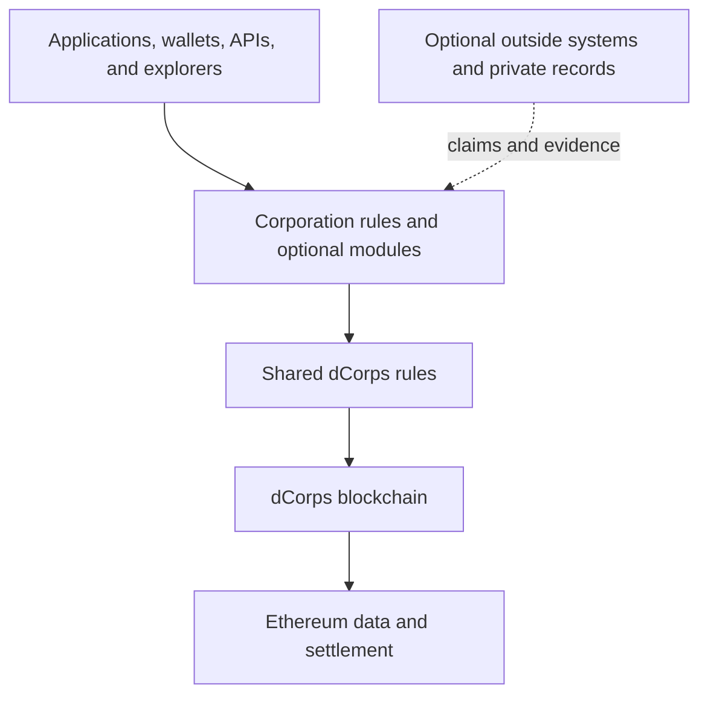
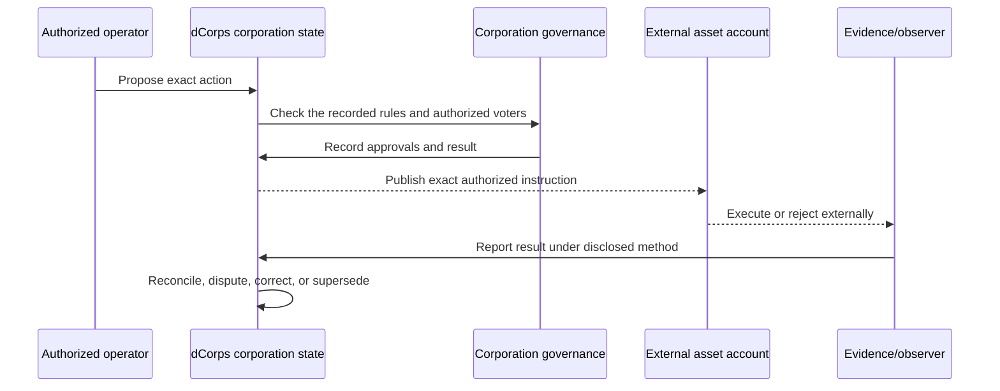
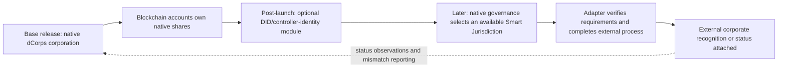
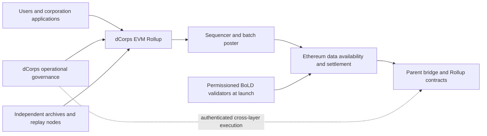
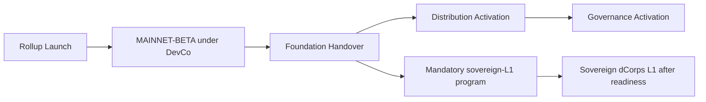

# dCorps

## The Blockchain for Digital Corporations

**Create a business cryptographically. Own it directly. Operate it globally.**

- **Document type:** Blockchain whitepaper
- **Version:** 1.0
- **Status:** Official project baseline
- **Date:** 2026-07-17
- **Author:** Nicolas Turcotte, Protocol Founder
- **Bootstrap sponsor and operator:** dCorps Development Ltd. (BVI)

This document is the official project-design baseline for the dCorps blockchain. It presents the purpose, architecture, protocol model, native asset, governance path, security assumptions, and adoption strategy. Unless deployment evidence is expressly cited, present-tense descriptions state the **target design**, not a claim that a feature is already deployed, audited, operational, decentralized, or legally effective. It is not an offer to sell DCHUB, does not authorize a public distribution, and is not legal, tax, accounting, investment, or regulatory advice. Production addresses, deployed software versions, audits, legal instruments, operating providers, sale or distribution terms, and live network parameters belong in separately published disclosures.

---

## Abstract

Today, creating a business begins with geography. A person selects a country, state, or province; follows its formation rules; pays the required intermediaries; enters a local registry; and then attempts to obtain banking, payment, and international credibility. Access, cost, speed, and trust depend heavily on where that person lives and which institutions accept the result.

dCorps begins somewhere else: cryptography.

> The ability to form an organization and be taken seriously should not depend on where you were born.

A valid creation transaction on dCorps creates a digital corporation directly on the blockchain. It does not report that a corporation was already created by a country. It creates the corporation's native identity, initial ownership, governing rules, roles, accounts, and history inside dCorps.

The creator receives a complete business-management structure rather than an empty registry entry. The corporation begins with a stable identity, shares owned by blockchain accounts, decision rules, proposals, approvals, directors, officers, operators, and delegated roles. It can designate merchant, operating, payroll, reserve, capital, and treasury accounts; prepare bridged-stablecoin and other programmable-asset payments; and connect documents or external events to on-chain evidence.

The corporation also controls how its information is disclosed. It can make selected records public, keep sensitive material private, or open particular information to named blockchain accounts and roles such as an auditor or investor. Every accepted action, change, dispute, and correction contributes to an append-oriented history that can be reconstructed independently of the original application when the disclosed chain and archival requirements are satisfied.

dCorps presents this structure through complete official web and mobile management applications. A founder should be able to create the corporation and then manage ownership, partners, governance, roles, treasury accounts, bridged-stablecoin payments, evidence, disclosure, and reporting from one coherent workspace. The applications make the blockchain usable; the chain keeps the authoritative record. Every canonical corporation operation available through an official application must also be available through documented programmatic and direct-chain interfaces under the same corporation authorization and protocol rules.

A corporation can be created by one person or jointly by several partners. The founders assign share units to their blockchain accounts and choose rules for voting, share transfers, protected decisions, roles, and treasury approvals. Smart contracts apply those rules before accepting a change. This gives the partners cryptographic protection against unilateral action: one partner cannot simply take another partner's shares, rewrite the agreed rules, or approve a protected transaction without the required account signatures and approvals.

The blockchain account shown in the official dCorps share ledger owns the native shares. Whoever satisfies that account's signing rules controls it: normally a private key for a basic account or the published signer and recovery rules of a smart account. A wallet is the access tool; the account is the owner. No incorporation paper, attorney, notary, bank, DID, Smart Jurisdiction, or government registry is required to create or own the base dCorps corporation.

The design requires alteration of accepted history to be detectable under the disclosed trust model. A correction, transfer, governance change, or superseding action creates a new visible record. dCorps therefore provides durable evidence of what the corporation recorded, who had authority under its rules, what was approved, and how the state later changed. It does not make every off-chain claim true, and MAINNET-BETA's disclosed chain-owner and archival risks limit the strength of this guarantee until those powers and dependencies are removed.

Every dCorps corporation uses one universal, modular corporation model. There is no template or corporation-type selection. A corporation can begin with one owner or several owners, simple rules or layered governance, and only the roles and accounts it needs. Creation choices establish its initial state; later authorized workflows can change ownership, share classes, decision rules, directors, officers, delegations, accounts, financing, disclosure, and other operating capacity without changing its permanent identity or abandoning its history.

DCHUB is the fixed-supply native gas asset. Stablecoins and other commerce assets remain external assets represented through disclosed bridges. Future DID modules may identify account controllers, and future Smart Jurisdictions may attach external legal recognition, but neither creates the native corporation, owns its shares, or becomes its source of truth.

The launch implementation is an EVM-compatible Arbitrum Rollup settling directly to Ethereum. The Rollup allows dCorps to become operational before an independent consensus network is technically and economically sustainable, but it is bootstrap architecture rather than the final destination. The chain is dCorps, applications are replaceable, user corporations control themselves, and protocol operations progress from DevCo bootstrap to independent Foundation stewardship and later public DCHUB governance. After Foundation Handover, the Foundation has a continuing mandate to preserve the operating network and lead the readiness-gated development of a sovereign dCorps Layer 1. DevCo remains involved through a disclosed long-term development and operations agreement, while Nicolas Turcotte's protected strategic role preserves the mission against speculative capture without becoming permanent technical control over the sovereign network.

---

## dCorps in one minute

1. Create a corporation alone or with several partners directly on dCorps.
2. Issue its share units to the partners' blockchain accounts and choose the rules that protect them.
3. Use those accounts to prove ownership and approve decisions.
4. Set directors, officers, roles, rules, and business accounts.
5. Receive and make payments with supported bridged stablecoins and other assets.
6. Choose what is public, keep sensitive records private, or open selected information to specific blockchain accounts and roles such as an auditor or investor.
7. Build an append-oriented history whose alteration is detectable under the disclosed network trust model.
8. Add optional identity or external legal recognition later if the corporation wants it.
9. Start alone or create a complex structure from day one; grow without changing the corporation's identity.

The business exists on dCorps because the blockchain created it. A country, application, bank, lawyer, or service provider may interact with it later, but none of them is the source of its dCorps existence.

### Plain-language terms used in this paper

| Term | Meaning here |
| --- | --- |
| Account | The blockchain address or smart account that owns shares or performs an action |
| Canonical | The official result recorded by dCorps |
| Entity state | The corporation's current recorded ownership, rules, roles, accounts, and history; in V1.0, an entity is always a native dCorps corporation |
| Corporation rules | The versioned protocol rules shared by every dCorps corporation; a corporation's structure comes from its recorded state, not from a template or type |
| Native dCorps share | A protocol-native unit of ownership and control inside one dCorps corporation; it is not automatically a statutory share under external law and is not equity in DevCo, the Foundation, or DCHUB |
| Evidence anchor or commitment | A cryptographic fingerprint of information; it proves the fingerprint was recorded, not that every claim is true |
| Governance | The rules and process used to propose and approve decisions |
| DCHUB | The native asset used to pay dCorps transaction fees and, later, govern shared chain operations |
| Foundation | The independent institution that later stewards the shared dCorps network and leads the sovereign-L1 mission; it is not a kind of corporation created by dCorps |
| Bridge | The system that represents an external asset, such as a stablecoin, on dCorps |
| Rollup | A blockchain that executes its own transactions while publishing data and results to Ethereum |
| Final | A record that has reached the disclosed point at which users may rely on it |

---

## Contents

1. A new way to form and operate a business
2. What dCorps is
3. Rules the design must follow
4. How dCorps identifies a corporation and records change
5. Ownership, voting, roles, and asset signing
6. One corporation model, shaped over time
7. What the chain proves, what counts as evidence, and what stays private
8. Treasury and payments
9. Why dCorps uses its own blockchain
10. DCHUB: paying for the chain and later governing shared operations
11. Who controls what
12. Protecting the chain, corporations, and history
13. Adoption strategy and roadmap
14. What can go wrong
15. How dCorps differs from other systems
16. Conclusion

Sections 1 through 8 explain the product and the corporation model. Sections 9 through 12 explain the blockchain, DCHUB, control, and security. Sections 13 through 16 explain launch, risks, and differentiation. Exact software algorithms and legal instruments are deliberately outside this whitepaper.

---

## The idea in one sentence

> dCorps lets anyone create a corporation on a blockchain, own it through blockchain accounts, operate it through clear rules and accounts, and build an append-oriented history independent of any single application or country.

dCorps proves what happened inside dCorps. It does not automatically prove that every outside claim is true, that a payment was wise, or that an outside institution will recognize the result. It **does** determine native dCorps ownership: if the official chain record assigns shares to an account, that account owns those shares inside the dCorps corporation. External legal recognition is separate and optional.

The chain—not the official application—is dCorps. Applications, wallets, explorers, indexers, APIs, and professional services are replaceable access surfaces. They can improve usability and provide conclusions within their own responsibility, but they do not become consensus.

Control is divided into three understandable parts:

1. **Each corporation controls itself:** its owners and authorized participants control its shares, rules, roles, accounts, and assets.
2. **Shared chain operations are governed separately:** DevCo operates the Rollup first, the Foundation later, and eligible DCHUB holders may eventually govern listed operational matters. After handover, the Foundation is also responsible for carrying the network toward its sovereign Layer 1 mission.
3. **The project keeps a protected direction during development and transition:** Nicolas Turcotte is the permanent historical Protocol Founder and initial Strategic Steward for dCorps identity, mission, core doctrine, DCHUB purpose, roadmap, and overall direction. This protection prevents speculative token governance from removing the Founder or redirecting the project while he builds it and helps the Foundation continue the mission. It does not provide unilateral control over a corporation, its assets, chain treasury spending, personnel, consensus, validation, or routine technical operations, and it is not infinite personal technical control over the final sovereign network.

During the Rollup phase, this is not described as complete decentralization. The purpose is to protect the mission during development, decentralize shared operations over time, keep every dCorps corporation under its own control, and ultimately establish a sovereign network that no Founder, DevCo, Foundation, parent chain, provider, or administrative controller can unilaterally shut down.

### Design at a glance

| Dimension | V1.0 target design |
| --- | --- |
| Protocol category | Blockchain for creating and operating digital corporations |
| Bootstrap execution | EVM-compatible Arbitrum Rollup |
| Bootstrap settlement and parent data availability | Ethereum |
| Launch validation | Permissioned BoLD with disclosed validators |
| Native gas | DCHUB |
| Commerce assets | Bridged stablecoins and other external assets under disclosed bridge and issuer assumptions |
| Maximum DCHUB issuance | 1,000,000,000 |
| Corporation model | One universal modular corporation model whose structure is shaped by recorded state and authorized workflows, not templates or corporation types |
| Workflow requirements | Supported workflows define common authorization, transition, event, evidence, privacy, failure, and reconstruction requirements across every interface |
| Access surfaces | Official web and mobile applications, managed REST API, SDKs, direct RPC, published contract ABIs, wallets, explorers, and conforming third-party systems |
| Managed-service boundary | Providers may charge for hosted capacity and support, but service access cannot grant different protocol powers or restrict independent direct-chain access |
| Native share owner | The blockchain account shown in the official dCorps share ledger |
| Ownership control | The account's private key or published smart-account signing rules |
| Ownership-upgrade objective | No DevCo, Foundation, Founder, token vote, chain administrator, or application can unilaterally change a corporation's finalized ownership |
| Identity binding | Not part of the base release; future optional DID or controller-attestation modules |
| External legal status | Post-launch optional Smart Jurisdiction attachment, separate from native existence and ownership |
| Supported structure | Native dCorps corporations only |
| Corporation assets | Non-custodial and corporation-controlled |
| Privacy model | Public authority state with minimized data and protected source records |
| Historical reconstruction | Ethereum blobs, independent complete archives, permanent Ethereum commitments, and tested replay |
| Bootstrap operator | dCorps Development Ltd. (BVI) |
| MAINNET-BETA trust boundary | DevCo controls disclosed Arbitrum chain-upgrade authority; mitigations reduce but do not eliminate that power during beta |
| Institutional transition | Same-Rollup Foundation Handover after readiness gates and only after the Foundation's governing instruments impose the sovereign-L1 mission and the continuing DevCo agreement is effective |
| Long-term network mission | A sovereign dCorps Layer 1, launched only after separately reviewed technical, security, economic, and continuity readiness |
| Public distribution | Separate Distribution Activation, including up to 7% public sale and 3% community distribution |
| Public governance | Later delegated, linear DCHUB voting for listed operational surfaces |
| Strategic direction | Nicolas Turcotte as permanent historical Founder and initial Strategic Steward, with protected anti-capture authority during development and transition rather than infinite technical control |
| Decentralization claim | DevCo-operated bootstrap, progressive operational decentralization, corporation autonomy, and a mandatory sovereign-L1 destination |

---

## 1. A new way to form and operate a business

### 1.1 What makes a business

A business needs more than a name. It needs an identity, owners and a record of what they own, rules for making decisions, people authorized to perform specific jobs, accounts used to receive and pay money, and a history of what happened. These pieces form one operating structure even though conventional systems usually store them in different places.

All of those things can change. A founder may add an investor. Share classes may change. A director may leave. A new treasury account may replace an old one. A vote may correct an earlier mistake.

dCorps keeps the current situation and the history together. It can answer simple questions: Who owns the shares now? Who could approve this action? Which account could sign it? What rules applied at the time? What evidence was recorded? What changed later?

### 1.2 Today's business records are scattered

Today, those answers are spread across registries, contracts, ownership spreadsheets, board minutes, banks, wallets, accounting tools, and private applications.

A registry may name an officer without showing every limit on that person's power. An ownership spreadsheet may show balances without showing which rules applied to a vote. Meeting minutes may approve a payment without identifying the exact asset, amount, network, or receiving account. A wallet may sign a transaction without knowing whether the corporation approved it.

When someone later needs proof, the history must be rebuilt from emails, exports, signatures, minutes, transaction records, and provider logs. That is slow, expensive, and often incomplete.

dCorps starts independently of those old systems. A dCorps corporation can exist and operate before it receives any service or recognition from a registry, bank, card network, lawyer, or corporate-service provider. Outside services can connect later, while the corporation's native existence and history continue on the chain.

### 1.3 Replace geography with cryptography

Today's business system begins with a country. It depends on local registries, legal services, banks, payment companies, and private databases. The same business may appear credible in one country and difficult to verify, fund, or pay in another.

Blockchains, programmable accounts, stablecoins, and open financial tools work across borders. What is still needed is a native way to create and operate the business itself on those rails.

dCorps provides that new system. A person can create a digital corporation, issue shares to blockchain accounts, set decision rules and roles, designate business accounts, record actions, attach document fingerprints, use bridged stablecoins, and build a history that anyone can inspect.

At every scale, that native stack can be the business—not a waiting room for conventional incorporation. A dCorps corporation can begin with one owner or with a complex structure, and it can evolve from one to the other without abandoning its identity or history. External legal status or services may be attached later if the corporation chooses them, but they do not define whether the dCorps corporation exists, owns its shares, governs itself, or can operate through digital financial rails.

This is valuable for a solo founder, a local shop, a remote team, a small school, a cross-border venture, a community-owned business, and a growing company. Scale and professional sophistication are not admission requirements. dCorps reduces the gap between corporations that inherit trusted rails and corporations that must otherwise spend heavily to prove that they exist and operate seriously.

The value comes from making the raw corporate history portable, structured, and difficult to falsify retroactively. Counterparties, communities, software, and future analysis systems can then form better judgments from shared evidence instead of relying on a single presentation or database.

### 1.4 A wallet signature is not the same as company approval

The blockchain holding an asset answers one question:

> Did the account sign this transaction?

The corporation answers another:

> Did the corporation approve this exact action under its rules?

The answers can differ. A wallet can execute an unauthorized corporate payment. A corporation can approve a transaction that account signers later refuse.

dCorps keeps both answers. A valid account signature proves that the account approved the transaction. The dCorps record shows what that account owns and what the corporation allowed it to approve. If the account holds 40 percent of a share class, it owns that recorded position and receives the rights assigned to that class. The signature alone does not prove the human identity behind the account or give that person an unrelated business role.

The wallet application is only a tool. The blockchain account is the owner. A basic account is normally controlled by its private key. A smart account can require several signers, recovery guardians, delays, or other published rules. A delegated key may perform one limited task without becoming the owner.

dCorps preserves both records and makes the mismatch visible. It does not force corporate approval and asset execution into the same concept.

### 1.5 What dCorps can and cannot prove

The main claim is simple:

> dCorps keeps a public, independently readable history of the corporation and the changes approved under its recorded rules.

From the chain history, a reader can reconstruct the corporation's recorded situation at a particular time, identify which accounts owned its native shares, inspect what a proposal or payment instruction requested, and verify whether the recorded voting and approval rules were satisfied. The same history shows which account signatures were accepted, how an outside result was checked, and whether a later action disputed, corrected, withdrew, or replaced an earlier record.

That proof has a clear boundary. Off-chain statements, professional opinions, legal recognition, beneficial ownership under outside law, commercial fairness, accounting treatment, and provider performance depend on evidence or institutions beyond the chain. dCorps records those materials according to their source and verification method rather than presenting them as native facts. Inside the protocol, however, ownership is unambiguous: the account shown in the official dCorps share ledger owns the corresponding native shares.

### 1.6 Who dCorps is for

dCorps is for anyone who wants to create and operate a native digital corporation. Size, geography, wealth, and corporate complexity are not admission criteria. A solo founder can begin with one owner and grow over time. Several partners can establish protected ownership and decision rules together. A local shop, school, remote team, cross-border venture, or digital-native company can use the same protocol base to establish discoverable existence, receive bridged-stablecoin payments, structure treasury accounts, and build a credible operating history.

The same corporation can later add directors, officers, employees, share classes, financing rounds, delegations, multiple accounts, and more advanced governance. For people operating where banking, merchant processing, registry visibility, or international trust is limited, dCorps provides the same protocol-level starting point available to users in better-served markets. Applications and service providers can build against that shared standard instead of reserving sophisticated infrastructure for privileged clients.

V1.0 supports corporations only. Its universal scope comes from allowing the same corporation model to begin with any practical level of ownership and governance complexity and to keep changing through authorized workflows without changing its identity.

dCorps does not require a business to be small, large, simple, or complex before it deserves a durable identity. A corporation can start with one owner, one share class, basic governance, and a treasury capable of using bridged stablecoins, then add roles, accounts, evidence, financing, and advanced governance without changing its permanent identity. It can also be created with several owners, layered ownership, decision-making groups, delegations, policies, and accounts from the beginning. These are differences in recorded state, not different templates or protocol types. Conventional incorporation and banking remain available choices; they are not prerequisites for native dCorps existence.

The costs and responsibilities of blockchain use—keys, fees, public metadata, smart-contract risk, and recovery—must be made understandable and manageable through product design. They are implementation challenges to solve for ordinary users, not reasons to exclude them from the protocol's mission.

---

## 2. What dCorps is

At its center, dCorps is a blockchain that orders transactions and preserves the official history of every native corporation. Shared corporation rules give consistent meaning to identity, ownership, authority, accounts, evidence, and corrections. Each corporation shapes those capabilities through its recorded state and authorized workflows, while optional modules can add specialized capabilities later. Protocol governance operates the shared chain without entering the internal governance of user corporations.

Applications, wallets, explorers, document stores, financial services, registries, custodians, and other networks can all interact with this structure. They provide access or external services around the corporation, while the chain remains the common record from which its native state can be reconstructed.

The solid path shows the parts of dCorps. The dotted path shows outside information that can be referenced as evidence without becoming an automatic blockchain fact.

### 2.1 The chain—not the app—is dCorps

The website, the Hub, wallets, and corporate-management applications are interfaces to dCorps. The blockchain stores the official corporation identity, issued shares, owners, changes, and history. Public data formats and test examples allow another application to read the same records and recover the same corporation and native share balances from the same final chain history.

This allows applications to compete without splitting the corporation into separate records. A company can leave the official application and use another interface without creating a new corporation.

The official web and mobile applications, managed REST API, SDKs, direct RPC access, published contract ABIs, wallets, explorers, and conforming third-party systems are interfaces to the same protocol. Every canonical corporation operation exposed through an official application must be executable through the documented REST API and SDK and by an independently built client using direct RPC and the published ABIs. Each interface applies the same active corporation rules, account authorization, required signatures, canonical state transitions, evidence semantics, and DCHUB transaction-fee requirements. An API credential controls access to a managed service. Transaction submission requires DCHUB gas paid by the user or a disclosed sponsor. Neither mechanism grants authority inside a corporation. No official application, API operator, or integration receives a private protocol capability or privileged state-transition path.

Capability parity applies to canonical protocol operations and reconstructible canonical state. Hosted indexing, queries, notifications, orchestration, batching, encrypted storage, reports, transaction-sponsorship administration, support, and service levels are provider services. Providers may package and charge for those services. A managed-service restriction cannot restrict documented SDK, direct RPC, published-ABI, or independently built conforming access to the protocol.

### 2.2 The complete corporation-management stack

Most people will experience dCorps through an ERP-style management application built by dCorps. After creating a corporation, the user enters a structured workspace designed to manage the company from formation through daily operation, financing, growth, and eventual transfer or closure. The objective is not to expose raw smart contracts. It is to give an ordinary founder the kind of organized control environment normally assembled from many separate corporate, cap-table, banking, governance, document, and accounting tools.

The corporation workflow catalogue is a protocol-design input. Each supported workflow identifies the initiating account or role, active rules, preconditions, required approvals and signatures, canonical state transition, resulting state, emitted events, evidence and privacy boundary, failure outcomes, and reconstruction requirements. The contracts, schemas, events, indexers, REST API, SDKs, and official applications implement that common operation. Private interface logic cannot replace protocol authorization or canonical state.

The ownership area shows the share classes, issued units, owner accounts, percentages, restrictions, vesting, transfers, and complete capitalization history. A corporation may begin with one owner and one simple share class. A company formed by several partners can show each partner's units and the exact rules protecting transfers or major decisions. The same corporation can add financing rounds, several classes, allocation pools, boards, committees, and investor protections without changing its identity or changing to another template.

The governance and people areas organize proposals, votes, written approvals, directors, officers, operators, delegations, conflicts, and decision thresholds. Instead of treating a policy as a document nobody can enforce consistently, the application translates supported policies into clear workflows backed by smart-contract rules. It shows who can propose an action, who must approve it, when a decision becomes effective, and what happened afterward.

The financial area brings together the corporation's merchant, operating, payroll, reserve, capital, and treasury accounts. It can prepare payment requests, collect the required corporate approvals, send an authorized transaction to the corporation-controlled account for signing, and reconcile the observed bridged-stablecoin or other asset movement with the original decision. The corporation retains custody through its own accounts and signing devices while the management stack connects the payment to the company's authority and evidence history.

The records and reporting areas connect document fingerprints, invoices, agreements, outside observations, corporate actions, and corrections to the relevant event. Disclosure controls let the corporation publish selected information or open protected records to specific accounts and roles such as an auditor, investor, lender, director, or adviser. Dashboards and exports can then present a current view of the corporation while preserving the ability to inspect how that view was produced.

Everything that can be represented and safely enforced on-chain should use the blockchain as its authoritative record. Sensitive source documents and information that should remain confidential stay encrypted outside the public chain and are connected through fingerprints and access rules. The dCorps application may provide the most complete reference experience, but it cannot privately rewrite the corporation: another conforming application must be able to recover the same ownership, decisions, accounts, and history from the chain.

### 2.3 The shared rules every corporation follows

The shared rules provide a stable identifier and status for each corporation, identify the applicable rule version, and preserve the history of ownership positions, roles, governing bodies, committees, delegations, proposals, votes, and approvals. They also define how business accounts are labeled across networks, how evidence and outside observations are connected to actions, and how disputes, corrections, revocations, and replacements affect the current record.

Those rules are universal across dCorps corporations. A corporation may have one or several shareholders, one or several share classes, no board or a layered board and committee structure, simple or protected voting, and few or many operating roles and accounts. These differences are expressed through its state, not through different corporation types.

### 2.4 One modular corporation model

Every native dCorps corporation uses the same versioned corporation rules. There is no template catalogue, preset selection, or protocol-level Solo, Standard, Venture, or Complex corporation type. A corporation's structure is its current on-chain state: owners, share classes, voting and transfer rules, boards, committees, roles, delegations, accounts, recovery choices, disclosure settings, and attached modules.

Creation records the initial shape chosen by the founder or co-founders. Later workflows make the smallest authorized state transitions needed to add or remove owners, issue or transfer shares, establish a board, appoint people, change decision rules, add accounts, raise capital, attach modules, or adopt more advanced controls. Versioned protocol rules can evolve through reviewed upgrades, but a corporation never switches templates or changes its permanent identity merely because its structure becomes more complex.

### 2.5 Optional add-ons

Post-launch modules can add DID identity claims, Smart Jurisdiction adapters, industry workflows, specialized voting, or enhanced account rules. These additions remain separate from the base release and must disclose what they can read or change, who can upgrade them, and how failure affects the corporation.

The important limit is continuity. An optional module cannot rewrite earlier history, redefine the corporation's identity, alter another corporation without authority, or gain custody simply because it was attached. If it fails or is removed, unrelated corporation state must remain intact. This allows dCorps to expand without making any optional provider the new source of the corporation's existence or control.

---

## 3. Rules the design must follow

### 3.1 Corporation autonomy begins with cryptographic ownership

Every dCorps corporation controls its own shares, decision rules, roles, accounts, evidence, disclosures, and assets. The blockchain account shown in the official share ledger owns each native share balance, and that account is controlled through its private key or published smart-account rules. A spreadsheet, certificate, application, future identity provider, or future Smart Jurisdiction may describe the position, but the native ownership record remains on dCorps.

The final ownership objective is non-unilateral control: no DevCo, Foundation, Founder, token vote, chain administrator, or application can change a corporation's finalized ownership without a transition authorized under that corporation's active rules. The corporation contracts enforce this objective from launch. The disclosed Arbitrum chain-owner authority retained during MAINNET-BETA remains a stronger underlying power and means the objective is not yet an absolute chain-level guarantee during that phase.

Ownership is only one kind of power. The right to own shares, vote on a proposal, perform a business task, and sign an asset transaction can belong to different accounts under different rules. Keeping them separate allows a corporation to give an operator permission to issue invoices, for example, without giving that operator shares or unrestricted access to treasury funds. Protocol governance operates the shared chain and has no ordinary role inside those corporation-specific decisions.

### 3.2 The corporation outlives any application

The official dCorps application is designed to provide the complete management experience, but the corporation cannot depend on that application for its existence. Its ownership, roles, rules, accounts, and accepted history remain readable from the blockchain through another application, explorer, node, or indexer. This makes the application replaceable while preserving the company that users created through it.

### 3.3 Evidence, correction, and privacy remain connected

dCorps records where evidence came from and how it was checked. A native blockchain fact, a private document fingerprint, an outside report, and a professional opinion retain different meanings even when they support the same corporate action. That separation lets a reader understand the strength and limits of the available evidence instead of seeing one unexplained verified label.

Mistakes remain correctable without erasing accountability. The original accepted record stays visible, while a later authorized action can dispute, revoke, correct, or replace its current effect. Sensitive source material remains encrypted outside the public chain by default. The corporation decides which information becomes public and which protected records are opened to selected accounts or roles, while the chain preserves the relevant commitments and access history.

### 3.4 Trust must be visible, and shared operations decentralize over time

The dCorps chain still depends on sequencers, validators, bridges, upgrades, price feeds, archives, providers, and governance. Those dependencies must be published in terms users can understand. The network begins as a Rollup under accountable DevCo operation, transitions to an independent Foundation on the same Rollup, and can later activate public DCHUB operational governance after measurable readiness conditions are met. Foundation Handover also begins the Foundation's mandatory responsibility to preserve that operating network while leading dCorps toward a sovereign Layer 1. Handover cannot occur until that responsibility is imposed by the Foundation's governing instruments. The operating controllers and eventually the network architecture can change while every corporation's identity and history continue under an explicitly adopted continuity design.

### 3.5 Founder direction and operational control remain separate

The Protocol Founder protects the mission, doctrine, identity, DCHUB purpose, roadmap, and overall strategic direction of dCorps while building the project and helping the Foundation continue that mission. Normal protocol operations become institutionally and publicly governable, and user corporations remain under their own control. The strategic role protects against speculative takeover; it is not a treasury key, consensus key, validator key, infrastructure key, shutdown power, or hidden power over user corporations. Its continuation and eventual transition are governed separately from the permanent historical attribution of Nicolas Turcotte as Protocol Founder.

---

## 4. How dCorps identifies a corporation and records change

### 4.1 One permanent identity for each dCorps network deployment

The initial dCorps Ethereum Rollup receives one permanent network identifier when it is launched. That identifier is created from facts that cannot later be changed: the Ethereum parent network, the original Rollup contract, and the approved initial deployment record.

The identifier is then stored in the Rollup's initial state. Contract upgrades within that network do not change its identifier. They must point back to the original deployment and publish a verifiable link between old and new contracts. The Protocol Specification contains the exact hashing and encoding method.

The network identifier, continuing dCorps project identity, and each corporation's `EntityID` are different things. The required long-term sovereign dCorps Layer 1 will be a new network deployment with a new network identifier; the Rollup cannot simply be renamed or treated as though it became an L1 in place. This whitepaper establishes the mission rather than a premature transition mechanism. Before L1 launch, a separately reviewed continuity design must preserve exact DCHUB economic supply, holder positions, corporation identity, authorized corporation state, replay protection, and permanent linkage to the final Ethereum-confirmed Rollup state. The new network cannot silently present itself as the original Rollup deployment.

### 4.2 One permanent identity for each corporation

Every corporation receives one permanent `EntityID` when it is created. The identifier is tied to the dCorps chain, the creation registry, a unique creation number, the creator's authorization, the applicable corporation-rule version, and the exact initial corporation state.

The creation record stores a cryptographic fingerprint of those facts. Upgrading the registry does not change the corporation's `EntityID`. A voluntary export to a noncanonical external chain would require an explicit export from dCorps, an identified final source record, acceptance by the destination, protection against using the same export twice, and a public continuity record. The protocol-wide transition to the sovereign dCorps L1 instead follows the separately reviewed network continuity design described above. Another chain cannot simply copy the identifier and claim to be the same official corporation. Exact encoding belongs in the Protocol Specification.

### 4.3 What dCorps records for each corporation

At every point in its history, dCorps records the corporation's:

| Record | What it contains |
| --- | --- |
| Identity | Name, identifier, public claims, and the version of each claim |
| Corporation rules | The applicable version of the universal dCorps corporation rules |
| Status | Draft, active, suspended, dissolved, or archived |
| Ownership | Share classes, issued shares, owner accounts, and restrictions |
| People and powers | Directors, officers, committees, delegates, and recovery authority |
| Decisions | Proposals, eligible voters, approvals, rejections, and results |
| Business accounts | Merchant, operating, payroll, reserve, capital, and treasury accounts |
| Evidence | Document fingerprints, disclosed records, and outside observations |
| Actions and corrections | Operating actions, payments, disputes, corrections, and superseding records |
| Optional additions | The exact versions of any modules attached to the corporation |

A transaction asks dCorps to change one or more of those records. The change is accepted only when it follows the active rules and is approved by the accounts or roles authorized for that specific action.

The decision uses the ownership, roles, rules, conflicts, amounts, assets, destinations, deadlines, and approval thresholds that applied at the recorded decision point. A later change cannot rewrite which rules applied earlier, and an application's private permissions cannot replace the chain's authority record.

When the paper says an account owns a share, it means the official dCorps share ledger assigns that share to the account. When the paper states an ownership percentage, it must also say what is being counted—for example, one share class, all issued shares, voting shares, economic shares, or a fully diluted total. An application cannot display a more favorable percentage by silently changing that basis.

### 4.4 Exactly what an account authorizes

An account signature must be tied to the exact action being approved. The signed information identifies the dCorps chain, the corporation, the action, the result it would produce, the applicable rule version, a one-time reference, and any deadline. This prevents a signature collected for one corporation, action, or time from being reused for something else.

For a basic account, authorization normally means a valid signature from its private key. For a smart account, authorization means satisfying its published rules—for example, two of three signers, a hardware key, a guardian, or a recovery delay. The wallet software is not the owner and does not become authoritative merely because it displays the balance.

A service may deliver an already authorized action to the chain, but it cannot change what the account approved. Exact message formats and signature standards belong in the Protocol Specification.

### 4.5 From creation to closure

A corporation can move through clear recorded stages:

- a draft can become active or be abandoned;
- an active corporation can be suspended and later restored;
- an active or suspended corporation can be dissolved; and
- a dissolved corporation can be archived while its history remains available.

The dCorps status is not an outside legal status. A native dCorps corporation can be active without any legal-status attachment. A later Smart Jurisdiction or outside registry can report a different status in its own system. Interfaces must show the source and date of every external-status claim instead of presenting it as native dCorps state.

An external registration, court order, professional conclusion, future DID-binding change, or future Smart Jurisdiction status update can be committed as evidence or observation when the applicable module exists. None of them directly changes native share ownership. Current native ownership changes only through a valid dCorps state transition under the applicable corporation rules. If external and native states conflict, both are shown and the mismatch remains explicit until an authorized native transition or an external correction resolves it.

Corrections are append-oriented:

1. the original accepted record remains visible;
2. the correcting record identifies its target;
3. it states its authority, effect, and reason;
4. current-state derivation follows the explicit correction rule; and
5. historical queries show both states.

This preserves accountability without treating a known error as permanent current authority.

---

## 5. Ownership, voting, roles, and asset signing

dCorps keeps four questions separate: Who owns the shares? Who may approve this decision? Who may perform this business task? Who can sign the asset transaction? The same account may answer several questions, but one power never silently becomes another.

### 5.1 Who owns the shares

A native share is owned by the blockchain account shown in the official dCorps share ledger. Each share class can have its own rights for voting, information, payments, conversion, transfer, or closure of the corporation.

A **native dCorps share** is a protocol-native unit of ownership and control inside one dCorps corporation. It is not automatically a statutory share created under an external jurisdiction and is not equity in dCorps, DevCo, the Foundation, or DCHUB. External recognition may attach later without becoming the source of native ownership.

This is ownership inside dCorps. A certificate, DID, application database, spreadsheet, Smart Jurisdiction, or government registry is not required to make the share exist. Future identity and legal services may describe or recognize the share, but they do not become the dCorps share ledger.

The owner controls the share through the account's signing rules. That may be one private key or a smart account with several signers and recovery options. At base release, the account may remain pseudonymous. A future identity requirement may apply to a particular service, but identity information does not become ownership.

Share ownership does not automatically make someone a director, officer, application administrator, asset signer, or governor of the dCorps chain. The share class and corporation rules say what the owner may do.

### 5.2 Who may approve a decision

Voting power is the right to vote, consent, approve, or reject a particular corporation action. dCorps calculates it from the recorded ownership, roles, and rules that apply to that decision.

Voting power can depend on:

- eligible position classes;
- balances at the record block;
- board or committee seats;
- class-specific voting rules;
- delegations and proxies;
- vesting or transfer restrictions;
- conflicts and exclusions;
- minimum participation and counting rules;
- approval thresholds; and
- the proposal's action type and economic scope.

An owner may have 50 percent of the voting power for one proposal and no vote on another. A vote does not make the owner an officer, operator, administrator, or asset signer.

### 5.3 Who may perform a business task

Permission to perform a business task comes from a recorded role, board seat, delegation, limit, or approved process. Tasks can include:

- issue an invoice or payment intent;
- submit an evidence commitment;
- propose a payment;
- update a claim;
- administer a program within an approved budget;
- prepare a financing action;
- nominate a role change; or
- submit an account-designation update.

Permission is specific to the action. A job title alone does not authorize every change.

Where a corporation has expressly adopted it, root authority is a limited recovery and rule-protection role inside that corporation. It is not general ownership, voting power, or asset control. A root controller cannot rewrite old ownership records, bypass required approvals, or override an owner account that selected no recovery.

### 5.4 Who may sign an asset transaction

Asset-signing power is the ability to sign or submit a transaction from the account holding the asset. It follows that account's keys, smart-contract rules, or provider rules.

Asset-signing power may belong to a basic blockchain account, a multisignature or other smart account, a custodian, a bank, a payment provider, or another independently governed execution system. dCorps connects the corporation's instruction to the observed result while the selected account system retains execution control.

### 5.5 Company approval and asset signing are different

For a protected payment, dCorps asks two separate questions:

1. **Did the corporation approve this exact payment under its recorded rules?**
2. **Did the account holding the asset sign and complete the transaction?**

The relationship can produce four meaningful states:

| Corporation authorization | Asset execution | Interpretation |
| --- | --- | --- |
| Valid | Matching | Recorded authority and observed execution align |
| Valid | Missing or rejected | The corporation approved, but execution did not complete |
| Missing or invalid | Executed | The asset account moved funds without the expected corporation authorization |
| Valid | Mismatched | Execution differs in network, asset, source, destination, amount, call data, or another bound effect |

The third and fourth cases are not hidden as success. They are authority mismatches that can trigger corporation-specific review, dispute, remediation, or correction.

### 5.6 Use the rules that existed when the decision was made

Every important proposal identifies the exact recorded moment used to decide who could vote or approve. It may use the moment the proposal was created, the start of voting, or another moment stated in the corporation's rules.

Moving shares, changing a board seat, ending a delegation, or changing a policy later cannot silently change the preserved result. New rules do not rewrite whether an earlier action was properly approved.

### 5.7 From proposal to result

The external account can remain fully independent. The chain preserves how the corporate decision relates to the external result.

---

## 6. One corporation model, shaped over time

### 6.1 One universal corporation

Every native dCorps corporation is created under one universal, versioned corporation rule system. The founder does not select a corporation template or protocol type. The creation transaction establishes the corporation's permanent identity and the initial state chosen for its owners, share classes, issued shares, decision rules, directors, officers, delegates, business accounts, recovery policies, evidence, and disclosure.

For a founder in Sri Lanka—or anywhere else—creation produces much more than an empty blockchain address. It creates the corporation and its first rules directly on dCorps. The blockchain accounts shown in the share ledger own the native shares. No incorporation paper, outside ownership spreadsheet, DID, application provider, attorney, notary, bank, or external registry is required.

The same model supports a corporation created by one owner, several co-founders, or a layered ownership and governance structure from the beginning. Every later increase or reduction in complexity is an authorized change to that corporation's state, not a switch to another template.

This native existence does **not**, by itself, claim recognition by an outside legal, tax, banking, or regulatory system. A future Smart Jurisdiction may attach an available external corporate recognition or status if the corporation chooses it and satisfies the applicable requirements. V1.0 creates and operates native corporations only. Other organizational forms are outside its scope and are not promised.

### 6.2 A complete corporation from day one

Creating a dCorps corporation initializes a coherent initial operating state rather than a single registry row:

| Component | What it gives the corporation |
| --- | --- |
| Corporation identifier | Stable identity independent of an application |
| Identity claims | Native names, domains, external references, public accounts, and verification methods; DID bindings are a post-launch module, not a base-release dependency |
| Native share ledger | Share classes, issued supply, account-owned balances, rights, restrictions, and history |
| Decision rules | Proposal types, eligible voters, minimum participation, approval levels, protected decisions, and versions |
| Board and roles | Directors, officers, committees, operators, delegations, and effective periods |
| Account registry | Merchant, operating, payroll, reserve, capital, and treasury designations |
| Evidence record | Document fingerprints, file lists, outside reports, signed statements, and disclosure choices |
| Corporate timeline | Ordered proposals, approvals, transitions, executions, disputes, and corrections |
| Recovery rules | Signer changes, recovery, objections, delays, and emergencies |
| Integration surface | Versioned events, reads, exports, REST API, SDKs, direct RPC, published contract ABIs, and replaceable applications |

A corporation can begin simple and add complexity through approved changes without changing its permanent identity.

Several partners can also create the corporation together from the beginning. They can divide the initial share units among their accounts and define which decisions require a simple majority, a larger shareholder threshold, approval from a specific share class, board approval, or several treasury signers. The smart contracts check those rules every time a protected change is proposed. No application administrator can bypass them merely by editing a private database.

This enforcement reduces dependence on trust between partners and on a single administrator. It does not eliminate smart-contract, key-compromise, bridge, or upgrade risk; those risks remain subject to the security and recovery model described later in this paper.

### 6.3 From simple to complex through workflows

The corporation is shaped by the smallest explicit workflows needed for its actual operation. At creation, a founder can issue all shares to one account and use one decision path, or several founders can divide shares among their accounts and establish protected decisions immediately. After creation, authorized workflows can add or remove owners, issue or transfer shares, create or amend share classes, establish a board or committee, appoint or remove officers, delegate a task, designate accounts, adopt recovery rules, raise capital, change disclosure, or attach an optional module.

A person can be the only owner, director, and operator at first while those capacities remain distinct in the record. The same corporation can later contain several shareholders, investor protections, financing rounds, vesting, committees, many accounts, advanced treasury rules, and different approval or privacy rules for different actions. It can also simplify again through valid transitions.

No workflow changes the corporation into another protocol type. The permanent `EntityID`, accepted history, and continuity remain while the recorded state changes.

### 6.4 Accounts own and transfer shares

A native share belongs to one `EntityID`, one share class, and one owner account. Its rights come from that share class and the corporation's active rules. The account shown in the official dCorps share ledger is the owner.

Issuance, allocation, acceptance, transfer, cancellation, repurchase, conversion, vesting, restriction, and correction are explicit native state transitions. A transfer changes ownership only when it is accepted under the applicable corporation rules. The current owner account must cryptographically authorize the transfer, and the corporation can enforce disclosed class restrictions, lockups, rights of first refusal, approval requirements, or other native rules. These constraints regulate how the owner exercises the position; they do not make an application or Smart Jurisdiction adapter the owner.

The ownership rule is:

> Control the account under its cryptographic policy, and you control the native shares held by that account, subject to the corporation's on-chain share rules.

In ordinary user language, **your wallet owns your shares**. More precisely, the owning object is the blockchain account and the wallet is the software or device used to exercise its cryptographic control.

For a conventional account, private-key control normally provides that authority. For a smart account, the controlling condition can be a threshold, multisignature, hardware key, guardian set, time delay, recovery module, or another published cryptographic policy.

Recovery is an owner choice, not a protocol master power. An owner may select an account with no recovery and accept the risk that a lost key can make the shares permanently unusable. An owner may instead select a smart account with its own signers, guardians, delays, and recovery conditions. dCorps, DevCo, the Foundation, and protocol governance possess no universal recovery key. A recovery policy cannot be added or expanded after the incident unless the owner account had already authorized that possibility.

A compromised key can authorize a malicious action if the account and corporation rules provide no protection. Native transfer delays, smart-account recovery, corporation-approved freezes, and challenge rules may prevent or reverse current effect only when the owner accepted those protections before the incident and the predetermined on-chain transition authorizes the result. They do not erase the original transaction, and no external paper record directly rewrites the ledger. If a malicious transfer reaches final native effect under the configured rules, the canonical owner changes; the protocol does not pretend otherwise.

Native shares are not DCHUB. They grant rights only inside their corporation and never create dCorps protocol-governance power.

### 6.5 Future optional DID identity

The base release ends at native cryptographic account control. It does not require, issue, resolve, or govern DIDs. A blockchain account owns its native shares whether its controller is public, pseudonymous, or later identified.

A future optional DID module may bind one or more controller identity claims to an account. Such a binding can support eligibility checks, disclosures, credentials, or later Smart Jurisdiction requirements, but it remains an identity and attestation relationship. The blockchain account continues to own the shares, and only its cryptographic authorization policy can approve a transfer. The DID and its document never hold the shares, so creation, rotation, revocation, reassignment, expiry, or failure of the identity service leaves the official share ledger unchanged.

If a future module uses a DID claim as one condition of an action, the applicable corporation rules must disclose that condition without collapsing controller identity into ownership. The precise DID methods, credential formats, privacy controls, recovery rules, and trust assumptions belong in the module specification and Network Disclosure adopted for that later release.

### 6.6 Future optional external legal recognition

A native dCorps corporation can operate without any Smart Jurisdiction. It retains its `EntityID`, shares, ownership, governance, roles, accounts, and history even if no external legal attachment is ever selected.

A **Smart Jurisdiction** is a post-launch reviewed adapter and service integration that can connect the native corporation to an available external corporate form or recognition path. It is introduced only after the required identity, evidence, privacy, and adapter mechanisms are separately reviewed. It publishes its supported jurisdiction, corporate form, eligibility, required controller identity claims or DIDs, evidence, filings, fees, continuing obligations, status sources, supported actions, limitations, and exit conditions.

The intended flow is:

Selection is a corporation action under the corporation's native governance rules. When the relevant post-launch modules exist, a DID can establish the identity or eligibility of an account controller where the chosen jurisdiction requires it. The DID does not own the shares, and no DID participant can authorize or perform a share transfer merely through the identity layer. The adapter attaches recognition to the already existing corporation; it does not create the native corporation retroactively.

A Smart Jurisdiction can be renewed, superseded, suspended, expire, or be removed without deleting the core corporation. An external registry, court, or service can control the legal result within its own system, but cannot silently alter dCorps ownership. If external and native ownership diverge, dCorps records the external claim and displays the mismatch while canonical native ownership remains the on-chain account state until the corporation completes an authorized native transition.

### 6.7 Future optional legacy-company mapping

Mapping an existing legal company is not a base-release objective and is not the dCorps product thesis. A future optional interoperability module may allow an existing company to create a mapped dCorps representation by committing its initial mapped state, source records, mapping date, verification method, and relationship to a native share ledger. The dCorps representation and the legal company remain distinct systems whose relationship is explicit rather than assumed.

If such a module is introduced, the mapping identifies whether native shares mirror external statutory shares, represent a separate digital capitalization, or use another disclosed relationship. It also identifies which system controls each external legal conclusion. The existing legal company does not become the source of truth for the native dCorps ledger merely because it predates the mapping. Supporting legacy migration must never redefine dCorps as software for fitting conventional corporations into an existing legal framework.

### 6.8 Transferring full control of a corporation

Selling or handing over a company may require several coordinated but distinct changes. Native shares may move to new owner accounts while directors and officers change, root and account signers rotate, protected records move to new control, public claims and domains are updated, and recovery policies are replaced. Treating those steps separately makes partial completion and unfinished obligations visible.

dCorps exposes the state before and after each transition, its separate authority path, partial completion, effective time, and external steps that remain outstanding. This is safer than treating control as a single private-database flag.

---

## 7. What the chain proves, what counts as evidence, and what stays private

### 7.1 Five types of evidence

dCorps separates evidence according to what it can actually establish.

| Type | Meaning |
| --- | --- |
| On-chain dCorps fact | A fact that can be read from a final dCorps record under an identified software version |
| Private record with an on-chain fingerprint | A document or file kept outside the public chain while its cryptographic fingerprint and context are recorded |
| Outside observation | A reported event from another blockchain, registry, provider, or system, together with the method used to check it |
| Signed statement | An identified issuer's statement about a subject and time |
| Expert conclusion | A legal, accounting, audit, valuation, compliance, or other expert opinion for which the issuer remains responsible |

The classes can be combined in an evidence package. They are not interchangeable.

### 7.2 Facts the dCorps chain can prove

The chain can prove that a corporation was created on dCorps; which shares were issued; which accounts owned them; which rules and roles were active; which proposals and approvals were recorded; which business accounts were designated; which evidence fingerprints were stored; which corrections were made; and the order in which those events occurred.

They are strong within the chain's trust model. They say nothing automatically about facts outside that model.

When this paper refers to the corporation's **material state**, it means the public information needed to understand its identity, status, shares, owners, rules, roles, business accounts, proposals, approvals, evidence references, disputes, corrections, and active optional attachments at a particular point in the chain history. It does not include the hidden contents of a private document. If only a document fingerprint was recorded, dCorps can later confirm whether disclosed bytes match that fingerprint; it cannot recreate a file that was never made available.

### 7.3 Private documents and their fingerprints

Raw contracts, invoices, payroll data, customer lists, personal information, professional work papers, credentials, and internal communications should remain outside public state unless a corporation knowingly chooses disclosure.

A useful fingerprint identifies the hashing method and the exact file or file list to which it applies. It also records who submitted it and under what authority, which corporation action or reporting period it supports, how the source record is retained or disclosed, whether a later record replaces or withdraws it, and any known omissions or coverage limits. That context prevents an unexplained hash from being presented as stronger evidence than it really is.

A matching fingerprint proves that the disclosed file is the same file that was previously referenced. It does not prove that the document is accurate, complete, fair, lawful, or the only relevant record.

Protected records are encrypted before leaving the user's controlled environment where practicable. Commitments to predictable private records use a unique secret salt or an equivalent hiding construction so that an observer cannot test likely plaintext against a naked public hash. The exact encryption, commitment, and key-management mechanisms belong in the Protocol Specification.

### 7.4 Reports from outside systems

External systems remain independent. dCorps therefore records how an event was established.

| Observation method | Trust implication |
| --- | --- |
| On-chain proof | Depends on the proof system, verifier, source consensus, and finality |
| Light client or reviewed bridge | Depends on client, bridge, validator, and upgrade assumptions |
| Oracle | Depends on membership, aggregation, incentives, and failure policy |
| Provider attestation | Depends on the provider's authority and accuracy |
| Independent observer threshold | Depends on observer selection and threshold |
| Corporation-supplied claim | Self-asserted unless separately supported |

An interface must not display every method with the same confidence label.

### 7.5 Exporting a complete evidence package

An evidence package answers a defined question for an authorized reviewer. It identifies the corporation and time range, the relevant chain and contract versions, the state changes being examined, and the finality level used. It can combine disclosed records with their matching fingerprints, outside observations with their verification methods, and signed attestations with the status of their issuers. If an application or indexer derived part of the view, the package explains that derivation. It also carries known disputes, corrections, omissions, and limitations, and identifies any professional responsible for conclusions that go beyond raw protocol facts.

The package reduces ambiguity. It does not eliminate judgment.

### 7.6 The corporation controls disclosure

dCorps does not force a corporation to make every record public. The corporation chooses the disclosure level for each information category and, where supported, for each individual record.

| Disclosure level | Who can read it | Example |
| --- | --- | --- |
| **Public** | Anyone | Public name, selected ownership information, a published proposal, or a designated business account |
| **Corporation-private** | Only corporation accounts or roles authorized by its rules | Internal policy, detailed invoice, payroll record, or private schedule |
| **Selected accounts** | Specifically named blockchain accounts | A due-diligence package opened to one investor account or a financial record opened to one auditor account |
| **Selected roles** | Accounts holding a defined role under the stated access rule | Records shared with current directors, an audit role, an investor-information role, or an authorized adviser role |
| **Commitment only** | Nobody receives the private contents through dCorps; the public chain shows only a fingerprint and limited context | A confidential agreement whose existence and later integrity may need to be proved |
| **Time-limited access** | Named accounts or roles until a stated expiry | A lender receives access during underwriting, or an investor receives access during a financing review |

The levels can be combined. A corporation may make its existence, basic ownership structure, and selected governance history public while keeping contracts, customer records, payroll, commercial terms, and detailed financial records private. It may then open only the required private records to a particular auditor, investor, lender, director, adviser, regulator, or other reviewer.

In user language, the corporation can choose:

- **what** information is being shared;
- **who** may access it;
- **why** access is granted;
- **when** access begins and expires;
- whether access belongs to a **specific blockchain account** or to a **defined role**; and
- whether a role grant follows future role holders or is frozen to the accounts holding that role when access was granted.

The blockchain account—not the wallet application—is the access subject. A recipient may use compatible software such as MetaMask or a hardware signer such as Trezor or Ledger to prove control of that account. Changing wallet software does not change the access grant. A wallet address alone does not prove the recipient's human identity; any identity requirement is a separate verification condition and does not become ownership.

Private source records remain encrypted outside the public chain under storage and key-management arrangements chosen by the corporation. dCorps records the document fingerprint, disclosure rule, authorized grant, effective period, expiry, revocation, and later replacement without publishing the private plaintext. A permitted recipient proves control of an authorized account and obtains the record or decryption material through the selected protected-record system. Exact encryption, key-wrapping, storage, recovery, and delivery methods belong in the Protocol Specification and the protected-record provider disclosure.

Access can be revoked for future use, and keys can be rotated for later versions. Revocation cannot make a recipient forget information already viewed or delete a copy already downloaded. It also cannot protect plaintext that was accidentally placed in a public transaction. Recipient devices, storage providers, access services, and key-recovery systems remain security and confidentiality risks.

A disclosure setting communicates the corporation's intended access boundary. It does not guarantee that an authorized recipient will preserve confidentiality, that an off-chain provider will remain available, or that public metadata reveals nothing.

### 7.7 Privacy limits

Public-chain data can be difficult or impossible to erase, so privacy begins before submission. The dCorps design minimizes public data, uses fingerprints and file lists instead of raw sensitive content, and gives corporations selective disclosure rather than a single all-or-nothing privacy setting. Protected-record systems should be encrypted and exportable, support key rotation and provider exit, and follow explicit retention and deletion policies. Public commitments and private source material must remain visibly distinct.

Encryption cannot remove public metadata. Activity timing, relationships, signer patterns, account structure, financing events, counterparties, and amounts can become correlatable even when source content remains protected.

Future privacy tools may prove a specific fact without revealing all underlying information. dCorps will not call a system private merely because it uses advanced cryptography. Every such tool must state what it proves, what it reveals, who can change it, and what users must trust.

---

## 8. Treasury and payments

dCorps is designed to give a newly created digital corporation stablecoin-native financial operating capacity through bridges. The corporation can designate its own merchant, operating, payroll, reserve, capital, and treasury accounts; govern payment instructions; receive funds directly; and preserve the relationship between authority, payment, and evidence. The corporation can hold, receive, and pay bridged stablecoins through open blockchain rails without first obtaining a conventional bank account.

Stablecoins are not native dCorps assets. DCHUB is the native gas asset; supported stablecoins remain external assets represented on dCorps through disclosed bridge infrastructure. Every supported representation must identify its origin network, canonical token, bridge path, child-chain token, finality assumptions, upgrade authority, issuer controls, and failure or exit path.

This capability is non-custodial. dCorps structures and evidences the corporation's financial authority but does not hold its funds, guarantee an asset, or become a bank. Stablecoin contracts, issuers, bridges, networks, wallets, and liquidity remain disclosed dependencies selected by the corporation.

The bridged stablecoin balance remains in a blockchain treasury account controlled by the corporation. The corporation may control that account using a hardware signing device such as Trezor or Ledger through compatible wallet software, a software wallet such as MetaMask, or a smart or multisignature account with several authorized signers. The stablecoins exist on the blockchain; they are not physically stored inside the hardware device or wallet application. Those tools protect or use the keys that control the account.

The dCorps protocol requires no custody of the corporation's private keys, and a conforming application must not collect them or become the discretionary custodian or signer of its treasury account. dCorps records which account the corporation designated, which internal approvals apply, and whether an observed payment matches an approved instruction. In ordinary operation, spending from that account requires its corporation-controlled signing rules. Any exceptional bridge-administrator or stablecoin-issuer power is a separate disclosed trust assumption, not dCorps custody of the corporation's wallet.

Native share ownership, corporation approval, and treasury signing are separate authority paths. Losing a share-owner key does not by itself move or destroy the stablecoins held by a separately controlled treasury account, although it can block a required corporation approval. If the same lost key is also a required treasury signer, the funds can become inaccessible. The reference product therefore separates these roles by default and explains any deliberate reuse of one account across them.

A bridge may lock source-network stablecoins in a bridge contract while a corresponding balance is represented on dCorps. That creates a separate bridge-contract, operator, upgrade, and stablecoin-issuer risk that must be disclosed. It does not give the dCorps application, DevCo, or Foundation possession of the corporation's account keys or ordinary authority to spend the corporation's represented balance.

### 8.1 The corporation controls its own funds

The corporation accesses its assets through compatible wallet software, hardware signing devices, smart accounts, or a separately selected provider. It chooses the accounts, signers, thresholds, and recovery arrangements appropriate to its own risk. Because the blockchain account holds the balance, the corporation can change wallet applications without moving the assets or asking dCorps to release them.

The management application can prepare a transaction, collect the required corporation approvals, submit an already authorized payload, and observe the result. The signing account still decides whether execution occurs. The corporation must also retain an independent execution and recovery path so loss of the official application does not trap its funds.

### 8.2 Labeling business accounts clearly

An account record carries enough context to prevent a bare address from being misunderstood. It identifies the corporation, the account's business purpose, the network or provider, the address or provider reference, the account type and custody model, supported assets, the corporation's approval policy, the execution configuration, the period during which the designation applies, and any later correction or replacement.

The same hexadecimal address can exist on several EVM networks while controlling different balances and contracts. Network and asset identity must therefore be explicit.

Standard purposes can include merchant, operating, payroll, tax reserve, capital, long-term reserve, and treasury accounts. The purpose is a shared semantic label, not proof of legal ownership or accounting treatment.

### 8.3 Receiving a payment

A receiving workflow begins with an authorized payment request that identifies the corporation, network, asset, destination, amount, reference, deadline, and any supporting evidence. The payer transfers directly to the corporation-controlled account. dCorps then observes the external transaction through the disclosed verification method and compares the network, token, source, destination, amount, reference, and finality with the request. The resulting record can distinguish a complete match from a partial payment, overpayment, duplicate, wrong asset, wrong network, refund, dispute, or later correction.

The protocol exposes uncertainty rather than labeling an ambiguous transfer paid.

### 8.4 Making a payment

An outgoing workflow begins with an exact proposed instruction. The management stack identifies the applicable corporation policy and the recorded ownership and role state used for approval. Every approval is tied to the source account, network, asset, recipient, amount, purpose, call effect, deadline, and supporting evidence. After the required corporate approvals exist, the external asset account still authorizes execution through its own signing rules. dCorps observes the result and reconciles it with the instruction so the record shows whether the approved and executed transactions actually match.

Every asset signer should be able to inspect the source, network, asset, amount, destination, call effect, nonce, and linked corporation instruction before signing.

### 8.5 Worked example: a reserve payment

Consider a corporation with two share classes, three directors, and one treasurer. Its policy requires two non-conflicted directors to approve a payment above 100,000 units and unanimous approval above 1,000,000 units. Its treasury is controlled separately by a smart account requiring signatures from two of three authorized signers.

The treasurer proposes a 250,000-unit stablecoin payment to a vendor. The action binds the exact stablecoin contract, source account, recipient, amount, network, purpose, invoice commitment, call data, nonce, and expiry.

At the record block, one director has a disclosed conflict with the vendor and is excluded. The remaining two eligible directors approve. dCorps records the policy version, board snapshot, conflict state, approvals, result, and exact authorized effect.

The smart account then executes. An observation record identifies the transaction, block, token, source, destination, amount, finality, and verification method. The invoice later disclosed to an auditor matches the prior commitment.

The evidence supports a precise statement: the observed transaction matches an instruction authorized under the recorded dCorps rules and the disclosed invoice matches its commitment.

It does not prove that the vendor performed, the price was fair, the directors satisfied all duties, the stablecoin is risk-free, or the accounting treatment is correct. Those conclusions remain external.

---

## 9. Why dCorps uses its own blockchain

### 9.1 Why not use a database or another blockchain?

A database can store company records, and digital signatures can prove who signed a statement. Another option is to deploy the complete dCorps contract system on an existing Ethereum network. The question is whether dCorps needs control of an entire chain or only its own smart contracts.

| Option | Benefits | Tradeoffs for dCorps | Burden |
| --- | --- | --- | --- |
| Corporate software service | Easy workflow and low technical burden | The provider controls the database and can become a permanent dependency | Low |
| Signed private files | Proves signatures and allows private sharing | Does not provide one shared, continuously ordered corporation history | Low to medium |
| dCorps contracts on an existing Ethereum L2 | Shared dCorps rules and application independence without operating a new chain | The host chain controls gas, upgrades, congestion, sequencing, and other chain policies | Medium |
| A dedicated dCorps Rollup | Adds native DCHUB gas and dCorps control of chain fees, upgrades, validators, sequencing, blockspace, and archival policy | Adds bridge, operator, security, cost, liquidity, and maintenance risks | High |

Many dCorps features could work as smart contracts on an existing chain. A dedicated dCorps chain is justified only if the added control and independence are worth the cost and risk:

- DCHUB must function as native gas rather than only an application token;
- dCorps must govern chain-level fees, upgrades, validator posture, sequencer and batch-poster appointments, bridge administration, and archival policy;
- dedicated blockspace and corporation-state operating guarantees must materially improve reliability or product design;
- one chain-level migration and authority model must be preferable to dependence on a host L2's fee asset, governance, congestion, upgrade choices, and product priorities; and
- the resulting economics and security must be credible at realistic—not aspirational—usage.

Before Rollup launch, an independently reviewable comparison must evaluate the dedicated Rollup against the canonical-contract alternative using at least:

- projected deployment, Ethereum settlement, sequencing, validation, bridge, archive, RPC, security, staffing, and governance costs;
- ETH working-capital requirements and DCHUB pricer and liquidity stress;
- host-L2 gas, congestion, governance, upgrade, censorship, and dependency risks;
- the security impact of introducing a new bridge, operator set, upgrade surface, gas asset, and validator policy;
- expected corporation demand, transaction volume, revenue, runway, and break-even conditions; and
- the measurable value of native DCHUB gas, dedicated blockspace, and dCorps-controlled chain authorities.

The comparison, assumptions, sensitivity ranges, reviewers, and decision must be published before Rollup launch. If the dedicated Rollup does not demonstrate sufficient economic viability and security, launch must wait while the design is improved. Any decision to abandon the dedicated-chain model would require a different whitepaper and a new project architecture; it cannot be presented as this V1.0 design. Independent review can stop launch, but it cannot silently redefine dCorps.

### 9.2 Planned bootstrap architecture

The launch dCorps network is an EVM-compatible [Arbitrum chain in Rollup mode](https://docs.arbitrum.io/launch-arbitrum-chain/chain-config/data-availability/config-data-availability) with Ethereum as parent chain and parent-chain data-availability layer. This is the production bootstrap network. It is intended to make dCorps operational and economically productive while the Foundation develops the separately reviewed sovereign Layer 1 required by the long-term mission.

Transactions execute in the child environment. Compressed transaction data is posted to Ethereum. State assertions are resolved through the deployed Rollup and dispute system. Ethereum settlement does not eliminate child-chain assumptions: the sequencer, batch poster, validators, chain owners, Upgrade Executors, bridge, pricer, archives, governance, and implementation remain material trust and failure surfaces.

The production configuration must be published in a versioned Network Disclosure containing exact contract addresses, software releases and implementation hashes, challenge and force-inclusion parameters, validator posture, sequencing policy, gas-token and pricer contracts, bridge and upgrade roles, cost and fee routing, the canonical DCHUB supply and burn mechanism used for that deployment, archive configuration, and current operators. A whitepaper describes the design; the disclosure identifies the deployed facts.

### 9.3 Ethereum settlement and the remaining dCorps responsibilities

Rollup mode is selected because transaction data needed for state reconstruction is posted through Ethereum rather than depending on a separate data-availability committee. This strengthens the availability model relative to committee-based alternatives while increasing parent-chain cost exposure.

Ethereum provides the parent consensus and data-availability environment used by the Rollup, but it is only one part of the complete security model. Nitro contracts and node software define execution and dispute behavior. Permissioned validators monitor and advance Rollup state at launch. The sequencer supplies fast ordering, while stronger confirmation arrives later through Ethereum posting and the Rollup process. The Delayed Inbox and force-inclusion path provide a censorship escape after configured delays. dCorps governance and emergency controllers still retain the upgrade and operating powers disclosed for each phase.

Interfaces must distinguish received, sequenced, posted to Ethereum, challenge-pending, confirmed, finalized, reverted, and invalidated states.

### 9.4 Who checks the chain at launch

The target launch uses BoLD with permissioned validation. Current [Arbitrum BoLD guidance](https://docs.arbitrum.io/launch-arbitrum-chain/chain-config/validation/bold) recommends that Arbitrum chains adopt BoLD's dispute-system improvements while keeping validation permissioned because permissionless configurations create bond, challenge, resource-exhaustion, liveness, and infrastructure risks that must be calibrated for each chain.

At launch, the validator allowlist remains enabled. The Network Disclosure identifies the validators, their independence, rotation and monitoring arrangements, challenge funding, and incident procedures. The exact Nitro node and contract versions require independent review. DCHUB is not the BoLD bonding asset in this configuration, so launch security is described as permissioned Rollup validation rather than permissionless, token-secured consensus.

Permissionless validation is a possible later milestone for the Rollup, not a launch assumption. It requires an independently reviewed bond model, liquid and price-appropriate bonding asset, adversarial tests, challenge infrastructure, monitoring, defense resources, and a governed upgrade based on then-current Arbitrum guidance. The sovereign dCorps Layer 1 has a different requirement: its final operating design must support independent, permissionless participation and must not depend on a DevCo, Foundation, Founder, or provider allowlist for continued consensus.

### 9.5 Who orders transactions and how users can bypass censorship

The sequencer provides fast transaction ordering and soft confirmations. A soft sequencer confirmation is not sufficient authorization for an irreversible external payment, asset transfer, filing, or other execution. The corporation's execution policy must require the disclosed Ethereum-posting, challenge, confirmation, or finality state appropriate to the consequence and must expose reorg, invalidation, and challenge assumptions.

If the sequencer is unavailable or censoring, a user with the required child-chain DCHUB and parent-chain ETH can submit through the configured Ethereum Delayed Inbox and invoke force inclusion after the disclosed delay. Force inclusion therefore reduces sequencer dependence but does not remove gas-asset, Ethereum-access, bridge, contract, or configuration dependencies.

During MAINNET-BETA, public DCHUB distribution is disabled. Before a corporation is admitted, its designated transaction accounts receive or escrow a disclosed minimum beta gas balance sized against a stressed transaction bundle, including corporation recovery and delayed-inbox use; the corporation is shown how to monitor and replenish that balance. Any DCHUB transferred for this purpose comes from the fixed 500,000-DCHUB gas-onboarding sub-cap inside the community allocation, reduces that sub-cap and all later applicable release ceilings one-for-one, remains purpose-bound and governance-ineligible, and is publicly reconciled. Limited beta gas provisioning is not a public token-distribution event. Beta users may also use disclosed sponsored-transaction services, but sponsorship is not treated as operator-independent censorship resistance. A participant that holds enough DCHUB for child execution and enough ETH for parent submission can use the Delayed Inbox without DevCo transmitting the transaction. A participant that depends on DevCo to obtain DCHUB, ETH, a signature, or message construction does not have that independent path.

Accordingly, MAINNET-BETA makes only a qualified claim: already provisioned and technically capable participants can exercise the configured escape path. dCorps does not claim open, universal, operator-independent censorship resistance until public gas access, independent tooling, and successful non-DevCo force-inclusion tests exist.

dCorps publishes the sequencer and batch-poster identities, their availability and posting policies, the Delayed Inbox addresses and instructions, the force-inclusion and finality parameters, the challenge-period assumptions, and the monitoring, incident, replacement, and emergency procedures. A user should be able to find the complete censorship-recovery path in one current Network Disclosure.

A user should not need the official application to submit a force-included transaction or verify the resulting state.

### 9.6 Keeping the corporation history available

Corporation history is the product. Ethereum settlement alone does not guarantee that every input remains retrievable decades later. Under [EIP-4844](https://eips.ethereum.org/EIPS/eip-4844), blob data is retained by Ethereum for approximately 4,096 epochs—roughly 18 days—not as permanent archival storage.

dCorps therefore adopts a hybrid history model for the Rollup phase. Ordinary compressed transaction batches use Ethereum blobs for practical cost. At least three organizationally independent complete archives preserve the material L2 input batches, parent receipts, delayed-inbox data, assertions, challenge records, upgrade artifacts, configuration manifests, schemas, and authenticated snapshots needed for replay. At least one complete archive must remain outside both DevCo and Foundation operational control.

The archives publish open, content-addressed history packages and public retrieval interfaces so additional parties can retain independent copies. Regular archive manifests and confirmed state checkpoints are committed permanently to Ethereum through calldata or events. Those commitments expose missing or altered data when a copy is retrieved; they cannot recreate bytes if every complete archive copy has disappeared.

The exact archive format, checkpoint cadence, repair process, provider requirements, and reconstruction commands belong in the Protocol Specification and Network Disclosure. They must be implemented and tested before MAINNET-BETA can be described as production-ready.

Three different verification properties are tested and reported separately:

1. **Archive independence:** at least three organizationally independent archives can supply authenticated inputs for a range older than transient blob availability, and one provider can exit without making the retained range unavailable.
2. **Nitro replay:** a compatible, independently operated Nitro node can replay those inputs and reproduce the disclosed dCorps chain state and receipts under the identified software and configuration versions.
3. **Corporation-state reconstruction:** at least two independently authored corporation-state implementations—not two copies of the same indexer—can derive materially equivalent public corporation state and commitment relationships from the replayed chain range and published schemas.

Passing one property does not prove the others. An archive can preserve corrupt or incomplete inputs; Nitro replay can reproduce chain state without proving that a corporation indexer interprets corporation-rule semantics correctly; and two corporation indexers can agree while depending on one unavailable archive. A failed archive test, replay, reconstruction, or provider-exit exercise prevents dCorps from claiming durable reconstruction until corrected.

The resulting claim is deliberately bounded: dCorps is designed for indefinite, independently verifiable historical reconstruction. During the Rollup phase, complete reconstruction after Ethereum's transient blob window still depends on at least one authentic complete archive copy surviving.

### 9.7 Who can upgrade the chain

[Arbitrum chain ownership](https://docs.arbitrum.io/launch-arbitrum-chain/operate/ownership-and-access) deploys critical control surfaces on both child and parent chains. These include Upgrade Executors, proxy administration, the Rollup admin role, bridge administration, ArbOS and system parameters, sequencer and batch-poster appointments, validator policy, fee routing, and emergency controls.

dCorps maintains an authority matrix for every such surface. The matrix identifies the controlling contract or key, the controller during each lifecycle phase, the exact capability, the transfer or revocation mechanism, the applicable delay and review, and the public evidence showing that the intended controller is active.

The corporation identity and ownership kernel is designed as a minimal, non-proxy, immutable contract surface with no administrator function that transfers native shares or replaces a corporation's active rules. New corporation-rule and optional-module versions deploy as identified versions. A corporation adopts a new version only through a transition authorized under its own active governance; a network-wide upgrade cannot silently migrate or reinterpret every corporation.

That application-level protection is not absolute during MAINNET-BETA. DevCo controls disclosed Arbitrum chain-owner and Upgrade Executor authority and could technically replace the underlying Rollup rules if that authority were compromised or abused. Multisignature control, hardware protection, public executable payloads, long timelocks, capability-limited emergency contracts, independent review, and continuous monitoring reduce this risk but do not eliminate it.

Before production reliance, dCorps must provide a corporation-specific Ethereum continuity path. A corporation acting under its own rules must be able to prove and register its last finalized dCorps state, prevent duplicate use of the same export, and select or accept a destination without cooperation from the sequencer, DevCo, Foundation, or official application. The Ethereum continuity mechanism cannot be controlled by the same unrestricted authority against which it protects.

After Governance Activation on the Rollup, eligible DCHUB operational governance can control the listed network authorities. A decision begins in the dCorps governance contract, waits through its safety delay, travels through the official dCorps-to-Ethereum message bridge, waits through the Ethereum safety delay, and then reaches the contract authorized to perform the parent-chain action.

Every cross-layer action binds the chain identity, proposal, target, value, payload, nonce, expiry, scope, and applicable authorization. Replay, payload mismatch, cancellation, and expiry are checked before execution. The detailed message format and legal implementation belong in the Protocol Specification and Governance Charter, not in this whitepaper.

The Rollup-phase target is to revoke or provably constrain every generic DevCo and Foundation upgrade power so that reviewed protocol evolution remains possible without any administrator gaining unilateral authority over finalized corporation ownership. That hardening is required even though the Rollup is not the final architecture.

The long-term mission is a sovereign dCorps Layer 1 that no Ethereum or Arbitrum dependency, Founder, DevCo, Foundation, provider, or administrative controller can unilaterally stop or rewrite. Foundation Handover is prohibited until the Foundation's governing instruments make development of that network a mandatory institutional responsibility. Launch remains readiness-gated: the Foundation must not call a network sovereign until its consensus, validator participation, security, economics, DCHUB continuity, corporation continuity, historical reconstruction, and operating independence have passed separately published review. Readiness can delay launch; it cannot convert the sovereign-L1 mission back into an optional architecture.

### 9.8 The corporation survives an application failure

Contracts expose versioned state reads and events sufficient to explain accepted transitions. Indexers publish their chain range, finality policy, schema, source contracts, and derivation version. Their outputs remain reproducible and non-consensus.

An indexer failure can degrade access but cannot alter chain state. Direct contract reads, independent nodes, archive replay, and alternative indexers remain verification paths.

A replacement application conforms only if it treats chain state and protocol rules as authoritative over its private cache and can recover materially equivalent corporation state from the same finalized range and schemas.

Application replacement covers writes as well as reads. A conforming replacement must be able to construct and submit every supported canonical operation exposed by the official applications through the published authorization and transition formats. A managed API may relay an already authorized payload. Its API credential, commercial package, cache, or provider policy cannot add, remove, or reinterpret corporation authority.

---

## 10. DCHUB: paying for the chain and later governing shared operations

### 10.1 Why DCHUB exists

dCorps needs a credible transition from privately operated infrastructure to public operational participation. DCHUB serves first as the native gas asset used to price execution, reimburse network operation, and fund a controlled usage-linked protocol burn after verified costs and obligations are covered. Later, after public distribution and the required electorate, security, and readiness conditions exist, eligible DCHUB can also govern defined areas of shared protocol operation.

The alternatives are legitimate but serve a different architecture.

| Model | Advantage | Limitation for dCorps |
| --- | --- | --- |
| ETH gas with institutional governance | Simple and liquid gas asset | Long-term control remains institutional; no native public governance asset |
| ETH gas plus separate governance token | Separates gas volatility from voting | Creates two assets and disconnects governance from ordinary network use |
| Stablecoin gas with institutional governance | Predictable nominal fees | Adds issuer, freeze, censorship, reserve, and depeg dependencies while governance remains institutional |
| Stablecoin gas plus governance token | Stable fees and public voting | Retains issuer dependence and two-token complexity |
| DCHUB gas and DCHUB governance | One asset connects network use, public distribution, and eventual operational control | Creates volatility, liquidity, pricer, concentration, regulatory, and bootstrap risks |

DCHUB is selected because dCorps intends to make its shared operational infrastructure publicly governable—not because every Rollup needs a token.

If independent review concludes that a custom DCHUB gas asset is unsafe or unjustified, dCorps should not launch under this architecture. It should publish a successor design rather than quietly substituting ETH, a stablecoin, or another governance model while retaining the same claims.

### 10.2 DCHUB, corporation shares, and operating assets remain separate

DCHUB belongs to the shared dCorps network, while native corporation shares belong to one specific user corporation. Holding DCHUB therefore creates no ownership, dividend, redemption, or asset claim against a user corporation, DevCo, the Foundation, or the Protocol Treasury. It also leaves each corporation's internal governance under that corporation's own share and decision rules.

At launch, DCHUB pays gas but does not secure BoLD consensus or make validation permissionless. Its later governance authority applies only to the disclosed operational surfaces of the dCorps network. User assets remain under user-corporation control, and the protected strategic identity of dCorps remains under the stewardship model described in Section 11. Corporation shares, DCHUB, and operating assets such as bridged stablecoins are three separate forms of value with three separate authority systems.

### 10.3 Fixed supply

The maximum number of DCHUB that can ever be issued is **1,000,000,000**.

At Rollup launch, DCHUB is introduced on the dCorps Arbitrum Rollup and used there as the native gas asset. DCHUB must continue as the same economic asset when the sovereign L1 launches. V1.0 does not decide whether the word **Genesis** applies to the Rollup activation or to the later sovereign-L1 launch, and it does not prematurely select the final issuance, custody, bridge, lock, burn, or transition mechanism.

Before DCHUB is activated on the Rollup, the independently reviewed Token Specification and Network Disclosure must identify the canonical contracts and supply ledger used during that phase, every mint or activation authority, all custody and bridge relationships, and the controls that enforce the fixed cap. Before the sovereign L1 launches, the Foundation must publish and independently validate a continuity design that carries the same DCHUB economic supply onto the L1 without creating a second asset or duplicate claim. It must preserve every holder position, the Founder's 15 percent allocation, all other allocations, vesting and release conditions, cumulative burns, custody restrictions, and governance status.

Supply reports keep three facts separate:

1. **Historical issuance** is every unit of canonical economic DCHUB ever activated under the authorized supply design. It can never exceed one billion.
2. **Outstanding supply** is historical issuance minus tokens that were permanently and verifiably burned.
3. **Location** shows where each part of outstanding DCHUB is canonically held or represented without counting the same economic unit twice.

Any canonical contract, escrow, bridged representation, or successor-network representation of the same DCHUB unit is one economic quantity, not additive supply. A reversible lock, inaccessible wallet, lost key, governance promise, or unretired representation is not a burn. The exact Rollup and L1 mechanisms remain technical decisions for the separately reviewed specifications, but their combined simultaneously spendable supply can never exceed the remaining fixed cap.

### 10.4 What the supply words mean

The following terms describe different states and must not be used interchangeably:

| Term | Meaning in this whitepaper |
| --- | --- |
| **Issued supply** | Cumulative canonical economic DCHUB activated under the authorized supply design. It can never exceed 1,000,000,000. A bridged or verified successor-network representation of the same units is not new economic issuance. |
| **Outstanding supply** | Issued supply minus cumulative, cryptographically verified irreversible burns. Locks, lost keys, bridge escrow, and promises not to use tokens are not burns. |
| **Allocated supply** | Outstanding DCHUB assigned to a disclosed allocation category or sub-budget. Allocation does not mean vested, released, circulating, or governance-eligible. |
| **Vested supply** | The portion of a time-based Founder, contributor, or private-reserve grant whose contractual time condition has been satisfied. Vested DCHUB may remain locked and non-circulating. |
| **Released supply** | DCHUB permitted to leave its vesting or purpose-bound release contract for the authorized recipient or use. Bridge movement without a change in economic custody is not a release. |
| **Circulating supply** | Outstanding DCHUB that is transferable and held outside unvested, purpose-bound, and protocol-controlled custody, counting every bridged or successor-network representation of one economic unit only once. Circulation does not by itself create voting rights. |
| **Purpose-bound supply** | DCHUB reserved for a stated program, budget, or use and subject to its allocation purpose, release ceiling, disclosure, and conflict rules. |
| **Protocol-controlled supply** | DCHUB whose disposition remains controlled by a DevCo, Foundation, treasury, timelock, vesting, program, or liquidity mandate rather than by an unrestricted recipient. |
| **Governance-eligible supply** | Released DCHUB that satisfies the applicable custody, holding-age, grant-quarantine, delegation, conflict, one-layer-voting, and snapshot rules and is not otherwise excluded. |
| **Vault-locked supply** | Candidate governance units locked in the child-chain Governance Vault for the required period. Vault locking is necessary but not sufficient for governance eligibility. |
| **Effective voting supply** | Total governance-eligible DCHUB self-delegated or delegated at a proposal snapshot after all exclusions are applied and duplicate cross-network or custodial representations are removed. One eligible DCHUB contributes one vote. This is the denominator used for protocol quorums and affirmative-support floors. |

Every published supply report identifies the controlling deployment and snapshot, reconciles every canonical contract, custody location, bridge, and external representation relevant at that time, and prevents the same economic unit from being counted twice. Categories such as allocated, vested, and Vault-locked are attributes, not necessarily disjoint buckets; a reconciliation must therefore avoid adding overlapping quantities as though they were separate supplies.

### 10.5 Allocation

| Allocation | Share | DCHUB | Purpose |
| --- | ---: | ---: | --- |
| Founder | 15% | 150,000,000 | Long-term Founder alignment under extended vesting |
| Core contributors | 8% | 80,000,000 | Protocol, product, security, and operating contributors |
| Conditional private infrastructure reserve | 11% | 110,000,000 | Counsel-approved private financing for actual infrastructure needs, only if required |
| Corporation ecosystem, public distribution, and public goods | 37% | 370,000,000 | Public distribution, security, tooling, standards, corporation adoption, integrations, and research |
| Network operations and security | 18% | 180,000,000 | Sequencing, posting, monitoring, incident capacity, validation, and operations |
| Protocol Treasury | 4% | 40,000,000 | Governed continuity, security, grants, and exceptional requirements |
| Foundation stewardship | 4% | 40,000,000 | Independent stewardship, Rollup continuity, and the mandatory sovereign-L1 mission |
| Operational liquidity | 3% | 30,000,000 | Bounded gas and protocol usability after Distribution Activation |
| **Total** | **100%** | **1,000,000,000** | |

Every percentage in this allocation table is measured against the one-billion-DCHUB maximum supply. Later canonical burns reduce outstanding supply but do not change the original number of DCHUB assigned to an allocation.

The 37 percent ecosystem allocation contains a 7 percent public-sale allocation and a 3 percent community-distribution allocation. They are carved from the existing 37 percent and do not reduce or dilute the Founder's 15 percent allocation. The dedicated sovereign-L1 tooling budget inside the ecosystem allocation, the Foundation allocation, and recurring protocol revenue fund Rollup continuity and sovereign-L1 development first. If those resources are insufficient after Foundation Handover, and the required legal, security, economic, and market-integrity reviews permit distribution, the Foundation must activate and manage the already allocated public sale under separately published terms, custody, permitted-use, reporting, eligibility, jurisdiction, pricing, claim, liquidity, risk, and market-integrity disclosures. Net sale proceeds remain purpose-bound to Rollup continuity and the mandatory sovereign-L1 program until the independently published mission budget is funded; DCHUB governance cannot redirect them. If a lawful sale is temporarily unavailable, the Foundation must preserve the Rollup and the L1 mandate while securing another disclosed lawful funding path. This whitepaper establishes the funding duty but is not an offer or sale document and does not itself activate a distribution. Unsold or unclaimed DCHUB remains locked, non-circulating, and non-voting under its original allocation. The private infrastructure reserve is conditional; unused reserve also remains locked, non-circulating, and non-voting.

### 10.6 How the ecosystem budget is divided

The 37 percent ecosystem allocation is itself bounded:

| Program | Share of total supply | DCHUB |
| --- | ---: | ---: |
| Security, audits, monitoring, and incident tooling | 7% | 70,000,000 |
| Core protocol and sovereign-L1 tooling and developer grants | 10% | 100,000,000 |
| Smart Jurisdiction adapters, standards, and legal-technical research | 6% | 60,000,000 |
| Corporation adoption, verification, and institutional integrations | 4% | 40,000,000 |
| Public sale | 7% | 70,000,000 |
| Community, user, and builder distribution | 3% | 30,000,000 |
| **Total** | **37%** | **370,000,000** |

The public-sale allocation supports broad, transparent public access and, when required, finances the Foundation's continuing network and sovereign-L1 mandate. The community allocation supports actual users, builders, contributors, and bounded gas onboarding. It includes a fixed sub-cap of 500,000 DCHUB, or 0.05 percent of total supply, for gas-onboarding credits. Exact selection, anti-abuse, sale, claim, use-of-proceeds, custody, and distribution mechanics require separate disclosure before activation. Public-sale and broad community distributions are not recipient-specific grants and do not inherit a grant quarantine unless the published distribution terms expressly impose one; they still must satisfy the normal 90-day holding and Governance Vault rules before voting.

The remaining program budgets are ceilings, not promises to spend. Each program release requires a disclosed purpose, recipient, conflicts, milestones, outcome evidence, and remaining budget.

Any pre-Distribution MAINNET-BETA gas provisioning is charged against the 500,000-DCHUB gas-onboarding sub-cap within the community allocation when transferred, remains purpose-bound and governance-ineligible, and reduces the later community release and first-public-release ceilings by the same amount. It never creates an additional beta allocation.

### 10.7 When allocations unlock

The vesting rules can be read directly from this table:

| Allocation | When the clock starts | Nothing vests before | What happens next | Fully vested |
| --- | --- | ---: | --- | ---: |
| Founder | Distribution Activation | 24 months | Exactly 25% is vested at month 24; the remaining 75% vests monthly over the next 72 months | Month 96 |
| Contributor grant | The later of Distribution Activation or the individual grant date | 18 months | The grant then vests monthly over 48 months | Month 66 |
| Conditional private infrastructure reserve | The later of Distribution Activation or the individual closing date | 12 months | The delivery then vests monthly over 36 months | Month 48 |

The deployed vesting contracts must implement these rules exactly. Rounding, start-date treatment, and test examples belong in the audited token specification rather than this public explanation.

Unvested DCHUB is non-transferable and non-voting. Delegation, wrapping, lending, pledging, address splitting, or side arrangements cannot accelerate eligibility.

### 10.8 Maximum release schedule

The network-operations allocation has the following maximum annual schedule beginning at Distribution Activation:

| Year | Maximum DCHUB release |
| ---: | ---: |
| 1 | 40,000,000 |
| 2 | 35,000,000 |
| 3 | 30,000,000 |
| 4 | 25,000,000 |
| 5 | 20,000,000 |
| 6 | 15,000,000 |
| 7 | 10,000,000 |
| 8 | 5,000,000 |
| **Total** | **180,000,000** |

Additional ceilings are:

- public sale and community distribution: a one-time combined maximum of 100,000,000 during the first 90 days after Distribution Activation; this launch distribution replaces, rather than supplements, ordinary ecosystem-program releases during the first twelve months;
- remaining ecosystem and public goods after the first twelve months: 50,000,000 in any rolling four-quarter period and 20,000,000 in one quarter;
- Protocol Treasury: 5,000,000 in any rolling four-quarter period and 2,000,000 in one quarter;
- Foundation stewardship: 5,000,000 in any rolling four-quarter period and 2,000,000 in one quarter; and
- operational liquidity: 10,000,000 in any rolling four-quarter period and 5,000,000 in one quarter, within the 30,000,000 total allocation.

These maxima may be lowered, deferred, canceled, or left unused only when doing so does not prevent the funding duty in Sections 10.5 and 11.4. If dedicated allocations and recurring revenue are insufficient after Foundation Handover and distribution is permitted, the public-sale fallback cannot be canceled, redirected, or starved. If a legal, security, or market-integrity condition delays a release or sale, the Foundation must preserve the operating network, keep the mission active, and disclose the alternative funding path. The maxima cannot be increased or accelerated under the V1.0 economic design.

### 10.9 The first public release

During the first 90 days after Distribution Activation, aggregate release from purpose-bound custody is capped at 105,000,000 DCHUB:

| Source | Maximum | Purpose |
| --- | ---: | --- |
| Public sale | 70,000,000 | Broad public access under separately published sale terms |
| Community, user, and builder distribution | 30,000,000 | Disclosed community, use, contribution, builder, and gas-onboarding programs |
| Operational liquidity | 5,000,000 | Gas-access and market-liquidity positions |
| **Maximum first 90 days** | **105,000,000** | **10.5% of maximum supply** |

No more than 100,000,000 can initially leave protocol-controlled custody through the public-sale and community allocations. The 5,000,000 liquidity inventory remains non-circulating and governance-ineligible while protocol-controlled. Distribution does not itself create voting power; each holder must separately satisfy the holding, lock, delegation, eligibility, and snapshot rules.

Any beta gas credits already distributed are subtracted from the community allocation, its 500,000-DCHUB gas-onboarding sub-cap, and the 105,000,000 first-90-day ceiling. They are not counted twice.

### 10.10 Maximum amounts available over time

The following is a maximum cumulative vesting-and-release boundary, not a forecast:

| End of year | Founder | Contributors | Private reserve | Ecosystem | Operations | Treasury | Foundation | Liquidity | Total maximum |
| ---: | ---: | ---: | ---: | ---: | ---: | ---: | ---: | ---: | ---: |
| 1 | 0 | 0 | 0 | 100.000M | 40.000M | 5.000M | 5.000M | 10.000M | 160.000M |
| 2 | 37.500M | 10.000M | 36.667M | 150.000M | 75.000M | 10.000M | 10.000M | 20.000M | 349.167M |
| 3 | 56.250M | 30.000M | 73.333M | 200.000M | 105.000M | 15.000M | 15.000M | 30.000M | 524.583M |
| 4 | 75.000M | 50.000M | 110.000M | 250.000M | 130.000M | 20.000M | 20.000M | 30.000M | 685.000M |
| 5 | 93.750M | 70.000M | 110.000M | 300.000M | 150.000M | 25.000M | 25.000M | 30.000M | 803.750M |
| 6 | 112.500M | 80.000M | 110.000M | 350.000M | 165.000M | 30.000M | 30.000M | 30.000M | 907.500M |
| 7 | 131.250M | 80.000M | 110.000M | 370.000M | 175.000M | 35.000M | 35.000M | 30.000M | 966.250M |
| 8 | 150.000M | 80.000M | 110.000M | 370.000M | 180.000M | 40.000M | 40.000M | 30.000M | 1,000.000M |

Actual circulation should be lower whenever grants occur later, programs do not use their ceilings, allocations remain locked, or liquidity remains protocol-controlled.

### 10.11 How DCHUB works as gas during the Rollup phase

DCHUB is used as the dCorps Rollup's native gas asset. Its exact Rollup-phase token contracts, parent-chain relationship, custody, and bridge mechanics are not selected by this whitepaper; they belong in the independently reviewed Token Specification and Network Disclosure adopted before activation. Any design that uses Arbitrum custom-gas-token infrastructure must satisfy the applicable [Arbitrum custom-gas-token requirements](https://docs.arbitrum.io/launch-arbitrum-chain/chain-config/costs/custom-gas-token-rollup), disclose every associated authority and dependency, and preserve the fixed economic supply.

The sovereign L1 must continue using DCHUB as the same economic asset. The Foundation-led continuity design must carry forward the exact outstanding supply, holder positions, allocations, vesting and release conditions, governance status, custody restrictions, and cumulative burns while retiring or reconciling every prior representation so that no unit can be claimed twice. V1.0 establishes that continuity requirement without choosing the future mechanism.

The protocol burn is implemented through transparent network-fee routing. It is not an ERC-20 transfer tax, callback, rebase, or token-transfer hook.

The batch poster pays Ethereum costs in ETH while users pay child-chain gas in DCHUB. A parent-chain fee-token pricer supplies the exchange rate used to reimburse posting costs. A stale or manipulated pricer can underpay the operator or overcharge users, so production requires:

- a reviewed pricing method;
- update and staleness bounds;
- circuit breakers;
- independent monitoring;
- transparent fee routing;
- reconciliation against actual parent-chain costs; and
- governance-controlled replacement under delay.

The pricer examples in public Arbitrum materials are illustrative and not treated as audited production components.

### 10.12 Paying network costs, burning the protocol fee, and the Arbitrum revenue share

The network must cover Ethereum posting, infrastructure, monitoring, incident response, security maintenance, archives, stewardship, and applicable licensing obligations.

Every transaction fee is separated into three disclosed components:

1. **Parent-cost reimbursement** funds the verified Ethereum settlement and data-availability cost and maintains the ETH working capital required by the batch poster.
2. **Operations, security, and protocol development** compensates the sequencer and other required infrastructure, monitoring, archive, security, stewardship, disclosed DevCo development and operations agreement, and sovereign-L1 work, together with other applicable contractual obligations.
3. **Protocol burn** permanently removes a controlled DCHUB fee component only after the first two components and all applicable obligations are funded.

A valid burn must irreversibly reduce canonical outstanding DCHUB across the controlling supply design and reconcile every representation of the burned units. Sending DCHUB to an inaccessible wallet, locking it, or destroying only one representation while leaving another claim outstanding is not a burn. The protocol burn never draws from Founder, contributor, public-distribution, treasury, Foundation, liquidity, user-corporation, or other allocated balances; it applies only to the designated fee component actually paid for network use. The Rollup and later L1 burn mechanisms belong in their respective independently reviewed technical specifications.

The exact burn rate, bounds, circuit breakers, Rollup supply and representation mechanism, and accounting treatment require economic stress testing and independent technical review before activation. Cost coverage and network continuity take priority. A safety rule may reduce or suspend the burn when the disclosed cost and reserve conditions are not met. After Governance Activation, eligible DCHUB governance may adjust the rate only within the adopted bounds and cannot convert the mechanism into a promise of price support, yield, buyback, dividend, or appreciation.

Under the [Arbitrum Expansion Program Terms](https://docs.arbitrum.foundation/aep/ArbitrumExpansionProgramTerms.pdf) published in June 2025, the Protocol Revenue Share is 10 percent of Protocol Net Revenue, with Protocol Net Revenue defined as the positive difference between covered gross operation revenue and defined Settlement Costs. The executed agreement in force for the deployed chain—not this summary—controls the actual definition, percentage, deductions, reporting, valuation, and payment.

A plain-language calculation is used for each reporting period:

1. Start with revenue covered by the applicable AEP agreement.
2. Subtract only the Settlement Costs that the agreement expressly allows.
3. If the result is negative, treat it as zero rather than creating a refund.
4. Apply the revenue-share percentage in the executed agreement. Under the cited published terms, that percentage is 10 percent.

For this formula, `SettlementCosts` has the meaning in the applicable AEP agreement, not a project-created list of general operating deductions. Under the cited published terms, it covers qualifying underlying-chain settlement transaction fees and qualifying permissionless data-availability recording fees. Covered noncash property is valued and reported under the executed agreement and disclosed accounting policy.

Gas fees, protocol fees, provider-service fees, and user-corporation operating revenue remain separate economic flows. Provider-service fees may include charges for hosted applications, managed REST API capacity, indexing, automation, storage, transaction-sponsorship administration, service levels, and support. Throughout this paper, recurring protocol revenue means network-level revenue routed under the protocol and disclosed chain agreements. It excludes provider-service revenue unless a later disclosed agreement expressly assigns a defined share to the protocol or the Foundation. Corporation payments and treasury assets are not protocol revenue. Finite token reserves are not recurring revenue.

V1.0 grants no managed-service exclusivity to DevCo and assigns no provider-service revenue to the Foundation. A later appointment, brand or technology license, bounded exclusivity, or revenue-sharing arrangement may be adopted through the authority then in force and must be separately defined and disclosed. It must preserve documented SDK, direct-RPC, published-ABI, and independently built conforming access to canonical protocol operations. Commercial access or payment purchases service capacity or convenience; rate limits control service use; sponsored gas funds transaction submission. None grants corporation authority or a privileged state-transition path.

The protocol burn cannot be classified as a Settlement Cost or other contractual deduction unless the executed agreement expressly permits that treatment. All applicable revenue-share calculations and payments are completed under the controlling agreement; the burn mechanism cannot be used to evade them.

### 10.13 Can the network sustain itself?

Before Rollup launch, and again before Distribution Activation, dCorps publishes an economic viability disclosure with base, downside, and severe-stress cases. It covers at least:

- Ethereum calldata or blob, settlement, challenge, and cross-layer execution costs;
- ETH working capital for batch posting, force inclusion support, bridge operations, and incident response;
- DCHUB liquidity depth, gas-acquisition access, pricer methodology, staleness, manipulation, volatility, and depeg-like stress scenarios;
- sequencer, validator, RPC, indexer, monitoring, security, audit, archive, staffing, insurance, and Foundation costs;
- applicable AEP revenue share and other contractual or licensing obligations;
- protocol-burn rate, Rollup supply and representation execution, future sovereign-L1 supply continuity, cost-coverage priority, outstanding-supply effects, and suspension cases;
- public-sale proceeds, custody, permitted use, unsold-token treatment, community-claim participation, concentration, and liquidity stress;
- non-token cash runway, restricted-token runway, reserve exhaustion dates, and contingency funding;
- expected corporation count, transaction demand, fee revenue, pricing assumptions, and sensitivity ranges; and
- operating and cash break-even conditions, including the usage and DCHUB/ETH price relationships required to reach them.

The disclosure distinguishes recurring revenue from token-reserve drawdown and does not treat unsold, locked, or purpose-bound DCHUB as cash. Assumptions, data sources, responsible preparers, review status, and material changes are published. Failure to demonstrate adequate runway or a credible path to sustainable operation prevents the relevant launch or distribution phase.

DCHUB introduces substantial risk. Price volatility can make gas costs unstable, weak liquidity can impair access, and pricer failure can misallocate parent-chain costs. Early distributions can concentrate governance or attract speculation before genuine protocol use exists, while reserve releases can create market pressure. Regulatory treatment can vary across jurisdictions, and recurring protocol revenue may remain below operating cost for an extended period.

The response is not to promise price support. It is to constrain release, disclose custody and conflicts, separate circulation from governance eligibility, stress-test the operating and burn models, and delay public governance until a broad electorate and functioning network exist. Dedicated allocations and recurring protocol revenue fund continuity and sovereign-L1 development first. If those resources remain insufficient after Foundation Handover and the required reviews permit distribution, the Foundation must use the separately authorized public-sale process and its purpose-bound proceeds for that mandatory mission. If a lawful sale is temporarily unavailable, the Foundation must preserve the Rollup and mandate while securing another disclosed lawful funding path. Increased use can increase the amount burned, but no burn guarantees demand, liquidity, market value, or exchange support.

---

## 11. Who controls what

### 11.1 Three separate areas of control

dCorps deliberately separates authority that many blockchain projects leave ambiguous.

| Layer | What it controls | What it does not control |
| --- | --- | --- |
| Corporation governance | One corporation's native shares, roles, policies, proposals, accounts, evidence, and actions | The dCorps chain, another corporation, DCHUB, or protocol treasury |
| Protocol operations | Shared contracts, corporation-rule versions, modules, fees, infrastructure, upgrades, treasury programs, and emergency controls | User-corporation assets or protected strategic direction |
| Strategic stewardship | dCorps identity, mission, core doctrine, DCHUB purpose, canonical roadmap, positioning, sovereign-L1 destination, and overall direction while the Strategic Steward serves | Treasury spending, providers, personnel, consensus, validation, ordinary upgrades, daily chain operation, or corporation actions |

The separation is intentional. Owning DCHUB does not create authority inside a corporation. Owning shares in a dCorps corporation does not create protocol governance power. Strategic stewardship does not create an operational key.

### 11.2 How shared chain control changes over time

Each transition is evidence-gated. The stages are not marketing labels.

**Rollup Launch**

The dCorps Rollup, DCHUB gas functionality, disclosed supply controls, allocation custody, initial contracts, and technical configuration are activated. Public distribution and token voting remain disabled. This stage does not decide whether dCorps will use the word **Genesis** for the Rollup or reserve it for the sovereign L1.

**MAINNET-BETA**

DevCo operates the continuing production chain under disclosed bootstrap controls. MAINNET-BETA is not described as production-ready until the complete universal corporation model is implemented and the applicable readiness tests pass. Corporations can then begin using the full model, but dCorps does not claim public token governance or operational decentralization. DCHUB functions technically as gas. Limited beta gas provisioning comes only from the fixed gas-onboarding-credit sub-cap and is reconciled; provisioned users with sufficient DCHUB and ETH can test the operator-independent Delayed Inbox path, while sponsored users remain dependent on the sponsor.

**Foundation Handover**

Operational stewardship transfers on the same Rollup to the independent dCorps Foundation after protocol, security, operational, economic, legal, governance, and provider-replacement readiness are demonstrated. Corporation identifiers and history continue unchanged. The handover is a controller transition, not a chain migration or relaunch, and the Rollup remains in service. It is not the final architectural destination. Handover cannot occur until the Foundation's governing instruments impose its duty to preserve the operating network and lead and finance the sovereign-L1 mission, the continuing DevCo agreement is executed and effective, and the institutional continuity arrangements are operational.

**Distribution Activation**

The Foundation-managed public sale of up to 7 percent of maximum supply, community distribution of up to 3 percent, bounded operational liquidity, and non-binding DCHUB signaling can begin only after separate legal, security, economic, and market-integrity review and publication of the controlling distribution disclosures. Purpose-bound allocations and recurring protocol revenue finance Rollup continuity and the mandatory sovereign-L1 program first; if they are insufficient and distribution is permitted, the public-sale fallback applies. Distribution does not activate binding token governance and does not change the Founder's 15 percent allocation.

**Governance Activation**

At least 180 days after Distribution Activation, and only after the electorate and network-readiness gates are satisfied, eligible DCHUB can become binding operational governance for the listed dCorps-administered authorities.

**Sovereign Layer 1 mission**

After Foundation Handover, sovereign-L1 work continues as a mandatory program alongside Rollup operation, distribution, and public operational governance. The Foundation leads and finances the work, and DevCo continues in the defined development and operations role guaranteed by the disclosed effective agreement. No fixed calendar date overrides readiness. The Foundation must launch the sovereign network when the separately reviewed consensus, security, validator, economic, DCHUB-continuity, corporation-continuity, history, and operational-independence requirements are satisfied; it cannot abandon the destination merely because the Rollup remains functional.

### 11.3 The Founder protects the purpose and direction

Nicolas Turcotte is the creator and permanent historical Protocol Founder of dCorps and the initial Strategic Steward.

The Strategic Domain covers the dCorps name, project identity, mission, and central thesis: corporations and their shares exist natively on-chain, owner accounts control those shares cryptographically, and external recognition can attach later without becoming the source of native truth. It also protects the separation among ownership, governance, operations, and asset execution; application replaceability; corporation autonomy; non-custody; evidence boundaries; DCHUB's purpose; the corporation-only universal modular model; later DID and Smart Jurisdiction integrations; the mandatory sovereign-L1 destination; the canonical roadmap and positioning; and the conditions under which a migration, rebrand, fork, or successor may claim dCorps continuity.

The protected role continues through DevCo bootstrap, Foundation Handover, public token distribution, and initial public governance so that token accumulation or a speculative voting majority cannot remove Nicolas Turcotte from the project or redirect dCorps while he is building it and helping the Foundation continue the mission. Neither the Foundation nor DCHUB governance may remove, bypass, or override the active Strategic Steward merely through a token vote.

Strategic stewardship is not infinite personal control. Nicolas Turcotte remains the permanent historical Protocol Founder, but the active Strategic Steward role can transition or end through his voluntary decision or through a separately adopted continuity and cessation process. That process must be adopted before Governance Activation and must address authentication, recovery, temporary incapacity, death or permanent incapacity, and a legitimate transition of active stewardship. It does not require a fixed exit date or prematurely end the Founder's active role. A successor can become Strategic Steward but never becomes the historical Protocol Founder.

The role is powerful but bounded. While active, it provides final direction over what dCorps is and where it is going, while leaving execution to the proper operational process. It provides no automatic key for user assets, user-corporation votes, the Protocol Treasury, token releases, personnel, providers, the sequencer, bridge, consensus, validators, pricer, Upgrade Executor, emergency controls, shutdown, or routine software changes. Those actions continue to require the authority assigned to them. The sovereign L1 must remain technically capable of continuing without a Founder credential.

A strategic direction does not execute itself. If implementation needs code, budget, a corporation-rule change, an upgrade, a provider action, or another operational authority, the Foundation or DCHUB governance selects lawful and secure implementation means through the applicable operational process.

This structure is transparent about its trade-off. During the protected stewardship period, it protects mission continuity and Founder involvement but creates dependency on one person's judgment, availability, and transition planning. Participants who require token holders to have immediate final authority over project identity should not describe dCorps as meeting that model. The trade-off does not alter the separate technical mission: the final sovereign blockchain cannot depend on that personal authority for consensus or continued operation.

### 11.4 The Foundation operates the shared chain

The Foundation is formed before Rollup launch so that essential continuity, source, escrow, intellectual-property, and step-in arrangements can be established in advance, but it does not become chain operator merely by existing. It accepts operational stewardship only at Foundation Handover after its independence and capability are demonstrated.

The Foundation exists to operate and preserve the Rollup within the strategic direction after DevCo handover and to carry the protocol to a sovereign dCorps Layer 1. Foundation Handover is prohibited until its governing instruments impose that mission and prevent it from being treated as a discretionary research option. The Foundation must maintain the operating network while commissioning, funding, reviewing, and leading the sovereign-L1 program until the readiness conditions are satisfied.

Foundation Handover is also prohibited until a disclosed long-term DevCo development and operations agreement is executed and effective. The agreement guarantees a defined continuing role for DevCo so that technical continuity and Founder involvement are preserved. It cannot give DevCo unilateral chain authority, user-corporation authority, exclusive protocol access, or a credential on which the final sovereign network depends. It may define DevCo's role in an official branded hosted application or managed developer service only while independent protocol interfaces and Foundation continuity rights remain available. Its scope, term, compensation, performance obligations, service or brand rights, security requirements, conflicts, audit and data-portability requirements, step-in rights, and termination conditions belong in the executed agreement rather than this whitepaper.

To perform its role, the Foundation needs an independent board majority, its own accounts and signers, direct contractual and infrastructure access, capable advisers and operators, and adequate financial capacity. The dedicated sovereign-L1 tooling budget, Foundation allocation, and recurring protocol revenue fund Rollup continuity and sovereign-L1 development first. If those resources are insufficient and the required reviews permit distribution, the Foundation must activate and manage the separately disclosed public sale from the existing 7 percent allocation; the sale does not dilute or reduce the Founder's 15 percent allocation. Purpose-bound mission resources and sale proceeds cannot be redirected or starved by DCHUB governance. If a lawful sale is temporarily unavailable, the Foundation must preserve the Rollup and the mandate while securing another disclosed lawful funding path.

Before Handover, a disclosed institutional continuity arrangement must also provide for Rollup service and the sovereign-L1 mission if the Foundation refuses to perform, is captured, becomes insolvent, or ceases to operate. Any successor institutional steward must be seated through that disclosed process without giving the Founder, DevCo, Foundation, or another party a unilateral chain key. The Foundation must hold the rights needed to maintain the protocol, documentation, repositories, and marks, prove that it can operate without depending on DevCo credentials even while DevCo remains contracted, and demonstrate archive recovery. Its conflicts, procurement, compensation, security, use-of-proceeds, and records policies must be public.

The Foundation is not described as strategically sovereign over dCorps while the Strategic Steward role remains active. It is operationally independent and capable within the established strategic boundaries, and it cannot abandon or redefine the sovereign-L1 mission. While V1.0 controls, neither the Founder, Foundation, nor DCHUB governance can waive that destination. A different destination would require an explicit successor whitepaper and continuity design, not a silent exception within V1.0.

### 11.5 Public DCHUB governance of shared operations

Binding token governance activates only when a meaningful public electorate exists. The vault, delegation, snapshot, threshold, and cross-layer execution rules in this section govern shared operations during the Rollup phase. They do not predetermine the sovereign L1's consensus or operational-governance design, which requires separate review while preserving the fixed DCHUB supply, protected mission, Founder boundary, and corporation autonomy. Minimum activation conditions include:

| Gate | Minimum condition |
| --- | --- |
| Distribution history | 180 days since Distribution Activation |
| Public active voting power | 50,000,000 DCHUB deposited in the Governance Vault, continuously held for 90 days, and validly self-delegated or delegated outside unvested, purpose-bound, grant-conditioned, protocol-controlled, and otherwise excluded custody |
| Breadth | At least 1,000 eligible child-chain addresses; this is a distribution signal, not a count of people |
| Insider limit | Founder, DevCo, Foundation directors, members of disclosed protocol emergency bodies, and their disclosed affiliates collectively below 20% of effective power |
| Operating history | 90 days of reproducible bridge, supply, delegation, eligibility, and snapshot reconciliation |
| Rehearsal | Two complete public governance rehearsals, including a contested or rejected proposal and a canceled or safely failed execution |
| Security | Independent review with no unresolved critical defect |
| Validator independence | At least two active permissioned validators independent from both DevCo and the Foundation |

Addresses are not people. Address breadth and disclosed-insider reporting cannot prove that undisclosed coordination is absent. These are minimum transparency and distribution defenses, not a claim of one-person-one-vote or perfect decentralization.

The required 50,000,000 DCHUB does not exist merely because tokens have been allocated or released. It can become public active voting power only after Distribution Activation as independently controlled participants acquire DCHUB through the public sale, community distribution, bounded public liquidity, or disclosed services, integrations, adoption, security, and ecosystem work. A recipient-specific program or grant release is governance-ineligible for twelve months after the recipient obtains control unless a stricter rule applies. Broad public-sale and community-distribution recipients instead follow their published distribution terms and the normal 90-day holding, Governance Vault, and self-delegation or delegation requirements. Unvested, purpose-bound, protocol-controlled, undelegated, and otherwise excluded balances do not count.

The first-90-day public release can supply enough candidate DCHUB to meet the numerical floor, but it cannot satisfy the required self-delegation or delegation, 90-day continuous holding, 180-day distribution history, reconciliation, rehearsal, security, validator, or continuing-condition gates by itself. Governance Activation is therefore never automatic at release.

Candidate governance units must be on the child chain and locked in the Governance Vault for at least 90 continuous days before the proposal snapshot. Locking does not cure ineligibility. Only validly self-delegated or delegated locked DCHUB counts toward the 50,000,000 activation gate and effective voting supply. Undelegated DCHUB cannot vote or enter the denominator at that snapshot. One eligible DCHUB contributes one vote. A holder may self-delegate or delegate voting power to a public representative without transferring custody, may revoke that delegation, and may directly override the delegate for the holder's own position under the published snapshot rules.

For every proposal, the protocol calculates voting power in four steps:

1. Remove tokens that are unvested, purpose-bound, too new, protocol-controlled, otherwise excluded, or not locked in the Governance Vault for the required time.
2. Reconcile every cross-network representation, custody position, lending position, and wrapper so one economic DCHUB position cannot vote more than once.
3. Apply each valid self-delegation or delegation once at the published snapshot.
4. Publish the eligibility ledger, delegation state, effective voting total, disclosed-insider share, and proposal snapshot before voting.

The protocol does not identify ordinary voters, impose KYC for voting, assess subjective control groups, or impose per-wallet caps. Splitting 100 eligible DCHUB across many addresses does not create more than 100 votes. Hidden coordination and acquired concentration remain possible and must be disclosed as governance risks rather than presented as solved identity problems. Exact calculations and audited examples belong in the Governance Specification and deployed contracts.

Every proposal uses the same published snapshot and these counting rules:

- **Quorum:** effective votes cast For, Against, or Abstain are compared with the full effective voting total.
- **Approval:** For votes are compared with For plus Against votes. Abstain helps reach quorum but does not help a proposal pass.
- **Minimum affirmative support:** For votes must also reach the stated share of the full effective voting total.
- **Insider limit:** the combined effective power of all disclosed insiders and their disclosed affiliates is compared with the full effective voting total.

No address, delegation, wrapper, lender, custodian, or cross-network representation can be counted twice.

Minimum proposal safeguards are:

| Proposal class | Quorum | Approval and affirmative floor | Delay |
| --- | ---: | ---: | ---: |
| Ordinary executable | 20% | More than 50% of votes cast and at least 12.5% of effective power | 7 days |
| Treasury or program | 25% | More than 50% of votes cast and at least 15% of effective power | 10 days |
| Software, corporation-rule, module, or protected change | 33% | At least 67% of votes cast and at least 22% of effective power | 21 days |
| Expand emergency power | 50% | At least 75% of votes cast and at least 33% of effective power | 30 days |

Governance controls only listed operational surfaces. While active protected stewardship applies, Strategic Domain changes also require exact Strategic Steward consent, and no protocol proposal can govern a user corporation or move its assets. A token majority cannot use operational governance to remove the Founder, bypass the protected mission, abandon the sovereign-L1 mandate, redirect or starve purpose-bound mission resources, or convert strategic protection into an operational key.

The activation gates are continuing operating conditions. At every proposal-creation and execution snapshot after Governance Activation, the protocol must still satisfy the 50,000,000 active eligible voting-power floor, address-breadth signal, disclosed collective-insider limit, reconciliation history, unresolved-critical-security condition, and independent-validator condition. If a continuing condition fails, binding general governance enters a disclosed restricted mode and cannot open or execute general proposals until the condition is restored; only capability-limited recovery and emergency actions may proceed under the Governance Charter and deployed controls. This prevents a one-time activation snapshot from becoming a permanent license for a later ineligible electorate.

### 11.6 Emergency powers and their limits

Emergency power exists to contain a severe vulnerability or preserve chain integrity. It is capability-limited, logged, publicly attributable, and automatically expiring. The active emergency contracts cannot mint DCHUB, alter finalized corporation ownership, transfer user-corporation assets, redirect unrelated treasury value, execute an unrestricted upgrade, or become a permanent governance bypass. During MAINNET-BETA, the separately disclosed generic Arbitrum chain-owner authority remains capable of replacing underlying rules; this limitation is not presented as eliminating that stronger beta risk. The sovereign L1 cannot retain a permanent emergency authority able to stop or rewrite the network unilaterally.

The precise roles, timers, appointment procedures, recovery mechanisms, and cross-layer message formats belong in the Governance Charter, Protocol Specification, Network Disclosure, and audited contracts.

---

## 12. Protecting the chain, corporations, and history

### 12.1 What must remain safe

dCorps aims to preserve the integrity, availability, and explainability of corporation state when keys, applications, providers, operators, contracts, archives, or governance fail. Protection begins with permanent corporation identifiers, current ownership and authority, and the meaning of historical events. It extends to DCHUB supply and bridge reconciliation, chain ownership and upgrade paths, governance snapshots and execution payloads, protected-record commitments, evidence manifests, and the archives needed to reconstruct them. The system must also preserve the separation among Founder strategy, shared protocol operations, and each corporation's internal authority.

### 12.2 Main threats and defenses

| Threat | Consequence | Core response |
| --- | --- | --- |
| Shareholder-account compromise | Unauthorized exercise or transfer of native shares | Smart-account thresholds, typed payloads, transfer delay, native freeze or recovery, and attributable correction |
| Strategic key compromise | False project direction or bypass | Identity-bound recovery, exact consent, independent challenge, and strategic freeze |
| Sequencer outage or censorship | Delayed or excluded transactions | Delayed Inbox, force inclusion, alternate submission, and replacement |
| Batch-poster failure | Missing parent-chain data | Monitoring, replacement, treasury funding, and recovery procedures |
| Validator or dispute failure | Invalid assertion or liveness loss | Permissioned independent validators, BoLD monitoring, challenge resources, and tested rotation |
| Chain-owner compromise | Malicious upgrade or parameter change | Immutable corporation kernel, timelocks, separated roles, public payloads, capability-limited controls, Ethereum continuity path during the Rollup phase, and eventual elimination of unilateral generic authority in the sovereign L1 |
| Bridge or supply defect | Inflation, locked value, or accounting mismatch | Cross-network and custody reconciliation, invariant monitoring, caps, and independent audits |
| Pricer failure | User overpayment or operator loss | Staleness limits, bounds, circuit breakers, monitoring, and governed replacement |
| Application, managed API, or indexer failure | Unavailable or misleading interface | Published schemas and ABIs, independently usable SDK and direct RPC, reproducible indexers, exports, and replacement applications or providers |
| Archive loss | Inability to reconstruct history | Three or more independent archives, content-addressed manifests, permanent Ethereum commitments, public mirrors, and replay tests |
| Governance capture | Unauthorized operational control | Eligibility exclusions, transparent delegation, disclosed-insider ceiling, voting age, quorum, affirmative floors, narrow authority, and timelocks |
| Fee-router or burn failure | Unfunded operation, incorrect fees, or false supply reduction | Cost-first routing, irreversible canonical economic destruction, representation reconciliation, bounds, circuit breakers, and independent review |
| Founder operational capture | Strategic protection becomes hidden or permanent technical chain control | No unilateral operational, consensus, validator, upgrade, treasury, or shutdown key; independent Foundation; stewardship-transition process; and boundary tests |
| Privacy disclosure | Irreversible exposure or correlation | Data minimization, protected records, selective disclosure, and metadata warnings |
| External-provider failure | Incorrect, frozen, or inaccessible assets or claims | Explicit trust class, multiple providers where practical, exit paths, and mismatch records |

### 12.3 Protect the meaning of old records during upgrades

Smart-contract safety is not sufficient. A technically correct transition can still be semantically wrong if a schema, corporation rule, authority rule, or historical interpretation changes unexpectedly.

Every material upgrade therefore requires:

- explicit contract and schema versions;
- published migration scope;
- preserved pre-upgrade interpretation;
- deterministic mapping of current state;
- conformance fixtures and independent reconstruction;
- implementation hashes and review; and
- a recovery or rollback boundary where technically possible.

An upgrade cannot silently reinterpret an earlier accepted record.

### 12.4 No single application or hidden key dependency

Operational roles should not collapse into one credential. Sequencer, batch poster, validator, bridge, treasury, emergency, upgrade, archive, Foundation, DevCo, and Strategic Steward keys have different purposes and compromise consequences.

Production requires inventory, separation, hardware protection where appropriate, rotation, recovery, monitoring, least privilege, and public disclosure of every protocol-relevant role. No one person or organization should remain an undisclosed single point of protocol operation after Foundation Handover.

### 12.5 Recover without erasing what happened

Recovery changes current and future authorization; it does not rewrite prior history or allow an external record to become the native owner.

For a smart account, key rotation or guardian recovery can preserve the same owning account and therefore the same share ownership. For an externally owned account, a predetermined native recovery rule can authorize a visible transition to a replacement account if the corporation adopted that rule before the incident. If no such rule exists, a lost key can make the shares unusable, and a stolen key can exercise or transfer them subject to the applicable corporation rules. dCorps discloses that consequence rather than inventing an off-chain administrator with hidden power.

No DevCo, Foundation, protocol-governance, application, or corporation-wide master key can recover every owner account. Recovery exists only where the owner accepted the applicable cryptographic policy before the incident.

Lost keys, compromised accounts, malicious transfers, provider failures, and incorrect records are represented through attributable on-chain transitions. Freezes, recoveries, corrections, or restoration of current effect use the corporation's native rules. Earlier ownership and transaction history remains available to explain what happened.

### 12.6 Security claims dCorps must prove

dCorps should not claim stronger properties than its deployed configuration demonstrates. It must not claim:

- permissionless validation while validators remain allowlisted;
- token-secured consensus when DCHUB is not the bond asset;
- permanent availability without independently tested archives;
- non-custody if an operator retains an undisclosed asset key;
- native cryptographic ownership if a private application or any future DID issuer or legal adapter can silently rewrite the share ledger;
- decentralized governance before the public-electorate gates are met; or
- application independence without reproducible reconstruction by another implementation; or
- absolute chain-level protection against ownership-rule replacement while a disclosed generic Arbitrum chain-owner authority remains active; or
- sovereign-L1 operation before the network has independent consensus participation and no Founder, DevCo, Foundation, provider, parent chain, or administrative controller can unilaterally stop or rewrite it.

---

## 13. Adoption strategy and roadmap

### 13.1 Universal formation and growth

dCorps begins with native formation itself. Any person or group should be able to create and shape the corporation it needs without waiting for privileged legal, banking, or payment access. The protocol is universal by design: it must be usable by underserved founders and local businesses without imposing an upper limit on ownership, governance, operational, or treasury complexity.

Users may include solo founders, local businesses, digital-native operators, remote teams, cross-border ventures, investment-backed companies, and complex private groups creating new native dCorps corporations. The launch objective is native creation, and a corporation must be able to grow to substantial complexity without leaving the protocol.

The strongest early use cases are people and groups that need an accessible way to create a structured corporation, operate through bridged-stablecoin treasury accounts, and show counterparties a durable history of ownership, authority, decisions, evidence, and operations. A business can begin with one owner and simple rules, then add people, capital, accounts, governance, and external recognition as needed. This is especially valuable across borders and in places that receive less automatic international trust. It also gives application developers one standard that can serve any conforming dCorps corporation instead of only customers accepted by incumbent providers.

The base-release product should make the complete native management stack available immediately after corporation creation: native share issuance and account-owned balances, board and roles, governance, merchant and treasury designations, document commitments, bridged-stablecoin and other asset-payment instructions, evidence exports, and a visible corporate timeline. An accepted action remains historically visible even after correction or supersession. The official application makes this usable, but the corporation and history remain on the chain rather than inside the application.

### 13.2 Adoption is not token volume

Success is measured through protocol use and verifiability, not token price or transaction count.

Meaningful indicators include:

- native corporations created and operated without an external legal-status dependency;
- time and cost from corporation creation to the first governed bridged-stablecoin or other programmable-asset transaction;
- sustained use by corporations with one or several owners and simple through highly layered governance, including in voluntarily disclosed underserved jurisdictions;
- active corporations with continuing state transitions;
- independent applications and indexers;
- percentage of actions with complete authority and evidence linkage;
- successful reconstruction by independent implementations;
- retained corporations and repeated use;
- coverage of the universal corporation workflows and, only after expansion, adoption of reviewed DID and Smart Jurisdiction modules;
- external integrations using standard protocol reads and events;
- archive replay success;
- bridge and supply reconciliation quality; and
- reduction in time required to explain a corporation action.

Fabricated transactions, circular incentives, undisclosed grants, token-distribution volume, and enterprise logos without real corporation use do not establish product adoption. The central adoption test is whether people who previously lacked equal corporate rails can create and operate credible digital corporations of their own.

### 13.3 Development roadmap

**Phase 0 — Specification and reference implementation**

- freeze the minimal, non-proxy corporation-identity and ownership kernel and its invariants;
- complete the universal modular corporation rules, native share-ownership, account-control, and native recovery semantics;
- support both owner-selected no-recovery accounts and owner-defined smart-account recovery without a protocol master key;
- publish typed-message, transaction, contract-ABI, REST, SDK, and event schemas;
- implement reference contracts, official web and mobile applications, managed REST API, SDKs, indexer, corporation resolver, and evidence exporter;
- derive common authorization, transition, event, evidence, privacy, failure, and reconstruction requirements from the supported corporation workflow catalogue;
- build cross-interface conformance fixtures and threat model;
- specify and test private development networks, stablecoin bridge paths, and external asset workflows;
- publish the dedicated-Rollup versus existing-L2 contract-system comparison and pass the economic and security decision gate; and
- form the Foundation for pre-launch continuity arrangements without transferring bootstrap chain operation from DevCo.

**Phase 1 — Audited MAINNET-BETA**

- deploy the dCorps Rollup and activate DCHUB as its native gas asset under the reviewed Token Specification and Network Disclosure;
- publish the Network Disclosure and contract source;
- enable DCHUB as technical gas without public distribution;
- enable only reviewed bridged-stablecoin representations whose origin tokens, bridge contracts, issuer controls, upgrade authorities, finality, and exit paths are disclosed;
- onboard a limited, geographically diverse set of native dCorps corporations spanning one-owner, multi-owner, simple-governance, and layered-governance states; the beta limit is a security-control measure, not a restriction of the intended market;
- provision disclosed beta gas balances, independent transaction tooling, and repeated Delayed Inbox and force-inclusion tests;
- operate permissioned BoLD validation;
- establish independent archives and replay tests;
- permanently commit archive manifests and confirmed state checkpoints to Ethereum;
- deploy disclosed multisignature, timelock, and capability-limited emergency controls;
- demonstrate the corporation-specific Ethereum continuity path without DevCo, Foundation, sequencer, or official-application cooperation;
- execute every supported canonical operation through the official web and mobile applications, REST API, SDK, and an independently authored direct-RPC and published-ABI client with the same authorization and resulting state; and
- validate application, managed-API, indexer, and provider replacement and exit.

**Phase 2 — Foundation readiness and handover**

- fund, operationalize, and independently qualify the already formed Foundation;
- transfer or license required software, specifications, repositories, marks, and operating rights;
- establish independent board, accounts, providers, and credentials;
- complete security, economic, legal, and operational reviews;
- adopt effective Foundation governing instruments that impose the mandatory sovereign-L1 mission and the institutional continuity process;
- execute and make effective the disclosed long-term DevCo agreement that guarantees its defined continuing development and operations role while demonstrating that Foundation authority and network continuity do not depend on DevCo administrative credentials;
- transfer every disclosed chain authority on the same network;
- publish an independently verified authority matrix showing every residual DevCo role and the path to revoke or constrain generic upgrade power;
- activate the Foundation's mandatory sovereign-L1 program, purpose-bound budget, reporting, and readiness process; and
- preserve Rollup service while sovereign-L1 development proceeds.

**Phase 3 — Distribution Activation**

- publish token, bridge, custody, release, vesting, liquidity, legal, and market-integrity disclosures;
- enable the Foundation-managed, separately disclosed public sale of up to 7 percent, community distribution of up to 3 percent, and bounded gas-access liquidity;
- make net public-sale proceeds purpose-bound to Rollup continuity and the mandatory sovereign-L1 program until the published mission budget is funded;
- maintain token governance in signaling-only mode;
- monitor circulation, concentration, pricer performance, and network use.

**Phase 4 — Governance Activation**

- satisfy the 180-day distribution history;
- satisfy active-voting-power, address-breadth, disclosed-insider, validator, security, and operating gates;
- complete public governance rehearsals;
- transfer listed child and parent operational authorities to governed timelocks;
- maintain the protected strategic boundary and corporation autonomy.

**Phase 5 — Sovereign Layer 1 readiness and launch milestone**

The mandatory sovereign-L1 program begins at Foundation Handover in Phase 2 and proceeds in parallel with Distribution and Governance Activation. Phase 5 is its readiness-gated launch milestone, not the beginning of the work.

- continue operating and hardening the Rollup until the sovereign network is ready;
- fund and commission the sovereign-L1 program through its dedicated allocations, recurring protocol revenue, and, if required and permitted, purpose-bound Foundation-managed public-sale proceeds under separate disclosure;
- maintain DevCo in the defined continuing role guaranteed by the effective development and operations agreement without granting it unilateral chain authority;
- complete and independently review the consensus, validator, security, economic, DCHUB-continuity, corporation-continuity, history, and operating-independence design;
- demonstrate that no Founder, DevCo, Foundation, provider, parent chain, or administrative controller can unilaterally stop or rewrite the sovereign network; and
- launch the sovereign dCorps Layer 1 when the adopted readiness evidence is complete.

**Phase 6 — Protocol expansion**

- introduce optional DID and controller-attestation modules only after native ownership is independently reconstructible;
- introduce the reviewed Smart Jurisdiction catalog and adapter flow only after the required identity and evidence modules are ready;
- consider legacy-company mapping only as optional interoperability after the native formation model is proven; it is not a launch dependency or primary adoption objective;
- support independent applications and professional evidence providers;
- if the Rollup remains in parallel operation, evaluate permissionless Rollup validation only after a defensible bond and defense model exists;
- improve selective disclosure and proof systems without weakening truth boundaries.

### 13.4 Independent readiness tests

Before public claims are made, dCorps must demonstrate:

- independent archive availability and provider exit beyond transient blob availability;
- permanent Ethereum archive-manifest and state-checkpoint commitments, with reconstruction from surviving archive data;
- Nitro replay from authenticated archived inputs under the disclosed software and configuration;
- materially equivalent public corporation-state and commitment reconstruction by at least two independently authored implementations;
- exact reconstruction of native share issuance, account owners, class rights, transfers, and ownership percentages under identified denominators;
- wallet-application replacement without moving shares and smart-account key rotation without changing the owning account;
- rejection of unauthorized share transfers and successful execution of every supported native recovery path without an external-ledger override;
- successful deposit, governed use, withdrawal, reconciliation, and failure handling for every supported bridged-stablecoin representation;
- successful execution of every supported canonical operation through official web and mobile applications, the documented REST API and SDK, and an independently authored direct-RPC and published-ABI client with identical authorization and resulting state;
- application and managed-API replacement from finalized chain data, published operation formats, and exported protected-record manifests;
- successful external-account mismatch detection;
- supply, bridge, delegation, and voting reconciliation;
- cost-first transaction-fee routing and irreversible canonical DCHUB burn reconciliation across every active representation, including suspension and failure cases;
- sequencer censorship and force-inclusion recovery;
- corporation-authorized Ethereum continuity without DevCo, Foundation, sequencer, or official-application cooperation;
- validator rotation and dispute monitoring;
- Foundation operation with DevCo in its contractually guaranteed defined role but without dependence on DevCo administrative credentials;
- provider replacement from escrowed source and documentation;
- exact child-to-parent governance execution and cancellation;
- rejection of both unauthorized strategic changes and unauthorized Founder operational actions;
- successful institutional continuity if the Foundation refuses to perform, is captured, becomes insolvent, or ceases, without creating a unilateral chain key; and
- before sovereign-L1 launch, independent proof that the network meets its adopted consensus, participation, security, economic, continuity, reconstruction, and non-unilateral-control requirements.

Failure of a required test delays the relevant phase. A date does not substitute for readiness.

---

## 14. What can go wrong

### 14.1 Adoption risk

The protocol can be technically sound and still fail to attract corporations, developers, service providers, or independent applications. Ordinary users may find key management, fees, recovery, and public-chain concepts intimidating; counterparties may initially distrust a corporation that exists natively outside familiar registries; and incumbent providers may refuse to recognize or serve it. These are adoption barriers the product must overcome without surrendering the native-formation thesis.

### 14.2 The network may cost more than it earns

A dedicated Rollup creates fixed operating, security, archival, governance, and Ethereum-settlement costs. The mandatory sovereign-L1 mission adds research, engineering, validator, security, infrastructure, and transition costs. Low usage can make either architecture economically irrational. The Foundation must preserve the working Rollup and continue the mission without launching an underfunded or insecure L1 merely to satisfy a date.

### 14.3 A properly approved decision can still be bad

dCorps can prove that an action satisfied recorded rules while the action remains commercially poor, legally defective, fraudulent under external facts, or harmful to the corporation. Protocol authorization is not substantive wisdom.

### 14.4 Keys can be lost, stolen, or coerced

Keys can be stolen, coerced, shared, or lost. Because native shares are account-owned, account compromise is an ownership-control risk, not merely a login problem. An unprotected externally owned account can lose effective control or authorize a final transfer. Smart accounts, hardware protection, thresholds, delays, and native recovery reduce but cannot eliminate these risks. Address control is not proof of human identity. If DID or identity providers are introduced later, they can also fail without becoming owners of the shares.

### 14.5 Software, bridge, and Rollup failures

Kernel contracts, corporation rules, modules, bridges, Nitro components, pricers, governance, and upgrade paths can contain defects. Ethereum congestion and changes to external dependencies can affect cost and liveness. During MAINNET-BETA, DevCo's disclosed generic Arbitrum chain-owner authority could technically replace underlying rules; the immutable corporation kernel and operational safeguards reduce but do not eliminate that risk. A later sovereign L1 introduces a different consensus and validator security model that must be proven before launch.

### 14.6 Operators and archives can fail

Sequencer, batch-poster, validator, RPC, managed-API, indexer, and archive providers can fail or collude. Multi-provider design, published operation formats, direct-chain access, and force-inclusion paths reduce but do not eliminate dependency. If every complete archive copy disappears after Ethereum's transient blob window, surviving commitments can expose incorrect replacement data but cannot reconstruct the missing bytes.

The Foundation can also refuse to perform, be captured, become insolvent, or cease to operate. That failure could interrupt Rollup service or the sovereign-L1 program even when the technology remains sound. Foundation Handover therefore requires an effective institutional continuity arrangement, independently usable operating rights, and a tested step-in process that preserves both responsibilities without giving any party a unilateral chain key.

### 14.7 Public governance can be captured

Token governance can be captured through concentrated ownership, borrowed voting power, delegation, undisclosed coordination, or voter apathy. One eligible DCHUB equals one vote; address breadth does not prove a matching number of independent people. Eligibility exclusions, disclosed-insider limits, quorums, affirmative floors, delays, and a narrow operational domain reduce but do not eliminate capture risk.

### 14.8 Founder protection creates concentration and transition risk

Permanent historical Founder attribution and protected strategic stewardship can preserve mission continuity and prevent speculative capture, but active stewardship concentrates project-level direction. A wrong strategic choice can persist despite operational disagreement. Transition, cessation, succession, legitimacy, availability, and trust remain material risks. If strategic protection becomes an undisclosed operational key or an indefinite technical dependency, dCorps has violated the separation stated in this paper.

### 14.9 Public information may be impossible to erase

Public commitments and activity can reveal sensitive metadata even when content remains protected. A mistaken public disclosure may be impossible to erase.

### 14.10 Outside systems may disagree with dCorps

Registries, courts, banks, custodians, stablecoin issuers, oracles, professional reviewers, and any post-launch DID providers or Smart Jurisdictions remain external. Their decisions can conflict with dCorps state. The protocol preserves native ownership while exposing the mismatch, but that does not force an external institution to recognize the native result. Laws and token treatment vary by jurisdiction and can change.

### 14.11 DCHUB prices and network costs can move sharply

DCHUB may be volatile, illiquid, concentrated, or subject to uncertain regulatory treatment. Gas pricing and Ethereum posting costs can diverge. Public distribution, liquidity arrangements, and scheduled unlocks can create selling pressure. A burn rate that exceeds sustainable fee economics can underfund operations, while low network use can make the burn economically insignificant. Token reserves can be exhausted before recurring protocol revenue is sufficient, and neither use nor burning guarantees market value or exchange support.

### 14.12 The standard may fail to gain adoption

The universal corporation rules can become too abstract to be useful or too rigid to support real corporations as they grow. Smart Jurisdiction adapters can diverge or misrepresent their external effect. Competing standards can gain stronger adoption.

These risks are not peripheral disclaimers. They define the conditions under which the dCorps thesis can fail.

---

## 15. How dCorps differs from other systems

dCorps combines established concepts rather than claiming to have invented digital signatures, cap tables, smart accounts, attestations, token governance, or Rollups.

| Category | Strength | dCorps distinction |
| --- | --- | --- |
| Cap-table systems | Positions, classes, transfers, vesting, capitalization | Makes the chain itself the native share ledger rather than treating it as an export of an off-chain cap table |
| Smart and multisignature accounts | Cryptographic authorization, thresholds, and recovery | Makes the account the native share owner while separating ownership from other corporate capacities |
| DAO frameworks | Membership, proposals, voting, treasury coordination | Adds one continuously configurable corporation model, separates share ownership from other powers, connects decisions to execution evidence, and states the boundaries with outside systems |
| Attestation systems | Attributable claims under schemas | Places attestations inside ordered corporation state without turning them into consensus truth |
| Document timestamping | Proof that bytes or a digest existed | Binds commitments to corporation authority, manifests, actions, disclosure, and supersession |
| General-purpose Ethereum L2s | Neutral execution, composability, mature infrastructure, and the ability to host canonical dCorps contracts | A dedicated Rollup adds native DCHUB gas and dCorps-controlled chain policy only if the pre-launch comparison justifies that added burden |
| Government and professional registries | Legal status and authoritative conclusions in their scope | Attaches their recognition through Smart Jurisdictions without making them the source of native corporation existence or ownership |
| GLEIF vLEI and DIDs | Verifiable identity and corporate credentials | Treats identity as a future optional controller or eligibility layer—not a base-release dependency—while blockchain accounts remain the native share owners |

DCHUB is also distinct from common chain assets:

- unlike SOL, it does not secure Layer-1 consensus during the Rollup launch; any later consensus role belongs to the separately reviewed sovereign-L1 design;
- unlike ATOM, it is not initially a staking asset for an interchain hub;
- unlike ARB, it is native gas for its own Rollup as well as a later operational-governance asset; and
- unlike a corporation share position, it governs shared protocol operations rather than one company.

The differentiation is the composition: one application-independent chain on which the corporation and its account-owned shares are native, while identity, authority, execution evidence, privacy, institutional continuity, and optional legal recognition remain explicitly connected but distinct.

---

## 16. Conclusion

Corporations increasingly operate through digital signatures, programmable accounts, remote teams, cross-border providers, and machine-readable evidence. Their authority remains fragmented.

The deeper problem is unequal access. A person's birthplace should not determine whether a corporation can establish identity, coordinate ownership and authority, receive payments, build a history, or be taken seriously. dCorps is designed to make those foundational capabilities available on common digital rails.

dCorps proposes a dedicated blockchain on which a person forms a digital corporation directly. The corporation, its issued shares, and its ownership state exist natively. From that foundation, ownership connects to decision rules, operational roles, exact instructions, bridged-stablecoin commerce, evidence, disclosure, and correction. Registries, banks, professional services, and future Smart Jurisdictions can recognize or serve the corporation when useful, while its dCorps identity and share ledger continue independently.

The complete management stack makes this model practical. A founder opens an ERP-style application, creates a corporation alone or with several partners, assigns share units to their blockchain accounts, and chooses the rules that protect ownership and important decisions. From the same workspace, the corporation can manage directors and officers, proposals and approvals, merchant and treasury accounts, bridged-stablecoin payments, documents and evidence, disclosure permissions, reports, and the full corporate timeline. Authorized workflows can shape the same company from a simple one-owner state into a highly layered corporation—or simplify it again—without changing its identity, switching templates, or leaving the system.

The official web and mobile applications provide the organized experience, but the chain remains dCorps. The same canonical operations must be available through the documented REST API and SDK and through independently built direct-RPC and published-ABI clients under the same corporation authorization and protocol rules. Another conforming application can reproduce and change the same ownership, authority, decisions, accounts, and history through those published rules. Managed providers may charge for hosting, capacity, automation, support, and service levels; those commercial services cannot create a privileged protocol path. Under the universal corporation rules, the official share ledger identifies the owner accounts, and control follows each account's cryptographic policy. Future identity modules may describe account controllers, and Smart Jurisdictions may attach external corporate recognition, while native shares remain under the corporation's on-chain ownership rules.

The same principle applies to operations. The corporation controls its own treasury accounts and private keys. dCorps connects decisions to payments and evidence without taking custody. The corporation decides which information is public, which records remain encrypted, and which private materials are opened to selected accounts or roles such as an auditor, investor, lender, director, or adviser.

DCHUB supplies native gas on the Rollup and can later govern defined shared operations after measurable distribution and readiness conditions are met. DevCo bootstraps the Rollup. The Foundation later assumes operational stewardship on that same network, preserves DevCo's defined continuing role through the effective agreement, and becomes responsible for the mandatory sovereign-L1 program. Dedicated allocations and recurring protocol revenue fund the mission first; if they are insufficient and the required reviews permit distribution, the Foundation must manage the separately disclosed public sale from the existing allocation without reducing the Founder's 15 percent. DCHUB continues as the same economic asset on the sovereign L1 under a future independently reviewed continuity design. Public DCHUB governance can follow when the electorate and security model are ready.

The Rollup is how dCorps becomes operational; it is not the final destination. The long-term mission is a sovereign dCorps Layer 1 that can continue without dependence on Ethereum, Arbitrum, a Founder, DevCo, the Foundation, a provider, or an administrative controller able to stop or rewrite it unilaterally. Founder protection preserves the project purpose and Nicolas Turcotte's involvement against speculative capture while he builds dCorps and helps the Foundation continue it. That protection is distinct from consensus and is not infinite personal technical control over the sovereign network.

The decisive test is whether the system preserves an independently understandable corporate history. Years later, without the original application, a verifier should still be able to determine which accounts owned the shares, which rules applied, who had authority, what was approved, what executed, which evidence supported it, and what later changed. The same record should distinguish native dCorps facts from external claims without confusing the two.

If dCorps achieves that standard, a founder in a small village and a founder in a global financial center receive the same protocol-level ability to create a corporation, own it cryptographically, manage it through a complete operating stack, transact through bridged stablecoins, and build verifiable credibility over time. That equality is the purpose of the dCorps blockchain.

---

## Appendix A. Core protocol invariants

1. A native dCorps corporation exists because canonical dCorps state creates it, not because an external registry recognizes it.
2. A corporation has one stable canonical identifier within the dCorps continuity model.
3. Registry and implementation upgrades do not silently change corporation identity.
4. Native shares exist, and are owned, according to the canonical corporation share ledger.
5. The owner of a native share is the blockchain account holding its canonical balance.
6. Control of an owner account follows its cryptographic authorization policy.
7. A wallet application or cap-table export—and, if introduced later, a DID, identity issuer, Smart Jurisdiction, or legal record—does not become the native share owner merely by describing or recognizing it.
8. Native share ownership changes only through an accepted dCorps transition under the applicable corporation rules.
9. DID and Smart Jurisdiction integrations are optional post-launch modules; they can attach, change, expire, or detach without destroying the native corporation or silently rewriting its shares.
10. If a post-launch legacy mapping module is ever introduced, the existing company and its dCorps representation remain distinct systems with an explicit relationship.
11. Every accepted transition binds a corporation, action type, rule version, authority context, nonce, and effect.
12. Native economic ownership, governance capacity, operational authority, and asset-execution authority remain distinct.
13. Corporation governance cannot become protocol governance merely because both use the same chain.
14. Protocol governance cannot govern a user corporation or move user-corporation assets.
15. DCHUB and native corporation shares are separate assets with separate authority domains.
16. Application state cannot override canonical chain state.
17. Indexer output is derived and reproducible, not consensus.
18. External observations identify their verification method and trust assumptions.
19. A commitment proves a digest relationship, not truth or completeness.
20. Corrections and native recovery transitions preserve the historical record they affect.
21. A corporation-rule or module upgrade cannot silently reinterpret earlier accepted records.
22. Combined canonical economic DCHUB issuance across the Rollup, bridges, and sovereign L1 never exceeds 1,000,000,000.
23. Multiple contracts, custody locations, bridges, or network representations of one DCHUB position are never double-counted.
24. Unvested, purpose-bound, protocol-controlled liquidity, and otherwise excluded DCHUB cannot vote.
25. Governance Activation remains separate from public token distribution.
26. DCHUB operational governance cannot claim permissionless validation or token-secured consensus unless the deployed system actually provides it.
27. The Strategic Steward cannot use strategic authority as an operational execution key.
28. While V1.0 controls, no Founder, Foundation, or DCHUB vote can abandon the sovereign-L1 destination; protected strategic consent guides implementation and continuity but cannot silently waive this invariant.
29. A chain or interface cannot claim durable reconstruction unless independent replay succeeds beyond transient data availability.
30. Security, economic, ownership, and decentralization claims must match the disclosed deployed configuration.
31. DCHUB is the native gas asset; stablecoins and other commerce assets are external assets represented through disclosed bridges and must not be described as native to dCorps.
32. Permission to read a protected record does not create share ownership, voting power, a corporate role, or authority over a corporation account.
33. Recording a document fingerprint or disclosure rule on-chain does not publish the protected document's private contents.
34. One governance-eligible DCHUB contributes one vote at the published snapshot, counted once through self-delegation or revocable delegation after exclusions.
35. Transaction-fee routing funds verified settlement, operations, security, and applicable contractual obligations before burning the separately designated protocol fee component.
36. A DCHUB burn reduces outstanding supply only when the controlling supply system irreversibly destroys the economic units and every representation is reconciled.
37. No DevCo, Foundation, protocol-governance, application, or corporation-wide master key can recover every native-share owner account.
38. During MAINNET-BETA, application-level ownership protections do not eliminate the separately disclosed generic Arbitrum chain-owner authority.
39. The 7 percent public-sale and 3 percent community-distribution reserves come from the existing 37 percent ecosystem allocation and do not change the Founder's 15 percent allocation.
40. Every native dCorps corporation uses one universal modular corporation model; its structure is recorded state shaped through authorized workflows, not a selected template, preset, or corporation type.
41. V1.0 creates and operates native corporations only; other organizational forms are outside its scope and are not promised.
42. The Arbitrum Rollup is the production bootstrap network, not the final architectural destination.
43. Foundation Handover cannot occur until the Foundation's governing instruments require it to preserve the operating Rollup and lead and finance the mandatory sovereign dCorps Layer 1 mission.
44. Foundation Handover cannot occur until a disclosed effective development and operations agreement guarantees DevCo's defined continuing role, but neither that agreement nor Founder protection can give DevCo or the Founder unilateral authority over the sovereign network.
45. The sovereign dCorps Layer 1 cannot be claimed as operational until no Founder, DevCo, Foundation, provider, parent chain, or administrative controller can unilaterally stop or rewrite it.
46. Nicolas Turcotte remains the permanent historical Protocol Founder, while active Strategic Stewardship is anti-capture mission protection with a separately governed transition rather than infinite personal technical control.
47. Supported corporation workflows define protocol requirements for authorization, state transitions, events, evidence, privacy, failure handling, and reconstruction; private application logic cannot replace those requirements.
48. Every canonical corporation operation available through an official web or mobile application is available through the documented REST API and SDK and through direct RPC and published contract ABIs under the same corporation rules, account authorization, required signatures, canonical state transitions, evidence semantics, and protocol fee requirements.
49. Commercial service access, payment, rate limits, and sponsored gas confer no corporation authority or privileged state-transition path, and no managed-service arrangement may restrict documented SDK, direct-RPC, published-ABI, or independently built conforming access to canonical protocol operations.

---

## Appendix B. Primary technical references

These references describe external technologies and standards on which the target design relies. Their inclusion does not imply partnership, endorsement, audit coverage, or automatic production compatibility.

### Arbitrum and Ethereum

- [Arbitrum chain overview](https://docs.arbitrum.io/launch-arbitrum-chain/overview/introduction)
- [Arbitrum Rollup data availability](https://docs.arbitrum.io/launch-arbitrum-chain/chain-config/data-availability/config-data-availability)
- [Custom gas token for a Rollup chain](https://docs.arbitrum.io/launch-arbitrum-chain/chain-config/costs/custom-gas-token-rollup)
- [BoLD for Arbitrum chains](https://docs.arbitrum.io/launch-arbitrum-chain/chain-config/validation/bold)
- [Arbitrum chain ownership and access control](https://docs.arbitrum.io/launch-arbitrum-chain/operate/ownership-and-access)
- [Arbitrum transaction lifecycle and force inclusion](https://docs.arbitrum.io/how-arbitrum-works/deep-dives/transaction-lifecycle)
- [Arbitrum Nitro](https://github.com/OffchainLabs/nitro)
- [Arbitrum Nitro contracts](https://github.com/OffchainLabs/nitro-contracts)
- [Arbitrum Expansion Program Terms](https://docs.arbitrum.foundation/aep/ArbitrumExpansionProgramTerms.pdf)
- [EIP-4844 shard blob transactions](https://eips.ethereum.org/EIPS/eip-4844)
- [EIP-1559 fee-market change](https://eips.ethereum.org/EIPS/eip-1559)

### Signatures, identity, accounts, and evidence

- [EIP-712 typed structured data](https://eips.ethereum.org/EIPS/eip-712)
- [ERC-1271 contract signatures](https://eips.ethereum.org/EIPS/eip-1271)
- [Safe smart-account concepts](https://docs.safe.global/advanced/smart-account-concepts)
- [OpenZeppelin Governor and timelock patterns](https://docs.openzeppelin.com/contracts/5.x/governance)
- [ERC-5805 voting with delegation and checkpoints](https://eips.ethereum.org/EIPS/eip-5805)
- [W3C Decentralized Identifiers](https://www.w3.org/TR/did-core/)
- [W3C Verifiable Credentials Data Model](https://www.w3.org/TR/vc-data-model-2.0/)
- [Ethereum Attestation Service](https://docs.attest.org/docs/welcome)
- [Open Cap Table Coalition](https://www.opencaptablecoalition.com/)
- [GLEIF verifiable LEI](https://www.gleif.org/en/vlei/introducing-the-verifiable-lei-vlei)

---

## Appendix C. Project doctrine

The [dCorps Founder Manifesto](https://dcorps.com/manifesto/) states the broader motivation this protocol design serves: anyone, anywhere should be able to form an entity that can operate with credibility, continuity, and real financial rails. V1.0 implements that motivation through corporations only. It makes cryptographic formation—not geolocated registration—the starting point; the native digital corporation and its cryptographic ownership primary; one modular corporation model broadly usable from one owner to layered governance; bridged-stablecoin operations first-class; and external corporate recognition an optional later attachment rather than an entry gate.

This is not an enterprise-only registry, compliance portal, professional-services product, or migration project for incumbent corporations. Its success is measured by whether anyone can create a corporation natively, control it cryptographically, transact through bridged stablecoins and programmable accounts, build a history that the world can independently inspect, and grow from one owner and simple rules to highly layered corporate ownership and governance without changing templates or leaving dCorps.

The mission also applies to dCorps itself. The Arbitrum Rollup provides the bootstrap path to operation, revenue, and public participation. It is not the final destination. After Foundation Handover, the Foundation must preserve the operating Rollup, retain DevCo in the defined continuing role guaranteed by the disclosed effective agreement, and carry the project toward a sovereign dCorps Layer 1. DCHUB is used on the Rollup and continues as the same economic asset on that L1, while the exact continuity mechanism remains a later technical decision. Founder protection prevents speculative capture of that mission during development and transition without becoming permanent technical control over the sovereign blockchain.

---

## Document status

V1.0 defines the dCorps target design: universal cryptographic corporation formation under one continuously configurable model; blockchain-account ownership of native shares; structure shaped through authorized workflows rather than templates or corporation types; complete official web and mobile management applications; capability-equivalent documented REST API, SDK, direct-RPC, and published-ABI access; commercially packageable managed services without privileged protocol authority; bridged-stablecoin financial operations; optional later identity and Smart Jurisdiction attachments; DCHUB native gas and cost-first fee burn; DevCo-operated Rollup bootstrap; Foundation-led sovereign-L1 development as a mandatory mission; contractually guaranteed DevCo continuity; Founder anti-capture stewardship with a governed transition; progressive operational decentralization; delegated linear operational governance; and corporation self-control.

This whitepaper intentionally does not reproduce exact algorithms, encodings, archival procedures, recovery state machines, legal instruments, appointment procedures, succession procedures, notice workflows, or contract-enforcement clauses. Those mechanisms belong in the Protocol Specification, Network Disclosure, Governance Charter, economics documentation, security documentation, and separately executed legal instruments.

Official status adopts this document as the controlling project design. It does not declare that the chain is deployed, audited, publicly distributed, decentralized, economically viable, legally recognized, or publicly released. Those claims require the corresponding implementation, review, authorization, and evidence.
